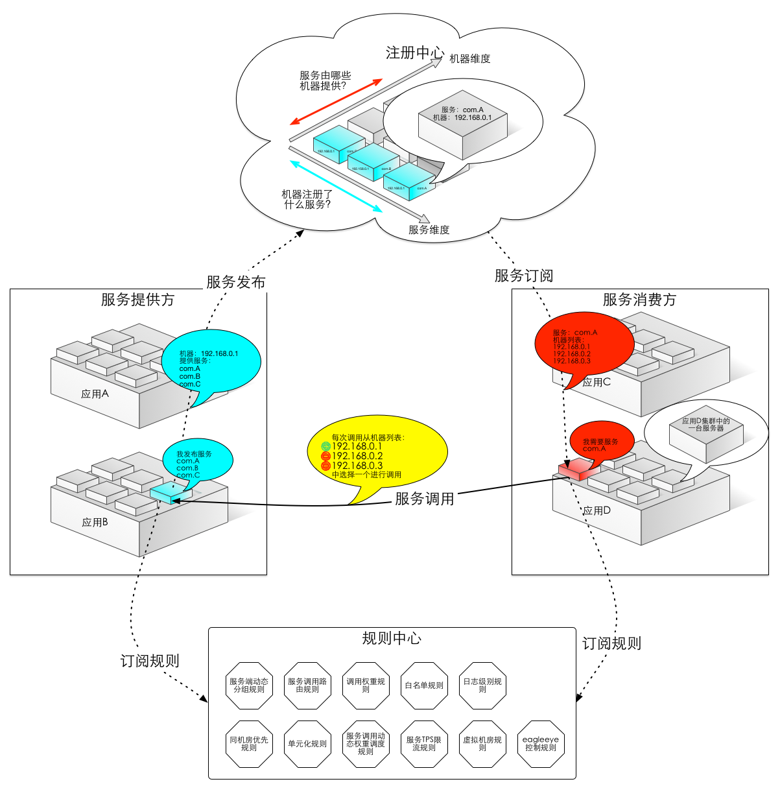
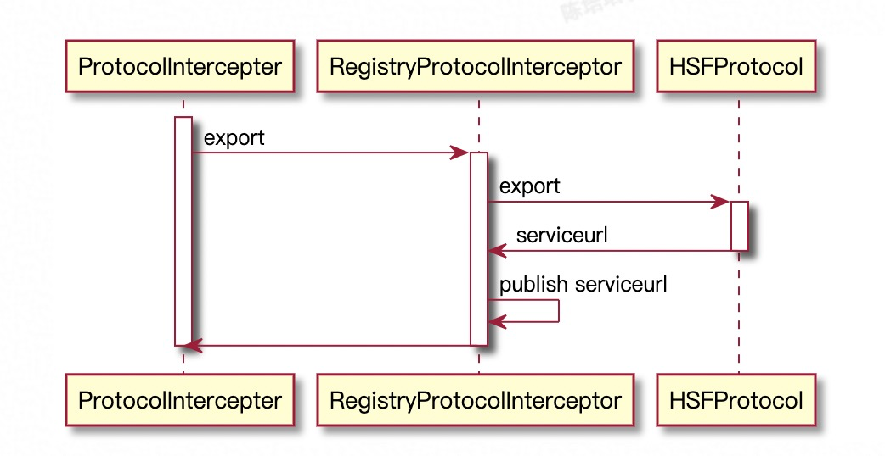
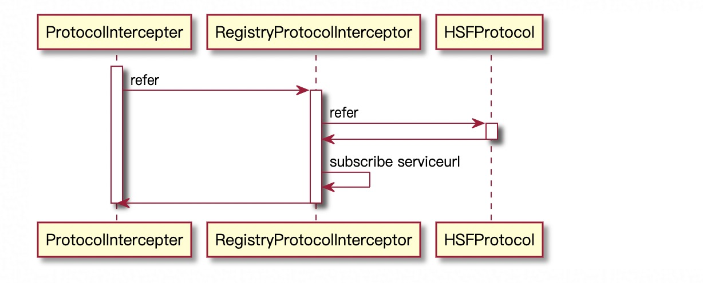

## 参考博文
[《深入理解HSF分布式服务框架》](《深入理解HSF分布式服务框架》)

[TOC]


# 基本结构(服务+地址+规则)
名称|是否必须|描述|实现
|--|--|--|--|
服务消费者|是|服务调用者，向地址注册中心订阅服务，根据订阅到的地址发起调用|HSFApiConsumerBean
服务提供者|是|将自己的地址和提供的服务注册到地址注册中心，接受服务消费者的调用|HSFApiProviderBean
地址注册中心|是|提供服务发现的能力，接受服务提供者注册的信息，并根据key合并信息后推送给订阅的消费者|ConfigServer
持久化配置中心|否|存储HSF服务的治理规则，如路由规则、归组规则、权重规则等。HSF消费者在启动时会订阅这些规则|Diamond




服务端将自己的接口和实现打包成jar，客户端依赖jar包，然后像调用本地接口一样调用服务。

服务端和客户端主键保持长连接进行通信

# 服务的发布和订阅(Protocol)
## 发布export():当服务发布时会启动HSFServer，同时会生成ServiceURL
将地址和接口信息通过Protocol发布到注册中心Registry，Registry会将收到的地址在一定时间内聚合并推送给客户端

首先ProtocolInterceptor的export()进行拦截，他的实现RegistryProtocolInterceptor会从HSFProtocol获取对应的服务地址ServiceURL，然后通过Registry的register方法将地址发布到Registry

ServiceMetadata中包含HSF服务的元数据信息，里面的内容通过addProperty(String propName, String propValue)进行添加

```java
public class RegistryProtocolInterceptor extends AbstractDelegateProtocolInterceptor {
    @Override
    public List<ServiceURL> export(ServiceMetadata serviceMetadata, InvocationHandler invocationHandler) {
        //1. 通过HSFProtocol获取服务地址列表
        List<ServiceURL> serviceURLs = protocol.export(serviceMetadata, invocationHandler);
        if (serviceMetadata.isRegistryPub()) {
            List<Registry> registries = serviceMetadata.getRegistries();
            for (Registry registry : registries) {
                //2. 注册到注册中心
                /**
                    register()里面的代码
                    Publisher<String> publisher = PublisherRegistrar.register(registration);
                    publisher.publish(data);
                */
                registry.register(serviceMetadata, serviceURLs);
            }
            return serviceURLs;
        } else {
            return null;
        }
    }
}

// HSFProtocol的export()过程
public class HSFProtocol implements Protocol {
    public List<ServiceURL> export(ServiceMetadata serviceMetadata, InvocationHandler invocationHandler) {
        // 1. 先尝试启动HSF服务端
        registerProvider(serviceMetadata);
        //register server InvocationHandler is done outside

        // 2. 获取服务端可以暴露的IP:端口
        Map<Integer, String> needExportServers = providerServer.severNeedExport();

        List<ServiceURL> serviceURLs = new ArrayList<ServiceURL>();

        for (Map.Entry<Integer, String> server : needExportServers.entrySet()) {
            String data = HSFServiceTargetUtil.getTarget(server.getValue(), server.getKey(), serviceMetadata);
            ServiceURLRawData serviceURLRawData = ServiceURLRawData.parseUrl(data);
            HSFServiceURL hsfServiceURL = new HSFServiceURL(serviceMetadata, serviceURLRawData);
            serviceURLs.add(hsfServiceURL);
        }

        return serviceURLs;
    }

    public void registerProvider(ServiceMetadata metadata) {
        try {
            providerServer.startHSFServer();
        } catch (Exception e) {
            throw new RuntimeException(
                    LoggerHelper.getErrorCodeStr("hsf", "HSF-0016", "HSF", "start provider server failed"), e);
        }

        // 分配线程池
        threadPoolService.getExecutorManager().allocateExecutor(metadata.getUniqueName(), metadata.getCorePoolSize(),
                metadata.getMaxPoolSize());
    }
}
```




## 订阅refer():当服务订阅时会创建返回能够进行远程调用的InvocationHandler
通过Protocal向Registry订阅服务地址，Registry会将地址推送给客户端

订阅的实现就是返回一个InvocationHandler，他会通过ClientStream发起远程接口调用



```java
public class RegistryProtocolInterceptor extends AbstractDelegateProtocolInterceptor {
    public InvocationHandler refer(ServiceMetadata serviceMetadata) {
        // HSFProtocol返回一个InvocationHandler
        InvocationHandler invocationHandler = protocol.refer(serviceMetadata);

        RegistryInvocationHandler registryHandler = serviceMetadata.getAttachment(REGISTRY_INVOCATION_HANDLER_KEY);
        //TODO remove this null check
        if (registryHandler == null) {
            registryHandler = new RegistryInvocationHandler();
            registryHandler.setServiceMetadata(serviceMetadata);
            registryHandler.setProtocol(protocol);
            registryHandler.start();
            serviceMetadata.putAttachment(REGISTRY_INVOCATION_HANDLER_KEY, registryHandler);
        }

        // 将数据推送给客户端
        /**
            refer()里面的代码：
            Subscriber subscriber = SubscriberRegistrar.register(cs_registration);
            subscriber.setDataObserver(listener);
            listener.setSubscriber(subscriber);
        */
        registryHandler.refer();
        registryHandler.setInvocationHandler(invocationHandler);
        return registryHandler;
    }
}
```
