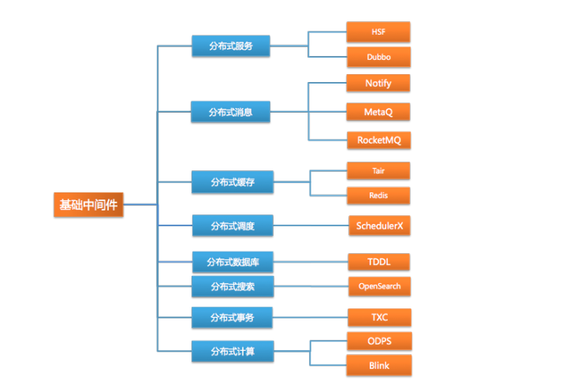

# 三个方面
## 1. 扩展性
随着任务规模的不断增长，系统要有足够的适应能力和兼容能力

1）集群规模扩展性
系统的服务性能可以随着集群机器数量线性增长

2）地理扩展性
不同地区能使用各自的数据中心来抵消地理因素带来的服务延迟

3）管理扩展性
随着集群机器的数量上升，管理复杂度不会快速上升

## 2. 性能
性能优良的系统应该具备三个特质：短RT、低延迟，高吞吐和较低的计算资源占用率

## 3. 可用性
可用性=可用时间/(可用时间+不可用时间)

可用性百分比越高，难度越高

# 各种分布式
## 1. 分布式服务
[分布式服务](../分布式大礼包/分布式服务.md)

## 2. 分布式消息

## 3. 分布式缓存

## 4. 分布式调度

## 5. 分布式数据库

## 6. 分布式搜索

## 7. 分布式事务

## 8. 分布式计算