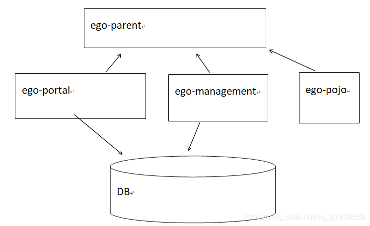
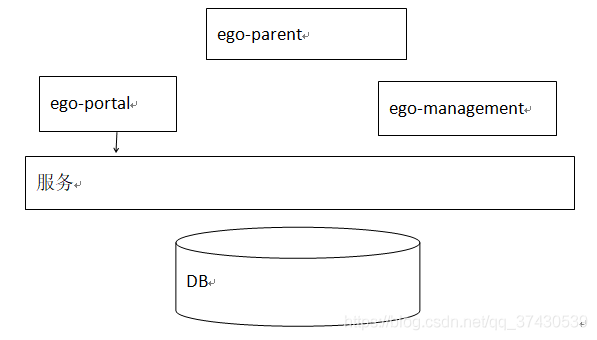
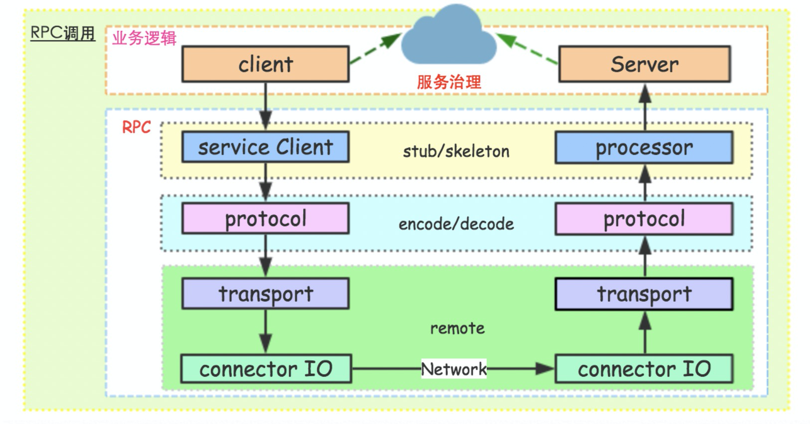
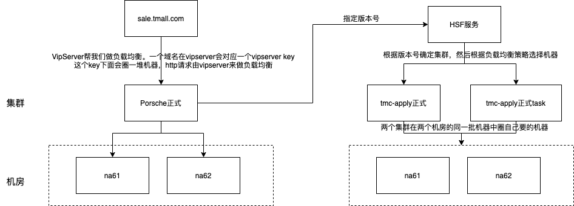

## 参考博文
[花了一个星期，我终于把RPC框架整明白了！](https://developer.51cto.com/art/201906/597963.htm)
[深入理解 RPC](https://juejin.cn/post/6844903443237175310)
[什么是SOA架构？和RPC框架之间的联系？](https://blog.csdn.net/qq_37430539/article/details/97379507)

[TOC]

# 两个概念
## SOA
SOA（Service-Oriented Architecture）即 面向服务架构

将一个程序根据服务功能拆分成多个部分，各个部分提供的服务能被其他服务调用

例如，一个大型项目，分了多个小项目，其中一些小项目需要用到数据库中的数据。
这种架构存在两个问题：
1. 小项目直接访问数据库，对数据库来说有压力和安全问题
2. 各个项目之间有重复的访问数据库的代码


通过SOA架构，专门搞一个数据库访问的服务，其他服务都调用这个服务来访问数据库


实现SOA架构就需要远程服务调用，用到的就是RPC

## RPC
客户端通过网络向服务端请求服务，但是对客户端而言就像调用本地接口一样

本地动态代理隐藏通信细节，通过组件序列化请求，走网络到服务端，执行真正的服务代码，然后将结果返回给客户端，反序列化数据给调用方法的过程


# RPC分析
## 模块


### 1. 客户端和服务端
- 服务端接口
```java
public interface RpcService {
    String sayHi(String name);
}
public class RpcServiceImpl implements RpcService {
    public String sayHi(String name) {
        return "Hello," + name;
    }
}
```

- 客户端获取服务实例和请求接口

利用代理模式封装服务端对外的API，让客户端像调用本地接口一样调用。当客户端调用服务端接口时，ServiceProxyClient会走代理逻辑去远程请求真正的方法执行
```java
public class ServiceProxyClient {

    public static <T> T getInstance(Class<T> clazz) {
        return (T) Proxy.newProxyInstance(clazz.getClassLoader(), new Class[] {clazz}, new ServiceProxy(clazz));
    }

    public static class ServiceProxy implements InvocationHandler {

        private Class clazz;

        public ServiceProxy(Class clazz) {
            this.clazz = clazz;
        }

        public Object invoke(Object proxy, Method method, Object[] args) throws Throwable {

            ServiceProtocol.ProtocolModel model = new ServiceProtocol.ProtocolModel();
            model.setClazz(clazz.getName());
            model.setMethod(method.getName());
            model.setArgs(args);

            String[] argType = new String[method.getParameterTypes().length];
            for (int i = 0; i < argType.length; i++) {
                argType[i] = method.getParameterTypes()[i].getName();
            }
            model.setArgTypes(argType);

            //序列化入参
            byte[] req = ServiceProtocol.protocol.encode(model);

            //请求服务端接口
            byte[] rsp = ClientRemoter.client.getDataRemote(req);

            //反序列化结果
            return ServiceProtocol.protocol.decode(rsp, method.getReturnType());
        }
    }
}
```

- 测试代码
```java
//服务端启动和发布服务
public class ServerDemo {

    public static void main(String[] args) throws Exception {

        // 发布接口
        ServiceProcessor.processor.publish(RpcService.class,new RpcServiceImpl());

        // 启动server
        ServerRemoter remoter = new ServerRemoter();
        remoter.startServer(9999);

    }
}

//客户端远程调用
public class ClientDemo {

    public static void main(String[] args) {
        System.out.println("----------start invoke----------------");
        //客户端使用代理模式请求服务端接口
        RpcService service = ServiceProxyClient.getInstance(RpcService.class);
        System.out.println(service.sayHi("RPC World"));
        System.out.println("----------end invoke----------------");
    }
}
```

### 2. 服务注册和发现
服务端需要将自己的服务注册在服务发现者处，服务发现者会定位到某个具体的服务者
```java
public class ServiceProcessor {

    public static final ServiceProcessor processor = new ServiceProcessor();

    private static final ConcurrentMap<String, Object> PROCESSOR_INSTANCE_MAP = new ConcurrentHashMap<String, Object>();


    public boolean publish(Class clazz, Object obj) {
        return PROCESSOR_INSTANCE_MAP.putIfAbsent(clazz.getName(), obj) != null;
    }

    public Object process(ServiceProtocol.ProtocolModel model) {
        try {
            Class clazz = Class.forName(model.getClazz());

            Class[] types = new Class[model.getArgTypes().length];
            for (int i = 0; i < types.length; i++) {
                types[i] = Class.forName(model.getArgTypes()[i]);
            }

            Method method = clazz.getMethod(model.getMethod(), types);

            Object obj = PROCESSOR_INSTANCE_MAP.get(model.getClazz());
            if (obj == null) {
                return null;
            }

            return method.invoke(obj, model.getArgs());
        } catch (Exception e) {
            e.printStackTrace();
            return null;
        }
    }
}
```

#### 2.1 服务地址存储
1. 首先需要一个组件存储服务机器列表等服务数据，组件例如zookeeper，redis，mysql

zookeeper可以充当一个服务注册表（Service Registry），让多个服务提供者形成一个集群，让服务消费者通过服务注册表获取具体的服务访问地址（ip+端口）去访问具体的服务提供者

2. 服务端启动时，需要将自己的服务地址，比如ip，port，以及服务信息，比如接口，版本号等信息，提交到存储服务机器上

3. 客户端启动时，从存储服务的机器上，根据接口，版本等服务信息来拿到提供对应服务的RPC地址列表，客户端根据这个列表就可以开始调用远程服务了


#### 2.2 服务状态感知
1. 客户端感知服务端状态
a. 客户端其一个定时调度任务，周期去存储组件处拉取最新的服务集群地址列表，但是这个周期粒度比较难控制
b. 客户端和存储组件建立一个长连接，当存储组件发现有服务集群状态发生变更，推送给客户端。但是，这又要求存储组件具有推送功能

2. 存储服务感知RPC参与方的状态
让RPC两方都和存储组件保持连接，然后通过心跳等方式来探测对方是否下线

### 3. 解码和编码
包括编码/解码，或者说序列化和反序列化工作，除了对象序列化的工作，还有一些通信相关的字节流的额外解析部分。序列化工具有：hessian，protobuf，avro,thrift，json系，xml系等等
```java
public class ServiceProtocol {

    public static final ServiceProtocol protocol = new ServiceProtocol();

    /**
     * 将对象序列化为字节
     */
    public byte[] encode(Object o) {
        return JsonUtils.encode(o).getBytes();
    }

    /**
     * 反序列化成ProtocolModel对象
     */
    public <T> T decode(byte[] data, Class<T> clazz) {
        return JsonUtils.decode(new String(data), clazz);
    }

    /**
     * 编解码模型
     */
    public static class ProtocolModel {
        private String clazz;
        private String method;
        private String[] argTypes;
        private Object[] args;

        // setter getter方法省略
    }
}
```

### 4. 网络通信
服务端和客户端网络通信相关的功能
```java
/**
 * 客户端通信组件，客户端和外部服务端数据交互时使用
 */
 public class ClientRemoter {

     public static final ClientRemoter client = new ClientRemoter();

     public byte[] getDataRemote(byte[] requestData) {

         try () {
             //相当于客户端要订阅的服务端服务
             Socket socket = new Socket()
             socket.connect(new InetSocketAddress("127.0.0.1", 9999));
             socket.getOutputStream().write(requestData);
             socket.getOutputStream().flush();

             byte[] data = new byte[10240];
             int len = socket.getInputStream().read(data);

             return Arrays.copyOfRange(data, 0, len);
         } catch (Exception e) {
             e.printStackTrace();
             return null;
         }
     }
 }


/**
 * 服务端起一个端口监听服务，绑定到相关processor处理器上。
 */
public class ServerRemoter {

    private static final ExecutorService executor =
        Executors.newFixedThreadPool(Runtime.getRuntime().availableProcessors());

    public void startServer(int port) throws Exception {

        final ServerSocket server = new ServerSocket();
        server.bind(new InetSocketAddress(port));
        System.out.println("-----------start server----------------");
        try {
            while (true) {
                final Socket socket = server.accept();
                executor.execute(new MyRunnable(socket));
            }
        } finally {
            server.close();
        }
    }

    class MyRunnable implements Runnable {

        private Socket socket;

        public MyRunnable(Socket socket) {
            this.socket = socket;
        }

        public void run() {

            try () {
                InputStream is = socket.getInputStream(); 
                OutputStream os = socket.getOutputStream()

                byte[] data = new byte[10240];
                int len = is.read(data);

                //将获取到的数据反序列化成ProtocolModel对象
                ServiceProtocol.ProtocolModel model = ServiceProtocol.protocol.decode(Arrays.copyOfRange(data, 0, len), ServiceProtocol。ProtocolModel.class);

                //利用代理模式请求service接口
                Object object = ServiceProcessor.processor.process(model);
                os.write(ServiceProtocol.protocol.encode(object));
                os.flush();
            } catch (IOException e) {
                e.printStackTrace();
            } finally {
            // close socket...
           }        
        }    
    }
}
```

#### 网络传输协议
在 RPC 中可选的网络传输方式有多种，可以选择 TCP 协议、UDP 协议、HTTP 协议

1. 基于 TCP 协议的 RPC 调用
由服务的调用方与服务的提供方建立 Socket 连接，并由服务的调用方通过 Socket 将需要调用的接口名称、方法名称和参数序列化后传递给服务的提供方，服务的提供方反序列化后再利用反射调用相关的方法

2. 基于 HTTP 协议的 RPC 调用
调用方通过URL请求调用，双方的请求数据和响应数据是XML 数据或者 JSON 数据解析后的结果

TCP 协议处于协议栈的下层，能够更加灵活地对协议字段进行定制，减少网络开销，提高性能，实现更大的吞吐量和并发数。但是需要更多关注底层复杂的细节，实现的代价更高

 HTTP 协议是上层协议，发送同等内容的信息，使用 HTTP 协议传输所占用的字节数会比使用 TCP 协议传输所占用的字节数更高

## 基于Java的序列化工具
### JDK内置序列化工具 java.io.Serializable
实现java.io.Serializable接口，在需要序列化/反序列化的时候，直接使用ObjectInputStream/ObjectOutStream来readObject将流反序列化成对象或者writeObject将对象序列化成流

很多时候，我们并不使用原生的JDK序列化工具进行序列化，主要原因是因为其序列化后的二进制流太大，并且序列化耗时也比较长。但是，其最大的优点就是原生支持，快速使用，引入成本低，此外，其支持java所有类型

```java
public class JdkSerialiable {
    public static void serial(Blog blog) throws Exception {
        ByteArrayOutputStream baos = new ByteArrayOutputStream();
        ObjectOutputStream os = new ObjectOutputStream(baos);
        os.writeObject(blog);
        os.close();

        ObjectInputStream is = new ObjectInputStream(new ByteArrayInputStream(baos.toByteArray()));
        Blog blog1 = (Blog) is.readObject();
        is.close();
        System.out.println(blog1);
    }
}
```

### hessian
hessian在处理序列化的时候，会根据对象的数据类型采用不同的序列化策略，比如有些直接使用JavaSerializer，有些是自己来实现对应类型的序列化方法
```java
public class HessianSerialibale {

    public static void serial(Blog blog) throws Exception{

        ByteArrayOutputStream baos = new ByteArrayOutputStream();
        Hessian2Output os = new Hessian2Output(baos);
        os.writeObject(blog);
        os.close();
        Hessian2Input is = new Hessian2Input(new ByteArrayInputStream(baos.toByteArray()));
        Blog blog1 = (Blog) is.readObject();
        is.close();
        System.out.println(blog1);
    }
}
```

### Kryo工具
```java
public class KryoSerializable {

    public static void serial(Blog blog)throws Exception{
        Kryo kryo = new Kryo();
        ByteArrayOutputStream baos = new ByteArrayOutputStream();
        Output output = new Output(baos);
        kryo.writeClassAndObject(output, blog);
        output.close();

        ByteArrayInputStream bais = new ByteArrayInputStream(baos.toByteArray());
        Input input = new Input(bais);
        Blog blog1 = (Blog) kryo.readClassAndObject(input);
        input.close();
        System.out.println(blog1);
    }
}
```

### JSON工具


## 消息里为什么要有requestID
当客户端发送了调用请求，他就可以做别的事情了，等待结果返回的过程应该是异步的，这样要解决两个问题：
1. 怎么让当前线程“暂停”，等结果回来后，再向后执行
2. 如果一个进程中有多个线程发起远程调用，这样用的是一个socket连接，远程调用的顺序是不一定的。客户端收到响应后，怎么知道这个响应是属于哪个线程的

解决方法：
1. client在socket调用之前生成socket连接里面唯一的一个requestId,，一般常常使用AtomicLong从0开始累计数字生成唯一ID
2. 将requestId和处理结果的回调对象callback放入全局的ConcurrentHashMap中 (requestID, callback))
3. 服务端收到请求后，将response返回给客户端，response中包含requestId
4. 客户端socket连接上监听消息的线程会取出response中的requestId，根据requestId从Map中获取对应的callback，使用callback处理response


# RPC实现
## HSF
[HSF](../分布式大礼包/HSF.md)

## Dubbo


正式环境、task环境分别是两个集群，用两个集群的目的是做到隔离，目的就是为了让某些业务的正常与否不影响核心业务。可以是：
1. 业务隔离：不同应用间的集群
2. 服务隔离：某个HSF单独拎出来变成一个集群。例如上传Excel就是task集群
3. 物理隔离：AE环境是自己的集群，他的机器就是和国内完全的两个机房

na61、na62分别是两个机房，用两个机房的目的是容灾。万一一个机房挂掉了，还能有另一个机房顶上。两个机房的机器数量要保持大概一致，如果差距非常悬殊，那么当一个机房挂掉的时候，另一个机房是顶不住的。

集群和机房之间的关系是：两个集群可以在同一个机房中圈机器。比如正式环境、task环境底层对应的就是我们的100台机器，这100台机器分别在na61和na62两个环境，我们自己给两个环境分别圈机器


1. 对http请求
负载均衡是VIPserver做的。在VIPserver上注册域名后会绑定集群，然后圈机器。这样当一个请求进来的时候，VIPserver能根据域名获取到集群和机器列表，然后做负载均衡


2. 对HSF请求
首先每个集群提供的HSF服务都有自己的版本号，例如正式环境版本号是1.0.0，正式task环境版本号是1.0.0.task。当一个HSF请求进来时，HSF会根据group+接口+版本号确定集群，然后根据负载均衡策略请求一台机器。

那么对Porsche来说什么接口请求正式，什么接口请求正式task，就是在配置HSF服务的时候手动执行的版本号。其实两个集群的代码和能提供的服务是一样的，就是根据版本号将不同的请求分流到不同的集群，做到非核心业务不影响核心业务。

对于类似场景，如果想做到天猫商家一个集群、非天猫商家一个集群也是可以的。就是根据商家身份判断要使用哪个版本的HSF服务

目前对于HSF来说，group都是默认的HSF，并没有起到实际作用，使用group的好处：
1. 假如一个有1万台机器，在一个group的场景下，就要对这1万台机器做负载均衡；在两个group的场景下，1万台机器AA，首先先确定group，然后就可以只对5000台机器做负载均衡，效率更高
2. 假如现在有5个预发环境，每个预发环境都想提供预发和预发task服务，那么相当于有10个集群。在只有一个group的情况下，就需要有10个配置来决定每个集群提供的服务版本。假如有两个group，分别就是预发group和预发task group，然后每个group配置预发1-预发5的版本，就只需要7个配置。


