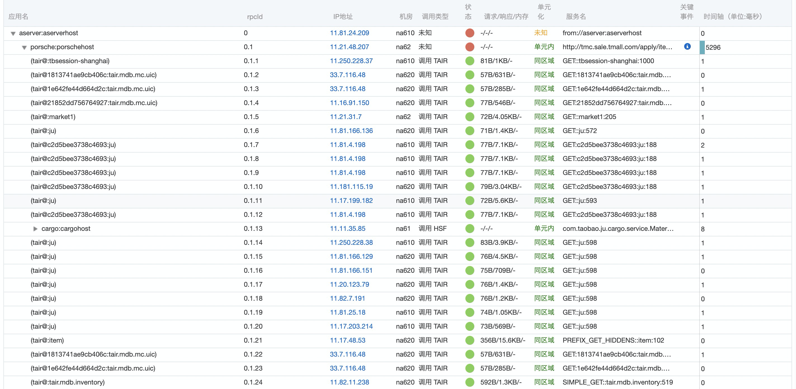
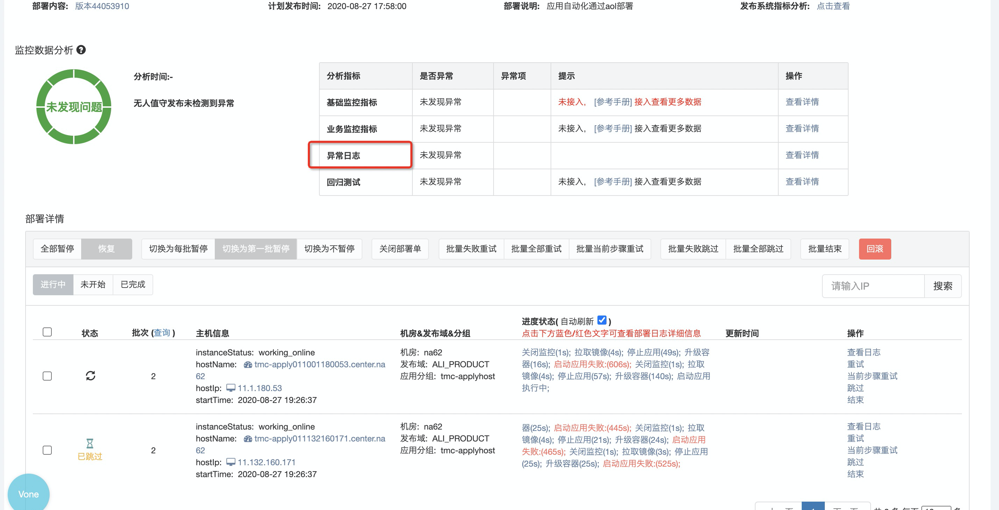
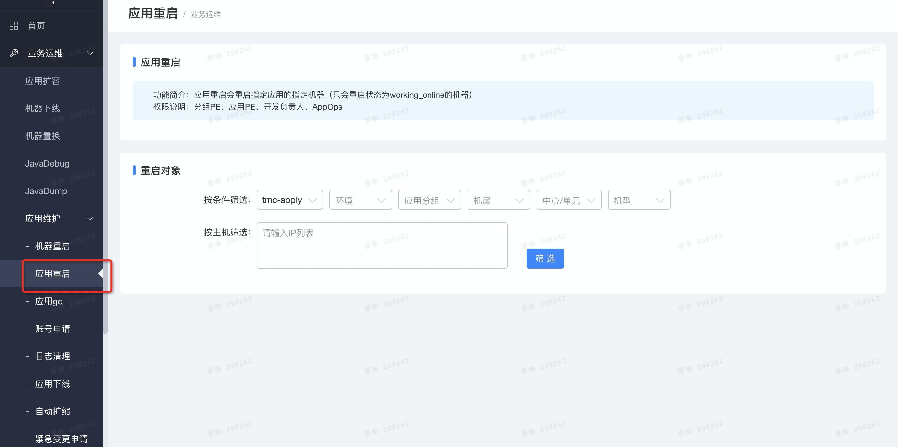
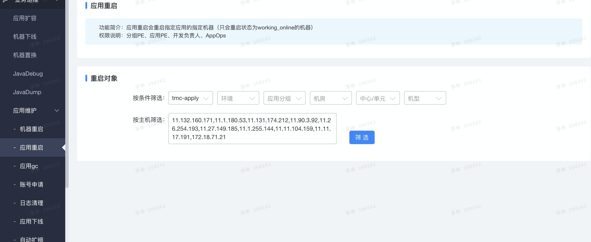

# 发布小贴士

## 1. 正式包打好没？

发布到主干上去打包

## 2. 注意发布顺序
tmc-business ->  tmc-apply   ->   porsche

## 3. 看看看

1. 看日志
- tmc-business（注意国外环境）

/home/admin/tmc-business/logs/tmc-business

- tmc-apply

/home/admin/tmc-apply/monitor：一定要看有没有报警。所有启动中的机器都有可能被攻击
/home/admin/tmc-apply/mango-service

2. 看鹰眼

[https://eagleeye-console.alibaba-inc.com/trace?spm=5176.2020520107.0.0.4d91840c59WcqR&pid=porsche:porschehost&regionId=cn-hangzhou#/abnormityDiagnosis](https://eagleeye-console.alibaba-inc.com/trace?spm=5176.2020520107.0.0.4d91840c59WcqR&pid=porsche:porschehost&regionId=cn-hangzhou#/abnormityDiagnosis)

根据traceId直接可以去鹰眼查具体的调用时间

3. 看集团监控

[https://x.alibaba-inc.com/application/appmonitor/tmc-business/monitor/middleware](https://x.alibaba-inc.com/application/appmonitor/tmc-business/monitor/middleware)

4. 看aone异常日志对比

## 4. 线上回归
回归改动的链路，看看有没有影响原有链路

## 5. 机器重启
机器会自动重启三次，如果三次都失败了，就去诺曼底手动重启
[https://n.alibaba-inc.com/ops/action/restart/host?spm=a1znmd.11230626.page.11.397b2889hh6Z1O](https://n.alibaba-inc.com/ops/action/restart/host?spm=a1znmd.11230626.page.11.397b2889hh6Z1O)

