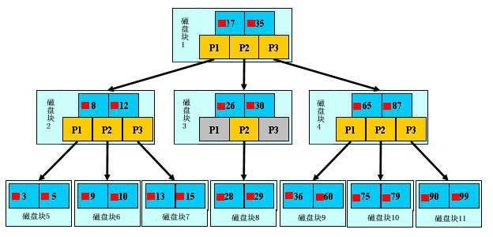

## 参考博文
[B+树和B树的区别](https://www.jianshu.com/p/ace3cd6526c4)
[图解MySQL索引(二)—为什么使用B+Tree](https://www.cnblogs.com/liqiangchn/p/12995831.html)

[TOC]

# 概念
## B树
多路的平衡搜索树,B-树是专门为外部存储器设计的，如磁盘，它对于读取和写入大块数据有良好的性能，所以一般被用在文件系统及数据库中

B树每次从磁盘读取都是一页一页的读，每页都包含一个范围内的数据，可以大大减少磁盘IO的次数，提高效率

B-树有如下特点:

1. 所有键值分布在整颗树中（索引值和具体data都在每个节点里）
2. 任何一个关键字出现且只出现在一个结点中
3. 搜索有可能在非叶子结点结束（最好情况O(1)就能找到数据）
4. 在关键字全集内做一次查找,性能逼近二分查找

## B+树
B+树是B-树的变体，也是一种多路搜索树, 它与 B- 树的不同之处在于:
1. 非叶节点存储主键不存储data，叶子节点存储主键和data
2. 叶子节点构成一个链表

## B树 VS B+树
- B+树非叶节点不存储数据，所以非叶节点的页大小和叶子节点不同，B树的每个节点页大小相同

- B+树内节点不存储数据，所有 data 存储在叶节点导致查询时间复杂度固定为 log n。而B-树查询时间复杂度不固定，与 key 在树中的位置有关，最好为O(1)

key 为 50 的节点就在第一层，B-树只需要一次磁盘 IO 即可完成查找。所以说B-树的查询最好时间复杂度是 O(1)

B+树所有的 data 域都在根节点，所以查询 key 为 50的节点必须从根节点索引到叶节点，时间复杂度固定为 O(log n)

- B+树叶节点构成链表可大大增加区间访问性，可使用在范围查询等，而B-树每个节点 key 和 data 在一起，则无法区间查找

- B+树可以很好的利用局部性原理，若我们访问节点 key为 50，则 key 为 55、60、62 的节点将来也可能被访问，我们可以利用磁盘预读原理提前将这些数据读入内存，减少了磁盘 IO 的次数

- 由于磁盘 IO 数据大小是固定的，在一次 IO 中，单个元素越小，量就越大。这就意味着B+树单次磁盘 IO 的信息量大于B-树

# MySQL为什么使用B-Tree（B+Tree）&& 存储知识
索引本身也很大，不可能全部存储在内存中，因此索引往往以索引文件的形式存储的磁盘上。这样的话，索引查找过程中就要产生磁盘I/O消耗，相对于内存存取，I/O存取的消耗要高几个数量级，所以评价一个数据结构作为索引的优劣最重要的指标就是==在查找过程中磁盘I/O操作次数的渐进复杂度==

b树是为了充分利用磁盘预读功能而创建出来的一种数据结构

- 为什么不用平衡二叉树
由于要维持树的平衡，在插入数据时可能要进行大量的数据移动。平衡搜索二叉树过于严格的平衡要求，导致几乎每次插入和删除节点都会破坏树的平衡性，使得树的性能大打折扣

- 为什么不用红黑树
每个节点只存储一个数据，磁盘IO次数会很多

- 为什么使用B+树
1. 一次IO能读取到内存的大小有限，B树的节点是索引和数据都放在一块，一次能读取的节点少，而B+树的非叶节点只存储索引信息
2. 充分利用空间局部性原理，适合磁盘存储
3. 能够很好支持单值，范围查询，有序性查询

# 查找

B+树中的每个节点都叫一页：索引页(索引节点)、数据页(数据节点、叶子节点)。数据页是一个双向链表
数据的插入都是从叶子节点找到合适的位置并插入。在插入键值后会有页的拆分动作，那就需要从磁盘中读取索引页写入新的索引值，然后将拆分了的页写入磁盘中。所以需要旋转功能减少页的拆分

旋转发生在叶子节点满了，而他的左右兄弟节点没满的情况下。会先将记录移动到兄弟节点上(一般先是左兄弟)

- B+数的查找过程

如图所示，如果要查找数据项29，那么首先会把磁盘块1由磁盘加载到内存，此时发生一次IO，在内存中用二分查找确定29在17和35之间，锁定磁盘块1的P2指针，内存时间因为非常短（相比磁盘的IO）可以忽略不计，通过磁盘块1的P2指针的磁盘地址把磁盘块3由磁盘加载到内存，发生第二次IO，29在26和30之间，锁定磁盘块3的P2指针，通过指针加载磁盘块8到内存，发生第三次IO，同时内存中做二分查找找到29，结束查询，总计三次IO。真实的情况是，3层的b+树可以表示上百万的数据，如果上百万的数据查找只需要三次IO，性能提高将是巨大的，如果没有索引，每个数据项都要发生一次IO，那么总共需要百万次的IO，显然成本非常非常高。

