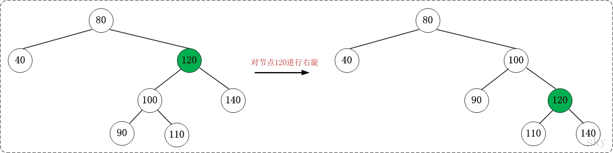
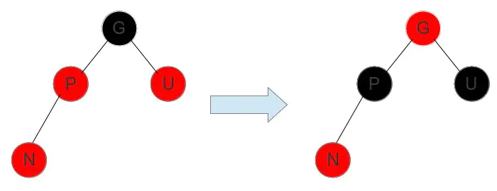
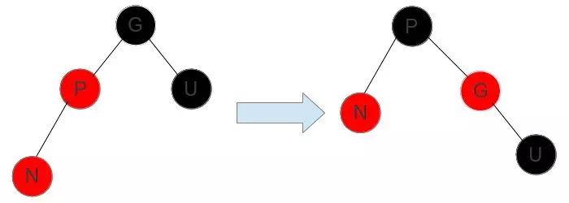
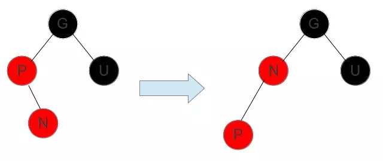

# 参考博文
[红黑树(一)之 原理和算法详细介绍](https://www.cnblogs.com/skywang12345/p/3245399.html)
[TOC]

# 概念
红黑树是一种自平衡二叉查找树，它可以在O(logn)时间内做查找，插入和删除
```
性质1：每个节点要么是黑色，要么是红色。
性质2：根节点是黑色。
性质3：每个叶子节点（NIL）是黑色。
性质4：每个红色结点的两个子结点一定都是黑色。
(从每个根到节点的路径上不会有两个连续的红色节点，但黑色节点是可以连续的)
性质5：任意一结点到每个叶子结点的路径都包含数量相同的黑结点。
(确保没有一条路径会比其他路径长出俩倍。因而，红黑树是相对是接近平衡的二叉树。)

```
因此若给定黑色节点的个数 N，最短路径的情况是连续的 N 个黑色，树的高度为 N - 1;最长路径的情况为节点红黑相间，树的高度为 2(N - 1) 


# 左旋和右旋
## 左旋
对x进行左旋，意味着"将x变成一个左节点"，将“x的右孩子”设为“x的父亲节点”

```
LEFT-ROTATE(T, x)  
01  y ← right[x]            // 前提：这里假设x的右孩子为y。下面开始正式操作
02  right[x] ← left[y]      // 将 “y的左孩子” 设为 “x的右孩子”，即 将β设为x的右孩子
03  p[left[y]] ← x          // 将 “x” 设为 “y的左孩子的父亲”，即 将β的父亲设为x
04  p[y] ← p[x]             // 将 “x的父亲” 设为 “y的父亲”
05  if p[x] = nil[T]       
06  then root[T] ← y                 // 情况1：如果 “x的父亲” 是空节点，则将y设为根节点
07  else if x = left[p[x]]  
08            then left[p[x]] ← y    // 情况2：如果 x是它父节点的左孩子，则将y设为“x的父节点的左孩子”
09            else right[p[x]] ← y   // 情况3：(x是它父节点的右孩子) 将y设为“x的父节点的右孩子”
10  left[y] ← x             // 将 “x” 设为 “y的左孩子”
11  p[x] ← y                // 将 “x的父节点” 设为 “y”
```


```
 (以x为节点进行左旋)：        
                               z
   x                          /                  
  / \      --(左旋)-->       x
 y   z                      /
                           y

```


## 右旋
对y进行右旋，意味着"将y变成一个右节点"，将“x的左孩子”设为“x的父亲节点”

```
RIGHT-ROTATE(T, y)  
01  x ← left[y]             // 前提：这里假设y的左孩子为x。下面开始正式操作
02  left[y] ← right[x]      // 将 “x的右孩子” 设为 “y的左孩子”，即 将β设为y的左孩子
03  p[right[x]] ← y         // 将 “y” 设为 “x的右孩子的父亲”，即 将β的父亲设为y
04  p[x] ← p[y]             // 将 “y的父亲” 设为 “x的父亲”
05  if p[y] = nil[T]       
06  then root[T] ← x                 // 情况1：如果 “y的父亲” 是空节点，则将x设为根节点
07  else if y = right[p[y]]  
08            then right[p[y]] ← x   // 情况2：如果 y是它父节点的右孩子，则将x设为“y的父节点的右孩子”
09            else left[p[y]] ← x    // 情况3：(y是它父节点的左孩子) 将x设为“y的父节点的左孩子”
10  right[x] ← y            // 将 “y” 设为 “x的右孩子”
11  p[y] ← x                // 将 “y的父节点” 设为 “x”
```




```
 (以x为节点进行右旋)：
                               y
   x                            \                 
  / \      --(右旋)-->           x
 y   z                            \
                                   z
```

# 操作 O(logn)
```
性质1：每个节点要么是黑色，要么是红色。
性质2：根节点是黑色。
性质3：每个叶子节点（NIL）是黑色。
性质4：每个红色结点的两个子结点一定都是黑色。
(从每个根到节点的路径上不会有两个连续的红色节点，但黑色节点是可以连续的)
性质5：任意一结点到每个叶子结点的路径都包含数量相同的黑结点。
(确保没有一条路径会比其他路径长出俩倍。因而，红黑树是相对是接近平衡的二叉树。)
```
## 插入
首先和二叉查找树的插入一样，查找、插入

插入的节点是红色的，插入、染红后的调整有5种情况：
假设要插入的节点为 N，N 的父节点为 P，祖父节点为 G，叔叔节点为 U。插入红色节点后，会出现5种情况
```
1. 插入的新节点 N 是红黑树的根节点，这种情况下，我们把节点 N 的颜色由红色变为黑色。
```


```
2. N 的父节点是黑色，这种情况下，性质4（每个红色节点必须有两个黑色的子节点）和性质5没有受到影响，不需要调整
```


```
3. N 的父节点P是红色，叔叔节点 U 也是红色,那P和U的父节点一定是黑色。
由于 P 和 N 均为红色，性质4被打破，此时需要进行调整。
这种情况下，先将 P 和 U 的颜色染成黑色，再将 G 的颜色染成红色。
此时经过 G 的路径上的黑色节点数量不变，性质5仍然满足。但需要注意的是 G 被染成红色后，可能会和它的父节点形成连续的红色节点，此时需要递归向上调整
```


```
4. N 的父节点P是红色，叔叔节点 U 也是黑色,那P和U的父节点一定是黑色。
1）插入节点 N 在父亲节点 P 的左孩子位置
把 爷爷节点 G 右旋，P 变成了这个子树的根节点，G 变成了 P 的右子树，把 P 变成黑的,再把 G 变成红的
2）插入节点 N 在父亲节点 P 的右孩子位置
将 P 左旋，再和做左孩子一样处理
```




## 删除
二叉查找树的删除，然后调整
```
如果当前待删除节点是红色的，它被删除之后对当前树的特性不会造成任何破坏影响.
```


## 查找