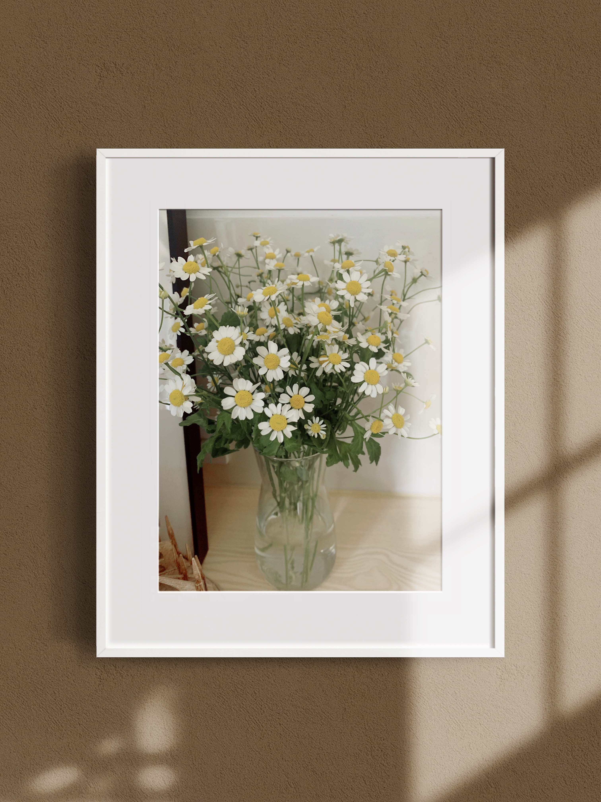
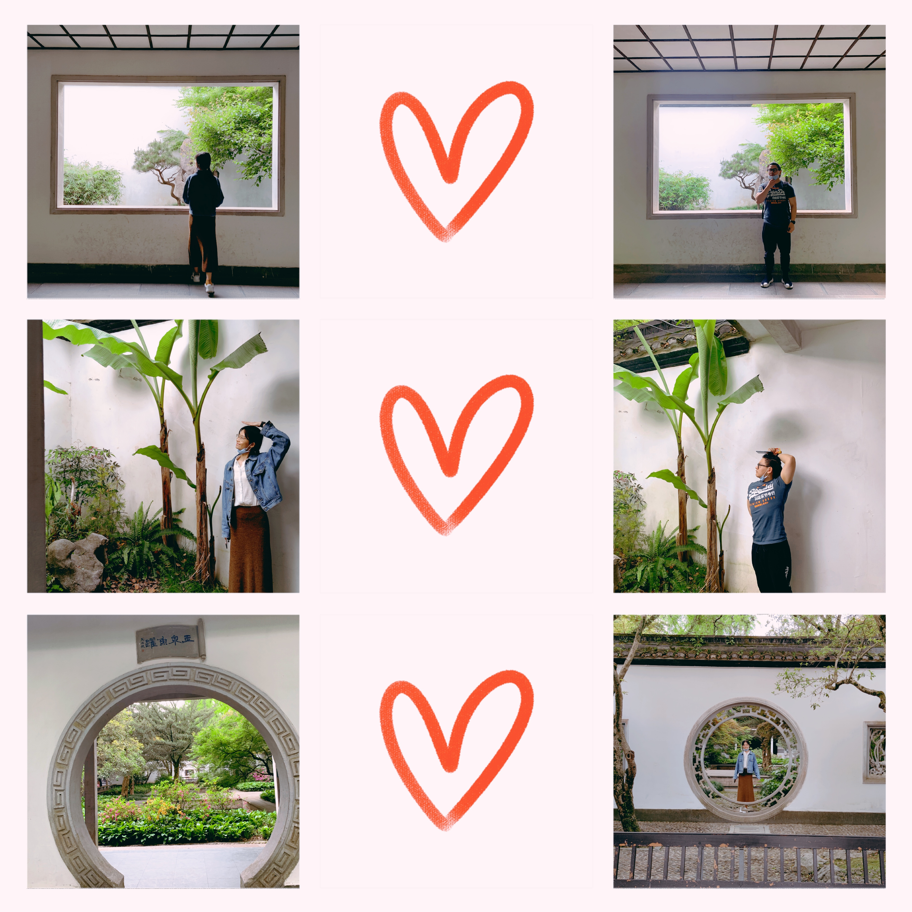
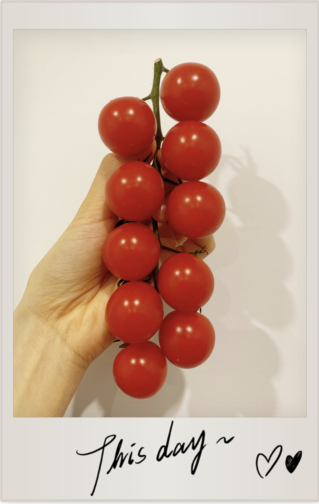
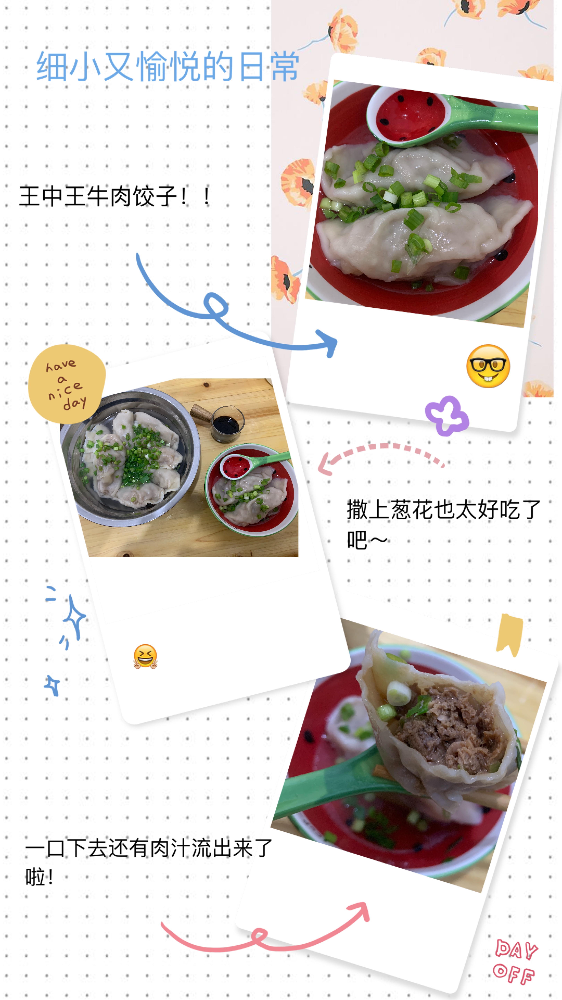
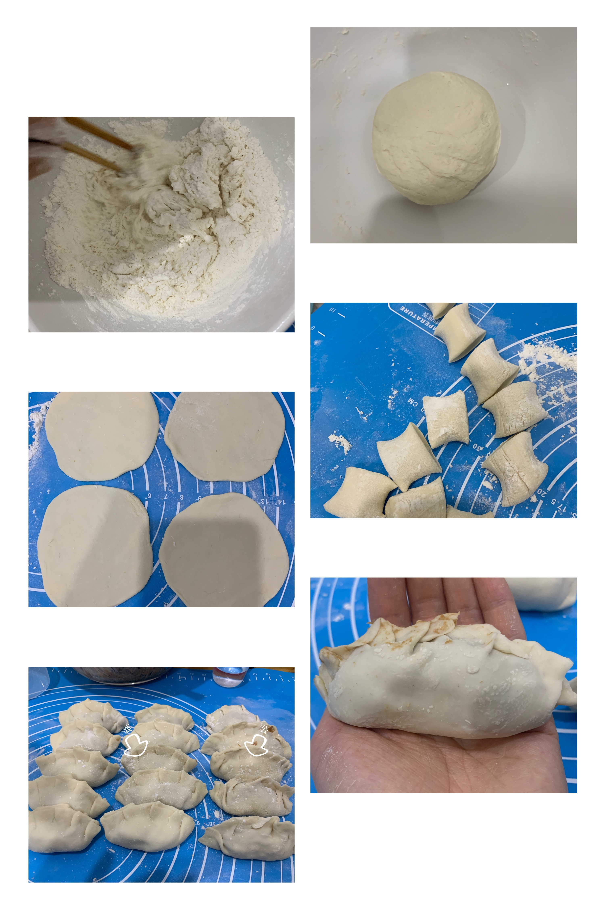
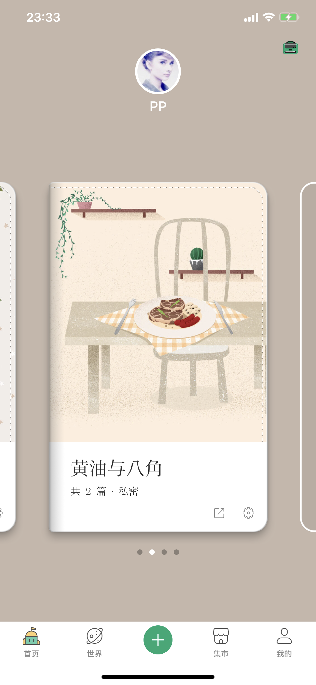
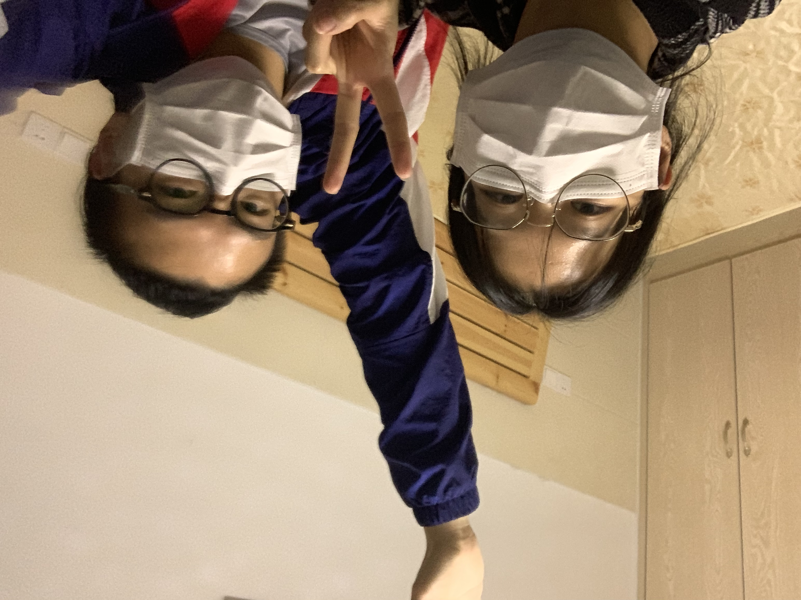
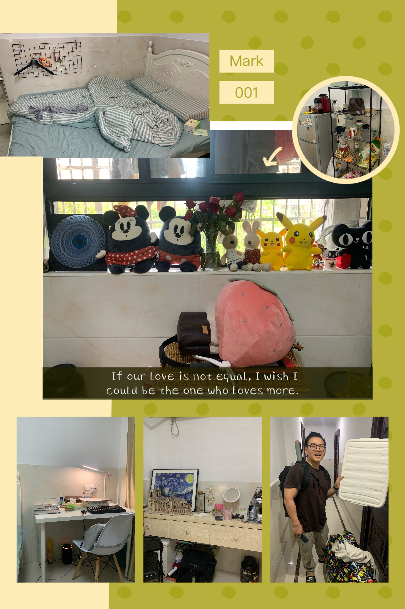
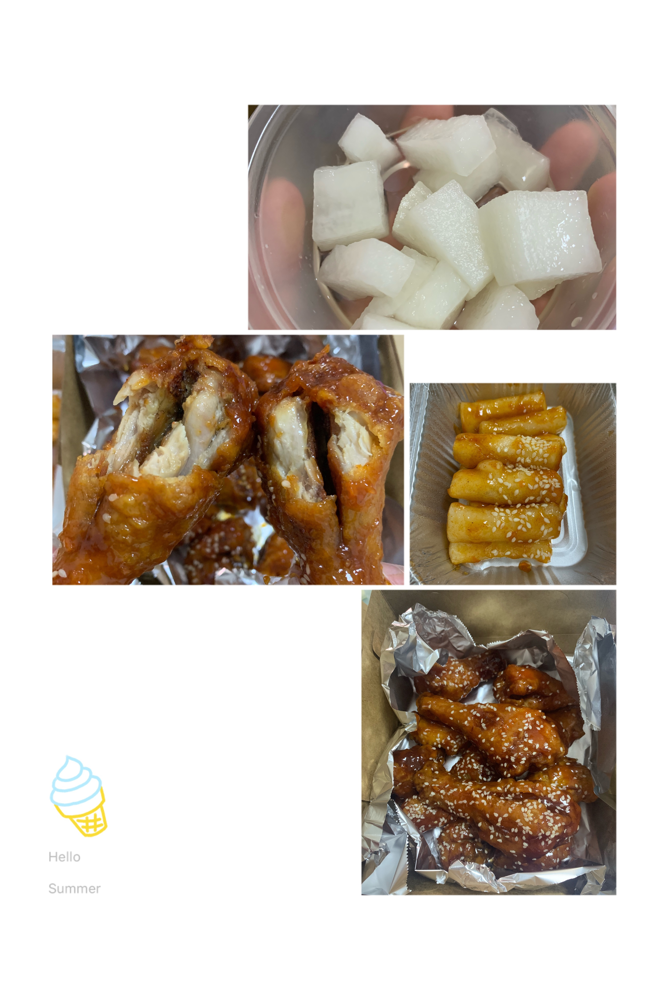
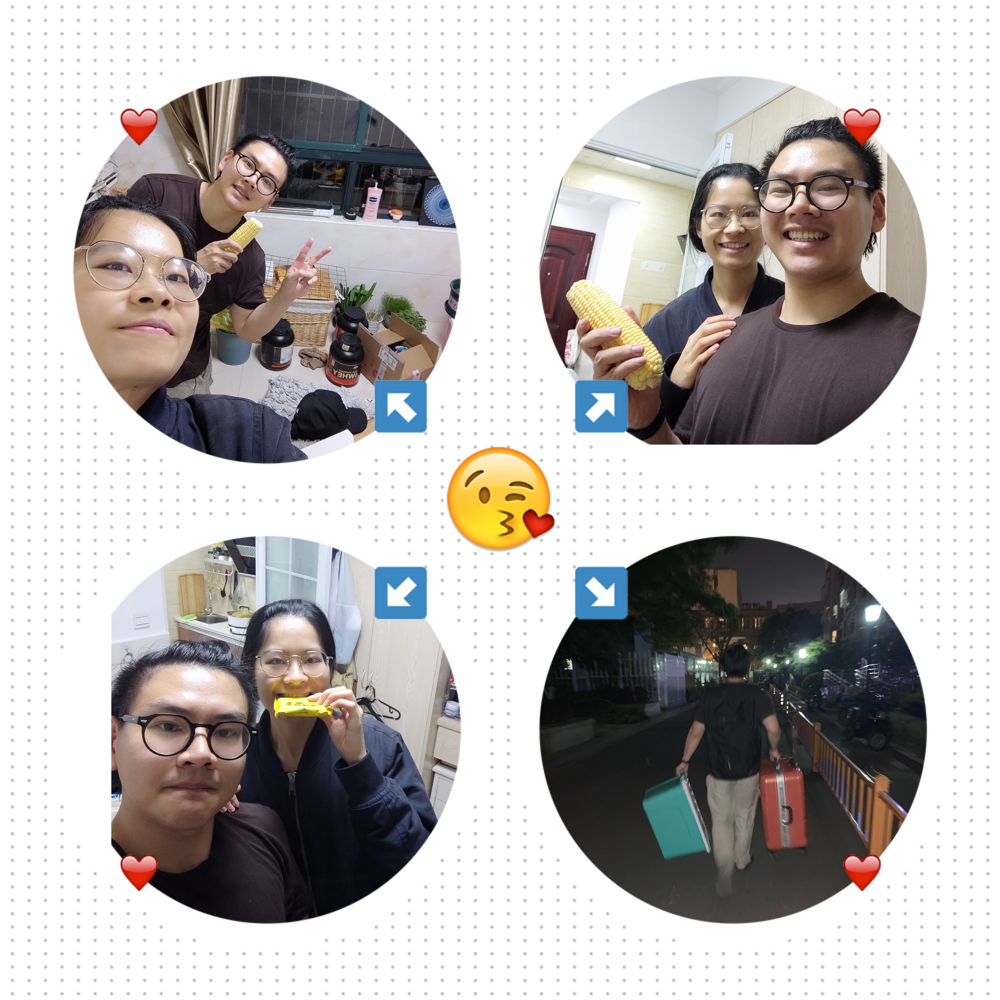

@author Peipei Chen 🌶

[TOC]
# 本月目标
1. 看完MySQL部分：《高性能MySQL》、《MySQL技术内幕：SQL编程》、《MySQL技术内幕：InnoDB存储引擎》（2/3）
2. 留两天看Linux
3. 看3本闲书：《送你一颗子弹》《山茶文具店》 (1/2)

# 2020年4月25日
## 今日小结
### 🔫学习
今天是看爆的一天！多看了2章，把索引和锁都看掉了，希望明天结束！

### ☠️运动
好了好了，明天开始运动

### 🔐生活
今天是平平淡淡的一天~照旧的不想看书但是硬着头皮看，想吃东西但是假克制。

最好吃的大概是早上的卤肉面🍜了吧~真好恰~晚上还吃了好吃的牛肉面和番茄🍅炒蛋🥚

还吃了新的冰淇淋品种——韩国吸吸乐，但是这也太甜了吧！浪费我的甜品份额！

今天还重新贴了面粉的标签，老公画的高筋还是形象啊~

等会要看余欢水嘿嘿，闲鱼真开心

## 明日计划
1. 最好结束InnoDB
2. hiit

# 2020年4月24日
## 今日小结
### 🌀学习
InnoDB第三章看完了，主要讲了下各种日志和文件

### 🚷运动
大姨妈禁止运动！

### 🍛生活
今天的主题是卤肉饭🍚！我公做卤肉饭还是有一手的把，成功的虏获了我。热热的米饭混着卤肉和香菇，大口大口吃可真爽。还有卤的鸡爪🐔就很有口感啊，这也太好吃了吧！

今天还吃了麦麦脆汁鸡🍗，骗子！明明就是脆汁鸡，看在你好吃的份上原谅你把！

然后买的餐具🍽到了嘻嘻，喜欢小猫🐈爪水果叉~

今天真的是吃爆的一天了，我就是死肥肥吧~~

喜欢老公给我喂水果🍎喂吃的嘻嘻

## 明日计划
1. 结束InnoDB第4章 ✅
2. 看余欢水 ✅

# 2020年4月23日
## 今日小结
### ⛈学习
真苦啊真苦，硬看InnoDB真苦

### 🌚运动
来大姨妈了，我动不动啊

### 🥀生活
今天来大姨妈了，觉得不舒服。拉粑粑肚子痛🤦‍♀️，屁屁痛。。。

是想吃东西🍢的一天，我好馋哦。。。

小雏菊碰水又活过来了！

今天老公脾气很好，值得表扬💐！

## 明日计划
1. 看完InnoDB第三章 ✅
2. 练胸背 ✅
3. 做卤肉饭 ✅

# 2020年4月22日
## 今日小结
### 🚁学习
趁天气好出去郊游了，学习先放一放！

### 🌋运动
走了一天的路，就把胸背改为有氧吧！

### 🏞生活
今天天气好好，我们去植物园玩了，而且门票免费！植物园🌲真的很大，原来玉泉本来是玉泉寺，在里面还拍了好多照片可是叶忘记带拍立得📷了我就很生气

然后还吃了鸡蛋饼🥚、好吃的芝士排骨🍗，买了好看的洋甘菊🌺

## 明日计划
1. 看完第二章 ✅
2. 胸背 ❎

# 2020年4月21日
## 今日小结
### 🆙学习
读完了《送你一颗子弹》：
>作者作为一个高端的知识分子，没有用华丽的语言描述什么大道理，而是很真实的写着自己的生活和心情。在很多方面都写到我心坎里去了，觉得这描述的就是某方面的我，我也会这么干这么想这么做。
>
>学习焦虑是每个人都会有吗？在以前我觉得作者这种水平的人，一定是把学习当生活的。可是他也和普通的我们一样呀，不学习就会焦虑，制定完学习计划又不能按时完成。是不是只要坚持学习的想法，长久下来也会慢慢积累成长呢。有时候我觉得自己看书的功利目的就有些强，会不能很好地享受这个过程。我想在之后慢慢的改变自己的想法吧，学习是必要的，但是不是为了什么目的而变得必要。
>
>有时候会对自己有很多的想法负担，觉得自己这不好那不好，觉得自己这里比不上别人哪里比不上别人。我想接受自己这样的性格，不觉得自己自闭、内向是不好的。虽然我内向，但是我也喜欢美食、喜欢新鲜、喜欢尝试。内向和美好生活没有联系，开朗不代表能更好的体验人生。转变自己的心态吧~给自己一点赞美和信心。

### 🤼‍♀️运动
今天hiit了，虽然不是很累了啦

### 🍴生活
今天也是悠闲悠闲的一天☀️，也是买买买的一天~

买了心仪已久的餐具🍽和其他小玩意，开心嘻嘻

今天去盒马买了高贵的番茄🍅，真不错！还有马芬🍰是不可能不好吃的！

喜欢晚上吃完饭在河边💧散步的感觉~~

还有晚餐的生菜包牛肉🐂就是我的取向狙击吧！

## 明日计划
1. 看InnoDB第二章 ❎
2. 看平凡的世界 ❎
3. 胸背 ❎

# 2020年4月20日
## 今日小结
### 🏁学习
今天大满贯！SQL编程结束了，可以开始看InnoDB存储引擎了

《送你一颗子弹》又看了一章，作者太接地气啦。不是空口讲大白话的知识分子，从他的文章中看到了一个平凡又上进的学者，和普通人一样他也有自己的惰性，也会乱买东西，也会不按时完成任务，也有学习焦虑，和我也差不多嘛！只不过人家更坚持、看更多书。

### 🍑运动
练屁屁了，大概离蜜桃臀又近了0.0000003步

### 😈生活
今天是超额完成任务的一天，不仅运动、学习了。还去吃了霸王餐，花泰好看但是味道一般呀~

还吃了自己包的牛肉大饺子🥟，实验证明低筋面粉也可以做饺子皮！

还写了2页手账，写了柠檬🍋鸡爪和番茄🍅土豆🥔牛腩，手账好玩又好看！

今天还在路边认识了一个新花花🌺，他叫络石，小名大风车嘻嘻。

今天又心态不平衡了，我觉得我没必要一直这样纠结，要试着放开心态，把hh当做一个和我毫不相干的人。凭什么我要为他搞得心情不好，也太不值了吧！

## 明日计划
1. 起码看完InnoDB存储引擎1，2两章，最好看完第三章 ❎
2. 看完《送你一颗子弹》✅
3. hiit ✅
4. 盒马买菜 ✅

# 2020年4月19日
## 今日小结
### 👏学习
今天呢，圆满完成任务。MySQL技术内幕只剩下最后两章了，20号之前能完成！

### 😊运动
最遗憾的是没有运动

### 🎆生活
今天生活的味道就是新鲜吧~

今天到了好多东西，新的床垫(睡觉终于不用睡得背疼了)，新的路由器(终于不用为刷不出图片而烦恼了)

今天和我公是小巧手的一天，今天做了好吃的舒芙蕾，意犹未尽。

做了超厉害的饺子！从擀饺子皮开始的！还是自己擀的饺子皮新鲜啊！

今天还开始写菜谱手账了，名字叫‘黄油与八角’，期待几年后的它有好多内容~~

今天又因为慧慧而心里不平衡了，我怎么老这么和她过不去。。

## 明日计划
1. 臀腿 ✅
2. 结束MySQL技术内幕 ✅

# 2020年4月18日
## 今日小结
### 🎓学习
今天把MySQL技术内幕第四章看完了，可是第五章看不完啊。。

### 💧运动
hiit了，但是为啥感觉不是很累呢，我想瘦瘦

### 🍾生活
今天感受到了新家🏡的美好，和老公在桌子上吃了幸福😋的一餐。希望在新家生活质量能越来越好🌹，我们能过得越来越舒服~

今天去旧家打扫了一下，祝愿我们不再遇到不厚道房东🌍！

现在水果🍇好贵，不能实现水果自由了。

我好饿，我是不是长蛔虫🐛了，吃了那么多水果还是饿。我的理性告诉我忍住！

## 明日计划
1. 最好结束第5、6、7章 ✅
2. 臀腿 ❎
3. 做舒芙蕾 ✅
4. 做牛肉饺子 ✅

# 2020年4月17日
## 今日小结
### ✂️学习
今天是大扫除的一天，没有学习份额

### 🚰运动
大扫除大扫除！

### 🍗生活
今天是保洁阿姨的一天，早上匆匆忙忙赶在垃圾收摊以前把垃圾丢了

然后就跑到新家来整理了，一开始理来理去都觉得怎么还有那么多东西。等慢慢理到最后，看到干净的新家可真幸福啊~

然后悠闲地来点炸鸡看电影，不是超级开心嘛！可是我年糕没吃够了啦！基努·里维斯也太帅了吧，黑色大衣就是为他设计的把！

## 明日计划
1. 最好结束技术内幕4、5两章 ❎
2. hiit ✅

# 2020年4月16日
## 今日小结
### ⏳学习
因为要搬家，不能学习也不能怪我吧！

### 🏏运动
搬家也算是做了有氧运动把！

### 生活
今天一天的主题就是：搬家！搬到凌晨2点多，我们是搬家勤劳第一名没错了吧！最后一趟搬完来点小夜宵真的是很幸福了呢。看到新家东西辣么多，理起来一定很有成就感吧！为什么我们有那么多东西，哭哭了

## 明日计划
1. 搬家搬完休息！✅

# 2020年4月15日
## 今日小结
### 🎰学习
今天上午把第三章看完了，下午就没在学习嘻嘻。搬家太忙啦！

### 👾运动
没时间！搬家！

### 🏡生活
今天吃了好吃的番茄🍅火锅🍲，肉肉真好吃不够吃，年糕真好吃不够吃。吃完觉得意犹未尽！

晚上搬家搬得要死要死😢的，搬到11点。搬家可真辛苦啊

## 明日计划
1. 继续搬家！✅

# 2020年4月14日
## 今日小结
### ☁学习
今天把第二章看完了，讲的是MySQL各种数据类型

### 🏊运动
酱油拌胸肩！

### 💸生活
今天去理了一下新家🏡，把墙和柜子擦了一下，真的是累到！

去盒马买了好多肉，用大用大，明天可以吃高贵的肥牛🐂、肥羊🐑、大虾🦐了，我们可真吃好~

今天就很平淡，在家里闲鱼的看书📖嘿嘿

今天玫瑰🌹也开得更开了~

今天小粉猪🐷杯杯开光了，胖的放不下杯垫。

今天也是吃爆鸡🐔胸肉的一天，两人吃了1斤半，节食真辛苦！

明天又是吃好的一天，现在已经嘴馋了。。。

## 明日计划
1. 起码《MySQL技术内幕：SQL编程》看完第3章 ✅
2. 吃火锅 ✅
3. hiit ✅

# 2020年4月13日
## 今日小结
### 🚫学习
今天是悠闲地一天，没有这个主题

### 🚶运动
虽然吃了很多肥肥，但是也算走爆了吧！

### 🌹生活
今天是逛逛逛的一天~

先去胡雪岩故居逛了一天，是晚清时代的全国首富💰，家里好大好多树🌲~~

然后去花鸟🐦市场逛了，买了可爱的多肉🍄、美丽的玫瑰🌹、小清新的花花🌸~喜欢，喜欢我老公。老公说以后给我300块预算买花，我已经在这里记下了！

今天的吃主题就是面🍜！中午吃了方老大，排了20分钟队伍。还是拌面好吃，番茄🍅鸡蛋🥚炒的很不错！然后片儿川里的黄鳝超级香的，比腰花好吃！晚上吃了冯记食铺，北京小吃的口味还是重啊，那些猪🐷肠猪肺对我来说太腻了，然后牛肉🐂大饼还不错，虽然有点油但是香！

今天还幸运的看了夕阳🌇，看了太阳☀️落下的全过程，生活真美啊~

## 明日计划
1. 看书看爆！✅
2. 盒马买菜 ✅
3. 胸肩 ✅

# 2020年4月12日
## 今日小结
### 🤔学习
比较打酱油的看了整理了下高性能MySQL的笔记，然后MySQL技术内幕开始了第一小节，罪过罪过

### 😅运动
hiit了，虽然不是很认真，但是还是hiit了！

### 🥓生活
今天吃烤肉🥓了！第一次家庭烤肉，老公给我烤包着生菜吃真好吃。绿辣椒辣🌶到蒙，好久没有这么辣🔥过了！

去菜市场买了准备火锅的菜和锅底，期待家庭👪火锅🍲~

然后还吃了自己做的木瓜牛奶冻，好吃！还要自己做更多甜品🍰~

## 明日计划
1. 逛吴山 ✅
2. 狂吃面 ✅

# 2020年4月11日
## 今日小结
### 🍵学习
今天学习就很酱油啦~复习了高性能MySQL的笔记就没了嘻嘻。英语总是不想开始，哭哭了

### 🐟运动
今天做了深蹲矫正和臀腿运动，昨晚屁屁怎么没有大大！

### 🏯生活
今天是好多“新的”一天~

今天很顺利的租了新房子，性价比还是很高的吧~希望在新家里能和老公有每天更不一样、更开心的生活。可是房东不让养猫猫，我哭哭了

今天还买了海氏烤箱！而且薅羊毛了，减了60块钱， 感觉有赚到！

今天呢也是小巧手的一天~做了很木瓜牛奶味的木瓜奶冻，做了面粉不够看起来很难吃的南瓜米糕。

今天也是算克制的一天，算吃的比较少了吧！唯一多的就是噪子面了，面面可真好吃。

## 明日计划
1. 开始《MySQL技术内幕：SQL编程》✅
2. 英语next ❎
3. hiit ✅
4. if(不下雨) 搬家; else 宅家; ✅
5. 买菜 ✅

# 2020年4月10日
## 今日小结
### 💻学习
今天把《网络是怎样连接的》看完了，大概的对五层协议是一个怎么样的存在有了了解。等会看《送你一颗子弹吧》~
>很好的网络科普书，之前看的计网教科书都从很抽象、理论、细节的角度描述计算机网络，很难让人从一个全局的角度去把握和理解。
>
>这本书以浏览器发起请求到服务器返回响应这条线路，清晰的描述了TCP的socket通信过程、五层协议下的消息收发过程、以太网下的路由器这几个点的过程。
>
>在这以前，五层协议对我来说是很抽象的东西，这本书从实际的代码模块出发描述五层协议到底是怎么样的一个存在。读完之后，对整体大框架有了一个把握。

### 💧运动
打酱油般的练了hiit，下午就没什么力气古怪。

### 🍰生活
今天是一个好像在节食又好像不在节食的一天。早上吃了2个面包，贝果的蒜蓉角角也太好吃了吧！杏仁可颂🥐不可能不好吃的！中午只吃了蛋，晚上水煮娃娃菜🥒和牛肉饼。零食的话有全麦面包🍞、酸奶🥛、香蕉🍌、毛豆！好像都没吃什么特别肥肥的，但是好像吃的又有点多哈哈哈。

今天还做了抹茶慕斯🍵，失败！太苦了！经验总结：
1. 如果不加糖，抹茶要少加，不然非常的苦
2. 打发🍼的操作要放在最后，不然放太久了会变成水不粘稠的。倒进模具里就变成水流出来了。。

## 明日计划
1. 开始《MySQL技术内幕：SQL编程》❎
2. 复习《高性能MySQL》✅
3. 臀腿 ✅
4. 做南瓜米糕 ✅
5. 买菜 ✅
6. 英语next ❎

# 2020年4月9日
## 今日小结
### 🙇学习
今天看完了第2章，对整个网络的数据发送过程有了一个基本的了解

### 🙅运动
今天很打酱油的练了背

### 🗣生活
又是肥肥的一天嘻嘻。

打卡了sunny garden！榴莲披萨🍕没让我失望！蘑菇🍄薄饼也太好吃了吧！黑松露炒饭也太让人回味了吧！我放弃牛油果了。。🥑

还喝了一点点奶茶嘻嘻。买了贵贵的红跑车面包，奶酪棒好吃是好吃但是太贵了！

反思自己为什么变得这么能吃这么嘴馋呢，我应该下定决心克制自己了，接下来到4月20日我都要保持keep diet的状态，相信自己不是说说而已！

## 明日计划
1. 最好结束网络3、4章 ✅
2. hiit+深蹲矫正+节食 ✅
3. 看《送你一颗子弹》✅
4. 做抹茶慕斯蛋糕 ✅

# 2020年4月8日
## 今日小结
### 🚫学习
今天宜家逛了一天没学习啦~~

### ❌运动
今天宜家逛了一天没运动啦~~如果走路算的话！

### 🍷生活
今天的主题词是宜家！逛了一天，买了很多东西，杯子🍸、碗、浇水壶、没用的收纳箱。意外😊的是居然可以用消费券，可惜的是没用上所有消费券。

还在宜家爆吃了两顿🍗，也不要太满足😌和太肥肥吧！

虽然感觉买了很多东西，但是觉得还有更多东西要买💰，呜呜呜，克制自己的消费欲望！

最期待的是有一个烤箱🔥，可以做好多东西啦~~~

## 明日计划
1. 继续网络第2章 ✅
2. 练背+节食 ❎
3. 英语next ❎
4. 买书架、化妆台架、杯架 ✅

# 2020年4月7日
## 今日小结
### 🍾学习
今天算是比较认真的一天了，网络第一章看完了，第二章看了一半，看到收发数据的部分

### 🏃‍♀️运动
今天hiit了，还算认真吧！还练了下腹部

### 🌈生活
又是比较规律的一天，要好好保持啊~

今天穿着情侣睡衣去盒马🦛购物了，喜欢情侣睡衣！用掉了一张20的消费券，买了青苹果🍏和爆浆玉米🌽。青苹果真酸！

而且夏天要来了，阳光☀️好明媚，花花🌺开的好灿烂~~

今天是比较keep fit的一天了，除了吃水果和牛肉棒没吃什么别的零食，要保持啊~~

今天做了手撕鸡🐔，还是那么好吃~~~因为加了花生🥜哈哈哈

今天还做了芒果🥭慕斯，口感像云朵☁️一样，浓郁的奶味，还不错！我要自己做甜点🍰了，我是个克制的肥肥🐷。

## 明日计划
1. IKEA走起！✅
2. 回来读英语 ❎
3. 练背 ❎
4. 做抹茶慕斯 ❎

# 2020年4月6日
## 今日小结
### 🐟学习
今天开始了网络的第一小节，了解了HTTP协议和URL

### 💨运动
就很打酱油的练了下胸嘻嘻

### 💵生活
今天主要的事情就是去麦当劳薅5折套餐的羊毛🐑+顺便买菜🥕了。

麦当劳👴真好吃，感到幸福

吃完麦当劳真罪恶，我是肥肥哭哭了。。

今天拼图也拼完了，还有一点小舍不得呢~

## 明日计划
1. 继续第一章 ✅
2. hiit ✅
3. 继续做手撕鸡 ✅
4. 盒马买菜 ✅

# 2020年4月5日
## 今日小结
### 🎯学习
把高性能MySQL翻完了！接下来要补网络基础了，开始《网络是怎样连接的》

### 🕴运动
下午两个人出去走了走，没有运动

### 🌨生活
又吵架了。。每次都因为莫名其妙的小问题吵架，然后矛盾愈演愈烈，最后还是和好了。总是在演跌宕起伏的情景剧。

这次吵架的起因是炒面🍜。。叶炒面炒烦了，我觉得很突然我也不开心了。。就吵吵吵吵吵。。。

下午去逛公园买了欢牛🐂，可是没有第一次好吃。。。

## 明日计划
1. 开始《网络是怎样连接的》第一章 ✅
2. 完结拼图 ✅
3. 练胸背 ✅
4. 抢5折麦当劳 ✅

# 2020年4月4日
## 今日小结
### 🤖学习
今天我是一个无情的学习机器人，已经学爆💥了！已经剩最后一章了，明天将听到我finish高性能MySQL的喜讯🧨！

今天《老人与海》已经看完了:
>坚持着做一件自己疯狂热爱的事情是多么了不起。即使周围所有声音都在告诉你该退休放下了，自己还是怀有强烈的意愿和热爱去做着。即使奋斗到最后，或许得到的还是一条鱼骨，但也绝不后悔。
>
>觉得有能有自己热爱事情的人真了不起，不管是不是有一番成就，能在其中获取快乐和平静就是值得赞扬的。我什么时候才能找到让自己热爱的事情啊～

### 🍑运动
我大概离蜜桃臀又近了0.00000002步把！

### 🍗生活
今天做了好吃的手撕鸡！酸辣酸辣真够味！

今天就是在家里学习、运动、拼图的一天，我大概已经是规律生活第一人了吧！

拼图明天大概就能拼完了，激动+舍不得~~~

## 明日计划
1. 完结高性能MySQL ✅
2. hiit ❎
3. 买菜 ❎
4. 看《送你一颗子弹》❎
5. 完结拼图 ❎

# 2020年4月3日
## 今日小结
### 🏵学习
今天算是学习认真的一天了把！第10张看完了，然后第11章还剩最后一小节。11章主要讲扩展性的事情，包括分库分表、读写分离。

### 🤾‍♀️运动
今天矫正了下深蹲动作、hiit了，然后还练了下腹部

### 🥐生活
今天是比较规律的一天了，在家里做饭、运动

今天是面包味的一天，吃了好几个好好吃的面包嘻嘻。羊角包🥐也太好吃了吧！

晚上吃了黄油煎鸡胸肉，被水煮鸡胸肉支配着恐惧😨！

晚上还拼图了一会，拍起来的效果还是很不错的！

## 明日计划
1. 结束11章，开始12章 ✅
2. 臀腿 ✅
3. 练琴30min ✅
4. 做手撕鸡！ ✅
5. 拼图1h ✅

# 2020年4月2日
## 今日小结
### 🔫学习
第十章终于开始了，看了复制的基本步骤和几种拓扑结构

### 😤运动
练了下背，主要是划船的动作矫正，我的左手有点外翻

### 💌生活
嘻嘻，意外到来的退税，去了墨西哥餐厅。but！让人失望了，除了牛肉饼没有一样过得去的..哭哭。

但是逛得很开心😄啊，吃了鲜芋仙，买了花花🌹，买了面包🍞，谢谢老公~~

老公给我摆的pp嘻嘻

买的拍立得📸相册到了，可是质量不太行啊，反而是送的贴纸👩‍❤️‍👩玩的比较开心了。

## 明日计划
1. 继续第10章 ✅
2. 剑桥英语next ✅
3. 练琴30min ✅
4. 拼图1h ✅
5. 深蹲矫正+hiit ✅

# 2020年4月1日
## 今日小结
### 🔖学习
又是不想学习的第一天，新的一月第一天没有学习也是可以原谅的吧！

害羞的是第10章都喊了好几天了还没开始嘻嘻

### 🌀运动
带酱油味的hiit+腹部训练

### 🛌生活
又是丧丧+懒散的一天，我都没什么自己的兴趣爱好，怎么培养呢。

老公又安慰了我一天，辛苦了！

映在墙上的花花🌺是不是很可爱呢~~

妈妈的清明饼寄到了，我喜欢吃的味道，还有番薯干！

下午出去买菜了，第一次溜我和老公的情侣睡裤，还有天气☀️好好哦，希望每天都是好天气~~

## 明日计划
1. 真的要开始第10章了 ✅
2. 练背 ✅
3. 练琴30min ❎
4. 拼图1h ❎

# 🌈2020年3月
[2020年3月](2020年3月.md)
给丰富的3月几个关键词：
新菜、拼图、高性能MySQL、运动、拼图、草莓、论文

在家老公给我做了很多菜：锅包肉、番茄土豆牛腩、手撕包菜、包子、青椒炒肉、鸡翅、草莓蛋饼、春卷、酸辣鸡爪、三汁焖锅。我老公大概就是厨房小能手了吧！

出去吃也打卡了不少地方，hello27、饭桶家、左庭右院、谭鸭血、大兴糕团、天泰、六甲牛乳。感觉自己变得越来越嘴馋了，就不饿也会想吃。得下定决心改掉这个习惯了，克制克制

好的一点是解锁了菜场买菜，定下只有周二去盒马买菜的规矩。相比去年还是省了一些钱的。

买了巴黎圣母院的拼图也是拼的很开心，两个人偶尔花1h拼拼图，找找图真的很有意思。最后的成功留下来就是最好的回忆~~~

这个月主要的学习内容是高性能MySQL，这本书是比较理论性的。看起来对部分底层有了大概的了解，比如索引。但是对于很多优化的部分目前看了还是没有什么感觉，看的过程中也是草草翻过。
然后大概花了1个月的时间看，虽然中途有一段时间去改论文。有好多时间看的都很痛苦不在状态，感觉还是得去寻找本科时候在自习室里的学习状态，慢慢调整吧~~

这个月的大头也是论文的事情，中间大改了一次，预审也只是中等，心理有些不平衡。希望论文盲审能顺利通过吧~在这段时间里，老公还是帮了我不少忙，谢谢我老公。

运动的话，也是比较有计划的，hitt-臀腿-胸肩-背这样的流程在走，不过有时候中间会断了嘿嘿。特别是集中改论文的那段时间最罪恶了。。

这个月和老公吵了好几次大架，每次都是因为莫名其妙的原因。几次是因为学习上的沟通问题，1次是因为炒面问题。我是很倔的，有时候心里就是秉着一股气，有时候发起神经来就很奇怪，其实是不那么生气的，但是自己越想就越生气。自己的这个臭脾气还是得改改吧~~

这个夏天也是草莓味的夏天，吃了不少的草莓和橘子，多吃水果才能变美美呀~~

下个月继续保持学习，然后希望两个人能更和和睦睦的，自己能保持节食的状态。

