@author Peipei Chen 🌶

[TOC]

# 2020年5月17日
## 🎱学习
去他妈的学习

## 🎱运动
去他妈的运动

## 🎱生活
今天是出去玩了，逛了博物馆、吃了好吃的、吃了甜品，可是还是很不开心啊。

觉得应该学习又没学习，应该运动又没运动。生活怎么这么累，活着怎么这么累。真的很烦躁了

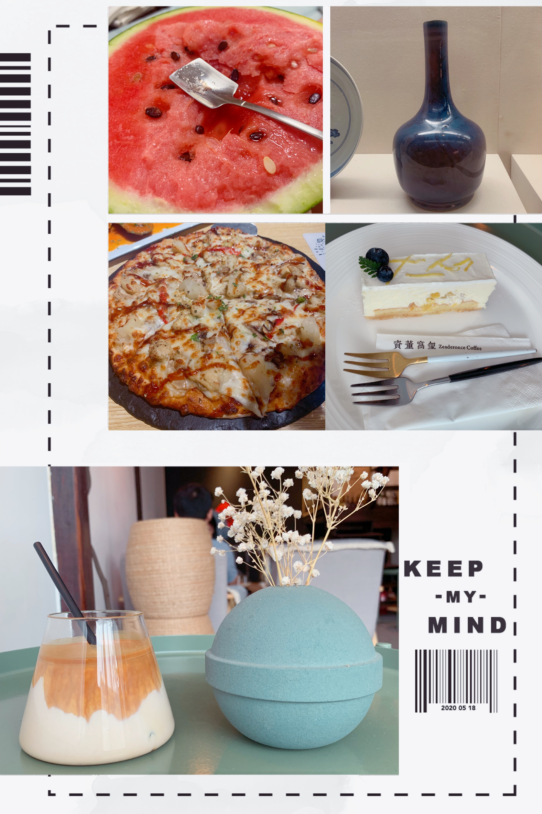

# 2020年5月16日
## 🐨学习
今天学习了！虽然还是不太集中吧

## 🐼运动
今天臀练得算认真的了，负重+微博了，不错！

## 🐝生活
今天待在家里，就是学习+运动+闲鱼

晚上吃了羊排，可真咸啊，生菜包肉是伟大的发明！

时间过得可真快啊，5月就咻的过了一大半了。

# 2020年5月15日
## 🐌学习
今天也没学习嘻嘻

## 🐅运动
但是我运动了，我hiit了！

## 🐏生活
早上面的个推，结果不好，个推还真好意思，让人跑那么多趟还一个劲的压低薪资，我们不去！

晚上就去吃了杭帮菜，还买了一件不同风格的花花🌺衣服，还买了猪猪大肠发圈！我就是小公主👸把！

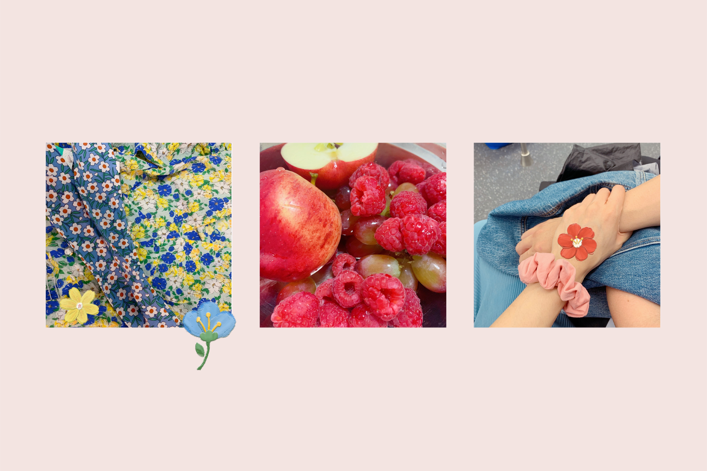

# 2020年5月14日
## 🙃学习
又是不想学习的一天

## 😶运动
又是不想运动的一天

## 👹生活
今天感觉很低气压啊， 做什么事情都没劲

晚上老公带我出去逛逛觉得心情好一点了，还拼了图。果然我就是大咸鱼，不能做正事的！老公还给我买了茉莉花，好一朵美丽的茉莉花！

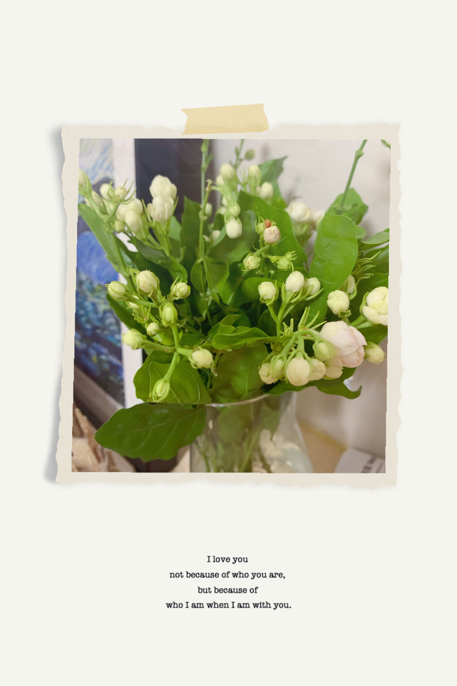

# 2020年5月13日
## 🚂学习
今天在看事实这本书，将怎么用理性、数据看待事物

晚上回家看了一下线程的一些基础知识

## 🚨运动
今天hiit了！

## 🚀生活
早上陪老公去个推面试了，老公面得还不错，希望有sp吧！

# 2020年5月12日
## ☔️学习
really bad

## ☁️运动
really tough

## ⚡️生活
今天真的是，老公一面字节就挂了，该死的面试官真随便

和老公捋自我介绍和项目，但是两个人就吵起来了，真烦

# 2020年5月11日
## 🌊学习
游啊游

## 🍍运动
游啊游

## 🌈生活
今天陪老公去面试个推了，老公说个推真破，希望他快点给我老公发offer！

今天还比较顺利的办成了居住证，浙大学生身份可真好用啊，不想毕业👨‍🎓！

早上的麦当劳🍔早餐可真好次，吃饱饱了！

diy手套🧤终于完成啦，效果还不错，我就是diy达人！就是弄得我手痛痛。

晚上吃完饭出去散散步🚶的感觉真好，早日实现10年1000万💰，早日实现散步自由！

# 2020年5月10日
## 🎬学习
今天我是一只小鱼🐟

## 🎳运动
今天我还是一只小鱼🐟

## 🧤生活
今天我就叫diy小达人，把头像缝到手套🧤里了！学了一个隐藏针线法。
1. 从下面穿上来
2. 在第一个洞附近从椭圆下面顺着穿两个洞
3. 针屁股后面的线从左往右绕过针

然后今天还吃了霸王餐，傻傻的机器人🤖

可爱的老公在家里开始无实物表演，大海🌊可真舒服呀~

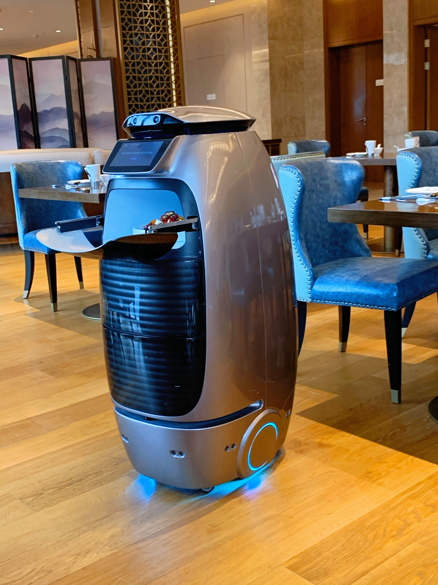
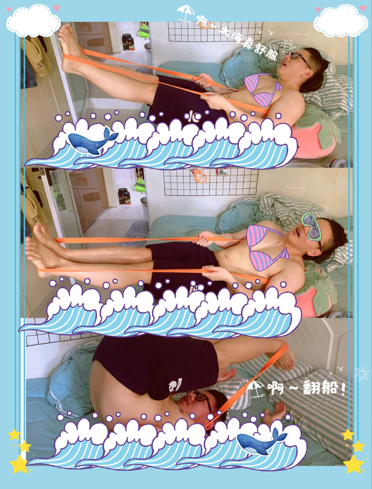

# 2020年5月9日
## 😫学习
又是学习很疲惫的一天

## ♣运动
今天老公面试太忙了！

## ✨生活
今天也是感觉累累的，不过老公给我买了好多零食，我就很开心

还有我最喜欢的跳动的心❤️到了，谢谢老公给我买

7盒拼图可以玩很久了！

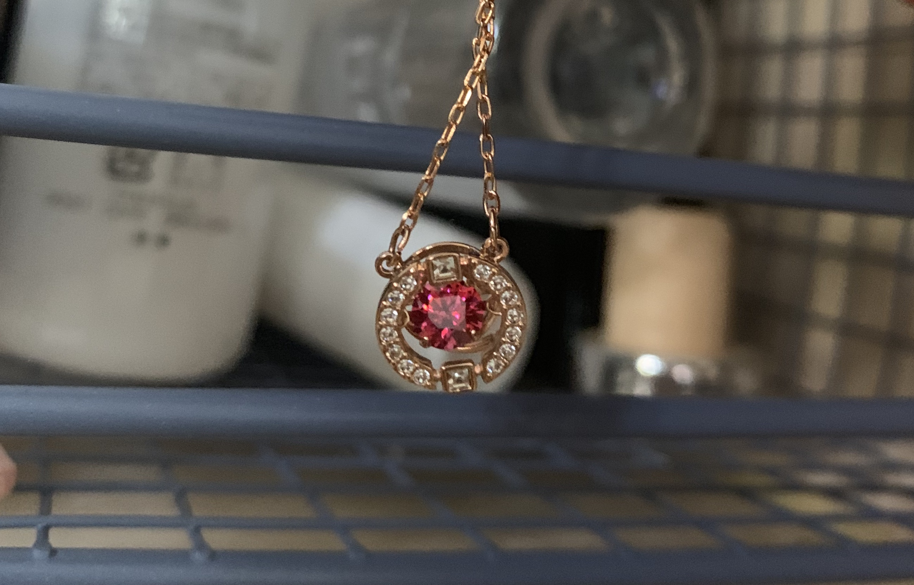
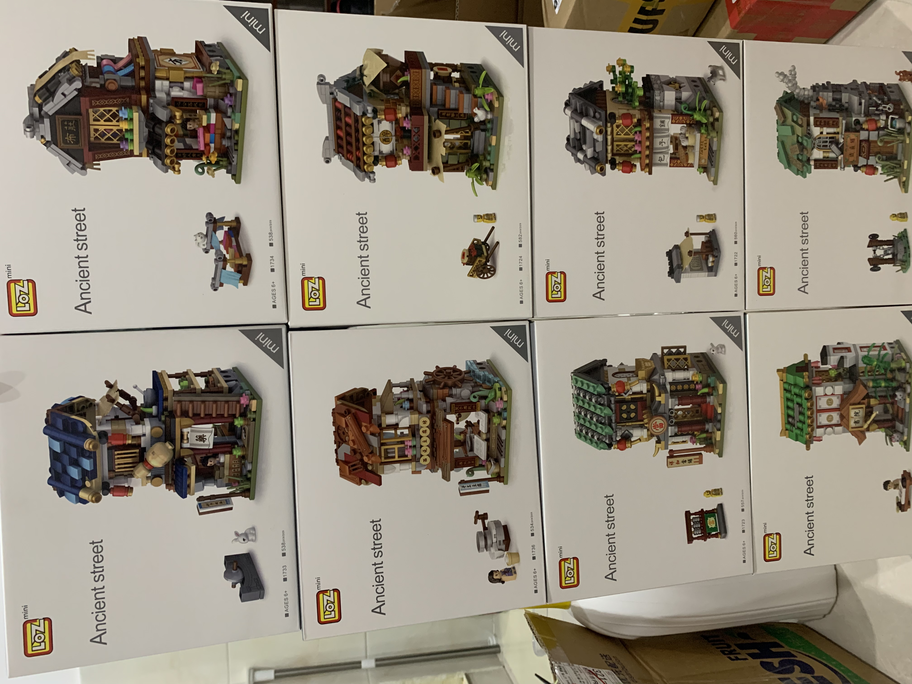

# 2020年5月8日
## ♻️学习
今天看的好慢的，那本书讲什么鬼都不知道，太乱了

## 🚰运动
hiit了

## 💔生活
今天是比较不开心的一天，我老公压力太大了，工作真的很难找啊。。

什么时候头上这片乌云才散去呢

# 2020年5月7日
## 😞学习
今天无心学习，明天再战把！

## 😤运动
今天做了深蹲和keep臀腿

## 🍔生活
今天做了一件大事，做汉堡🍔了！做出来之后还是超级好吃，没有吃够~

不过今天还是水加多了，面团没有发酵好，下次要注意一点一点加好才行。

今天的整体状态不是非常好，看书📖就无精打采的，哭哭😢。

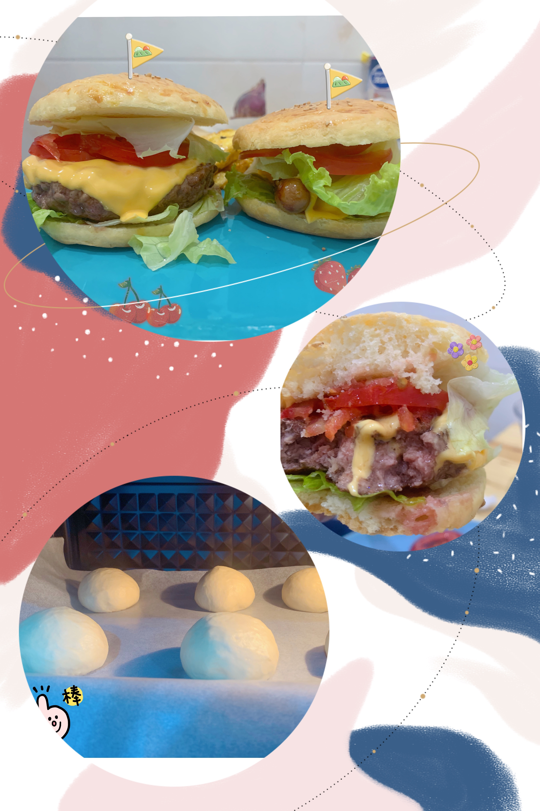

# 2020年5月6日
## 🔫学习
今天也是闲鱼的一天

## 🔐运动
我保证明天运动！

## 🏍生活
今天把小摩托车拼完了，还是超级可爱的把！

今天老公拼多多挂掉了，但是不是我老公的问题，老公加油！

今天晚餐又是吃好的一天，烤了小鸡腿吃，还有好吃的意面🍝，我老公厨艺没的说，期待明天的汉堡🍔

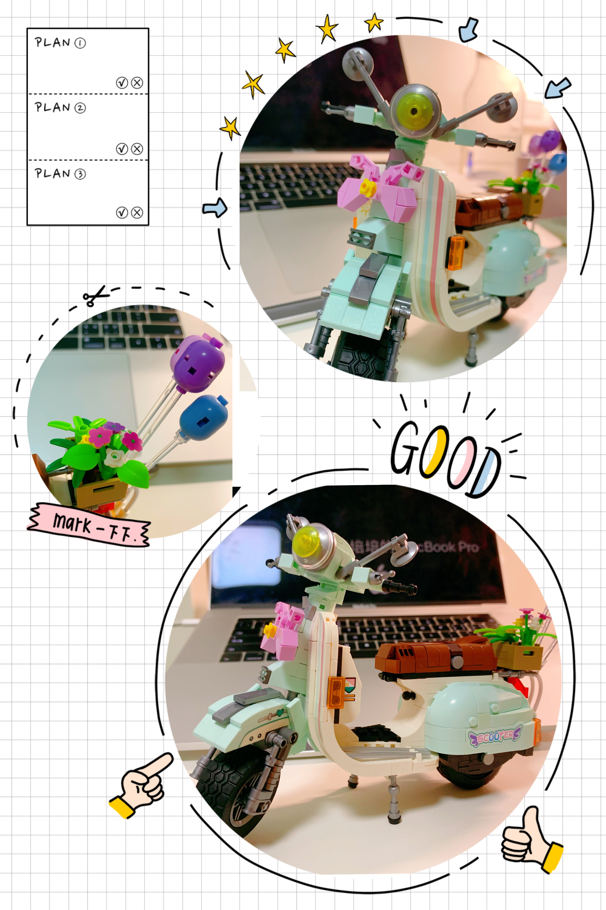
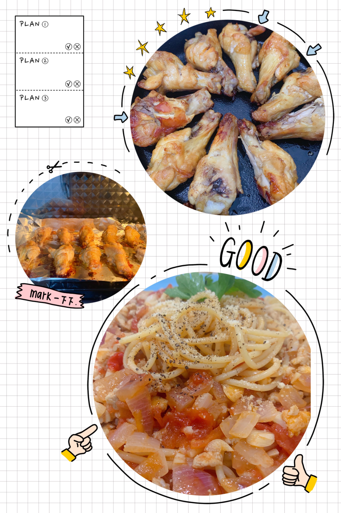

# 2020年5月5日
## 🐟学习
今天没怎么学习，就是看了下

## 🌫运动
hiit了，还算认真吧！

## 💰生活
今天去盒马买菜了，买了好多菜，用大用大

# 2020年5月4日
## 🚥学习
今天就大概把JVM看完了

## ⛵️运动
嘿嘿，没有完成晚上回来hiit的flag

## 🏡生活
今天是玩玩玩+吃吃吃的一天

晚上去吃了老爷锅🍲，就和一味差不多吧，芝士丸比较好吃~和的豆乳奶茶也还不错，挺小清新的。

今天又买了新玩具，搭积木可真好玩，一鼓作气把全套中华街🏡都买回家了！期待搭我的小摩托🏍~~ 

还买了我的小贴纸，我是小公主👸啊，必须要这么可爱的小贴纸的，和我的拍立得📷也太大配了吧

还买了新的香薰，raining garden series~~新家又香香啦~

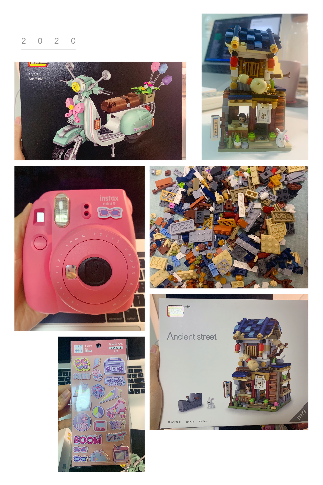
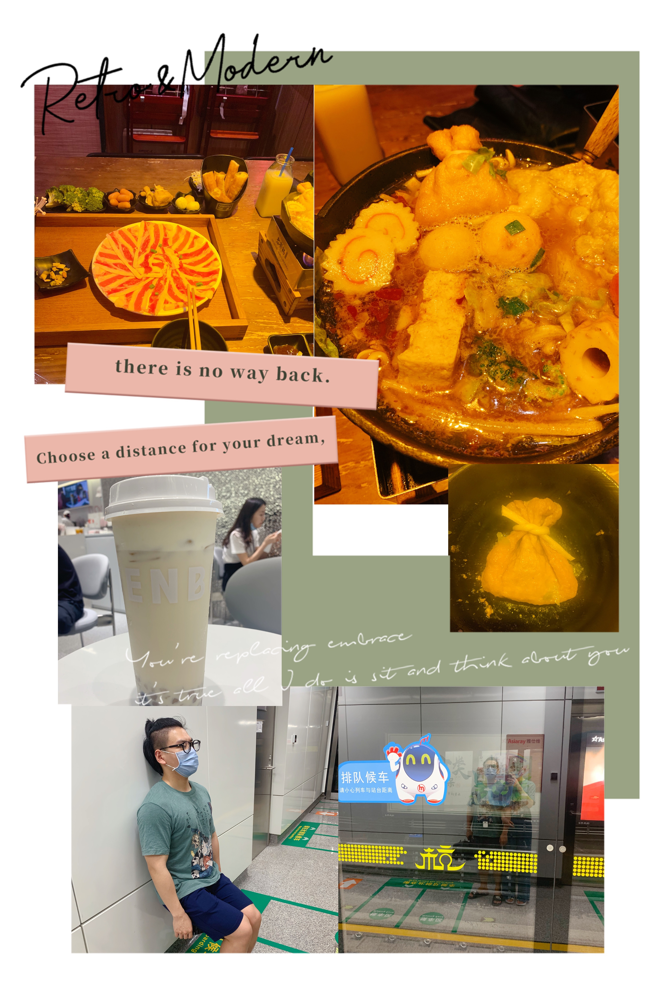

# 2020年5月3日
## 🚢学习
还没把JVM看完。。

## ⛲️运动
没有运动。。

## ⛺️生活
就呆在家里吃饭、学习，没什么特别的事情好说的

就做了个心烦的吐司，不知道怎么出手套膜。看了小高姐的教程，下次再试试

# 2020年5月2日
## 👩‍🏫‍学习
今天看了老半天对象创建部分，看的好慢啊

## 👼运动
没有运动。。。

## 🍰生活
今天烤箱到了！有烤箱真好！
我们烤了鸡胸肉，好嫩。还成功的做了戚风蛋糕，就超级松软，大成功！

今天老公还做了笔试题，真辛苦，老公加油！

今天老公特别爱我的样子，我也爱老公

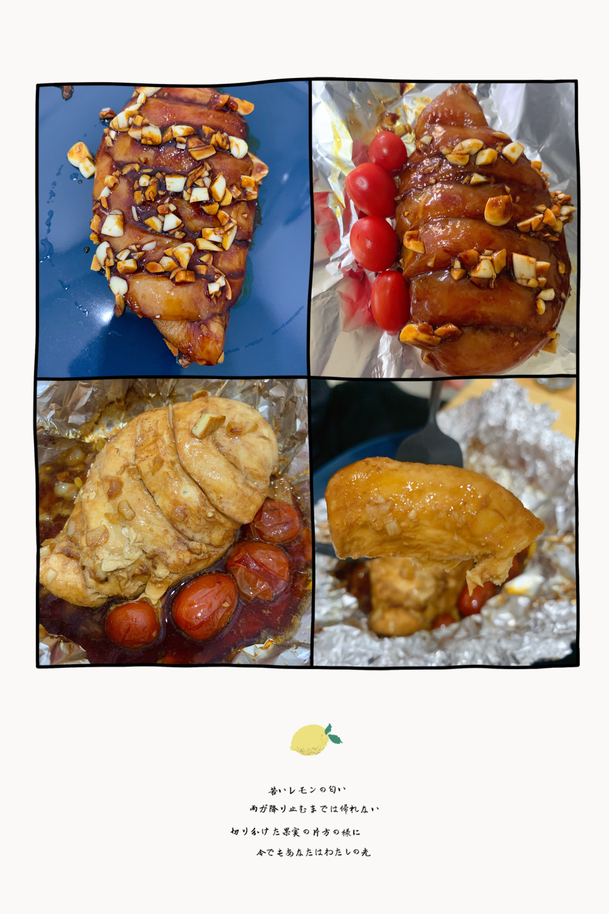

# 2020年5月1日
## ✍️学习
今天解决了JVM的类加载和类文件部分，太枯燥啦！

## 🛀运动
今天也好好hiit了，我棒棒

## ☀️生活
今天就是很规律的一天，学习、吃饭、学习、运动。不过也是心情很好呀，希望我老公能早点面试早点拿offer

我今天很傻的把冰淇淋🍨拿出来忘记放回去了，我就觉得很不开心。然后我老公安慰我，其实没什么大不了的，但是有时候我就会自己想不开。

今天还去买菜了，买了好多水果、菜，还吃了一顿虾虾🦐大餐，我们也太吃好了吧！

# 🍀2020年4月
[2020年4月](./journal/2020/4月.md)
[关键词]:MySQL、深蹲矫正、新菜、搬家、面试、吃吃吃、买买买、消费券

这个月前期学习中心还是MySQL，主要看了MySQL技术内幕的两本书。对MySQL不知道有了多少吸收，不过确实学到了点东西。希望能学以致用把~
然后看了《网络是怎样连接的》这本书，大概的对整个网络的架构更加清楚了。
最后的几天看了Linux、JVM，JVM还剩下一点内容留给5月~
闲书的话看了《子弹是怎样炼成的》、《山茶文具店两本》，都是读起来比较轻松的书。

这个月的运动还是那样，不过中间因为搬家、裁员断断续续了几次。重点是开始了深蹲矫正，结果表明矫正是有效果的~现在屁股不眨眼了，从数据上来看屁股好像也大了那么一丢丢，棒棒！！

生活还是那样多姿多彩~
去吃了好多家餐厅，失望的墨西哥、5折的麦当劳、好吃的sunnygarden可颂、方老大的拌川、好看的花泰、精致的夏久大概吃才是永恒的主题吧~
然后自己在家里也是做了很多菜呀，手撕鸡、抹茶慕斯、木瓜牛奶冻、家庭烤肉、家庭火锅、舒芙蕾、牛肉饺子、卤肉饭喜欢自己在家里做菜。

这个月还有消费券嘻嘻，拿着消费券去盒马购物才是最开心的呀。

这个月的大事是我们搬家了~搬了一个2居室的，多了一个客厅。我们买了架子收纳东西，房间里就变得干净好多。还买了心仪已久的烤箱，有了烤箱我们就能做好多东西了，第一个我要做的就是可颂了啦！为了搬家买了很多小玩意，让我觉得家里越来越丰富了~

新家真好，可是有一个不幸的事情。。我老公被裁员了，我很难过，老公压力很大。现在已经很少公司在招正式了，万一老公在杭州找不到合适的工作，万一要离开家家了怎么办呢。刚开始的几天里觉得非常难过，天都要塌了一样。不过想那么多也没用，现在老公就在很认真的准备面试。不管在不在杭州，面了再说。我老公太坚强了！想把所有的好运都给我老公，能早点找到合适的工作！

emmmm,心态还是一个很大的问题。看到社交网络上别人的小幸福，我就会觉得酸，就觉得自己不幸福。这大概是需要很久的时间去调整的把！

# 🌈2020年3月
[2020年3月](./journal/2020/3月.md)
[关键词]:新菜、拼图、高性能MySQL、运动、拼图、草莓、论文

在家老公给我做了很多菜：锅包肉、番茄土豆牛腩、手撕包菜、包子、青椒炒肉、鸡翅、草莓蛋饼、春卷、酸辣鸡爪、三汁焖锅。我老公大概就是厨房小能手了吧！

出去吃也打卡了不少地方，hello27、饭桶家、左庭右院、谭鸭血、大兴糕团、天泰、六甲牛乳。感觉自己变得越来越嘴馋了，就不饿也会想吃。得下定决心改掉这个习惯了，克制克制

好的一点是解锁了菜场买菜，定下只有周二去盒马买菜的规矩。相比去年还是省了一些钱的。

买了巴黎圣母院的拼图也是拼的很开心，两个人偶尔花1h拼拼图，找找图真的很有意思。最后的成功留下来就是最好的回忆~~~

这个月主要的学习内容是高性能MySQL，这本书是比较理论性的。看起来对部分底层有了大概的了解，比如索引。但是对于很多优化的部分目前看了还是没有什么感觉，看的过程中也是草草翻过。
然后大概花了1个月的时间看，虽然中途有一段时间去改论文。有好多时间看的都很痛苦不在状态，感觉还是得去寻找本科时候在自习室里的学习状态，慢慢调整吧~~

这个月的大头也是论文的事情，中间大改了一次，预审也只是中等，心理有些不平衡。希望论文盲审能顺利通过吧~在这段时间里，老公还是帮了我不少忙，谢谢我老公。

运动的话，也是比较有计划的，hitt-臀腿-胸肩-背这样的流程在走，不过有时候中间会断了嘿嘿。特别是集中改论文的那段时间最罪恶了。。

这个月和老公吵了好几次大架，每次都是因为莫名其妙的原因。几次是因为学习上的沟通问题，1次是因为炒面问题。我是很倔的，有时候心里就是秉着一股气，有时候发起神经来就很奇怪，其实是不那么生气的，但是自己越想就越生气。自己的这个臭脾气还是得改改吧~~

这个夏天也是草莓味的夏天，吃了不少的草莓和橘子，多吃水果才能变美美呀~~

下个月继续保持学习，然后希望两个人能更和和睦睦的，自己能保持节食的状态。

