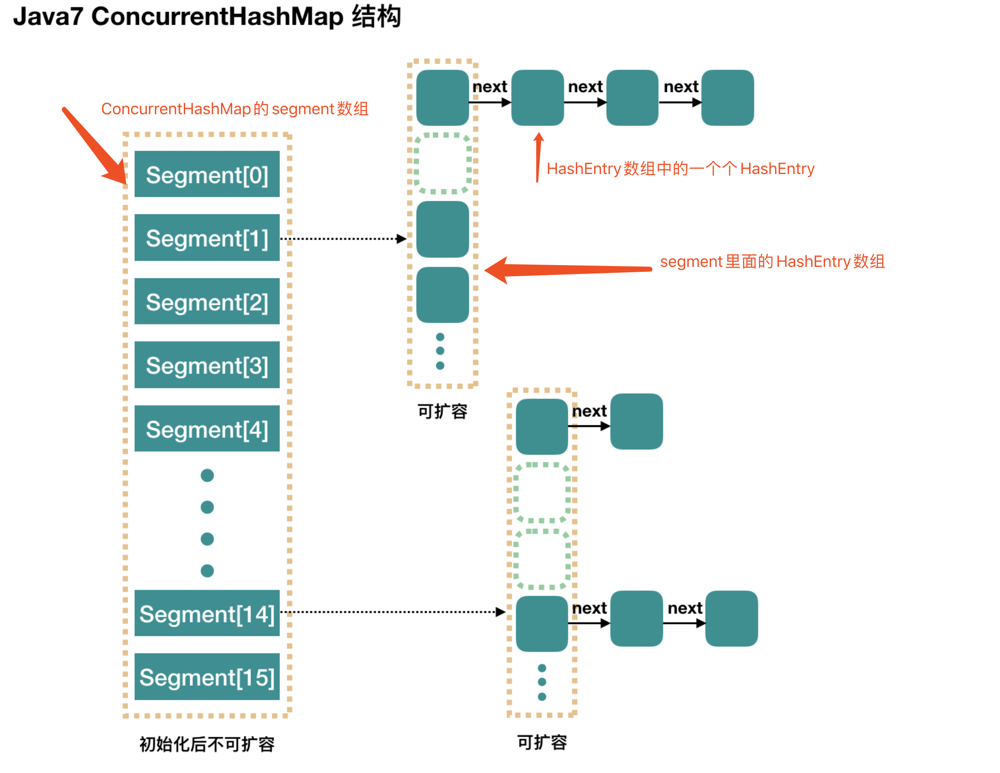

## 参考博文
[JUC集合: ConcurrentHashMap详解](https://www.pdai.tech/md/java/thread/java-thread-x-juc-collection-ConcurrentHashMap.html#%e6%95%b0%e6%8d%ae%e7%bb%93%e6%9e%84)
[学习ConcurrentHashMap1.7分段锁原理](https://www.bbsmax.com/A/A7zgD83oJ4/)
[ConcurrentHashMap1.7和1.8的底层不同实现](https://my.oschina.net/zupengliu/blog/1930025)
[深入理解ConcurrentHashMap](https://luoxn28.github.io/2019/06/19/shen-ru-li-jie-concurrenthashmap/)
[并发容器之ConcurrentHashMap(JDK 1.8版本)](https://juejin.im/post/5aeeaba8f265da0b9d781d16#heading-0)


[TOC]


# 1. ConcurrentHashMap - JDK 1.7
HashTable效率低是因为他使用synchronized在put时对整个表加锁，而ConcurrentHashMap使用了分段锁

整个ConcurrentHashMap内部有一个segment数组，segment继承==ReentrantLock加锁==，每次加锁只锁住一个segment。

segment的实现和HashTable相似，是==数组+链表==：
1. segment里面存放的是HashEntry数组
2. HashEntry数组里面存放一个个链表



## 初始化
- concurrencyLevel：segment数组大小，代表了最大的并发数，默认为16。一旦初始化后，segment数组就不能再扩容

- initialCapacity：整个ConcurrentHashMap的初始容量，实际操作的时候需要平均分给每个Segment。代表segment里面HashEntry数组的大小

- loadFactor：每个Segment内部使用的负载因子

Segment[i] 的默认大小为 2，负载因子是 0.75，得出初始阈值为 1.5，也就是以后插入第一个元素不会触发扩容，插入第二个会进行第一次扩容

```java
    public ConcurrentHashMap(int initialCapacity,
                             float loadFactor, int concurrencyLevel) {
        if (!(loadFactor > 0) || initialCapacity < 0 || concurrencyLevel <= 0)
            throw new IllegalArgumentException();
        // 对于concurrencyLevel的理解, 可以理解为segments数组的长度，即理论上多线程并发数(分段锁), 默认16
        if (concurrencyLevel > MAX_SEGMENTS)
            concurrencyLevel = MAX_SEGMENTS;
        // Find power-of-two sizes best matching arguments
        int sshift = 0;
        int ssize = 1;
        // 默认concurrencyLevel = 16, 所以ssize在默认情况下也是16,此时 sshift = 4
        // ssize = 2^sshift 即 ssize = 1 << sshift
        while (ssize < concurrencyLevel) {
            ++sshift;
            ssize <<= 1;
        }
        // 段偏移量，32是因为hash是int值，int值32位，默认值情况下此时segmentShift = 28
        this.segmentShift = 32 - sshift;
        // 散列算法的掩码，默认值情况下segmentMask = 15, 定位segment的时候需要根据segment[]长度取模, 即hash(key)&(ssize - 1)
        this.segmentMask = ssize - 1;
        if (initialCapacity > MAXIMUM_CAPACITY)
            initialCapacity = MAXIMUM_CAPACITY;
        // 计算每个segment中table的容量, 初始容量=16, 并发数=16, 则segment中的Entry[]长度为1。
        int c = initialCapacity / ssize;
        // 处理无法整除的情况，取上限
        if (c * ssize < initialCapacity)
            ++c;
        // MIN_SEGMENT_TABLE_CAPACITY默认时2，cap是2的n次方
        int cap = MIN_SEGMENT_TABLE_CAPACITY;
        while (cap < c)
            cap <<= 1;
        // create segments and segments[0]
        // 创建segments并初始化第一个segment数组,其余的segment延迟初始化
        Segment<K,V> s0 =
            new Segment<K,V>(loadFactor, (int)(cap * loadFactor),
                             (HashEntry<K,V>[])new HashEntry[cap]);
        // 默认并发数=16
        Segment<K,V>[] ss = (Segment<K,V>[])new Segment[ssize];
        UNSAFE.putOrderedObject(ss, SBASE, s0); // ordered write of segments[0]
        this.segments = ss;
    }
```

## put

- put 操作的线程安全性。
初始化槽，这个我们之前就说过了，使用了 CAS 来初始化 Segment 中的数组。 添加节点到链表的操作是插入到表头的，所以，如果这个时候 get 操作在链表遍历的过程已经到了中间，是不会影响的。当然，另一个并发问题就是 get 操作在 put 之后，需要保证刚刚插入表头的节点被读取，这个依赖于 setEntryAt 方法中使用的 UNSAFE.putOrderedObject。 扩容。扩容是新创建了数组，然后进行迁移数据，最后面将 newTable 设置给属性 table。所以，如果 get 操作此时也在进行，那么也没关系，如果 get 先行，那么就是在旧的 table 上做查询操作；而 put 先行，那么 put 操作的可见性保证就是 table 使用了 volatile 关键字。 

- remove 操作的线程安全性。
get 操作需要遍历链表，但是 remove 操作会"破坏"链表。 如果 remove 破坏的节点 get 操作已经过去了，那么这里不存在任何问题。 如果 remove 先破坏了一个节点，分两种情况考虑。 1、如果此节点是头结点，那么需要将头结点的 next 设置为数组该位置的元素，table 虽然使用了 volatile 修饰，但是 volatile 并不能提供数组内部操作的可见性保证，所以源码中使用了 UNSAFE 来操作数组，请看方法 setEntryAt。2、如果要删除的节点不是头结点，它会将要删除节点的后继节点接到前驱节点中，这里的并发保证就是 next 属性是 volatile 的

```java
//ConcurrentHashMap
    public V put(K key, V value) {
        Segment<K,V> s;
        if (value == null)
            throw new NullPointerException();
        // 根据key的hash再次进行hash运算
        int hash = hash(key.hashCode());
        // 基于hash定位segment数组的索引。
        // hash值是int值，32bits。segmentShift=28，无符号右移28位，剩下高4位，其余补0。
        // segmentMask=15，二进制低4位全部是1，所以j相当于hash右移后的低4位。
        int j = (hash >>> segmentShift) & segmentMask;
        if ((s = (Segment<K,V>)UNSAFE.getObject          // nonvolatile; recheck
             (segments, (j << SSHIFT) + SBASE)) == null) //  in ensureSegment
        // 找到对应segment
            s = ensureSegment(j);
        // 将新节点插入segment中
        return s.put(key, hash, value, false);
    }

        //Segment
         final V put(K key, int hash, V value, boolean onlyIfAbsent) {
            // 是否获取锁,失败自旋获取锁(直到成功)
            HashEntry<K,V> node = tryLock() ? null :
                scanAndLockForPut(key, hash, value); // 失败了才会scanAndLockForPut
            V oldValue;
            try {
                HashEntry<K,V>[] tab = table;
                int index = (tab.length - 1) & hash;
                // 获取到bucket位置的第一个节点
                HashEntry<K,V> first = entryAt(tab, index);
                for (HashEntry<K,V> e = first;;) {
                    // hash冲突
                    if (e != null) {
                        K k;
                        // key相等则覆盖
                        if ((k = e.key) == key ||
                            (e.hash == hash && key.equals(k))) {
                            oldValue = e.value;
                            if (!onlyIfAbsent) {
                                e.value = value;
                                ++modCount;
                            }
                            break;
                        }
                        // 不相等则遍历链表
                        e = e.next;
                    }
                    else {
                        if (node != null)
                            // 将新节点插入链表作为表头
                            node.setNext(first);
                        else
                            // 创建新节点并插入表头
                            node = new HashEntry<K,V>(hash, key, value, first);
                        int c = count + 1;
                        // 判断元素个数是否超过了阈值或者segment中数组的长度超过了MAXIMUM_CAPACITY，如果满足条件则rehash扩容！
                        if (c > threshold && tab.length < MAXIMUM_CAPACITY)
                            // 扩容
                            rehash(node);
                        else
                            setEntryAt(tab, index, node);
                        ++modCount;
                        count = c;
                        oldValue = null;
                        break;
                    }
                }
            } finally {
                // 解锁
                unlock();
            }
            return oldValue;
        }

    //找出对应 segment，如果不存在就创建并初始化
    @SuppressWarnings("unchecked")
    private Segment<K,V> ensureSegment(int k) {
        // 当前的segments数组
        final Segment<K,V>[] ss = this.segments;
        // 计算原始偏移量,在segments数组的位置
        long u = (k << SSHIFT) + SBASE; // raw offset
        Segment<K,V> seg;
        // 判断没有被初始化
        if ((seg = (Segment<K,V>)UNSAFE.getObjectVolatile(ss, u)) == null) {
            // 获取第一个segment ss[0]作为原型
            Segment<K,V> proto = ss[0]; // use segment 0 as prototype
            int cap = proto.table.length; // 容量
            float lf = proto.loadFactor; // 负载因子
            int threshold = (int)(cap * lf); // 阈值
            // 初始化ss[k] 内部的tab数组 // recheck
            HashEntry<K,V>[] tab = (HashEntry<K,V>[])new HashEntry[cap];
            // 再次检查这个ss[k]  有没有被初始化
            if ((seg = (Segment<K,V>)UNSAFE.getObjectVolatile(ss, u))
                == null) { // recheck
                Segment<K,V> s = new Segment<K,V>(lf, threshold, tab);
                // 自旋。getObjectVolatile 保证了读的可见性,所以一旦有一个线程初始化了,那么就结束自旋
                while ((seg = (Segment<K,V>)UNSAFE.getObjectVolatile(ss, u))
                       == null) {
                    if (UNSAFE.compareAndSwapObject(ss, u, null, seg = s))
                        break;
                }
            }
        }
        return seg;
    }

    //如果加锁失败就开始自旋
    private HashEntry<K,V> scanAndLockForPut(K key, int hash, V value) {
            // 根据hash获取头结点
            HashEntry<K,V> first = entryForHash(this, hash);
            HashEntry<K,V> e = first;
            HashEntry<K,V> node = null;
            int retries = -1; // negative while locating node
            // 尝试获取锁,成功就返回,失败就开始自旋
            while (!tryLock()) {
                HashEntry<K,V> f; // to recheck first below
                if (retries < 0) {
                    // 如果头结点不存在
                    if (e == null) {
                        if (node == null) // speculatively create node
                            node = new HashEntry<K,V>(hash, key, value, null);
                        retries = 0;
                    }
                    // 和头结点key相等
                    else if (key.equals(e.key))
                        retries = 0;
                    else
                        // 下一个节点 直到为null
                        e = e.next;
                }
                // 达到自旋的最大次数
                else if (++retries > MAX_SCAN_RETRIES) {
                    // lock()是阻塞方法。进入加锁方法,失败进入队列,阻塞当前线程
                    lock();
                    break;
                }
                // TODO (retries & 1) == 0 没理解
                else if ((retries & 1) == 0 &&
                         (f = entryForHash(this, hash)) != first) {
                    // 头结点变化,需要重新遍历,说明有新的节点加入或者移除
                    e = first = f; // re-traverse if entry changed
                    retries = -1;
                }
            }
            return node;
        }  

//对HashEntry<K,V>[] 进行扩容至原来的2倍
private void rehash(HashEntry<K,V> node) {
    HashEntry<K,V>[] oldTable = table;
    int oldCapacity = oldTable.length;
    // 2 倍
    int newCapacity = oldCapacity << 1;
    threshold = (int)(newCapacity * loadFactor);
    // 创建新数组
    HashEntry<K,V>[] newTable =
        (HashEntry<K,V>[]) new HashEntry[newCapacity];
    // 新的掩码，如从 16 扩容到 32，那么 sizeMask 为 31，对应二进制 ‘000...00011111’
    int sizeMask = newCapacity - 1;

    // 遍历原数组，老套路，将原数组位置 i 处的链表拆分到 新数组位置 i 和 i+oldCap 两个位置
    for (int i = 0; i < oldCapacity ; i++) {
        // e 是链表的第一个元素
        HashEntry<K,V> e = oldTable[i];
        if (e != null) {
            HashEntry<K,V> next = e.next;
            // 计算应该放置在新数组中的位置，
            // 假设原数组长度为 16，e 在 oldTable[3] 处，那么 idx 只可能是 3 或者是 3 + 16 = 19
            int idx = e.hash & sizeMask;
            if (next == null)   // 该位置处只有一个元素，那比较好办
                newTable[idx] = e;
            else { // Reuse consecutive sequence at same slot
                // e 是链表表头
                HashEntry<K,V> lastRun = e;
                // idx 是当前链表的头结点 e 的新位置
                int lastIdx = idx;

                // 下面这个 for 循环会找到一个 lastRun 节点，这个节点之后的所有元素是将要放到一起的
                for (HashEntry<K,V> last = next;
                     last != null;
                     last = last.next) {
                    int k = last.hash & sizeMask;
                    if (k != lastIdx) {
                        lastIdx = k;
                        lastRun = last;
                    }
                }
                // 将 lastRun 及其之后的所有节点组成的这个链表放到 lastIdx 这个位置
                newTable[lastIdx] = lastRun;
                // 下面的操作是处理 lastRun 之前的节点，
                //    这些节点可能分配在另一个链表中，也可能分配到上面的那个链表中
                for (HashEntry<K,V> p = e; p != lastRun; p = p.next) {
                    V v = p.value;
                    int h = p.hash;
                    int k = h & sizeMask;
                    HashEntry<K,V> n = newTable[k];
                    newTable[k] = new HashEntry<K,V>(h, p.key, v, n);
                }
            }
        }
    }
    // 将新来的 node 放到新数组中刚刚的 两个链表之一 的 头部
    int nodeIndex = node.hash & sizeMask; // add the new node
    node.setNext(newTable[nodeIndex]);
    newTable[nodeIndex] = node;
    table = newTable;
}      
```

## get
1. 计算 hash 值，找到 segment 数组中的具体位置
2. 槽中也是一个数组，根据 hash 找到数组中具体的位置
3. 到这里是链表了，顺着链表进行查找即可

```java
public V get(Object key) {
    Segment<K,V> s; // manually integrate access methods to reduce overhead
    HashEntry<K,V>[] tab;
    // 1. hash 值
    int h = hash(key);
    long u = (((h >>> segmentShift) & segmentMask) << SSHIFT) + SBASE;
    // 2. 根据 hash 找到对应的 segment
    if ((s = (Segment<K,V>)UNSAFE.getObjectVolatile(segments, u)) != null &&
        (tab = s.table) != null) {
        // 3. 找到segment 内部数组相应位置的链表，遍历
        for (HashEntry<K,V> e = (HashEntry<K,V>) UNSAFE.getObjectVolatile
                 (tab, ((long)(((tab.length - 1) & h)) << TSHIFT) + TBASE);
             e != null; e = e.next) {
            K k;
            if ((k = e.key) == key || (e.hash == h && key.equals(k)))
                return e.value;
        }
    }
    return null;
}
```


# 2. ConcurrentHashMap - JDK 1.8
1.8底层采用了==Node数组+链表+红黑树==的数据结构来实现，并发控制使用==Synchronized和CAS==来操作

ConcurrentHashMap里有一个Node数组，Node数组中存放链表，当链表长度大于8时会将链表结构转换成红黑树


## 初始化
```java
public class ConcurrentHashMap<K,V> extends AbstractMap<K,V>
    implements ConcurrentMap<K,V>, Serializable {

    // node数组最大容量：2^30=1073741824
    private static final int MAXIMUM_CAPACITY = 1 << 30;
    // 默认初始值，必须是2的幕数
    private static final int DEFAULT_CAPACITY = 16;
    //数组可能最大值，需要与toArray（）相关方法关联
    static final int MAX_ARRAY_SIZE = Integer.MAX_VALUE - 8;
    //并发级别，遗留下来的，为兼容以前的版本
    private static final int DEFAULT_CONCURRENCY_LEVEL = 16;
    // 负载因子
    private static final float LOAD_FACTOR = 0.75f;
    // 链表转红黑树阀值,> 8 链表转换为红黑树
    static final int TREEIFY_THRESHOLD = 8;
    //树转链表阀值，小于等于6（tranfer时，lc、hc=0两个计数器分别++记录原bin、新binTreeNode数量，<=UNTREEIFY_THRESHOLD 则untreeify(lo)）
    static final int UNTREEIFY_THRESHOLD = 6;
    static final int MIN_TREEIFY_CAPACITY = 64;
    private static final int MIN_TRANSFER_STRIDE = 16;
    private static int RESIZE_STAMP_BITS = 16;
    // 2^15-1，help resize的最大线程数
    private static final int MAX_RESIZERS = (1 << (32 - RESIZE_STAMP_BITS)) - 1;
    // 32-16=16，sizeCtl中记录size大小的偏移量
    private static final int RESIZE_STAMP_SHIFT = 32 - RESIZE_STAMP_BITS;
    // forwarding nodes的hash值
    static final int MOVED     = -1; 
    // 树根节点的hash值
    static final int TREEBIN   = -2; 
    // ReservationNode的hash值
    static final int RESERVED  = -3; 
    // 可用处理器数量
    static final int NCPU = Runtime.getRuntime().availableProcessors();
    //存放node的数组
    transient volatile Node<K,V>[] table;
    /*控制标识符，用来控制table的初始化和扩容的操作，不同的值有不同的含义
    *当为负数时：-1代表正在初始化，-N代表有N-1个线程正在 进行扩容
    *当为0时：代表当时的table还没有被初始化
    *当为正数时：表示初始化或者下一次进行扩容的大小*/
    private transient volatile int sizeCtl;

    public ConcurrentHashMap() {
    }
    public ConcurrentHashMap(int initialCapacity) {
        if (initialCapacity < 0)
            throw new IllegalArgumentException();
        int cap = ((initialCapacity >= (MAXIMUM_CAPACITY >>> 1)) ?
                MAXIMUM_CAPACITY :
                tableSizeFor(initialCapacity + (initialCapacity >>> 1) + 1));
        this.sizeCtl = cap;
    }
}
```


## Node
```java
static class Node<K,V> implements Map.Entry<K,V> {
    final int hash;
    final K key;
    volatile V val;
    volatile Node<K,V> next;
}
```

## put
1. 如果没有初始化就先调用initTable（）方法来进行初始化过程
2. 如果没有hash冲突就直接CAS插入
3. 如果还在进行扩容操作就先进行扩容
4. 如果存在hash冲突，就加锁来保证线程安全，这里有两种情况，一种是链表形式就直接遍历到尾端插入，一种是红黑树就按照红黑树结构插入，
5. 最后一个如果该链表的数量大于阈值8，就要先转换成黑红树的结构，break再一次进入循环
6. 如果添加成功就调用addCount（）方法统计size，并且检查是否需要扩容
```java
//ConcurrentHashMap
public V put(K key, V value) {
    return putVal(key, value, false);
}

final V putVal(K key, V value, boolean onlyIfAbsent) {
    if (key == null || value == null) throw new NullPointerException();
    int hash = spread(key.hashCode()); //两次hash，减少hash冲突，可以均匀分布
    int binCount = 0;
    for (Node<K,V>[] tab = table;;) { //对这个table进行迭代
        Node<K,V> f; int n, i, fh;
        //这里就是上面构造方法没有进行初始化，在这里进行判断，为null就调用initTable进行初始化，属于懒汉模式初始化
        if (tab == null || (n = tab.length) == 0)
            tab = initTable();
        else if ((f = tabAt(tab, i = (n - 1) & hash)) == null) {//如果i位置没有数据，就直接无锁插入
            if (casTabAt(tab, i, null,
                         new Node<K,V>(hash, key, value, null)))
                break;                   // no lock when adding to empty bin
        }
        else if ((fh = f.hash) == MOVED)//如果在进行扩容，则先进行扩容操作
            tab = helpTransfer(tab, f);
        else {
            V oldVal = null;
            //如果以上条件都不满足，那就要进行加锁操作，也就是存在hash冲突，锁住链表或者红黑树的头结点
            synchronized (f) {
                if (tabAt(tab, i) == f) {
                    if (fh >= 0) { //表示该节点是链表结构
                        binCount = 1;
                        for (Node<K,V> e = f;; ++binCount) {
                            K ek;
                            //这里涉及到相同的key进行put就会覆盖原先的value
                            if (e.hash == hash &&
                                ((ek = e.key) == key ||
                                 (ek != null && key.equals(ek)))) {
                                oldVal = e.val;
                                if (!onlyIfAbsent)
                                    e.val = value;
                                break;
                            }
                            Node<K,V> pred = e;
                            if ((e = e.next) == null) {  //插入链表尾部
                                pred.next = new Node<K,V>(hash, key,
                                                          value, null);
                                break;
                            }
                        }
                    }
                    else if (f instanceof TreeBin) {//红黑树结构
                        Node<K,V> p;
                        binCount = 2;
                        //红黑树结构旋转插入
                        if ((p = ((TreeBin<K,V>)f).putTreeVal(hash, key,
                                                       value)) != null) {
                            oldVal = p.val;
                            if (!onlyIfAbsent)
                                p.val = value;
                        }
                    }
                }
            }
            if (binCount != 0) { //如果链表的长度大于8时就会进行红黑树的转换
                if (binCount >= TREEIFY_THRESHOLD)
                    treeifyBin(tab, i);
                if (oldVal != null)
                    return oldVal;
                break;
            }
        }
    }
    addCount(1L, binCount);//统计size，并且检查是否需要扩容
    return null;
}

```

## get
1. 计算hash值，定位到该table索引位置，如果是首节点符合就返回
2. 如果遇到扩容的时候，会调用标志正在扩容节点ForwardingNode的find方法，查找该节点，匹配就返回
3. 以上都不符合的话，就往下遍历节点，匹配就返回，否则最后就返回null
```java
public V get(Object key) {
    Node<K,V>[] tab; Node<K,V> e, p; int n, eh; K ek;
    int h = spread(key.hashCode()); //计算hash,再散列
    if ((tab = table) != null && (n = tab.length) > 0 &&
        (e = tabAt(tab, (n - 1) & h)) != null) {//读取首节点的Node元素
        if ((eh = e.hash) == h) { //如果该节点就是首节点就返回
            if ((ek = e.key) == key || (ek != null && key.equals(ek)))
                return e.val;
        }
        //hash值为负值表示正在扩容，这个时候查的是ForwardingNode的find方法来定位到nextTable来
        //查找，查找到就返回
        else if (eh < 0)
            return (p = e.find(h, key)) != null ? p.val : null;
        while ((e = e.next) != null) {//既不是首节点也不是ForwardingNode，那就往下遍历
            if (e.hash == h &&
                ((ek = e.key) == key || (ek != null && key.equals(ek))))
                return e.val;
        }
    }
    return null;
}
```