## 参考博文
[ConcurrentLinkedQueue源码分析](https://juejin.im/entry/5b4dde4b5188251af6621e13)
[JUC集合: ConcurrentLinkedQueue详解](https://www.pdai.tech/md/java/thread/java-thread-x-juc-collection-ConcurrentLinkedQueue.html)
[ConcurrentLinkedQueue 源码分析 (基于Java 8)](https://www.jianshu.com/p/08e8b0c424c0)


[TOC]


# 1. 概述
ConcurrentLinkedQueue是基于链表实现的线程安全的非阻塞队列：
1. 是无界队列
2. 在链表尾部添加元素，从链表头部获取元素
3. 单向链表
4. 不允许有null元素
5. 采用CAS实现
6. 包含头结点head和尾结点tail两个指针，他们直接指向元素，自己没有单独的对象


# 2. 源码分析
## 构造函数
ConcurrentLinkedQueue继承了AbstractQueue，实现了Queue。AbstractQueue和Queue都定义了对队列的基本操作。但是AbstractQueue也实现了Queue，并且提供了部分方法的实现
```java
public class ConcurrentLinkedQueue<E> extends AbstractQueue<E>
        implements Queue<E>, java.io.Serializable {
    // 头节点，
    private transient volatile Node<E> head;
    // 尾节点，多线程环境下尾节点不一定是链表的最后一个节点、但最终会是最后一个节点
    private transient volatile Node<E> tail;
    private static final sun.misc.Unsafe UNSAFE;
    // 构造
    public ConcurrentLinkedQueue() {
        head = tail = new Node<E>(null);
    }

    public ConcurrentLinkedQueue(Collection<? extends E> c) {
        Node<E> h = null, t = null;
        for (E e : c) { // 遍历c集合
            // 保证元素不为空
            checkNotNull(e);
            // 新生一个结点
            Node<E> newNode = new Node<E>(e);
            if (h == null) // 头结点为null
                // 赋值头结点与尾结点
                h = t = newNode;
            else {
                // 直接头结点的next域
                t.lazySetNext(newNode);
                // 重新赋值头结点
                t = newNode;
            }
        }
        if (h == null) // 头结点为null
            // 新生头结点与尾结点
            h = t = new Node<E>(null);
        // 赋值头结点
        head = h;
        // 赋值尾结点
        tail = t;
    }
}
```


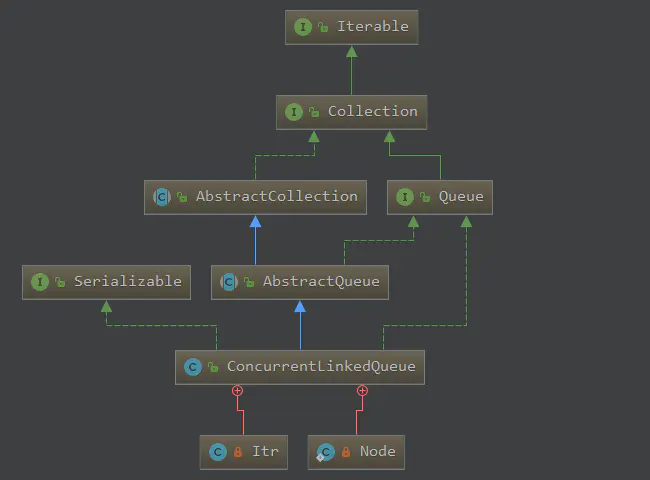


- Queue
```java
public interface Queue<E> extends Collection<E> {
    // 添加元素
    boolean add(E e);
    // 添加元素
    boolean offer(E e);
    // 删除元素
    E remove();
    // 删除并返回第一个元素，如果队列为空，则返回 null 
    E poll();
　　 // 返回第一个元素，如果不存在，则抛出NoSuchElementException异常
    E element();
    // 返回第一个元素，但不删除，如果队列为空，则返回 null 
    E peek();
}
```

- AbstractQueue
```java
public abstract class AbstractQueue<E> extends AbstractCollection<E> implements Queue<E> {

    public boolean add(E e) {
        if (offer(e))
            return true;
        else
            throw new IllegalStateException("Queue full");
    }

    public E remove() {
        E x = poll();
        if (x != null)
            return x;
        else
            throw new NoSuchElementException();
    }
...............................
}
```

## 内部类Node
E item 元素和 Node next 节点都使用了 volatile 来修饰，这说明了元素或某个节点被一个线程修改了之后，其他的线程是立马看到修改后的值的。

```java
    private static class Node<E> {
        // 节点中的元素
        volatile E item;
        // 下一个节点，没有上一个节点，表示它是一个单向链表的形式
        volatile Node<E> next;
        // 构造一个节点
        Node(E item) {
            UNSAFE.putObject(this, itemOffset, item);
        }
        // 使用 CAS 的方式设置节点的元素
        boolean casItem(E cmp, E val) {
            return UNSAFE.compareAndSwapObject(this, itemOffset, cmp, val);
        }
        // 设置下一个节点
        void lazySetNext(Node<E> val) {
            UNSAFE.putOrderedObject(this, nextOffset, val);
        }
        // 采用 CAS 的方式设置下一个节点
        boolean casNext(Node<E> cmp, Node<E> val) {
            return UNSAFE.compareAndSwapObject(this, nextOffset, cmp, val);
        }
      //  Unsafe 类的一些初始化
    }
```

## 添加元素
在链表尾部添加元素有两个方法： add() 和 offer()。add() 会调用 offer() 进行添加

这两个方法永远都会返回 true，所以不要使用 true | false 来判断是否添加成功

>1. 将入队节点设置成尾结点的下一个节点
>2. 更新tail节点：如果tail节点的next不为空，则将入队节点设置成tail节点；否则将入队节点设置成tail节点的next节点，此时tail节点不是尾结点

相当于第二次插入节点时才会将tail节点设置成尾结点

```java
    public boolean add(E e) {
        return offer(e);
    }

    public boolean offer(E e) {
        // 判空，为空则抛出空指针异常
        checkNotNull(e);
        // 创建要添加的节点
        final Node<E> newNode = new Node<E>(e);
        
        // 无限循环，入队不成功，则反复入队
        // t 表示 tail 节点
        // p 表示链表的尾节点，默认等于 tail 节点
        for (Node<E> t = tail, p = t;;) {
            // q 为尾节点的下一个节点         
            Node<E> q = p.next;
            // 如果尾节点的下一个节点为空，则表示 p 为尾节点
            if (q == null) {
                // CAS 设置尾节点的下一个节点为新添加的节点，如果设置失败，在再次尝试
                if (p.casNext(null, newNode)) {
                    // 如果tail节点有大于等于1个的 next 节点，则更新 tail 节点，将新添加的节点设置为 tail 节点
                    if (p != t) // 相当于循环两次更新一次 tail 节点
                        casTail(t, newNode);  // 新添加的节点设置为tail节点，允许失败，失败了表示有其他线程成功更新了tail节点
                    return true;
                }
            }
            else if (p == q) // 只有在尾节点和尾节点的下一个节点为空的情况下成立
                p = (t != (t = tail)) ? t : head;
            else 
                // 把 tail节点设置为为尾节点，再次循环设置下一个节点
                p = (p != t && t != (t = tail)) ? t : q;
        }
    }
```

1. 初始队列：
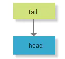

2. 添加第一个节点：

for循环：
```java
for (Node<E> t = tail, p = t;) {
    Node<E> q = p.next;
```

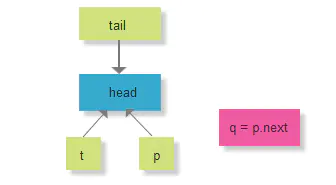

接下来进行q==null的判断
```java
if (q == null) {
    if (p.casNext(null, newNode)) {

        if (p != t) 
            casTail(t, newNode);  
        return true;
    }
}
```
此时q==null为true，tail节点的next为空，将新节点设置成尾结点的next节点。并且p != t为false，不更新tail。

插入节点后链表如下：
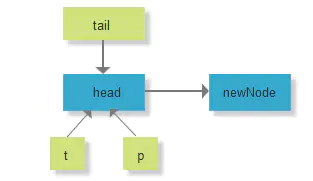


2. 添加第二个节点：
执行q=p.next后如下：

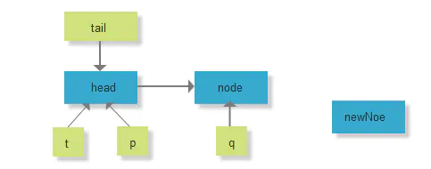

会走到下面的else
```java
else
    p = (p != t && t != (t = tail)) ? t : q
```

p != t 为false，t != tail 也为false，所有 把 q 赋给 p ，此时队列如下：
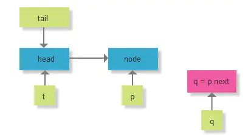


会执行第二次for循环，此时q==null，会将新的节点设置成p的next节点
```java
if (q == null) {
    if (p.casNext(null, newNode)) {
        if (p != t) 
            casTail(t, newNode);  
        return true;
    }
}
```
并且此时p!=t，会将tail设置成新的节点，第二次插入结果如下：
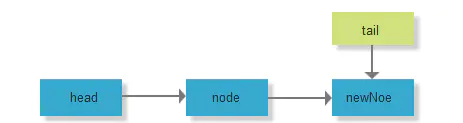

3. 添加第三个节点：
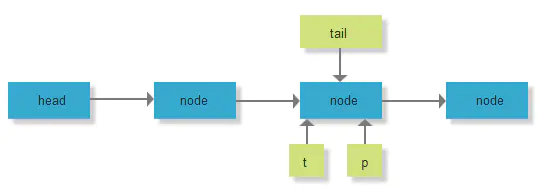


3. 添加第四个节点：
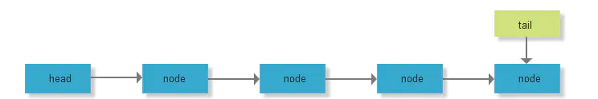


## 获取元素
获取元素得到的是队列中的第一个元素。

获取元素有两个方法：
1. poll():返回链表的第一个元素并删除
2. peek():仅返回链表的第一个元素不删除

>1. 如果head节点中有元素，直接弹出该节点，不更新head的指针
>2. 如果head节点中没元素。那么当出队元素时才更新head指针

相当于第二次获取元素时才会将head更新成第一个有元素的头结点

```java
    public E poll() {
        // 循环跳转，goto语法
        restartFromHead:
        for (;;) {
            // p 表示要出队的节点，默认为 head节点
            for (Node<E> h = head, p = h, q;;) {
                // 出队的元素
                E item = p.item;
                // 如果出队的元素不为空，则把要出队的元素设置null，不更新head节点；如果出队元素为null或者cas设置失败，则表示有其他线程已经进行修改，则需要重写获取
                if (item != null && p.casItem(item, null)) {
                    if (p != h) // 当head元素为空，才会更新head节点，这里循环两次，更新一次head节点
                        updateHead(h, ((q = p.next) != null) ? q : p); // 更新head节点
                    return item;
                }
                // 队列为空，返回null
                else if ((q = p.next) == null) {
                    updateHead(h, p);
                    return null;
                }
                else if (p == q)
                    continue restartFromHead;
                // 把 p 的next节点赋值给p
                else
                    p = q;
            }
        }
    }
```

1. 初始队列：
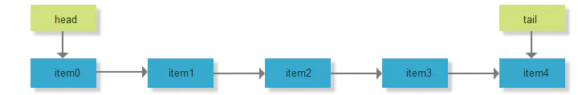

2. 获取item0：
首先执行for循环
```java
for (Node<E> h = head, p = h, q;;) {
       E item = p.item;
    ..............................
}
```
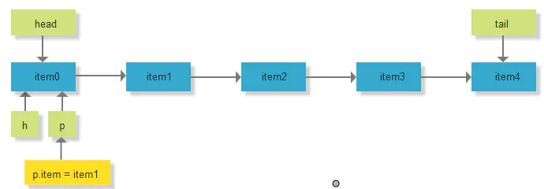

此时item!=null为true,将CAS设置p节点的item为null。此时p=h，所以不会更新head节点,直接返回item0
```java
if (item != null && p.casItem(item, null)) {
    // 不会执行
    if (p != h) // 
        updateHead(h, ((q = p.next) != null) ? q : p);
    return item;
}
```
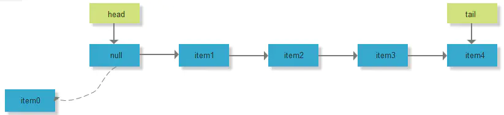


3. 获取item1：
首先执行for循环的赋值
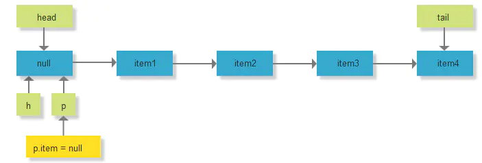


因为item=null，所以执行下面的判断
```java
else if ((q = p.next) == null) {
    updateHead(h, p);
    return null;
}
```
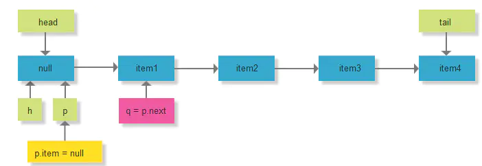


因为q!=null，所以执行下面的判断
```java
else if (p == q)
    continue restartFromHead;
```

因为此时p!=q,所以最后执行p=q,即让p指向他的下一个节点


开始第二次for循环：
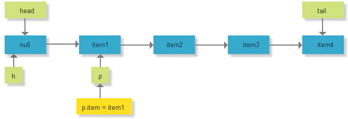

此时item!=null，会CAS设置p节点的item为null。而此时p!=h，所以会更新头结点。因为 p.next 即 item2 不为空，所以把 p.next 即 item2 设置为 head节点
```java
if (item != null && p.casItem(item, null)) {
    if (p != h) // hop two nodes at a time
        updateHead(h, ((q = p.next) != null) ? q : p);
    return item;
}
```
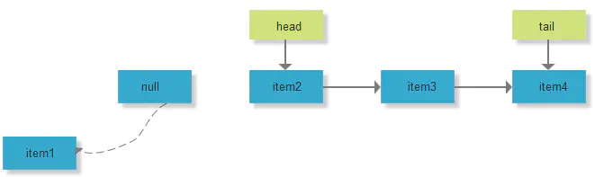

4. 获取item2：
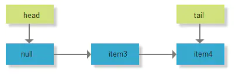

5. 获取item3:
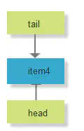


## isEmpty()
```java
public boolean isEmpty() {
    return first() == null;
}

    Node<E> first() {
        restartFromHead:
        for (;;) {
            for (Node<E> h = head, p = h, q;;) {
                boolean hasItem = (p.item != null);
                if (hasItem || (q = p.next) == null) {
                    updateHead(h, p);
                    return hasItem ? p : null;
                }
                else if (p == q)
                    continue restartFromHead;
                else
                    p = q;
            }
        }
    }
```

## remove
```java
public boolean remove(Object o) {
    // 元素为null，返回
    if (o == null) return false;
    Node<E> pred = null;
    for (Node<E> p = first(); p != null; p = succ(p)) { // 获取第一个存活的结点
        // 第一个存活结点的item值
        E item = p.item;
        if (item != null &&
            o.equals(item) &&
            p.casItem(item, null)) { // 找到item相等的结点，并且将该结点的item设置为null
            // p的后继结点
            Node<E> next = succ(p);
            if (pred != null && next != null) // pred不为null并且next不为null
                // 比较并替换next域
                pred.casNext(p, next);
            return true;
        }
        // pred赋值为p
        pred = p;
    }
    return false;
}


Node<E> first() {
    restartFromHead:
    for (;;) { // 无限循环，确保成功
        for (Node<E> h = head, p = h, q;;) {
            // p结点的item域是否为null
            boolean hasItem = (p.item != null);
            if (hasItem || (q = p.next) == null) { // item不为null或者next域为null
                // 更新头结点
                updateHead(h, p);
                // 返回结点
                return hasItem ? p : null;
            }
            else if (p == q) // p等于q
                // 继续从头结点开始
                continue restartFromHead;
            else
                // p赋值为q
                p = q;
        }
    }
}


final Node<E> succ(Node<E> p) {
    // p结点的next域
    Node<E> next = p.next;
    // 如果next域为自身，则返回头结点，否则，返回next
    return (p == next) ? head : next;
}
```


# 3. 例子
GetThread线程不会因为ConcurrentLinkedQueue队列为空而等待，而是直接返回null，所以当实现队列不空时，等待时，则需要用户自己实现等待逻辑
```java
import java.util.concurrent.ConcurrentLinkedQueue;

class PutThread extends Thread {
    private ConcurrentLinkedQueue<Integer> clq;
    public PutThread(ConcurrentLinkedQueue<Integer> clq) {
        this.clq = clq;
    }
    
    public void run() {
        for (int i = 0; i < 10; i++) {
            try {
                System.out.println("add " + i);
                clq.add(i);
                Thread.sleep(100);
            } catch (InterruptedException e) {
                e.printStackTrace();
            }
        }
    }
}

class GetThread extends Thread {
    private ConcurrentLinkedQueue<Integer> clq;
    public GetThread(ConcurrentLinkedQueue<Integer> clq) {
        this.clq = clq;
    }
    
    public void run() {
        for (int i = 0; i < 10; i++) {
            try {
                System.out.println("poll " + clq.poll());
                Thread.sleep(100);
            } catch (InterruptedException e) {
                e.printStackTrace();
            }
        }
    }
}

public class ConcurrentLinkedQueueDemo {
    public static void main(String[] args) {
        ConcurrentLinkedQueue<Integer> clq = new ConcurrentLinkedQueue<Integer>();
        PutThread p1 = new PutThread(clq);
        GetThread g1 = new GetThread(clq);
        
        p1.start();
        g1.start();
        
    }
}

/*
add 0
poll null
add 1
poll 0
add 2
poll 1
add 3
poll 2
add 4
poll 3
add 5
poll 4
poll 5
add 6
add 7
poll 6
poll 7
add 8
add 9
poll 8
*/
```


# 4. HOPS(延迟更新的策略)的设计

>tail更新触发时机：
当tail指向的节点的下一个节点不为null的时候，会执行定位队列真正的队尾节点的操作，找到队尾节点后完成插入之后才会通过casTail进行tail更新；当tail指向的节点的下一个节点为null的时候，只插入节点不更新tail。 

>head更新触发时机：
当head指向的节点的item域为null的时候，会执行定位队列真正的队头节点的操作，找到队头节点后完成删除之后才会通过updateHead进行head更新；当head指向的节点的item域不为null的时候，只删除节点不更新head

如果大量的入队操作，每次都要执行CAS进行tail的更新，汇总起来对性能也会是大大的损耗。如果能减少CAS更新的操作，无疑可以大大提升入队的操作效率，所以doug lea大师每间隔1次(tail和队尾节点的距离为1)进行才利用CAS更新tail。对head的更新也是同样的道理，虽然，这样设计会多出在循环中定位队尾节点，但总体来说读的操作效率要远远高于写的性能