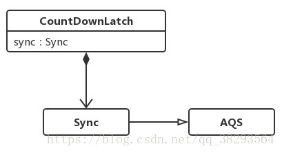

## 参考博文
[JUC工具类: CountDownLatch详解](https://www.pdai.tech/md/java/thread/java-thread-x-juc-tool-countdownlatch.html)
[CountDownLatch详解](https://www.jianshu.com/p/128476015902)


[TOC]

# 1. 概述
CountDownLatch像是一个倒数器，使得某些线程等待一组事件都发生后再继续执行。
它基于AQS实现，维护一个计数器，调用countDown()的线程使计数器减1，调用await()的线程将处于阻塞状态直到计数器为0，或者等待中的线程中断，或者等待超时。

- 同一个线程可以多次调用countDown()方法，那么每次计数器都将减1
- await()方法可以被多个线程调用，那么他们都将处于阻塞状态


# 2. 源码分析


## 构造函数
```java
public class CountDownLatch {
    private static final class Sync extends AbstractQueuedSynchronizer {
        ...
    }

    private final Sync sync;

    public CountDownLatch(int count) {
        if (count < 0) throw new IllegalArgumentException("count < 0");
        this.sync = new Sync(count);
    }
```

## await()
在计数器state为0之前，线程会一直阻塞，放入同步队列中
```java
//CountDownLatch
public void await() throws InterruptedException {
    // 转发到sync对象上
    sync.acquireSharedInterruptibly(1);
}

//AQS
public final void acquireSharedInterruptibly(int arg) throws InterruptedException {
    if (Thread.interrupted())
        throw new InterruptedException();
    if (tryAcquireShared(arg) < 0)
        doAcquireSharedInterruptibly(arg);
}

//Sync
protected int tryAcquireShared(int acquires) {
    return (getState() == 0) ? 1 : -1;
}
```

## countDown()
将计数器state-1，如果state=0，将释放所有阻塞的线程
```java
//CountDownLatch
public void countDown() {
    sync.releaseShared(1);
}

//AQS
public final boolean releaseShared(int arg) {
    if (tryReleaseShared(arg)) {
        doReleaseShared();
        return true;
    }
    return false;
}

//Sync
protected boolean tryReleaseShared(int releases) {
    // 无限循环
    for (;;) {
        // 获取状态
        int c = getState();
        if (c == 0) // 没有被线程占有
            return false;
        // 下一个状态
        int nextc = c-1;
        if (compareAndSetState(c, nextc)) // 比较并且设置成功
            return nextc == 0;
    }
}
  
```

# 3. 实例
## 实例1
主线程等待两个子线程执行完了再执行
```java
package thread;

import java.util.concurrent.CountDownLatch;

/**
 * 测试CountDownLatch
 */
public class CountDownLatchDemo {

    public static void main(String[] args) {
        CountDownLatch countDownLatch = new CountDownLatch(2);
        MyThread t1 = new MyThread("t1", countDownLatch);
        MyThread t2 = new MyThread("t2", countDownLatch);
        t1.start();
        t2.start();

        System.out.println("Waiting for t1 thread and t2 thread to finish");
        try {
            countDownLatch.await();
        } catch (InterruptedException e) {
            e.printStackTrace();
        }
        System.out.println(Thread.currentThread().getName() + " continue");
    }

    static class MyThread extends Thread {

        private CountDownLatch countDownLatch;


        public MyThread(String name, CountDownLatch countDownLatch) {
            super(name);
            this.countDownLatch = countDownLatch;
        }

        @Override
        public void run() {
            System.out.println(Thread.currentThread().getName() + " doing something");
            try {
                Thread.sleep(1000);
            } catch (InterruptedException e) {
                e.printStackTrace();
            }
            System.out.println(Thread.currentThread().getName() + " finish");
            countDownLatch.countDown();
        }
    }
}
/*
Waiting for t1 thread and t2 thread to finish
t2 doing something
t1 doing something
t1 finish
t2 finish
main continue
*/
```

## 实例2
工作线程需要等待主线程准备操作完毕才可以执行
```java
public class CountDownLatchTest {
	// 自定义工作线程
	private static class Worker extends Thread {
		private CountDownLatch countDownLatch;
		
		public Worker(CountDownLatch countDownLatch) {
			this.countDownLatch = countDownLatch;
		}
		
		@Override
		public void run() {
			super.run();
			
			try {
				countDownLatch.await();
				System.out.println(Thread.currentThread().getName() + "开始执行");
				// 工作线程开始处理，这里用Thread.sleep()来模拟业务处理
				Thread.sleep(1000);
				System.out.println(Thread.currentThread().getName() + "执行完毕");
			} catch (Exception e) {
				e.printStackTrace();
			}
		}
	}
	
	public static void main(String[] args) throws InterruptedException {
		CountDownLatch countDownLatch = new CountDownLatch(1);
		
		for (int i = 0; i < 3; i++) {
			System.out.println("创建工作线程" + i);
			Worker worker = new Worker(countDownLatch);
			worker.start();
		}
		
		// 工作线程需要等待主线程准备操作完毕才可以执行，这里用Thread.sleep()来模拟准备操作
		Thread.sleep(1000);
		System.out.println("主线程准备完毕");
		
		countDownLatch.countDown();
    }
}
/*
创建工作线程0
创建工作线程1
创建工作线程2
主线程准备完毕
Thread-0开始执行
Thread-2开始执行
Thread-1开始执行
Thread-0执行完毕
Thread-2执行完毕
Thread-1执行完毕
*/
```

## 实例3
实现一个容器，提供两个方法，add，size 写两个线程，线程1添加10个元素到容器中，线程2实现监控元素的个数，当个数到5个时，线程2给出提示并结束

- 使用wait和notify实现
```java
package thread;

import java.util.ArrayList;
import java.util.List;

/**
 * 实现一个容器，提供两个方法，add，size 写两个线程，线程1添加10个元素到容器中，线程2实现监控元素的个数，当个数到5个时，线程2给出提示并结束
 */
public class WaitNotifyTest {

    volatile List list = new ArrayList();

    public void add(int i) {
        list.add(i);
    }

    public int getSize() {
        return list.size();
    }

    public static void main(String[] args) {
        WaitNotifyTest test = new WaitNotifyTest();
        Object obj = new Object();

        new Thread(new Runnable() {
            @Override
            public void run() {
                synchronized (obj) {
                    System.out.println("t2 启动");
                    if (test.getSize() != 5) {
                        try {
                            obj.wait();
                            System.out.println("t2 结束");
                        } catch (InterruptedException e) {
                            e.printStackTrace();
                        }
                    }
                    obj.notify();
                }
            }
        }, "t2").start();

        new Thread(new Runnable() {
            @Override
            public void run() {
                synchronized (obj) {
                    System.out.println("t1 启动");
                    for (int i = 0; i < 10; i++) {
                        test.add(i);
                        System.out.println("add" + i);
                        if (test.getSize() == 5) {
                            obj.notify();
                            try {
                                obj.wait();
                            } catch (InterruptedException e) {
                                e.printStackTrace();
                            }
                        }
                    }

                }
            }
        }, "t1").start();
    }
}
/*
t2 启动
t1 启动
add0
add1
add2
add3
add4
t2 结束
add5
add6
add7
add8
add9
*/
```

- 使用CountDownLatch实现
```java
package thread;

import java.util.ArrayList;
import java.util.List;
import java.util.concurrent.CountDownLatch;

/**
 * 实现一个容器，提供两个方法，add，size 写两个线程，线程1添加10个元素到容器中，线程2实现监控元素的个数，当个数到5个时，线程2给出提示并结束
 */
public class CountDownLatchTest {

    volatile List list = new ArrayList();

    public void add(int i) {
        list.add(i);
    }

    public int getSize() {
        return list.size();
    }

    public static void main(String[] args) {
        CountDownLatchTest test = new CountDownLatchTest();
        CountDownLatch countDownLatch = new CountDownLatch(1);

        new Thread(() -> {
            System.out.println("t2 start");
            if (test.getSize() != 5) {
                try {
                    countDownLatch.await();
                } catch (InterruptedException e) {
                    e.printStackTrace();
                }
                System.out.println("t2 end");
            }
        }, "t2").start();

        new Thread(() -> {
            System.out.println("t1 start");
            for (int i = 0; i < 10; i++) {
                test.add(i);
                System.out.println("add" + i);
                if (test.getSize() == 5) {
                    System.out.println("countdown is open");
                    countDownLatch.countDown();
                }
            }
            System.out.println("t1 end");
        }, "t1").start();
    }
}
/*
t2 start
t1 start
add0
add1
add2
add3
add4
countdown is open
add5
add6
add7
add8
add9
t1 end
t2 end
*/
```