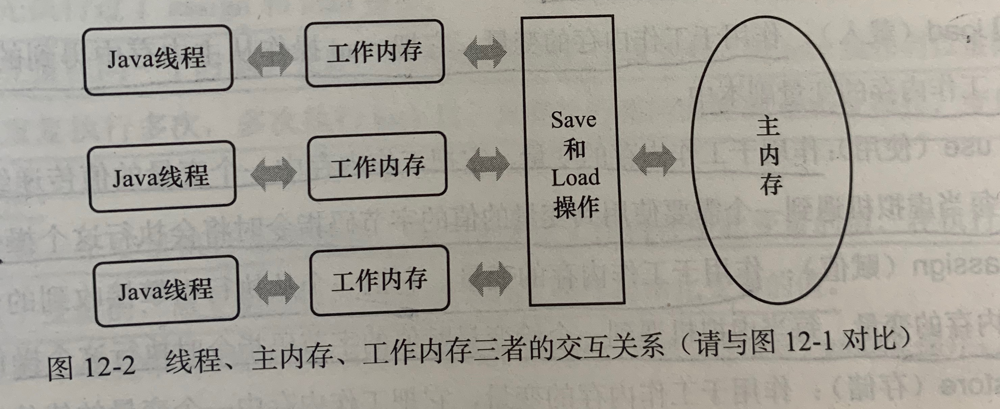

[TOC]

# 1. Java内存模型
Java内存模型定义了线程如何访问变量的规则，这里的变量指的是类中的实例字段、static字段和构成数组对象的元素，不包括方法中的参数和局部变量(他们本来就是线程私有的)

内存模型规定：
1. 所有的变量都存储在主内存中(虚拟机内存的一部分)，每个线程又有自己的工作内存
2. 线程的工作内存保存使用到的变量在主内存的拷贝副本(并不会直接拷贝整个对象，只拷贝对象中用到的某个字段)
3. 线程对变量的操作(读取、赋值等)都在工作内存中执行，不能直接读写主内存中的值
3. 不同线程间不能访问其他线程的工作内存，线程间变量值的传递都需通过主内存完成

这里的主内存、工作内存和堆、栈不是一个层次的划分，但是从概念上对应的话，主内存对应堆中的对象实例数据部分，工作内存对应栈中部分区域

# 2. 三个性质
## 原子性

## 可见性

## 有序性