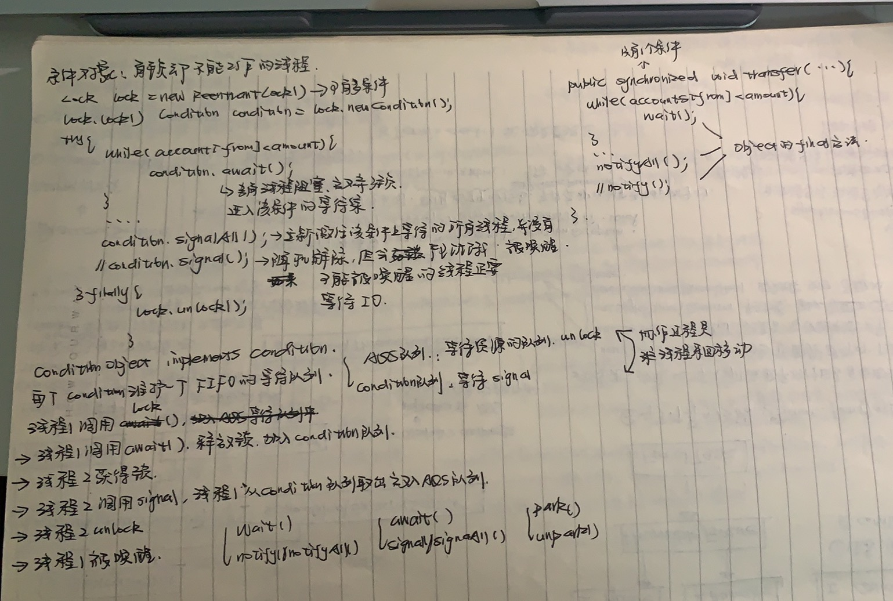

## 参考博文
[深入理解ReentrantLock的实现原理](https://juejin.im/post/5c95df97e51d4551d06d8e8e)
[JUC锁: ReentrantLock详解](https://www.pdai.tech/md/java/thread/java-thread-x-lock-ReentrantLock.html)
[ReentrantLock(重入锁)功能详解和应用演示](https://www.cnblogs.com/takumicx/p/9338983.html)
[公平锁与非公平锁的对比](https://juejin.im/post/5dbcea3bf265da4cf37683e6)

[TOC]


# 1. AQS
[AQS](./AQS.md)


# 2. ReentrantLock实现
ReentrantLock是基于AQS的独占锁

ReentrantLock继承Lock,Lock定义了lock()、unlock()、newCondition()方法

他有3个内部类：
1. Sync：Sync继承AQS，重写了AQS的tryAcquire和tryRelease方法实现的lock和unlock
2. FairSync:继承Sync，实现公平锁
3. NonFairSync:继承Sync,实现非公平锁


## ReentrantLock
sync变量指向公平锁子类或者非公平锁子类，默认构造函数创建的是非公平锁。对有参构造函数传入true创建公平锁
```java
public class ReentrantLock implements Lock, java.io.Serializable {
   
    private final Sync sync;

    abstract static class Sync extends AbstractQueuedSynchronizer {

        abstract void lock();

        final boolean nonfairTryAcquire(int acquires) {
            ...
        }

        protected final boolean tryRelease(int releases) {
            ...
        }

        final ConditionObject newCondition() {
            return new ConditionObject();
        }
    }

    static final class NonfairSync extends Sync {
        final void lock() {
            ...
        }

        protected final boolean tryAcquire(int acquires) {
            return nonfairTryAcquire(acquires);
        }
    }

    static final class FairSync extends Sync {

        final void lock() {
            acquire(1);
        }

        protected final boolean tryAcquire(int acquires) {
            ...
    }

    public ReentrantLock() {
        sync = new NonfairSync();
    }

    public ReentrantLock(boolean fair) {
        sync = fair ? new FairSync() : new NonfairSync();
    }

    public void lock() {
        sync.lock();
    }

    public void lockInterruptibly() throws InterruptedException {
        sync.acquireInterruptibly(1);
    }

    public void unlock() {
        sync.release(1);
    }
    
    public Condition newCondition() {
        return sync.newCondition();
    }
```


## lock()获取锁
Reentrante.lock()->AQS.acquire()->Sync的子类重写AQS的tryAcquire()

公平锁体现在线程获取锁的顺序按照队列先进先出的顺序，后来的线程不能先获得锁 
而对于非公平锁，如果当前锁没有被占用，申请的线程就会获得锁，而不管在队列中等待的线程   饥饿

公平锁和非公平锁的性能是不一样的，非公平锁的性能会优于公平锁。为什么呢？因为公平锁在获取锁时，永远是等待时间最长的线程获取到锁，这样当线程T1释放锁以后，如果还想继续再获取锁，它也得去同步队列尾部排队，这样就会频繁的发生线程的上下文切换，当线程越多，对CPU的损耗就会越严重。
非公平锁性能虽然优于公平锁，但是会存在导致线程饥饿的情况。在最坏的情况下，可能存在某个线程一直获取不到锁。不过相比性能而言，饥饿问题可以暂时忽略，这可能就是ReentrantLock默认创建非公平锁的原因之一了
- 对于下面的公平锁测试，每个线程都获取和释放锁2次，他们都是轮流的
```java
package thread;

import java.util.concurrent.TimeUnit;
import java.util.concurrent.locks.Lock;
import java.util.concurrent.locks.ReentrantLock;

/**
 * 测试ReentrantLock
 */
public class ReentrantLockTest {

    private static final Lock lock = new ReentrantLock(true);

    public static void main(String[] args) {
        fairLock();
    }

    public static void fairLock() {
        System.out.println("公平锁测试");
        for (int i = 0; i < 5; i++) {
            new Thread(new ThreadDemo(i)).start();
        }
    }

    static class ThreadDemo implements Runnable {
        Integer id;

        public ThreadDemo(Integer id) {
            this.id = id;
        }

        @Override
        public void run() {
            for (int i = 0; i < 2; i++) {
                try {
                    lock.lock();
                    System.out.println("获得锁的线程：" + id);
                    TimeUnit.MILLISECONDS.sleep(10);
                } catch (InterruptedException e) {
                    e.printStackTrace();
                } finally {
                    lock.unlock();
                }
            }
        }
    }
}
/*
公平锁测试
获得锁的线程：0
获得锁的线程：2
获得锁的线程：1
获得锁的线程：3
获得锁的线程：4
获得锁的线程：0
获得锁的线程：2
获得锁的线程：1
获得锁的线程：3
获得锁的线程：4
*/
```

- 对于下面的公平锁测试，每个线程都获取和释放锁2次，有些线程会接连重复获得锁
```java
package thread;

import java.util.concurrent.TimeUnit;
import java.util.concurrent.locks.Lock;
import java.util.concurrent.locks.ReentrantLock;

/**
 * 测试ReentrantLock
 */
public class ReentrantLockTest {

    private static final Lock lock = new ReentrantLock();

    public static void main(String[] args) {
        fairLock();
    }

    public static void nonFairLock() {
        System.out.println("非公平锁测试");
        for (int i = 0; i < 5; i++) {
            new Thread(new ThreadDemo(i)).start();
        }
    }

    static class ThreadDemo implements Runnable {
        Integer id;

        public ThreadDemo(Integer id) {
            this.id = id;
        }

        @Override
        public void run() {
            for (int i = 0; i < 2; i++) {
                try {
                    lock.lock();
                    System.out.println("获得锁的线程：" + id);
                    TimeUnit.MILLISECONDS.sleep(10);
                } catch (InterruptedException e) {
                    e.printStackTrace();
                } finally {
                    lock.unlock();
                }
            }
        }
    }
}
/*
非公平锁测试
获得锁的线程：0
获得锁的线程：0
获得锁的线程：1
获得锁的线程：1
获得锁的线程：2
获得锁的线程：2
获得锁的线程：3
获得锁的线程：3
获得锁的线程：4
获得锁的线程：4
*/
```


### 非公平锁NonFairSync
```
ReentrantLock:lock() -> NonFairSync:lock() -> AQS:acquire(int arg) -> NonFairSync:tryAcquire(int acquires) -> Sync:nonfairTryAcquire()
```

1. ==NonFairSync中调用lock()方法==使用CAS设置volatile计数器state的值
- 如果state期望值为0(代表锁没被占用)，则将state置为1(代表当前线程成功获取锁)，然后执行setExclusiveOwnerThread方法直接将该线程设置成锁的所有者。
- 如果state不为0，说明锁被占用，执行==AQS的acquire(1)==

2. acquire(1)中先执行==NonFairSync重写的tryAcquire()==

3. NonFairSync的tryAcquire()主体是==Sync的nonfairTryAcquire()==
- 先CAS设置state的值，如果设置成功则将该线程设置成锁的所有者
- 如果设置不成功，调用getExclusiveOwnerThread方法查看占用锁的线程是不是自己。如果是自己，则将计数器state+1(==可重入==)
4. 如果state设置失败，占用锁的又不是自己，那将当前线程放入AQS队列中


```java
/*
NonFairSync
*/
final void lock() {
    //CAS操作设置state的值
    if (compareAndSetState(0, 1))
        //设置成功 直接将锁的所有者设置为当前线程 流程结束
        setExclusiveOwnerThread(Thread.currentThread());
    else
        //设置失败 则进行后续的加入同步队列准备
        acquire(1);
}


//子类重写的tryAcquire方法
protected final boolean tryAcquire(int acquires) {
    //调用nonfairTryAcquire方法
    return nonfairTryAcquire(acquires);
}

/*
AQS
*/
public final void acquire(int arg) {
    //调用子类重写的tryAcquire方法 如果tryAcquire方法返回false 那么线程就会进入同步队列
    if (!tryAcquire(arg) &&
        acquireQueued(addWaiter(Node.EXCLUSIVE), arg))
        selfInterrupt();
}

/*
Sync
*/
final boolean nonfairTryAcquire(int acquires) {
    final Thread current = Thread.currentThread();
    int c = getState();
    //如果状态state=0，即在这段时间内锁的所有者把锁释放了，那么这里state就为0
    if (c == 0) {
        //使用CAS操作设置state的值
        if (compareAndSetState(0, acquires)) {
            //操作成功则将锁的所有者设置成当前线程 且返回true
            setExclusiveOwnerThread(current);
            return true;
        }
    }
    //如果状态state不等于0，也就是有线程正在占用锁，那么先检查一下这个线程是不是自己
    else if (current == getExclusiveOwnerThread()) {
        //如果线程就是自己了，那么直接将state+1，返回true，不需要再获取锁
        int nextc = c + acquires;
        if (nextc < 0) // overflow
            throw new Error("Maximum lock count exceeded");
        setState(nextc);
        return true;
    }
    //如果state不等于0，且锁的所有者又不是自己，那么线程就会进入到同步队列。
    return false;
}
```


### 公平锁FairSync
```
ReentrantLock:lock() -> FairSync:lock() -> AQS:acquire(int arg) -> FairSync:tryAcquire(int acquires)
```

1. 执行==FairSync的lock()方法==

2. FairSync的lock()方法主体是==AQS的acquire(1)==

3. AQS的acquire(1)的主体是==FairSync重写的tryAcquire()==
- 获取state
- 如果state=0代表锁没有被占用，看AQS同步队列中是否有等待的线程或当前线程是否是AQS队列头结点。如果队列为空或当前线程是头结点则当前线程获取锁，并state+1；否则当前线程被加入AQS队列尾部
- 如果state!=0代表锁被占用，判断锁的占有者是不是自己，如果是则state+1，如果不是则当前线程被加入AQS队列尾部

```java
/*
FairSync
*/
final void lock() {
    acquire(1);
}

protected final boolean tryAcquire(int acquires) {
    final Thread current = Thread.currentThread();
    int c = getState();
    //判断状态state是否等于0，等于0代表锁没有被占用，不等于0则代表锁被占用着。
    if (c == 0) {
        /*调用hasQueuedPredecessors方法判断同步队列中是否有线程在等待
        如果同步队列中没有线程在等待或当前线程是AQS队列头结点，则当前线程成为锁的所有者
        如果同步队列中有线程在等待，则继续往下执行
        这个机制就是公平锁的机制，也就是先让先来的线程获取锁，后来的不能抢先获取
        */
        if (!hasQueuedPredecessors() &&
            compareAndSetState(0, acquires)) {
            setExclusiveOwnerThread(current);
            return true;
        }
    }
    //判断当前线程是否为锁的所有者，如果是，那么直接更新状态state，然后返回true。
    else if (current == getExclusiveOwnerThread()) {
        int nextc = c + acquires;
        if (nextc < 0)
            throw new Error("Maximum lock count exceeded");
        setState(nextc);
        return true;
    }
    //如果同步队列中有线程存在 且 锁的所有者不是当前线程，则返回false。
    return false;
}


/*
AQS
*/
public final void acquire(int arg) {
    //同步队列中有线程 且 锁的所有者不是当前线程那么将线程加入到同步队列的尾部，
    //保证了公平性，也就是先来的线程先获得锁，后来的不能抢先获取。
    if (!tryAcquire(arg) &&
        acquireQueued(addWaiter(Node.EXCLUSIVE), arg))
        selfInterrupt();
}

    public final boolean hasQueuedPredecessors() {
        Node t = tail; // Read fields in reverse initialization order
        Node h = head;
        Node s;
        /*
        如果h==t返回false，说明队列为空
        如果h!=t&&s.thread != Thread.currentThread())返回false，说明队列不为空并且当前线程是队头
        */
        return h != t &&
            ((s = h.next) == null || s.thread != Thread.currentThread());
    }
```


## unlock()释放锁
公平锁和非公平锁的释放过程一样
```
Reentrante:unLock() -> AQS:release(int arg) -> Sync:tryRelease()
```

1. 判断当前线程是不是锁的所有者，如果不是就抛出异常。如果是就执行步骤2
2. 判断state-1后是否为0，如果是代表锁已经释放完，则唤醒队列中后面的线程。如果state-1不为0，说明锁重入了，锁还没释放完

```java
//ReentranteLock
public void unlock() {
        sync.release(1);
}

//AQS
public final boolean release(int arg) {
        if (tryRelease(arg)) {
            Node h = head;
            if (h != null && h.waitStatus != 0)
                unparkSuccessor(h);
            return true;
        }
        return false;
}

//Sync
protected final boolean tryRelease(int releases) {
            int c = getState() - releases;
            if (Thread.currentThread() != getExclusiveOwnerThread())
                throw new IllegalMonitorStateException();
            boolean free = false;
            if (c == 0) {
                free = true;
                setExclusiveOwnerThread(null);
            }
            setState(c);
            return free;            
}
```

## lockInterruptibly可中断方式获取锁
[三个interrupt方法](./三个interrupt方法.md)

如果当前线程被设置了中断状态，调用lockInterruptibly时会抛出InterruptedException异常
```java
public void lockInterruptibly() throws InterruptedException {
    sync.acquireInterruptibly(1);
}

public final void acquireInterruptibly(int arg)
        throws InterruptedException {
    //如果当前线程已经中断了，那么抛出异常
    if (Thread.interrupted())
        throw new InterruptedException();
    //如果当前线程仍然未成功获取锁，则调用doAcquireInterruptibly方法，这个方法和
    //acquireQueued方法没什么区别，就是线程在等待状态的过程中，如果线程被中断，线程会
    //抛出异常。
    if (!tryAcquire(arg))
        doAcquireInterruptibly(arg);
}
```


构造两个线程分别获取两个lock，其中一个先获取lock1再获取lock2，另一个则相反。如果没有外界中断，死锁状态会一直持续下去。通过将其中一个线程中断， 被中断的线程将抛出异常使得另一个线程能获取到锁

```java
public class ReentrantLockTest {
    static Lock lock1 = new ReentrantLock();
    static Lock lock2 = new ReentrantLock();
    public static void main(String[] args) throws InterruptedException {

        Thread thread = new Thread(new ThreadDemo(lock1, lock2));//该线程先获取锁1,再获取锁2
        Thread thread1 = new Thread(new ThreadDemo(lock2, lock1));//该线程先获取锁2,再获取锁1
        thread.start();
        thread1.start();
        thread.interrupt();//是第一个线程中断
    }

    static class ThreadDemo implements Runnable {
        Lock firstLock;
        Lock secondLock;
        public ThreadDemo(Lock firstLock, Lock secondLock) {
            this.firstLock = firstLock;
            this.secondLock = secondLock;
        }
        @Override
        public void run() {
            try {
                firstLock.lockInterruptibly();
                //避免有一个线程同时获取两个锁
                TimeUnit.MILLISECONDS.sleep(10);
                secondLock.lockInterruptibly();
            } catch (InterruptedException e) {
                e.printStackTrace();
            } finally {
                firstLock.unlock();
                secondLock.unlock();
                System.out.println(Thread.currentThread().getName()+"正常结束!");
            }
        }
    }
}
```


## tryLock()限时等待锁
- tryLock()：立即返回申请锁的结果，可以配合重试机制获取锁
- tryLock(Long time, TimeUnit unit):传入时间参数表示等待指定的时间

线程通过调用tryLock()方法获取锁,第一次获取锁失败时会休眠10毫秒,然后重新获取，直到获取成功

第二次获取失败时,首先会释放第一把锁,再休眠10毫秒,然后重试直到成功为止

线程获取第二把锁失败时将会释放第一把锁，这是解决死锁问题的关键,避免了两个线程分别持有一把锁然后相互请求另一把锁
```java
public class ReentrantLockTest {
    static Lock lock1 = new ReentrantLock();
    static Lock lock2 = new ReentrantLock();
    public static void main(String[] args) throws InterruptedException {

        Thread thread = new Thread(new ThreadDemo(lock1, lock2));//该线程先获取锁1,再获取锁2
        Thread thread1 = new Thread(new ThreadDemo(lock2, lock1));//该线程先获取锁2,再获取锁1
        thread.start();
        thread1.start();
    }

    static class ThreadDemo implements Runnable {
        Lock firstLock;
        Lock secondLock;
        public ThreadDemo(Lock firstLock, Lock secondLock) {
            this.firstLock = firstLock;
            this.secondLock = secondLock;
        }
        @Override
        public void run() {
            try {
                while(!lock1.tryLock()){
                    TimeUnit.MILLISECONDS.sleep(10);
                }
                while(!lock2.tryLock()){
                    lock1.unlock();
                    TimeUnit.MILLISECONDS.sleep(10);
                }
            } catch (InterruptedException e) {
                e.printStackTrace();
            } finally {
                firstLock.unlock();
                secondLock.unlock();
                System.out.println(Thread.currentThread().getName()+"正常结束!");
            }
        }
    }
}
```


## 结合Condition实现等待通知机制
[AQS](./AQS.md)

