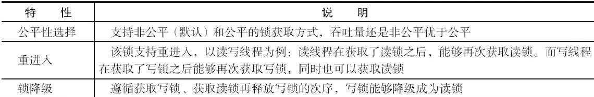
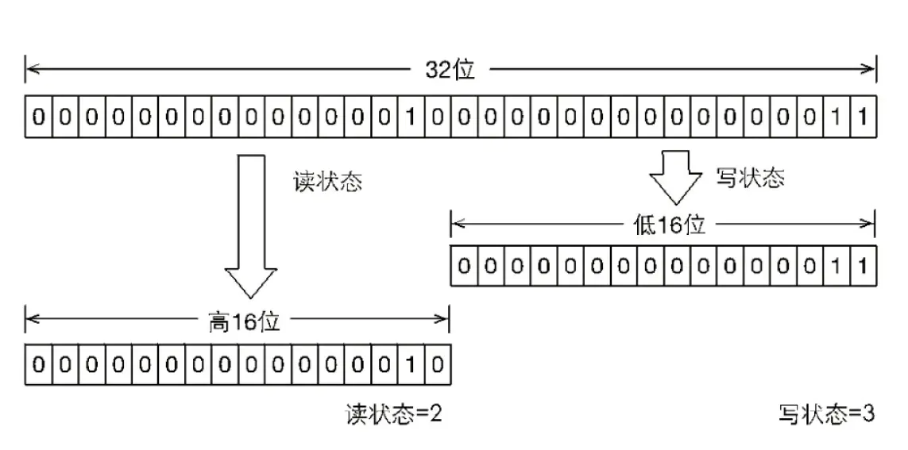

## 参考博文
[JUC锁: ReentrantReadWriteLock详解](https://www.pdai.tech/md/java/thread/java-thread-x-lock-ReentrantReadWriteLock.html)
[深入理解ReentrantReadWriteLock源码](https://juejin.im/post/5d67e6f651882544d2403c06)
[深入理解读写锁ReentrantReadWriteLock](https://juejin.im/post/5aeb0e016fb9a07ab7740d90)
[Java并发-ReentrantReadWriteLock锁降级/锁升级](https://blog.csdn.net/qq_29842929/article/details/81188824)


[TOC]


# 1. 概念
在某个线程获取读锁后，其他线程能继续获取读锁而不能获取写锁；
在某个线程获取写锁后，其他线程不能获取读锁或写锁；




# 2. 源码分析


```java
public class ReentrantReadWriteLock implements ReadWriteLock, java.io.Serializable {
    
    private final ReentrantReadWriteLock.ReadLock readerLock;
    
    private final ReentrantReadWriteLock.WriteLock writerLock;
    
    final Sync sync;

    public ReentrantReadWriteLock() {
        this(false);
    }
    
    public ReentrantReadWriteLock(boolean fair) {
        sync = fair ? new FairSync() : new NonfairSync();
        readerLock = new ReadLock(this);
        writerLock = new WriteLock(this);
    }

    public ReentrantReadWriteLock.WriteLock writeLock() { return writerLock; }
    public ReentrantReadWriteLock.ReadLock  readLock()  { return readerLock; }

    abstract static class Sync extends AbstractQueuedSynchronizer {
        ...
    }

    static final class NonfairSync extends Sync {
        ...
    }
    
    static final class FairSync extends Sync {
        ...
    }
    
    public static class ReadLock implements Lock, java.io.Serializable {
        ...
    }
    
    public static class WriteLock implements Lock, java.io.Serializable {
        ...
    }
}
```
## ReadWriteLock
定义了获取读锁或写锁的方法

```java
public interface ReadWriteLock {
    
    Lock readLock();

    Lock writeLock();
}
```


## Sync
Sync有两个内部类：
1. HoldCounter：与读锁配套使用
2. ThreadLocalHoldCounter

```java
abstract static class Sync extends AbstractQueuedSynchronizer {
    
    // 版本序列号
    private static final long serialVersionUID = 6317671515068378041L;        
    // 高16位为读锁，低16位为写锁
    static final int SHARED_SHIFT   = 16;
    // 读锁单位
    static final int SHARED_UNIT    = (1 << SHARED_SHIFT);
    // 读锁最大数量
    static final int MAX_COUNT      = (1 << SHARED_SHIFT) - 1;
    // 写锁最大数量
    static final int EXCLUSIVE_MASK = (1 << SHARED_SHIFT) - 1;
    // 本地线程计数器
    private transient ThreadLocalHoldCounter readHolds;
    // 缓存的计数器
    private transient HoldCounter cachedHoldCounter;
    // 第一个读线程
    private transient Thread firstReader = null;
    // 第一个读线程的计数
    private transient int firstReaderHoldCount;

    // 构造函数
    Sync() {
        // 本地线程计数器
        readHolds = new ThreadLocalHoldCounter();
        // 设置AQS的状态
        setState(getState()); // ensures visibility of readHolds
    }

     // 计数器
     static final class HoldCounter {
         //表示当前读线程重入的次数
        int count = 0;
        // 获取当前线程ID
        final long tid = getThreadId(Thread.currentThread());
    }

    // 本地线程计数器
    static final class ThreadLocalHoldCounter extends ThreadLocal<HoldCounter> {
        // 重写初始化方法，在没有进行set的情况下，获取的都是该HoldCounter值
        public HoldCounter initialValue() {
            return new HoldCounter();
        }
    }

    //获取占有读锁的线程数量
    static int sharedCount(int c) { 
        return c >>> SHARED_SHIFT; 
    }

    
}
```


## 写锁获取
如果读锁已经被某个线程获取，那么当前线程不能获取写锁。因为要保证写锁的写对读锁可见，如果允许读锁存在时获取写锁，那么读锁的线程不能感知写锁的操作


```java
//WriteLock
 public static class WriteLock implements Lock, java.io.Serializable {
     
        private final Sync sync;

        public void lock() {
            sync.acquire(1);
        }
 }

//AQS
 public final void acquire(int arg) {
        if (!tryAcquire(arg) &&
            acquireQueued(addWaiter(Node.EXCLUSIVE), arg))
            selfInterrupt();
}


//Sync
 abstract static class Sync extends AbstractQueuedSynchronizer {
    protected final boolean tryAcquire(int acquires) {
            //1.获取当前线程
            Thread current = Thread.currentThread();
            //获取读写锁的同步状态
            int c = getState();
            // 2. 获取写锁获取的次数
            int w = exclusiveCount(c);
            //如果读写状态不等于0
            if (c != 0) {
                // (Note: if c != 0 and w == 0 then shared count != 0)
                // 3.1 当读锁已被读线程获取或者当前线程不是已经获取写锁的线程的话，当前线程获取写锁失败
                if (w == 0 || current != getExclusiveOwnerThread())
                    return false;
                //如果超过获取锁的次数的最大值，则抛异常
                if (w + exclusiveCount(acquires) > MAX_COUNT)
                    throw new Error("Maximum lock count exceeded");
                // Reentrant acquire
                //3.2 当前线程获取写锁，支持可重复加锁
                setState(c + acquires);
                return true;
            }
            //写锁未被任何线程获取，当前线程可获取写锁
            if (writerShouldBlock() ||
                !compareAndSetState(c, c + acquires))
                return false;
            //写锁第一次获取成功，设置当前线程为写锁的线程，返回获取成功
            setExclusiveOwnerThread(current);
            return true;
        }

    //获取占有写锁的线程数量
    /*
    EXCLUSIVE_MASK = (1 << SHARED_SHIFT) - 1,就是0x0000FFFF
    将同步状态和EXCLUSIVE_MASK做与运算，就是取同步状态的低16位，即写锁的获取次数
    */
    static int exclusiveCount(int c) { 
        return c & EXCLUSIVE_MASK; 
    }
 }
 
```

下面的状态代表一个线程获取了3次写锁，2次读锁。
- 如果当前同步状态是S，那么写锁获取次数是S&0x0000FFFF（将高16位全部抹去）；读锁获取次数是S>>>16（无符号补0右移16位）
- 写锁加1是S+1；读锁加1是S+(1<<16)，即S+0x00010000




## 写锁释放
```java
//WriteLock
public static class WriteLock implements Lock, java.io.Serializable {
    public void unlock() {
        sync.release(1);
    }
}

//AQS
public final boolean release(int arg) {
        //尝试释放锁成功，如果当前头节点不等于null，并且等待状态不等于0，则唤醒后继节点unparkSuccessor()
        if (tryRelease(arg)) {
            Node h = head;
            if (h != null && h.waitStatus != 0)
                unparkSuccessor(h);
            return true;
        }
        return false;
}


//Sync
protected final boolean tryRelease(int releases) {
            //如果当前线程不是持有的线程，抛出异常
            if (!isHeldExclusively())
                throw new IllegalMonitorStateException();
            //判断释放后，写状态的值，
            int nextc = getState() - releases;
            //如果是最后一次释放，则设置当前独占线程为null。
            boolean free = exclusiveCount(nextc) == 0;
            if (free)
                setExclusiveOwnerThread(null);
            setState(nextc);
            return free;
}

```

## 读锁获取
```java
//ReadLock
public static class ReadLock implements Lock, java.io.Serializable {
    public void lock() {
        sync.acquireShared(1);
    }
}

//AQS
public final void acquireShared(int arg) {
        if (tryAcquireShared(arg) < 0)
            doAcquireShared(arg);
}

//Sync
protected final int tryAcquireShared(int unused) {
            Thread current = Thread.currentThread();
            int c = getState();
            //1. 如果写锁已经被获取并且获取写锁的线程不是当前线程的话，当前线程获取读锁失败返回-1
            if (exclusiveCount(c) != 0 &&
                getExclusiveOwnerThread() != current)
                return -1;
            //获取读状态
            int r = sharedCount(c);
            if (!readerShouldBlock() &&
                r < MAX_COUNT &&
                //使用CAS将读状态加1，即让当前线程获得读锁
                compareAndSetState(c, c + SHARED_UNIT)) {
                if (r == 0) {
                    firstReader = current;
                    firstReaderHoldCount = 1;
                } else if (firstReader == current) {
                    firstReaderHoldCount++;
                } else {
                    HoldCounter rh = cachedHoldCounter;
                    if (rh == null || rh.tid != getThreadId(current))
                        cachedHoldCounter = rh = readHolds.get();
                    else if (rh.count == 0)
                        readHolds.set(rh);
                    rh.count++;
                }
                return 1;
            }
            return fullTryAcquireShared(current);
}
```


## 读锁释放
```java
//ReadLock
public static class ReadLock implements Lock, java.io.Serializable {
    public void unlock() {
        sync.releaseShared(1);
    }
}

//AQS
public final boolean releaseShared(int arg) {
        if (tryReleaseShared(arg)) {
            doReleaseShared();
            return true;
        }
        return false;
}


//Sync
protected final boolean tryReleaseShared(int unused) {
            Thread current = Thread.currentThread();
          //当前线程为持有读锁的线程 
           if (firstReader == current) {
                // assert firstReaderHoldCount > 0;
                //如果当前读锁的状态值为1，则读锁只有一个。把firstReader = null;
                if (firstReaderHoldCount == 1)
                    firstReader = null;
                else
            //否则firstReaderHoldCount减一
                    firstReaderHoldCount--;
            } else {
            其他情况下。
                HoldCounter rh = cachedHoldCounter;
                if (rh == null || rh.tid != getThreadId(current))
                    rh = readHolds.get();
                int count = rh.count;
                if (count <= 1) {
                    readHolds.remove();
                    if (count <= 0)
                        throw unmatchedUnlockException();
                }
                --rh.count;
            }
          //自旋获取读状态，并替换。
            for (;;) {
                int c = getState();
                int nextc = c - SHARED_UNIT;
                if (compareAndSetState(c, nextc))
                    // Releasing the read lock has no effect on readers,
                    // but it may allow waiting writers to proceed if
                    // both read and write locks are now free.
                    return nextc == 0;
            }
}
```

# 3. 锁降级
读写锁支持锁降级。锁降级指的是当前线程拥有写锁，然后他再获取读锁，再释放写锁。那么它拥有的锁就从写锁降级成了读锁

但是不支持锁升级。锁升级是当前线程拥有读锁，然后他再获取写锁，在释放读锁。目的也是保证数据可见性，如果读锁已被多个线程获取，其中任意线程成功获取了写锁并更新了数据，则其更新对其他获取到读锁的线程是不可见的。

```java
void processCachedData() {
        rwl.readLock().lock();
        if (!cacheValid) {
            // Must release read lock before acquiring write lock
            rwl.readLock().unlock();
            rwl.writeLock().lock();
            try {
                // Recheck state because another thread might have
                // acquired write lock and changed state before we did.
                if (!cacheValid) {
                    data = ...
            cacheValid = true;
          }
          // Downgrade by acquiring read lock before releasing write lock
          rwl.readLock().lock();
        } finally {
          rwl.writeLock().unlock(); // Unlock write, still hold read
        }
      }
 
      try {
        use(data);
      } finally {
        rwl.readLock().unlock();
      }
    }
}
```
主要是为了保证数据的可见性，如果当前线程不获取读锁而直接释放写锁，假设此刻另一个线程（T）获取了写锁并修改了数据，那么当前线程是无法感知线程T的数据更新。如果当前线程获取读锁，即遵循锁降级的步骤，则线程T将会被阻塞，知道当前线程使用数据并释放读锁之后，线程T才能获取写锁进行数据更新


# 4. 示例
```java

import java.util.concurrent.locks.ReentrantReadWriteLock;

class ReadThread extends Thread {
    private ReentrantReadWriteLock rrwLock;
    
    public ReadThread(String name, ReentrantReadWriteLock rrwLock) {
        super(name);
        this.rrwLock = rrwLock;
    }
    
    public void run() {
        System.out.println(Thread.currentThread().getName() + " trying to lock");
        try {
            rrwLock.readLock().lock();
            System.out.println(Thread.currentThread().getName() + " lock successfully");
            Thread.sleep(5000);        
        } catch (InterruptedException e) {
            e.printStackTrace();
        } finally {
            rrwLock.readLock().unlock();
            System.out.println(Thread.currentThread().getName() + " unlock successfully");
        }
    }
}

class WriteThread extends Thread {
    private ReentrantReadWriteLock rrwLock;
    
    public WriteThread(String name, ReentrantReadWriteLock rrwLock) {
        super(name);
        this.rrwLock = rrwLock;
    }
    
    public void run() {
        System.out.println(Thread.currentThread().getName() + " trying to lock");
        try {
            rrwLock.writeLock().lock();
            System.out.println(Thread.currentThread().getName() + " lock successfully");    
        } finally {
            rrwLock.writeLock().unlock();
            System.out.println(Thread.currentThread().getName() + " unlock successfully");
        }
    }
}

public class ReentrantReadWriteLockDemo {
    public static void main(String[] args) {
        ReentrantReadWriteLock rrwLock = new ReentrantReadWriteLock();
        ReadThread rt1 = new ReadThread("rt1", rrwLock);
        ReadThread rt2 = new ReadThread("rt2", rrwLock);
        WriteThread wt1 = new WriteThread("wt1", rrwLock);
        rt1.start();
        rt2.start();
        wt1.start();
    } 
}

/*
rt1 trying to lock
rt2 trying to lock
wt1 trying to lock
rt1 lock successfully
rt2 lock successfully
rt1 unlock successfully
rt2 unlock successfully
wt1 lock successfully
wt1 unlock successfully
*/
```

