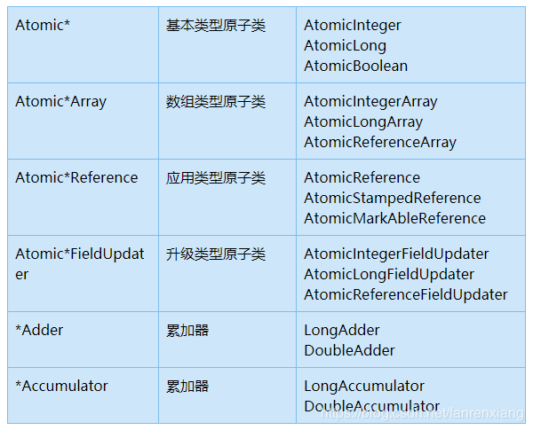

## 参考博文
[Unsafe与CAS](https://www.cnblogs.com/xrq730/p/4976007.html)
[面试必备：JUC 中的 Atomic 原子类总结](https://zhuanlan.zhihu.com/p/48068221)
[JUC原子类: CAS, Unsafe和原子类详解](https://www.pdai.tech/md/java/thread/java-thread-x-juc-AtomicInteger.html)
[原子操作类AtomicInteger详解](https://blog.csdn.net/fanrenxiang/article/details/80623884)


[TOC]




atomic包中的原子类都是基于[Unsafe](./Unsafe.md)实现的

# 1. 原子更新基本类型
## AtomicInteger
原子整型类提供的方法
```java
public final int get()：获取当前的值
public final int getAndSet(int newValue)：获取当前的值，并设置新的值
public final int getAndIncrement()：获取当前的值，并自增
public final int getAndDecrement()：获取当前的值，并自减
public final int getAndAdd(int delta)：获取当前的值，并加上预期的值
void lazySet(int newValue): 最终会设置成newValue,使用lazySet设置值后，可能导致其他线程在之后的一小段时间内还是可以读到旧的值。
```

他的应用如下，可以不加锁实现线程安全
```java
private AtomicInteger count = new AtomicInteger();
public void increment() {
    count.incrementAndGet();
}
// 使用 AtomicInteger 后，不需要加锁，也可以实现线程安全
public int getCount() {
    return count.get();
}
```

```
1、AtomicInteger里面的value原始值为3，即主内存中AtomicInteger的value为3，根据Java内存模型，线程1和线程2各自持有一份value的副本，值为3

2、线程1运行到第三行获取到当前的value为3，线程切换

3、线程2开始运行，获取到value为3，利用CAS对比内存中的值也为3，比较成功，修改内存，此时内存中的value为4，线程切换

4、线程1恢复运行，利用CAS比较发现自己的value为3，内存中的value为4，得到一个重要的结论-->此时value正在被另外一个线程修改，所以我不能去修改它

5、线程1的compareAndSet失败，循环判断，因为value是volatile修饰的，所以它具备可见性的特性，线程2对于value的改变能被线程1看到，只要线程1发现当前获取的value是4，内存中的value也是4，说明线程2对于value的修改已经完毕并且线程1可以尝试去修改它

6、最后说一点，比如说此时线程3也准备修改value了，没关系，因为比较-交换是一个原子操作不可被打断，线程3修改了value，线程1进行compareAndSet的时候必然返回的false，这样线程1会继续循环去获取最新的value并进行compareAndSet，直至获取的value和内存中的value一致为止

整个过程中，利用CAS机制保证了对于value的修改的线程安全性。
```

源码解析：AtomicInteger底层用的是==volatile变量==和==CAS==来进行更改数据的
- volatile保证线程的可见性，多线程并发时，一个线程修改数据，可以保证其它线程立马看到修改后的值
- CAS 保证数据更新的原子性

```java
public class AtomicInteger extends Number implements java.io.Serializable {
    private static final Unsafe unsafe = Unsafe.getUnsafe();
    private static final long valueOffset;
    static {
        try {
            //用于获取value字段相对当前对象的“起始地址”的偏移量
            valueOffset = unsafe.objectFieldOffset(AtomicInteger.class.getDeclaredField("value"));
        } catch (Exception ex) { throw new Error(ex); }
    }

    private volatile int value;

    //返回当前值
    public final int get() {
        return value;
    }

    //递增加detla
    public final int getAndAdd(int delta) {
        //三个参数，1、当前的实例 2、value实例变量的偏移量 3、当前value要加上的数(value+delta)。
        return unsafe.getAndAddInt(this, valueOffset, delta);
    }

    //递增加1
    public final int incrementAndGet() {
        return unsafe.getAndAddInt(this, valueOffset, 1) + 1;
    }
...
}
```

## AtomicLong


## AtomicBoolean


# 2. 原子更新数组
## AtomicIntegerArray
```java
public final int get(int i) //获取 index=i 位置元素的值
public final int getAndSet(int i, int newValue)//返回 index=i 位置的当前的值，并将其设置为新值：newValue
public final int getAndIncrement(int i)//获取 index=i 位置元素的值，并让该位置的元素自增
public final int getAndDecrement(int i) //获取 index=i 位置元素的值，并让该位置的元素自减
public final int getAndAdd(int delta) //获取 index=i 位置元素的值，并加上预期的值
boolean compareAndSet(int i, int expect, int update) //如果输入的数值等于预期值，则以原子方式将 index=i 位置的元素值设置为输入值（update）
public final void lazySet(int i, int newValue)//最终 将index=i 位置的元素设置为newValue,使用 lazySet 设置之后可能导致其他线程在之后的一小段时间内还是可以读到旧的值。
```


```java
import java.util.concurrent.atomic.AtomicIntegerArray;

public class Demo5 {
    public static void main(String[] args) throws InterruptedException {
        AtomicIntegerArray array = new AtomicIntegerArray(new int[] { 0, 0 });
        System.out.println(array);
        System.out.println(array.getAndAdd(1, 2));
        System.out.println(array);
    }
}
/*
[0, 0]
0
[0, 2]
*/
```

## AtomicLongArray


## AtomicReferenceArray


# 3. 原子更新引用类型
## AtomicReference
原子更新引用类型。
```java
package thread;

import java.util.concurrent.TimeUnit;
import java.util.concurrent.atomic.AtomicReference;
import java.util.concurrent.atomic.AtomicStampedReference;

/**
 * 测试CAS
 */
public class CASTest {

    public static void main(String[] args) {
        atomicReferenceTest();
    }

    public static void atomicReferenceTest() {

        // 创建两个Person对象，它们的id分别是101和102。
        Person p1 = new Person(101);
        Person p2 = new Person(102);
        // 新建AtomicReference对象，初始化它的值为p1对象
        AtomicReference ar = new AtomicReference(p1);

        Person p3 = (Person) ar.get();
        //Person并没有覆盖equals()方法，而是采用继承自Object.java的equals()方法用==判断
        System.out.println("p3.equals(p1)=" + p3.equals(p1));

        // 通过CAS设置ar。如果ar的值为p1的话，则将其设置为p2。
        ar.compareAndSet(p1, p2);

        p3 = (Person) ar.get();
        System.out.println("p3 is " + p3);
        System.out.println("p3.equals(p1)=" + p3.equals(p1));
        System.out.println("p3.equals(p2)=" + p3.equals(p2));
    }

    static class Person {
        volatile long id;

        public Person(long id) {
            this.id = id;
        }

        public String toString() {
            return "id:" + id;
        }
    }
}
/*
p3.equals(p1)=true
p3 is id:102
p3.equals(p1)=false
p3.equals(p2)=true
*/
```


## AtomicStampedRerence
原子更新引用类型, 内部使用Pair来存储元素值及其版本号。可以用于解决ABA问题
[CAS](./CAS.md)


## AtomicMarkableReference
 原子更新带有标记位的引用类型。

它维护一个boolean类型的标记来标记值有修改


# 4. 原子更新字段类
都是抽象类


- 因为原子更新字段类都是抽象类，每次使用的时候必须使用静态方法newUpdater()创建一个更新器，并且需要设置想要更新的类和属性
- 更新类的字段必须使用public volatile修饰(调用者能够直接操作对象字段),子类可以访问但不能操作父类字段
- 只能操作实例变量(非static)
- 不可以是final变量
- 对于AtomicIntegerFieldUpdater和AtomicLongFieldUpdater只能修改int/long类型的字段，不能修改其包装类型(Integer/Long)。如果要修改包装类型就需要使用AtomicReferenceFieldUpdater


## AtomicIntegerFieldUpdater
原子更新整型的字段的更新器。 

```java
public abstract class AtomicIntegerFieldUpdater<T> {
 
    @CallerSensitive
    public static <U> AtomicIntegerFieldUpdater<U> newUpdater(Class<U> tclass, String fieldName) {
        return new AtomicIntegerFieldUpdaterImpl<U>(tclass, fieldName, Reflection.getCallerClass());
    }

    public abstract boolean compareAndSet(T obj, int expect, int update);

    public abstract boolean weakCompareAndSet(T obj, int expect, int update);

    public abstract void set(T obj, int newValue);

    public abstract void lazySet(T obj, int newValue);

    public int getAndSet(T obj, int newValue) {
        int prev;
        do {
            prev = get(obj);
        } while (!compareAndSet(obj, prev, newValue));
        return prev;
    }

    public int getAndIncrement(T obj) {
        int prev, next;
        do {
            prev = get(obj);
            next = prev + 1;
        } while (!compareAndSet(obj, prev, next));
        return prev;
    }

    public int getAndDecrement(T obj) {
        int prev, next;
        do {
            prev = get(obj);
            next = prev - 1;
        } while (!compareAndSet(obj, prev, next));
        return prev;
    }

    public int getAndAdd(T obj, int delta) {
        int prev, next;
        do {
            prev = get(obj);
            next = prev + delta;
        } while (!compareAndSet(obj, prev, next));
        return prev;
    }

    public int incrementAndGet(T obj) {
        int prev, next;
        do {
            prev = get(obj);
            next = prev + 1;
        } while (!compareAndSet(obj, prev, next));
        return next;
    }

    public int decrementAndGet(T obj) {
        int prev, next;
        do {
            prev = get(obj);
            next = prev - 1;
        } while (!compareAndSet(obj, prev, next));
        return next;
    }

    public int addAndGet(T obj, int delta) {
        int prev, next;
        do {
            prev = get(obj);
            next = prev + delta;
        } while (!compareAndSet(obj, prev, next));
        return next;
    }

    public final int getAndUpdate(T obj, IntUnaryOperator updateFunction) {
        int prev, next;
        do {
            prev = get(obj);
            next = updateFunction.applyAsInt(prev);
        } while (!compareAndSet(obj, prev, next));
        return prev;
    }

    public final int updateAndGet(T obj, IntUnaryOperator updateFunction) {
        int prev, next;
        do {
            prev = get(obj);
            next = updateFunction.applyAsInt(prev);
        } while (!compareAndSet(obj, prev, next));
        return next;
    }

    public final int getAndAccumulate(T obj, int x,
                                      IntBinaryOperator accumulatorFunction) {
        int prev, next;
        do {
            prev = get(obj);
            next = accumulatorFunction.applyAsInt(prev, x);
        } while (!compareAndSet(obj, prev, next));
        return prev;
    }

    public final int accumulateAndGet(T obj, int x,
                                      IntBinaryOperator accumulatorFunction) {
        int prev, next;
        do {
            prev = get(obj);
            next = accumulatorFunction.applyAsInt(prev, x);
        } while (!compareAndSet(obj, prev, next));
        return next;
    }

    private static final class AtomicIntegerFieldUpdaterImpl<T> extends AtomicIntegerFieldUpdater<T> {
        private static final sun.misc.Unsafe U = sun.misc.Unsafe.getUnsafe();
        private final long offset;
        /**
         * if field is protected, the subclass constructing updater, else
         * the same as tclass
         */
        private final Class<?> cclass;
        /** class holding the field */
        private final Class<T> tclass;

        AtomicIntegerFieldUpdaterImpl(final Class<T> tclass,
                                      final String fieldName,
                                      final Class<?> caller) {
            ...
        }

        public final boolean compareAndSet(T obj, int expect, int update) {
            accessCheck(obj);
            return U.compareAndSwapInt(obj, offset, expect, update);
        }

        public final boolean weakCompareAndSet(T obj, int expect, int update) {
            accessCheck(obj);
            return U.compareAndSwapInt(obj, offset, expect, update);
        }

        public final void set(T obj, int newValue) {
            accessCheck(obj);
            U.putIntVolatile(obj, offset, newValue);
        }

        public final void lazySet(T obj, int newValue) {
            accessCheck(obj);
            U.putOrderedInt(obj, offset, newValue);
        }

        public final int get(T obj) {
            accessCheck(obj);
            return U.getIntVolatile(obj, offset);
        }

        public final int getAndSet(T obj, int newValue) {
            accessCheck(obj);
            return U.getAndSetInt(obj, offset, newValue);
        }

        public final int getAndAdd(T obj, int delta) {
            accessCheck(obj);
            return U.getAndAddInt(obj, offset, delta);
        }

        public final int getAndIncrement(T obj) {
            return getAndAdd(obj, 1);
        }

        public final int getAndDecrement(T obj) {
            return getAndAdd(obj, -1);
        }

        public final int incrementAndGet(T obj) {
            return getAndAdd(obj, 1) + 1;
        }

        public final int decrementAndGet(T obj) {
            return getAndAdd(obj, -1) - 1;
        }

        public final int addAndGet(T obj, int delta) {
            return getAndAdd(obj, delta) + delta;
        }

    }
}
```


```java
package thread;

import java.util.concurrent.TimeUnit;
import java.util.concurrent.atomic.AtomicIntegerFieldUpdater;
import java.util.concurrent.atomic.AtomicReference;
import java.util.concurrent.atomic.AtomicStampedReference;

/**
 * 测试CAS
 */
public class CASTest {

    public static void main(String[] args) {
        testAtomicIntegerFieldUpdater();
    }

    //name是类DataDemo中的一个字段名
    public static AtomicIntegerFieldUpdater<DataDemo> updater(String name){
        return AtomicIntegerFieldUpdater.newUpdater(DataDemo.class,name);

    }

    public static void testAtomicIntegerFieldUpdater() {
        DataDemo data = new DataDemo();
        System.out.println("publicVar = "+updater("publicVar").addAndGet(data, 2));
        //System.out.println("publicVar = "+updater("publicVar").getAndIncrement(data));
         
         /* 由于在DataDemo类中属性value2/value3,在TestAtomicIntegerFieldUpdater中不能访问
         将报 java.lang.IllegalAccessException异常
         */
//        System.out.println("protectedVar = "+updater("protectedVar").getAndAdd(data,2));
//        System.out.println("privateVar = "+updater("privateVar").getAndAdd(data,2));

        //System.out.println("staticVar = "+updater("staticVar").getAndIncrement(data));//报java.lang.IllegalArgumentException
        /*
         * 下面报异常：java.lang.IllegalArgumentException:must be integer
         */
 //       System.out.println("integerVar = "+updater("integerVar").getAndIncrement(data));
 //       System.out.println("longVar = "+updater("longVar").getAndIncrement(data));
    }

    static class DataDemo{
        public volatile int publicVar=3;
        protected volatile int protectedVar=4;
        private volatile  int privateVar=5;

        public volatile static int staticVar = 10;
        //public  final int finalVar = 11;

        public volatile Integer integerVar = 19;
        public volatile Long longVar = 18L;

    }
}

/*
publicVar = 5
*/
```

## AtomicLongFieldUpdater
原子更新长整型字段的更新器。 

## AtomicStampedFieldUpdater
原子更新带有版本号的引用类型。 

## AtomicReferenceFieldUpdater
原子更新引用类型。 


# 5. 累加器
*Adder是*Accumulator的特例

## LongAdder
在==高并发==情况下，LongAdder(累加器)比AtomicLong原子操作效率更高

在高度并发竞争情形下，AtomicLong每次进行add都需要flush和refresh（这一块涉及到java内存模型中的工作内存和主内存的，所有变量操作只能在工作内存中进行，然后写回主内存，其它线程再次读取新值），每次add()都需要同步，在高并发时会有比较多冲突，比较耗时导致效率低；而LongAdder中每个线程会维护自己的一个计数器，在最后执行LongAdder.sum()方法时候才需要同步，把所有计数器全部加起来，不需要flush和refresh操作

```java

/**
 * @description 压测AtomicLong的原子操作性能
 **/
public class AtomicLongTest implements Runnable {
 
    private static AtomicLong atomicLong = new AtomicLong(0);
 
    @Override
    public void run() {
        for (int i = 0; i < 10000; i++) {
            atomicLong.incrementAndGet();
        }
    }
 
    public static void main(String[] args) {
        ExecutorService es = Executors.newFixedThreadPool(30);
        long start = System.currentTimeMillis();
        for (int i = 0; i < 10000; i++) {
            es.submit(new AtomicLongTest());
        }
        es.shutdown();
        //保证任务全部执行完
        while (!es.isTerminated()) { }
        long end = System.currentTimeMillis();
        System.out.println("AtomicLong add 耗时=" + (end - start));
        System.out.println("AtomicLong add result=" + atomicLong.get());
    }
/*
AtomicLong add 耗时=1897
AtomicLong add result=100000000
*/


/**
 * @description 压测LongAdder的原子操作性能
 **/
public class LongAdderTest implements Runnable {
 
    private static LongAdder longAdder = new LongAdder();
 
    @Override
    public void run() {
        for (int i = 0; i < 10000; i++) {
            longAdder.increment();
        }
    }
 
    public static void main(String[] args) {
        ExecutorService es = Executors.newFixedThreadPool(30);
        long start = System.currentTimeMillis();
        for (int i = 0; i < 10000; i++) {
            es.submit(new LongAdderTest());
        }
        es.shutdown();
        //保证任务全部执行完
        while (!es.isTerminated()) {
        }
        long end = System.currentTimeMillis();
        System.out.println("LongAdder add 耗时=" + (end - start));
        System.out.println("LongAdder add result=" + longAdder.sum());
}
/*
LongAdder add 耗时=244
LongAdder add result=100000000
*/
```

## DoubleAdder


## LongAccumulator


## DoubelAccumulator