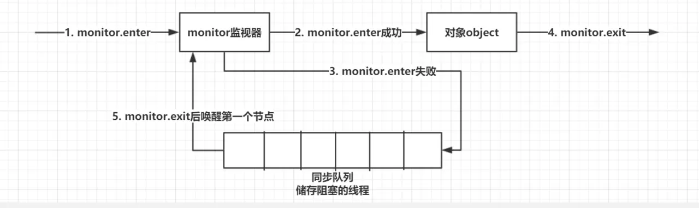
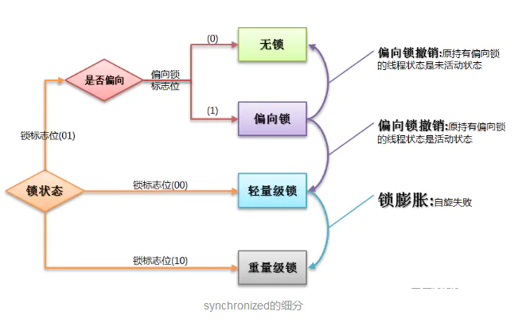
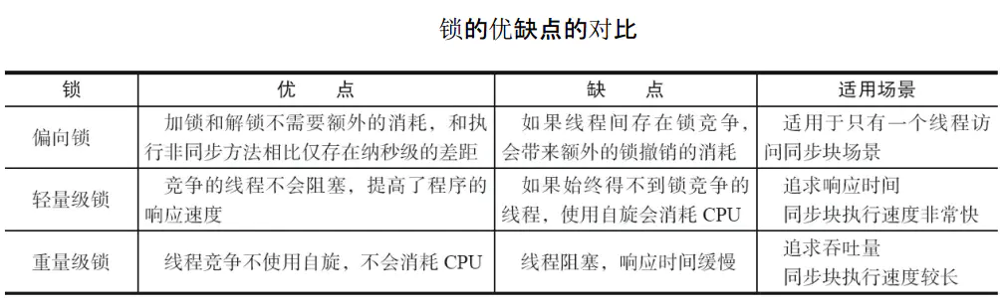
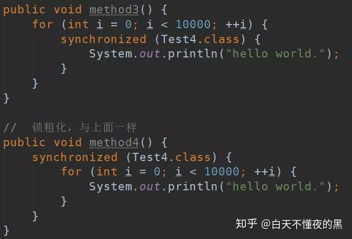

## 参考博文
[关键字: synchronized详解](https://www.pdai.tech/md/java/thread/java-thread-x-key-synchronized.html)
[彻底理解synchronized](https://juejin.im/post/5ae6dc04f265da0ba351d3ff)
[synchronized的使用（一）](https://ddnd.cn/2019/03/21/java-synchronized/)
[深入分析synchronized原理和锁膨胀过程(二)](https://juejin.im/post/5c936018f265da60ec281bcb)
[深入理解synchronized底层原理，一篇文章就够了！](https://zhuanlan.zhihu.com/p/75880892)


[TOC]

# 1. 使用

## 1.1 对象锁
### 代码块形式
可以指定要锁的对象
```java
public class SynchronizedObjectLock implements Runnable {

    static SynchronizedObjectLock instance = new SynchronizedObjectLock();

    @Override
    public void run() {
        // 同步代码块形式—:锁为this,两个线程使用的锁是一样的,线程1必须要等到线程0释放了该锁后，才能执行
        synchronized (this) {
            System.out.println("我是线程" + Thread.currentThread().getName());
            try {
                Thread.sleep(3000);
            } catch (InterruptedException e) {
                e.printStackTrace();
            }
            System.out.println(Thread.currentThread().getName() + "结束");
        }
    }

    public static void main(String[] args) {
        Thread t1 = new Thread(instance);
        Thread t2 = new Thread(instance);
        t1.start();
        t2.start();
    }
}
/*
我是线程Thread-0
Thread-0结束
我是线程Thread-1
Thread-1结束
*/
```


在t1释放block1的锁后，t2可以立马执行，不用等t1释放block2
```java
package thread;

public class SynchronizedObjectLock2 implements Runnable {

    static SynchronizedObjectLock2 instance = new SynchronizedObjectLock2();

    // 创建2把锁
    Object block1 = new Object();
    Object block2 = new Object();

    @Override
    public void run() {
        // 这个代码块使用的是第一把锁，当他释放后，后面的代码块由于使用的是第二把锁，因此可以马上执行
        synchronized (block1) {
            System.out.println("block1锁,我是线程" + Thread.currentThread().getName());
            try {
                Thread.sleep(3000);
            } catch (InterruptedException e) {
                e.printStackTrace();
            }
            System.out.println("block1锁," + Thread.currentThread().getName() + "结束");
        }

        synchronized (block2) {
            System.out.println("block2锁,我是线程" + Thread.currentThread().getName());
            try {
                Thread.sleep(3000);
            } catch (InterruptedException e) {
                e.printStackTrace();
            }
            System.out.println("block2锁," + Thread.currentThread().getName() + "结束");
        }
    }

    public static void main(String[] args) {
        Thread t1 = new Thread(instance);
        Thread t2 = new Thread(instance);
        t1.start();
        t2.start();
    }
}
/*
block1锁,我是线程Thread-0
block1锁,Thread-0结束
block2锁,我是线程Thread-0　　// 可以看到当第一个线程在执行完第一段同步代码块之后，第二个同步代码块可以马上得到执行，因为他们使用的锁不是同一把
block1锁,我是线程Thread-1
block2锁,Thread-0结束
block1锁,Thread-1结束
block2锁,我是线程Thread-1
block2锁,Thread-1结束

*/
```

### 方法锁形式
修饰实例方法，默认的锁对象为this，即当前对象

t1和t2锁的是同一个对象instance
```java
public class SynchronizedObjectLock implements Runnable {
    static SynchronizedObjectLock instance = new SynchronizedObjectLock();

    @Override
    public void run() {
        method();
    }

    public synchronized void method() {
        System.out.println("我是线程" + Thread.currentThread().getName());
        try {
            Thread.sleep(3000);
        } catch (InterruptedException e) {
            e.printStackTrace();
        }
        System.out.println(Thread.currentThread().getName() + "结束");
    }

    public static void main(String[] args) {
        Thread t1 = new Thread(instance);
        Thread t2 = new Thread(instance);
        t1.start();
        t2.start();
    }
}
/*
我是线程Thread-0
Thread-0结束
我是线程Thread-1
Thread-1结束
*/
```


```java
package thread;

public class SynchronizedObjectMethodLock implements Runnable {

    static SynchronizedObjectMethodLock instance1 = new SynchronizedObjectMethodLock();
    static SynchronizedObjectMethodLock instance2 = new SynchronizedObjectMethodLock();

    @Override
    public void run() {
        method();
    }

    // synchronized用在普通方法上，默认的锁就是this，当前实例
    public synchronized void method() {
        System.out.println("我是线程" + Thread.currentThread().getName());
        try {
            Thread.sleep(3000);
        } catch (InterruptedException e) {
            e.printStackTrace();
        }
        System.out.println(Thread.currentThread().getName() + "结束");
    }

    public static void main(String[] args) {
        // t1和t2对应的this是两个不同的实例，所以代码不会串行
        Thread t1 = new Thread(instance1);
        Thread t2 = new Thread(instance2);
        t1.start();
        t2.start();
    }
}
/*
我是线程Thread-1
我是线程Thread-0
Thread-0结束
Thread-1结束
*/
```

## 1.2 类锁
### 修饰静态方法
```java
public class SynchronizedObjectLock implements Runnable {
    static SynchronizedObjectLock instance1 = new SynchronizedObjectLock();
    static SynchronizedObjectLock instance2 = new SynchronizedObjectLock();

    @Override
    public void run() {
        method();
    }

    // synchronized用在静态方法上，默认的锁就是当前所在的Class类，所以无论是哪个线程访问它，需要的锁都只有一把
    public static synchronized void method() {
        System.out.println("我是线程" + Thread.currentThread().getName());
        try {
            Thread.sleep(3000);
        } catch (InterruptedException e) {
            e.printStackTrace();
        }
        System.out.println(Thread.currentThread().getName() + "结束");
    }

    public static void main(String[] args) {
        Thread t1 = new Thread(instance1);
        Thread t2 = new Thread(instance2);
        t1.start();
        t2.start();
    }
}
/*
我是线程Thread-0
Thread-0结束
我是线程Thread-1
Thread-1结束
*/
```


### 指定锁对象为Class对象
```java
public class SynchronizedObjectLock implements Runnable {
    static SynchronizedObjectLock instance1 = new SynchronizedObjectLock();
    static SynchronizedObjectLock instance2 = new SynchronizedObjectLock();

    @Override
    public void run() {
        // 所有线程需要的锁都是同一把
        synchronized(SynchronizedObjectLock.class){
            System.out.println("我是线程" + Thread.currentThread().getName());
            try {
                Thread.sleep(3000);
            } catch (InterruptedException e) {
                e.printStackTrace();
            }
            System.out.println(Thread.currentThread().getName() + "结束");
        }
    }

    public static void main(String[] args) {
        Thread t1 = new Thread(instance1);
        Thread t2 = new Thread(instance2);
        t1.start();
        t2.start();
    }
}
/*
我是线程Thread-0
Thread-0结束
我是线程Thread-1
Thread-1结束
*/
```


# 2. 实现原理
```java
public class SynchronizedDemo2 {
        Object object = new Object();

        public void method1() {
            synchronized (object) {

            }
        }

        public synchronized void method2() {

        }
}
```

执行：
```shell
javap -verbose SynchronizedDemo.class
```


- 对于代码块，字节码中添加monitorenter和monitorexit指令
- 对于方法，方法表的flag中添加CC_SYNCHRONIZED标志

两种指令的底层实现都是获取监视器锁monitor。monitor的实现依赖操作系统的mutex原语，用操作系统实现线程间的切换需要从用户态转到内核态，开销较大。


每个对象都有监视器锁monitor，只有获取到monitor的线程才能进入同步代码块。同一时刻只能有一个线程获取到某个对象的监视器锁，没有获取到的线程将blocked并进入同步队列

1. 执行monitorenter获取monitor
   1.1 如果monitor计数器为0，则该线程获取到锁，将计数器置为1，进入同步代码块
   1.2 如果该线程已经占有monitor，又尝试获取锁，则计数器加1(==可重入==)
   1.3 如果monitor已经被其他线程占有，当前线程阻塞进入同步队列

2. 执行monitorexit释放monitor
每执行一次monitorexit就将锁计数器减1，直到减到0就释放锁。这时如果刚好有其他线程来尝试获取monitor，那么会将锁交给该线程而不去唤醒队列中的第一个线程。否则同步队列中的线程能尝试重新获取(==非公平==)

上图中的第二条monitorexit指令是编译器自动生成的，当线程执行过程中发生异常时，将使用这条指令释放锁




# 3. 锁优化
## 3.1 锁膨胀
监视器锁monitor存储在对象的对象头的Mark Word中([对象创建过程](../JVM/对象创建过程.md)),当锁状态为重量级的时候，MarkWord中会有一个指向monitor对象的指针。

但是monitor的开销很大，JVM对synchronized做了优化。首先会利用对象头实现锁，如果线程竞争过大才会将锁升级(膨胀)为重量级锁(才会去使用monitor对象)

锁一共有4种状态,锁可以随着竞争激烈升级但不能降级。只有重量级锁依赖操作系统底层实现，其他状态的锁都依赖对象头实现
```
锁膨胀方向： 无锁 → 偏向锁 → 轻量级锁 → 重量级锁 (此过程是不可逆的)
```






### 轻量级锁
轻量级锁是相对于使用底层操作系统mutex互斥原语实现同步的重量级锁而言的，因为轻量级锁同步的实现是基于对象头的Mark Word

- 获取锁过程
1. 线程进入同步区域时，如果对象的锁状态为无锁(锁标志位为"01"状态，是否为偏向锁为"0"),则在当前线程的栈帧中创建一个锁记录空间(Lock Recored)，并将Mark Word的拷贝存进去(Displaced Mark Word)
2. 拷贝成功后，虚拟机使用CAS将对象的Mark Word更新为指向Lock Record的指针。如果这个更新成功了，则执行步骤3，否则执行步骤4
3. 如果更新成功，表明该线程持有了该对象的锁，并将Mark Word的锁状态改为00(轻量锁状态)
4. 如果更新失败，虚拟机先检查对象的Mark Word是否有指向当前线程栈帧的指针。如果有说明当前线程已经获取锁，可以直接进入。如果没有说明锁已经被其他线程占用，则进入自旋状态执行步骤2。如果达到自旋次数上限了还没获得锁，轻量级锁要膨胀为重量级锁。将对象的Mark Word的锁状态改为10(重量级锁状态)，Mark Word中储存就是指向monitor对象的指针，当前线程以及后面等待锁的线程也要进入阻塞状态


- 释放锁过程
1. 使用CAS操作将栈帧中的Displaced Mark Word拷贝回对象Mark Word(把原始的值拷贝回去)
2. 如果拷贝成功，说明没发生竞争关系，则释放锁，对象恢复到无锁状态(01)
3. 如果拷贝失败，说明有其他线程尝试获得锁并且已经锁膨胀，则释放锁并且唤醒同步队列中被挂起的线程


### 偏向锁
第一个获取到锁的线程会在对象头和栈帧中的锁记录里存储锁偏向的线程ID，在执行过程中如果没有其他线程来竞争，以后该线程在进入和退出同步块时不需要进行CAS操作来加锁和解锁。

只有当其他线程来竞争时，拥有偏向锁的线程才会释放锁

- 获取锁过程
1. 检查Mark Word中的偏向线程ID是否是当前线程ID，如果是则直接进入同步块(所以持有偏向锁的线程不用CAS来加锁和解锁，只用判断偏向线程ID是否是当前线程ID)。如果不是则执行步骤2
2. 检查对象的Mark Word是否是可偏向锁状态(锁标志位为"01"状态，是否为偏向锁为"1")，如果不是则升级成轻量级锁。如果是则执行步骤3
3. 使用CAS修改Mark Word中的偏向线程ID为当前线程ID，如果修改成功则执行同步代码块，否则执行释放锁过程


- 释放锁过程
1. 拥有锁的线程到达安全点(没有字节码在执行的时刻)
2. 暂停拥有锁线程
3. 检查线程是否处于同步块中，如果是则挂起该线程，并将对象头的Mark Word锁标记升级为轻量级锁(00)，将锁记录指针指向当前线程的Lock Recored。如果不处于同步块中，将对象头设置为无锁状态(01)


## 3.2 自旋锁和自适应性自旋锁
- 自旋锁
当某个线程请求一个被占用的锁时，该线程并不进入阻塞状态，而是循环请求锁(自旋)，当达到自旋次数上限后还没获取到锁才挂起。可能会出现刚挂起锁就被释放的情况


- 自适应自旋锁
对自旋锁的优化，自旋的时间不再固定，而根据上一次在这个锁上的自旋时间和锁拥有者的状态决定。如果线程自旋成功，那么下一次在这个锁上的自旋上限会增多


## 3.3 锁消除
虚拟机的JIT在运行时，对一些代码上要求同步但是被检测到不会存在共享数据竞争的锁进行消除

主要判定依据来源于逃逸分析，如果一段同步代码中的数据明显不会被其他线程访问到，JVM就将这些数据看做线程私有的


对字符串的连接操作会转换成StringBuidler对象的连续append()操作，而StringBuidler又是同步的。在如下代码中，方法的局部变量不会发生同步问题，所以JVM会进行锁消除操作


## 3.4 锁粗化
加同步锁时，应将同步块的范围尽量缩小，只锁会发生共享变量操作的部分。但有时候如果出现对一个对象进行一连串的操作，这一连串的操作都要反复加锁解锁，JVM会将锁范围扩展到一些列操作的外部


