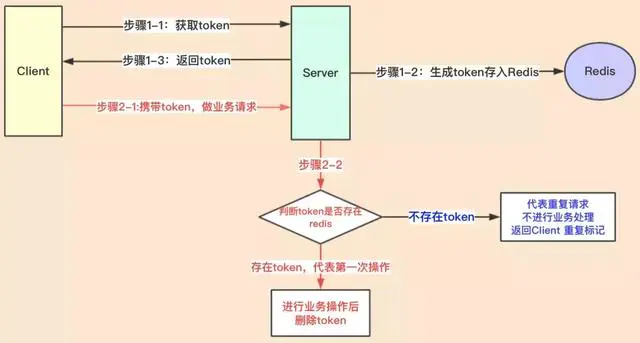

## 参考博文
[我是这样给同事分析幂等性问题的](https://xie.infoq.cn/article/107fd263605e9d184b78bf093)
[聊聊开发中幂等性问题](https://juejin.cn/post/6844903815552958477)

[TOC]

# 概念
指用相同的参数重复执行，并能获得相同结果的函数，这些函数不影响系统状态，也不用担心重复执行会对系统造成改变

# 场景
产生重复数据或数据不一致，这个绝大部分是由于发生了重复请求:

1. 微服务架构下，不同微服务间会有大量的基于 http,rpc 或者 mq 消息的网络通信，会有第三个情况【未知】，也就是超时。如果超时了，微服务框架会进行重试。
2. 用户交互的时候多次点击,无意地触发多笔交易。
3. MQ 消息中间件，消息重复消费
4. 第三方平台的接口（如：支付成功回调接口），因为异常也会导致多次异步回调
5. 其他中间件/应用服务根据自身的特性，也有可能进行重试

# 解决方案
## 1. 使用唯一索引
假如对插入一条数据，并且有唯一索引，再次插入就会失败
例如商品招商策略中的diff表以itemId作为唯一索引

## 2. 分布式锁
基于Tair带版本version的put

(1)请求锁的过程

第一步 用key从tair中get数据，如果存在数据，返回获取锁失败，如果不存在，进入第二步

第二步 用带version的put接口put数据，version必须是大于1的数字（原因在后面原理里解释），put成功返回获取锁成功，put失败返回获取锁失败

(2)释放锁的过程

invalid掉key对应的数据即可

这种方式能work的主要原因在于带version的put接口的行为：
1. 如果tair中不存在该条数据，则不校验version，新写入的数据version为1
2. 如果tair中已经存在该条数据，则校验tair中数据的version是否和入参一致，如果一致，则成功并更新新的值，并且version+1；如果数据中的version和入参不同，则返回失败

从这个行为我们去分析上面请求锁的第二步，用version为2去put数据的时候，如果tair中现在没有key对应的数据，那put成功，获取锁成功；如果tair中已经有数据，则说明其他客户已经持有了锁，而且version只能是1，不可能是2（这里想想为什么），那这次put必然会失败，也就是说其他人已经持有锁的情况下一定会拒绝当前这次请求。整体就实现了没有其他客户端持有锁当前请求成功，已经有其他客户端持有锁请求失败的功能。

## 3. token 令牌

应用流程如下：

1）服务端提供了发送 token 的接口。执行业务前先去获取 token，同时服务端会把 token 保存到 redis 中；

2）然后业务端发起业务请求时，把 token 一起携带过去，一般放在请求头部；

3）服务器判断 token 是否存在 redis 中，存在即第一次请求，可继续执行业务，执行业务完成后将 token 从 redis 中删除；

4）如果判断 token 不存在 redis 中，就表示是重复操作，直接返回重复标记给 client，这样就保证了业务代码不被重复执行。

