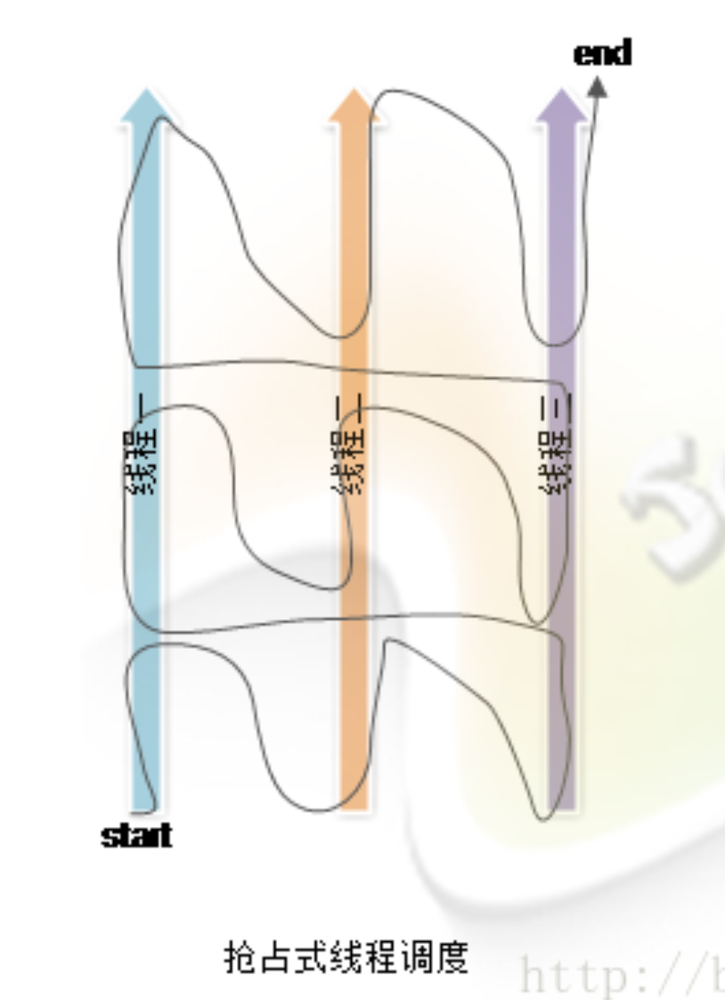

## 参考博文
[Java 并发 - 线程基础](https://www.pdai.tech/md/java/thread/java-thread-x-thread-basic.html)
[java 多线程 sleep() wait() yield() join()方法解析](https://blog.csdn.net/guo0820/article/details/51024005)
[Java多线程的调度策略](https://blog.csdn.net/wangyangzhizhou/article/details/41122385)
[技术进阶：深入理解Java虚拟机，Java与线程](https://zhuanlan.zhihu.com/p/61334240)
[Java 线程间通信和协作的两种方式](https://www.jianshu.com/p/8d40ef55e301)
[Java 并发：线程间通信与协作](https://blog.csdn.net/justloveyou_/article/details/54929949)


[TOC]

# 1. 线程状态


每个锁对象都有两个队列，一个是就绪队列，一个是阻塞队列。就绪队列存储了已就绪（将要竞争锁）的线程，阻塞队列存储了被阻塞的线程。当一个阻塞线程被唤醒后，才会进入就绪队列，进而等待CPU的调度；反之，当一个线程被wait后，就会进入阻塞队列，等待被唤醒

## 新建(New)
线程被创建但是未运行

## 运行状态(Runnable)
调用start()方法之后的状态，包含：
1. 就绪状态：线程等待CPU调度
2. 运行状态：线程开始真正执行

就绪状态是线程进入运行状态的唯一入口

## 阻塞(Blocking)
等待获取一个排它锁，等占用锁的线程释放锁

## 无限期等待(Waiting)
等待其他线程显示的唤醒

进入方法| 退出方法|
---|---|
没有设置Timeout参数的Object.wait()方法| Object.notify() / Object.notifyAll() 
没有设置Timeout参数的Thread.join()方法|被调用的线程执行完毕 
LockSupport.park()方法|-


## 限期等待(Timed Waiting)
在等待一定时间后就就被唤醒，无需其他线程来唤醒

进入方法| 退出方法 |
---|---|
Thread.sleep()方法| 时间结束 
设置了Timeout参数的Object.wait()方法| 时间结束 / Object.notify() / Object.notifyAll() 
设置了Timeout参数的Thread.join()方法| 时间结束 / 被调用的线程执行完毕 
LockSupport.parkNanos()方法| - 
LockSupport.parkUntil()方法| -

Thread.sleep():使一个线程睡眠
Object.wait():挂起一个线程

阻塞是被动的，它是在等待获取一个排它锁
等待是主动的，通过调用 Thread.sleep() 和 Object.wait() 等方法进入

## 死亡(Terminated)
线程执行完结束或产生异常后结束


# 2. 线程创建方式
Runnable和Callable都是创建一个任务，最终还是通过Thread调用start()方法执行。调用start()方法的线程放入就绪队列中，当线程被调度时才真正执行run()/call()方法

## 实现 Runnable 接口
实现Runnable接口的run()方法，传入Thread中，并由Thread调用start()开始线程

```java
public class MyRunnable implements Runnable {
    public void run() {
        // ...
    }
}

public static void main(String[] args) {
    MyRunnable instance = new MyRunnable();
    Thread thread = new Thread(instance);
    thread.start();
}
```

## 实现 Callable 接口
实现Callable接口的call()方法，不过他和Runnable相比可以有返回值。返回值封装在FutureTask里，并传入Thread中，由Thread调用start()开始线程。最后通过FutureTask的get()方法获取返回值

```java
public class MyCallable implements Callable<Integer> {
    public Integer call() {
        return 123;
    }
}

public static void main(String[] args) throws ExecutionException, InterruptedException {
    MyCallable mc = new MyCallable();
    FutureTask<Integer> ft = new FutureTask<>(mc);
    Thread thread = new Thread(ft);
    thread.start();
    System.out.println(ft.get());
}
```

## 继承 Thread 类
继承Thread类，重写run()方法

```java
public class MyThread extends Thread {
    public void run() {
        // ...
    }
}

public static void main(String[] args) {
    MyThread mt = new MyThread();
    mt.start();
}
```

Thread构造函数调用init进行初始化
```java
private void init(ThreadGroup g, Runnable target,String name,long stackSize, AccessControlContext acc,boolean inheritThreadLocals) {
        if (name == null) {
            throw new NullPointerException("name cannot be null");
        }

        this.name = name;

        //当前线程就是该线程的父线程
        Thread parent = currentThread();
        ...
        //该线程的daemon和priority和父线程相同
        this.group = g;
        this.daemon = parent.isDaemon();
        this.priority = parent.getPriority();
        ...
        this.target = target;
        setPriority(priority);
        //复制父线程的inheritableThreadLocals
        if (inheritThreadLocals && parent.inheritableThreadLocals != null)
            this.inheritableThreadLocals =
                ThreadLocal.createInheritedMap(parent.inheritableThreadLocals);
        ...

        //分配线程ID
        tid = nextThreadID();
    }
```
## 实现接口 VS 继承 Thread
实现接口比继承Thread更好：
1. Java 不支持多重继承，因此继承了 Thread 类就无法继承其它类，但是可以实现多个接口
2. 类可能只要求可执行就行，继承整个 Thread 类开销过大
3. 线程池只能放入实现Runable或callable类线程，不能直接放入继承Thread的类


# 3. 线程调度和优先级
## 3.1 调度模式
### 抢占式调度
每个线程的执行时间、线程的切换都由系统控制，系统来决定每条线程都执行多长时间

一个线程阻塞了不会影响到全部线程



### 协同式调度
占有CPU的线程执行完后主动通知系统切换线程执行，类似于接力赛

一个线程的阻塞会导致所有线程阻塞


## 3.2 Java的线程调度
JVM使用抢占式调度，在所有就绪状态的线程中，高优先级的线程会被分配CPU

但是Java的优先级不一定随时发生作用，因为Java的线程都是映射到操作系统线程实现的，线程调度最终还是由操作系统决定

- 优先级
Java线程的优先级用整数表示，取值范围是1~10，Thread类有以下三个静态常量：
```java
//线程可以具有的最高优先级，取值为10
static int MAX_PRIORITY

//线程可以具有的最低优先级，取值为1
static int MIN_PRIORITY 

//分配给线程的默认优先级，取值为5
static int NORM_PRIORITY 
```
Thread类的setPriority()和getPriority()方法分别用来设置和获取线程的优先级

线程的优先级有继承关系，比如A线程中创建了B线程，那么B将和A具有相同的优先级


## 3.3 上下文切换
[上下文切换](./上下文切换.md)


# 4. 线程的实现
## 使用内核线程实现


## 使用用户线程实现


## 混合实现


# 5. 用户线程(普通线程) VS 守护线程(后台线程)
[用户线程和守护线程](./用户线程和守护线程.md)


# 6. 几个方法比较
## sleep() 
休眠==当前线程==，millisec 单位为毫秒。当睡眠结束后，线程就转为就绪（Runnable）状态

==不会释放锁==
```java
Thread.sleep(millisec) 
```

当线程调用interrupt()方法设置中断状态后，遇到sleep()会抛出InterruptedException。线程必须在自己的run()方法中捕获异常，异常不能跨线程传递
```java
public void run() {
    try {
        Thread.sleep(3000);
    } catch (InterruptedException e) {
        e.printStackTrace();
    }
}
```

## yield()
==当前线程==会让出CPU给其他同优先级或更高优先级的线程，当前线程回到可运行状态。但是只是给线程调度器一个建议，不保证其他线程一定被执行，有可能当前线程又马上被执行

==不会释放锁==
```java
Thread.yield();
```

## join()
当前线程等待调用join()的线程结束后再继续执行后面的代码

==不会释放锁==
```java
//main等待线程t执行完了再继续执行
t.join();
```

常用于主线程需要等待子线程执行完成之后再结束，主线程需要子线程的执行结果
```java
public class ThreadJoin implements Runnable {

    private String name;

    public ThreadJoin(String name) {
        this.name = name;
    }

    @Override
    public void run() {
        System.out.println(Thread.currentThread().getName() + "线程运行开始");
        for (int i = 0; i < 5; i++) {
            System.out.println("子线程" + name + "运行:" + i);
            try {
                Thread.sleep((int) Math.random() * 10);
            } catch (InterruptedException e) {
                e.printStackTrace();
            }
        }
        System.out.println(Thread.currentThread().getName() + "线程运行结束");
    }

    public static void main(String[] args) {
        System.out.println(Thread.currentThread().getName() + "主线程运行开始");
        Runnable r1 = new ThreadJoin("A");
        Thread t1 = new Thread(r1);
        Runnable r2 = new ThreadJoin("B");
        Thread t2 = new Thread(r2);
        t1.start();
        t2.start();
        try {
            t1.join();
        } catch (InterruptedException e) {
            e.printStackTrace();
        }

        try {
            t2.join();
        } catch (InterruptedException e) {
            e.printStackTrace();
        }
        System.out.println(Thread.currentThread().getName() + "主线程运行结束");
    }
}
/*
main主线程运行开始
Thread-0线程运行开始
Thread-1线程运行开始
子线程A运行:0
子线程B运行:0
子线程A运行:1
子线程B运行:1
子线程A运行:2
子线程A运行:3
子线程B运行:2
子线程A运行:4
子线程B运行:3
Thread-0线程运行结束
子线程B运行:4
Thread-1线程运行结束
main主线程运行结束
*/
```


# 7. 线程间协作
## join()
[join()](#join)

## wait/notify
- Object的方法，必须在synchronized域中执行，也就是说执行wait/notify的线程必须获得锁，如果当前线程不是此锁的拥有者，会抛出IllegalMonitorStateException异常
- 执行wait方法的线程将==释放锁==并进入对象的等待队列中等待别的线程调用notify/notifyAll来唤醒
- 使用notify将随意唤醒线程从等待队列移到同步队列，使用notifyAll将唤醒所有线程从等待队列移到同步队列。同步队列中的线程以常规方式和其他线程竞争锁，并在当前线程释放锁后才能竞争。

==会释放锁==

```java
package thread;

/**
 * 使用wait、notify实现线程的顺序执行
1.从大的方向上来讲，该问题为三线程间的同步唤醒操作，
主要的目的就是ThreadA->ThreadB->ThreadC->ThreadA循环执行三个线程
2.为了控制线程执行的顺序，那么就必须要确定唤醒、等待的顺序，
所以每一个线程必须同时持有两个对象锁，才能继续执行。
一个对象锁是prev，就是前一个线程所持有的对象锁。还有一个就是自身对象锁
3.为了控制执行的顺序，必须要先持有prev锁，也就是前一个线程要释放自身对象锁，
再去申请自身对象锁，两者兼备时打印，之后首先调用self.notify()释放自身对象锁，
唤醒下一个等待线程，再调用prev.wait()释放prev对象锁，终止当前线程
*/
public class ThreadABC implements Runnable {

    private String name;
    private Object prev;
    private Object self;

    public ThreadABC(String name, Object prev, Object self) {
        this.name = name;
        this.prev = prev;
        this.self = self;
    }

    @Override
    public void run() {
        int count = 5;
        while (count > 0) {
            synchronized (prev) {
                synchronized (self) {
                    System.out.println(name);
                    count--;
                    self.notify();
                }
                try {
                    prev.wait();
                } catch (InterruptedException e) {
                    e.printStackTrace();
                }
            }
        }
    }

    public static void main(String[] args) throws Exception {
        Object a = new Object();
        Object b = new Object();
        Object c = new Object();
        ThreadABC ta = new ThreadABC("A", c, a);
        ThreadABC tb = new ThreadABC("B", a, b);
        ThreadABC tc = new ThreadABC("C", b, c);

        new Thread(ta).start();
        Thread.sleep(100);

        new Thread(tb).start();
        Thread.sleep(100);

        new Thread(tc).start();
        Thread.sleep(100);
    }
}
/*
A
B
C
A
B
C
A
B
C
A
B
C
A
B
C
*/
```


## Condition
[ReentrantLock](./ReentrantLock.md)


## 举例：交替打印奇偶数
- 使用 wait/notify：
```java
    public void printNumber() {
        new Thread(new EvenTask()).start();
        new Thread(new OddTask()).start();
    }
    
    private int number = 10;
    private final Object numberLock = new Object();

    private class EvenTask implements Runnable {
        @Override
        public void run() {
            synchronized (numberLock) {
                while (number >= 0 && (number & 1) == 0) {
                    System.out.println("偶数: " + (number--));
                    numberLock.notify();
                    try {
                        numberLock.wait();
                    } catch (InterruptedException e) {
                        e.printStackTrace();
                    }
                }
            }
        }
    }

    private class OddTask implements Runnable {
        @Override
        public void run() {
            synchronized (numberLock) {
                while (number >= 0 && (number & 1) == 1) {
                    System.out.println("奇数: " + (number--));
                    numberLock.notify();
                    try {
                        numberLock.wait();
                    } catch (InterruptedException e) {
                        e.printStackTrace();
                    }
                }
            }
        }
    }
```


- 使用 Lock/Condition：
```java
    public void printNumber() {
        new Thread(new EvenTask()).start();
        new Thread(new OddTask()).start();
    }
    
    private int number = 10;
    private Condition evenCondition = reentrantLock.newCondition();
    private Condition oddCondition = reentrantLock.newCondition();

    private class EvenTask implements Runnable {

        @Override
        public void run() {
            reentrantLock.lock();
            try {
                while (number >= 0 && (number & 1) == 0) {
                    System.out.println("偶数: " + (number--));
                    oddCondition.signal();
                    evenCondition.await();
                }
            } catch (InterruptedException e) {
                e.printStackTrace();
            } finally {
                reentrantLock.unlock();
            }
        }
    }

    private class OddTask implements Runnable {
        @Override
        public void run() {
            reentrantLock.lock();
            try {
                while (number >= 0 && (number & 1) == 1) {
                    System.out.println("奇数: " + (number--));
                    evenCondition.signal();
                    oddCondition.await();
                }
            } catch (InterruptedException e) {
                e.printStackTrace();
            } finally {
                reentrantLock.unlock();
            }
        }
    }
/*
偶数: 10
奇数: 9
偶数: 8
奇数: 7
偶数: 6
奇数: 5
偶数: 4
奇数: 3
偶数: 2
奇数: 1
偶数: 0
*/
```


