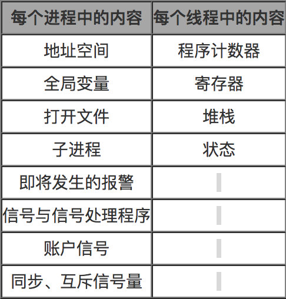
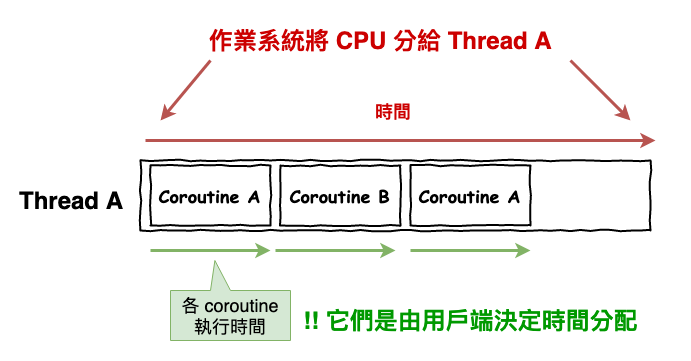
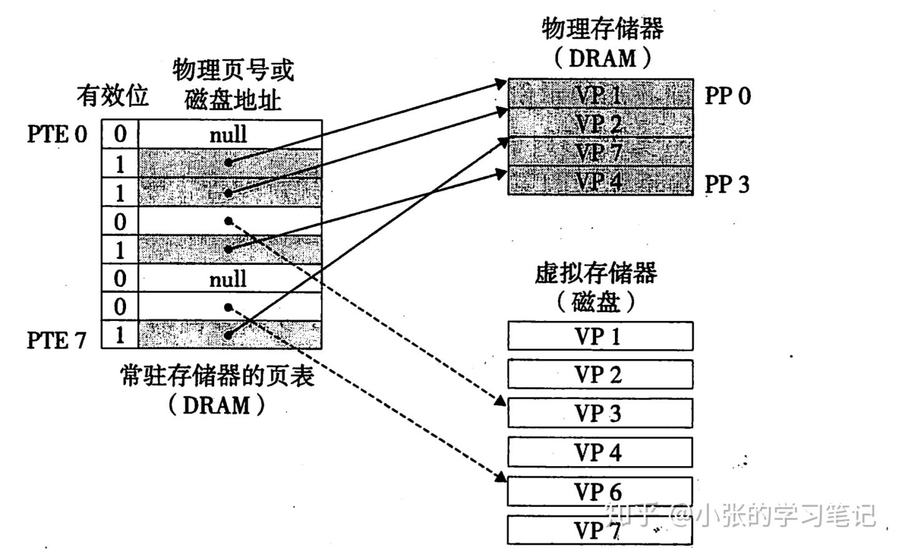

## 参考博文
[什么是协程？](https://zhuanlan.zhihu.com/p/172471249)
[线程和进程的区别（面试必备)](https://blog.csdn.net/qinian8/article/details/100779193)
[如何理解虚拟内存](https://zhuanlan.zhihu.com/p/96098896)

[TOC]

# 进程
进程是资源分配的基本单位，进程有自己的内存区域
## 为什么需要进程
CPU没一个时刻只能执行一条指令，但如果只执行一个程序的任务，其他程序都无法得到相应。所以CPU利用分时调度让每个程序都得到时间片执行。
但是每个程序的实例他们执行的数据和代码是不一样的，所以当一个任务切换到另一个任务的时候，需要保存当前任务的执行现场。所以就有了进程的概念，作为执行的基本单元，使用单独的内存维护着对应的上下文环境

# 线程
线程是运行调度的基本单位，一个进程当中有很多线程，他是执行任务的实体。

一个进程中的线程共享进程中的资源。

每个线程都有一个程序计数器（记录要执行的下一条指令），一组寄存器（保存当前线程的工作变量），堆栈（记录执行历史，其中每一帧保存了一个已经调用但未返回的过程）

# 进程 VS 线程
1. 1、进程是资源分配的最小单位，线程是程序执行的最小单位（资源调度的最小单位）
2. 进程有自己的独立空间，每个进程都有自己的PCB表存放数据；线程共享进程的内存
3. 线程间通信比较方便，同一进程下的线程共享静态变量、全局变量
4. 因为进程有独立的地址空间，所以一个进程不会影响另一个进程，但是线程间会相互影响

# 协程
协程，英文Coroutines，是一种比线程更加轻量级的存在。正如一个进程可以拥有多个线程一样，一个线程也可以拥有多个协程

当线程数量非常多的时候，产生的问题：
1. 系统线程会占用非常多的内存空间
2. 过多的线程切换会占用大量的系统时间。

协程运行在线程之上，当一个协程执行完成后，可以选择主动让出，让另一个协程运行。协程并没有增加线程数量，只是在线程的基础之上通过分时复用的方式运行多个协程，而且协程的切换在用户态完成，切换的代价比线程从用户态到内核态的代价小很多

协程的特点在于是一个线程执行

## 协程 VS 线程

1. 协程极高的执行效率：因为协程切换由程序自身控制，因此没有线程切换的开销。和多线程比，线程数量越多，协程的性能优势就越明显。

2. 不需要多线程的锁机制，因为只有一个线程，也不存在同时写变量冲突。在协程中控制共享资源不加锁，只需要判断状态就好了，所以执行效率比多线程高很多。

# 虚拟内存
程序运行需要的内存远超过机器的物理内存，通过 虚拟内存可以让程序可以拥有超过系统物理内存大小的可用内存空间。另外，虚拟内存为每个进程提供了一个一致的、私有的地址空间，它让每个进程产生了一种自己在独享主存的错觉（每个进程拥有一片连续完整的内存空间）

## 虚拟地址到物理地址的转换
每个进程都有一个页表，里面存放的是虚拟地址到物理地址的映射关系和虚拟地址上的数据是否在物理内存上。

具体的翻译工作由内存管理单元负责，当他收到一个虚拟地址，他会去页表查对应的数据是否被加载到内存，如果没找到就会发生缺页异常。

页表就是一个页表条目(Page Table Entry,PTE)的数组，每个PTE由一个有效位(valid bit)和一个地址组成，有效位表明了该虚拟页当前是否存在于物理内存中，如果有效位是1，该PTE中就会存储物理内存中相应的物理页的起始地址。如果有效位是0，且PTE中的地址为null，这表示这个虚拟页还未被分配，而如果有效位是0且PTE中有地址，那么这个地址指向该虚拟页在磁盘上的起始位置

当一个进程试图访问虚拟地址空间中的某个数据时，会经历下面两种情况的过程：

1. CPU想访问某个虚拟内存地址，找到进程对应的页表中的条目，判断有效位， 如果有效位为1，说明在页表条目中的物理内存地址不为空，根据物理内存地址，访问物理内存中的内容，返回

2. CPU想访问某个虚拟内存地址，找到进程对应的页表中的条目，判断有效位，如果有效位为0，但页表条目中还有地址，这个地址是磁盘空间的地址，这时触发缺页异常，系统把物理内存中的一些数据拷贝到磁盘上，腾出所需的空间，并且更新页表。此时重新执行访问之前虚拟内存的指令，就会发现变成了情况1.