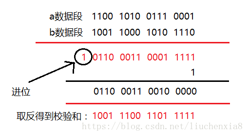

## 参考博文
[HTTP和HTTPS协议，看一篇就够了](https://blog.csdn.net/xiaoming100001/article/details/81109617)
[TCP三次握手、四次挥手出现意外情况时，为保证稳定，是如何处理的？](https://juejin.im/post/5e44fa256fb9a07ce31edc98)
[如何实现可靠UDP传输](https://juejin.im/post/5e92c1e2f265da47cd356f3c)
[网络基础：TCP协议-如何保证传输可靠性](https://blog.csdn.net/liuchenxia8/article/details/80428157)


[TOC]

# 1. TCP和UDP
## 1.1 TCP
**1. TCP 是面向连接的、可靠的、基于字节流的传输层通信协议**
```
1. 面向连接：一定是「一对一」才能连接，不能像 UDP 协议 可以一个主机同时向多个主机发送消息，也就是一对多是无法做到的；

2. 可靠的：无论的网络链路中出现了怎样的链路变化，TCP 都可以保证一个报文一定能够到达接收端；

3. 字节流：消息是「没有边界」的，所以无论我们消息有多大都可以进行传输。
并且消息是「有序的」，当「前一个」消息没有收到的时候，即使它先收到了后面的字节已经收到，那么也不能扔给应用层去处理，同时对「重复」的报文会自动丢弃。
```

**2. 连接指的是用于保证可靠性和流量控制维护的某些状态信息，包括Socket、序列号和窗口大小**
建立一个 TCP 连接是需要客户端与服务器端达成上述三个信息的共识
```
Socket：由 IP 地址和端口号组成
序列号：用来解决乱序问题等
窗口大小：用来做流量控制
```

**3. TCP 四元组可以唯一的确定一个连接**
```
1. 源地址
2. 源端口
3. 目的地址
4. 目的端口

源地址和目的地址的字段（32位）是在 IP 头部中，作用是通过 IP 协议发送报文给对方主机。

源端口和目的端口的字段（16位）是在 TCP 头部中，作用是告诉 TCP 协议应该把报文发给哪个进程。
```

**4. TCP头部格式**
```
1. 序列号：在建立连接时由计算机生成的随机数作为其初始值，通过 SYN 包传给接收端主机，
每发送一次数据，就「累加」一次该「数据字节数」的大小。用来解决网络包乱序问题。

2. 确认应答号：指下一次「期望」收到的数据的序列号，发送端收到这个确认应答以后可以认为在这个序号以前的数据都已经被正常接收。
用来解决不丢包的问题。

3. 控制位：
ACK：该位为 1 时，「确认应答」的字段变为有效，TCP 规定除了最初建立连接时的 SYN 包之外该位必须设置为 1 。
RST：该位为 1 时，表示 TCP 连接中出现异常必须强制断开连接。
SYC：该位为 1 时，表示希望建立连，并在其「序列号」的字段进行序列号初始值的设定。
FIN：该位为 1 时，表示今后不会再有数据发送，希望断开连接。当通信结束希望断开连接时，通信双方的主机之间就可以相互交换 FIN 位置为 1 的 TCP 段。
```


#### 可靠性
TCP协议保证数据传输可靠性的方式主要有:
1. 校验和
```
在数据传输的过程中，将发送的数据分隔成一个个16位的整数。

将这些整数加起来。并且前面的进位不能丢弃，补在后面继续加，最后取反，得到校验和。

发送方：在发送数据之前计算检验和，并进行校验和的填充。
接收方：收到数据后，对数据以同样的方式进行计算，求出校验和，与发送方的进行比对。
```


2. 序列号和确认应答
```
序列号：TCP传输时将每个字节的数据都进行了编号，这就是序列号。
有了序列号能够将接收到的数据根据序列号排序，并且去掉重复序列号的数据

确认应答：TCP传输的过程中，每次接收方收到数据后，都会对传输方进行确认应答。也就是发送ACK报文。
这个ACK报文当中带有对应的确认序列号，告诉发送方，接收到了哪些数据，下一次的数据从哪里发
```


3. 超时重传
发送方没有接受到响应的ACK报文原因可能有两点：
```
1. 数据在传输过程中由于网络原因等直接全体丢包，接收方根本没有接收到。
2. 接收方接收到了响应的数据，但是发送的ACK报文响应却由于网络原因丢包了。
```

超时重传就是发送方在发送完数据后等待一个时间，时间到达没有接收到ACK报文，那么对刚才发送的数据进行重新发送


3. 流量控制
接收端在接收到数据后，对其进行处理。如果发送端的发送速度太快，导致接收端的结束缓冲区很快的填充满了。此时如果发送端仍旧发送数据，那么接下来发送的数据都会丢包，继而导致丢包的一系列连锁反应，超时重传呀什么的。而TCP根据接收端对数据的处理能力，决定发送端的发送速度，这个机制就是流量控制

```
1. 在TCP协议的报头信息当中，有一个16位字段的窗口大小,窗口大小的内容实际上是接收端接收数据缓冲区的剩余大小。

2. 接收端会在确认应答发送ACK报文时，将自己的即时窗口大小填入，并跟随ACK报文一起发送过去。

3. 而发送方根据ACK报文里的窗口大小的值的改变进而改变自己的发送速度。
如果接收到窗口大小的值为0，那么发送方将停止发送数据。并定期的向接收端发送窗口探测数据段，让接收端把窗口大小告诉发送端
```

16位的窗口大小最大能表示65535个字节（64K），但是TCP的窗口大小最大并不是64K。在TCP首部中40个字节的选项中还包含了一个窗口扩大因子M，实际的窗口大小就是16为窗口字段的值左移M位。每移一位，扩大两倍


3. 拥塞控制
TCP传输的过程中，发送端开始发送数据的时候，如果刚开始就发送大量的数据，那么就可能造成一些问题。网络可能在开始的时候就很拥堵，如果给网络中在扔出大量数据，那么这个拥堵就会加剧。拥堵的加剧就会产生大量的丢包，就对大量的超时重传，严重影响传输

- 慢开始
```
发送的最初执行慢开始，令拥塞窗口cwnd = 1，发送⽅方只能发送 1 个报⽂文段;
当收到确认后，将 cwnd 加倍，因此之后发送⽅方能够发送的报⽂文段数量量为:2、4、8 

当拥塞窗口大小超过阈值时，不能再按照指数来增长，而是线性的增长

一旦造成网络拥塞，发生超时重传时，慢启动的阈值会为原来的一半（这里的原来指的是发生网络拥塞时拥塞窗口的大小），同时拥塞窗口重置为 1
```


## 1.2 UDP
**1. UDP头部格式**
```
1. 目标和源端口：主要是告诉 UDP 协议应该把报文发给哪个进程。
2. 包长度：该字段保存了 UDP 首部的长度跟数据的长度之和。
3. 校验和：校验和是为了提供可靠的 UDP 首部和数据而设计
```


## 1.3 TCP VS UDP
**1. 特点比较**
```
1. 连接
TCP 是面向连接的传输层协议，传输数据前先要建立连接。
UDP 是不需要连接，即刻传输数据。

2. 服务对象
TCP 是一对一的两点服务，即一条连接只有两个端点。
UDP 支持一对一、一对多、多对多的交互通信

3. 可靠性
TCP 是可靠交付数据的，数据可以无差错、不丢失、不重复、按需到达。
UDP 是尽最大努力交付，不保证可靠交付数据。

4. 拥塞控制、流量控制
TCP 有拥塞控制和流量控制机制，保证数据传输的安全性。
UDP 则没有，即使网络非常拥堵了，也不会影响 UDP 的发送速率。

5. 首部开销
TCP 首部长度较长，会有一定的开销，首部在没有使用「选项」字段时是 20 个字节，如果使用了「选项」字段则会变长的。
UDP 首部只有 8 个字节，并且是固定不变的，开销较小。

6. 应用场景
由于 TCP 是面向连接，能保证数据的可靠性交付，因此经常用于FTP 文件传输、HTTP / HTTPS
由于 UDP 面向无连接，它可以随时发送数据，再加上UDP本身的处理既简单又高效，
因此经常用于：包总量较少的通信如 DNS 、SNMP 等、视频、音频等多媒体通信、广播通信
```

**2. UDP 头部没有「首部长度」字段，而 TCP 头部有「首部长度」字段**
```
原因是 TCP 有可变长的「选项」字段，而 UDP 头部长度则是不会变化的，无需多一个字段去记录 UDP 的首部长度
```

**3. UDP 头部有「包长度」字段，而 TCP 头部则没有「包长度」字段**
```
TCP数据长度= IP 总长度 - IP 首部长度 - TCP 首部长度

其中 IP 总长度 和 IP 首部长度，在 IP 首部格式是已知的。TCP 首部长度，则是在 TCP 首部格式已知的，
所以就可以求得 TCP 数据的长度，不需要包长度
```


# 1. 三次握手
connect的执行过程其实就是TCP的==三次握手过程==：
>1. 客户端发出连接请求
1)客户端调用connect接口将服务器IP地址和端口号传递给协议栈的TCP模块
2)TCP模块创建TCP头部，重点是包含发送方和接收方的端口号，设置TCP头部中==SYN=1(表示连接)，ACK=0，选择序号为x==
3)TCP模块将TCP头部委托IP模块发送([5.IP与以太网的包收发操作](#5-ip与以太网的包收发操作))，经过一系列操作后网络包到达服务器。

>2. 服务器发送连接确认信息
1)服务器的IP模块将数据传递给TCP模块，TCP模块根据TCP头部信息从处于等待的套接字中找到端口号对应的套接字。套接字中会写入相应的信息，并将状态改为正在连接。
2)服务器的TCP模块返回响应，该过程和客户端发送连接请求一样，设置TCP头部中==SYN=1，ACK=1(ACK=1表示确认网络包已经送达)，ACK确认号为x+1,序号为y==

>3. 客户端回复确认信息
1)网络包到达客户端的TCP模块后，根据TCP头部中的SYN是否为1判断连接是否成功，如果为1表示成功则向套接字中写入服务器的IP地址、端口号等信息，同时还会将状态改为连接完毕。
2)客户端发送==ACK=1,确认ACK为y+1==的响应信息
3)服务器收到后才表示连接已经建立

第三次握手是可以携带数据的，前两次握手是不可以携带数据的


### 为什么是三次握手？不是两次、四次？
```
1. 防止已失效的连接请求报文段突然又传送到了服务端，因而产生错误。
比如：client发出的第一个连接请求报文段并没有丢失，而是在某个网络结点长时间的滞留了，以致延误到连接释放以后的某个时间才到达server。
如果是2次握手：server收到此失效的连接请求报文段后，就误认为是client再次发出的一个新的连接请求，于是就向client发出确认报文段，同意建立连接。
如果是3次握手：服务端给客户端返回确认，客户端收到后可以根据自身的上下文，判断这是一个历史连接（序列号过期或超时），那么客户端就会发送 RST 报文给服务端，表示中止这一次连接

2. 同步双方初始序列号
通信双方必须维护一个序列号，通过他：
1）接收方可以去除重复的数据；
2）接收方可以根据数据包的序列号按序接收；
3）可以标识发送出去的数据包中， 哪些是已经被对方收到的
四次握手其实也能够可靠的同步双方的初始化序号，但由于第二步和第三步可以优化成一步，所以就成了「三次握手」。
而两次握手只保证了一方的初始序列号能被对方成功接收，没办法保证双方的初始序列号都能被确认接收
```

## 既然 IP 层会分片，为什么 TCP 层还需要 MSS 呢
```
MTU：一个网络包的最大长度，以太网中一般为 1500 字节；
MSS：除去 IP 和 TCP 头部之后，一个网络包所能容纳的 TCP 数据的最大长度；

1. 如果将报文交给IP层分片：
当 IP 层有一个超过 MTU 大小的数据（TCP 头部 + TCP 数据）要发送，那么 IP 层就要进行分片，把数据分片成若干片，保证每一个分片都小于 MTU。
把一份 IP 数据报进行分片以后，由目标主机的 IP 层来进行重新组装后，在交给上一层 TCP 传输层。
当接收方发现 TCP 报文（头部 + 数据）的某一片丢失后，则不会响应 ACK 给对方，那么发送方的 TCP 在超时后，就会重发「整个 TCP 报文（头部 + 数据）」。

为了达到最佳的传输效能 TCP 协议在建立连接的时候通常要协商双方的 MSS 值，
当 TCP 层发现数据超过 MSS 时，则就先会进行分片，当然由它形成的 IP 包的长度也就不会大于 MTU ，自然也就不用 IP 分片了
```


## 什么是 SYN 攻击？如何避免 SYN 攻击？
- SYN攻击
```
攻击者在短时间内伪造不同IP地址的SYN报文，服务器接收后返回ACK + SYN 报文但是无法接收到应答，
久而久之就会占满服务端的 SYN 接收队列（未连接队列），使得服务器不能为正常用户服务
```

```
正常流程：
1. 当服务端接收到客户端的 SYN 报文时，会将其加入到内核的「 SYN 队列」；
2. 接着发送 SYN + ACK 给客户端，等待客户端回应 ACK 报文；
3. 服务端接收到 ACK 报文后，从「 SYN 队列」移除放入到「 Accept 队列」；
4. 应用通过调用 accpet() socket 接口，从「 Accept 队列」取出的连接。
```


- 避免 SYN 攻击方式
```
1. 修改 Linux 内核参数，控制队列大小和当队列满时应做什么处理

2. 当 「 SYN 队列」满之后，后续服务器收到 SYN 包，不进入「 SYN 队列」；
计算出一个 cookie 值，再以 SYN + ACK 中的「序列号」返回客户端，
服务端接收到客户端的应答报文时，服务器会检查这个 ACK 包的合法性。如果合法，直接放入到「 Accept 队列」。
最后应用通过调用 accpet() socket 接口，从「 Accept 队列」取出的连接
```


# 2. 四次挥手
>1. 服务器发起断开连接请求
服务器的应用程序调用Socket库的close程序，协议栈生成包含断开信息的TCP头部，即将控制位中的==FIN=1==，并记录进套接字中，委托IP模块向客户端发送数据

>2. 客户端确认报文
当收到FIN=1的头部后，客户端会向服务器==返回一个ACK号确认报文==已收到。并会将自己的套接字标记为进入断开操作状态。此时==TCP处于半关闭状态，服务器不能发数据但能收数据==

>3. 客户端发起断开连接请求
当应用程序继续调用read获取数据时，如果接收缓冲区中没数据了，协议栈会告知应用程序（浏览器）来自服务器的数据已经全部收到了。客户端的应用程序调用Socket库的close程序，协议栈将和服务器一样生成包含断开信息的TCP头部，即将控制位中的==FIN=1==，并记录进套接字中，委托IP模块向客户端发送数据

>4. 服务器确认报文
服务器收到后，返回一个ACK号确认报文已收到。进⼊==TIME-WAIT==状态，等待 2 MSL(最⼤报⽂存活时间)后释放连接。客户端收到确认报文后断开连接


### 为什么需要四次挥手
因为如果一方数据发送完了，那么此时他就只能读而不能发。但是另一方可能还有数据没有发送完。如果另一方也发送完了再关闭才可以。


### 为什么 TIME_WAIT 等待的时间是 2MSL
- MSL
```
MSL 是 Maximum Segment Lifetime，报文最大生存时间，它是任何报文在网络上存在的最长时间，超过这个时间报文将被丢弃
```
```
1. 确保最后⼀个确认报⽂文能够到达。如果客户端没收到服务端发送来的确认报⽂文，那么就会重新发送连接释放请求报⽂，服务端等待一段时间就是为了了处理这种情况的发生
2. 客户端在发送完最后一个ACK报文段后，再经过2MSL，就可以使本连接持续的时间内所产生的所有报文段都从网络中消失，使下一个新的连接中不会出现这种旧的连接请求报文段。
```

### TIME_WAIT 过多有什么危害
```
第一是内存资源占用；
第二是对端口资源的占用，一个 TCP 连接至少消耗一个本地端口；
```

# 3. 包的头部


# 4. 异常处理
## 4.1 TCP握手异常处理
### 客户端第一个「SYN」包丢了
如果客户端第一个「SYN」包丢了，也就是服务端根本就不知道客户端曾经发过包，那么处理流程主要在客户端。

而在 TCP 协议中，某端的一组「请求-应答」中，在一定时间范围内，只要没有收到应答的「ACK」包，无论是请求包对方没有收到，还是对方的应答包自己没有收到，均认为是丢包了，都会触发==超时重传机制==。

所以此时会进入重传「SYN」包。根据《TCP/IP详解卷Ⅰ：协议》中的描述，此时==会尝试三次，间隔时间分别是 5.8s、24s、48s，三次时间大约是 76s 左右==，而大多数伯克利系统将建立一个新连接的最长时间，限制为 75s。
也就是说三次握手第一个「SYN」包丢了，会重传，总的尝试时间是 75s。


### 服务端收到「SYN」并回复的「SYN,ACK」包丢了
此时服务端已经收到了数据包并回复，如果这个回复的「SYN,ACK」包丢了，==站在客户端的角度，会认为是最开始的那个「SYN」丢了，那么就继续重传==，就是我们前面说的「错误 1」 的流程。

==而对服务端而言，如果发送的「SYN,ACK」包丢了，在超时时间内没有收到客户端发来的「ACK」包，也会触发重传==，此时服务端处于 SYN_RCVD 状态，会依次等待 3s、6s、12s 后，重新发送「SYN,ACK」包。

而这个「SYN,ACK」包的重传次数，不同的操作系统下有不同的配置，例如在 Linux 下可以通过 tcp_synack_retries 进行配置，默认值为 5。如果这个重试次数内，仍未收到「ACK」应答包，那么服务端会自动关闭这个连接。

同时由于客户端在没有收到「SYN,ACK」时，也会进行重传，当客户端重传的「SYN」被收到后，服务端会立即重新发送「SYN,ACK」包

对于重复收到的包，会丢弃

### 客户端最后一次回复「SYN,ACK」的「ACK」包丢了

如果此时ACK在网络中丢失，那么Server端该TCP连接的状态为SYN_RECV，并且依次等待3秒、6秒、12秒后重新发送SYN+ACK包，以便Client重新发送ACK包，如果重发指定次数后，仍然未收到ACK应答，那么一段时间后，Server自动关闭这个连接。

但是如果收到了客户端发来的真实数据，会携带上一个「ACK」的确认序号，所以哪怕客户端响应的「ACK」包丢了，服务端在收到这个数据包时，能够通过包内 ACK 的确认序号，正常进入 ESTABLISHED 状态


## 4.2 TCP挥手异常处理
### 断开连接的 FIN 包丢了
如果客户端率先发的「FIN」包丢了，或者没有收到对端的「ACK」回复，则会触发超时重传，直到触发重传的次数，直接关闭连接。

对于服务端而言，如果客户端发来的「FIN」没有收到，就没有任何感知。会在一段时间后，也关闭连接


### 服务端第一次回复的 ACK 丢了
此时因为客户端没有收到「ACK」应答，会尝试重传之前的「FIN」请求，服务端收到后，又会立即再重传「ACK」

### 服务端发送的 FIN,ACK 丢了
服务端在超时后会重传


### 客户端最后回复的 ACK 丢了
客户端在回复「ACK」后，会进入 TIME-WAIT 状态，开始长达 2MSL 的等待，服务端因为没有收到「ACK」的回复，会重试一段时间，直到服务端重试超时后主动断开

或者等待新的客户端接入后，收到服务端重试的「FIN」消息后，回复「RST」消息，在收到「RST」消息后，复位服务端的状态。


### 客户端收到 ACK 后，服务端跑路了
客户端在收到「ACK」后，进入了 FIN-WAIT-2 状态，等待服务端发来的「FIN」包，而如果服务端跑路了，这个包永远都等不到。

在 TCP 协议中，是没有对这个状态的处理机制的。但是协议不管，系统来凑，操作系统会接管这个状态，例如在 Linux 下，就可以通过 tcp_fin_timeout 参数，来对这个状态设定一个超时时间。

需要注意的是，当超过 tcp_fin_timeout 的限制后，状态并不是切换到 TIME_WAIT，而是直接进入 CLOSED 状态

### 客户端收到 ACK 后，客户端自己跑路了
客户端收到「ACK」后直接跑路，服务端后续在发送的「FIN,ACK」就没有接收端，也就不会得到回复，会不断的走 TCP 的超时重试的机制，此时服务端处于 LAST-ACK 状态。
那就要分 2 种情况分析：

在超过一定时间后，服务端主动断开。
收到「RST」后，主动断开连接。

「RST」消息是一种重置消息，表示当前错误了，应该回到初始的状态。如果客户端跑路后有新的客户端接入，会在此发送「SYN」以期望建立连接，此时这个「SYN」将被忽略，并直接回复「FIN,ACK」消息，新客户端在收到「FIN」消息后是不会认的，并且会回复一个「RST」消息

## 4.3 RST复位包
TCP报文中有一个RST标志位，RST表示复位，用来关闭异常的连接

发送RST包关闭连接时，不必等缓冲区的包都发出去，直接就丢弃缓存区的包发送RST包。而接收端收到RST包后，也不必发送ACK包来确认

### 产生RST的原因
1、端口未打开
服务器程序端口未打开而客户端来连接，例如telnet一个未打开的TCP的端口可能会出现这种错误。

比如主机A向主机B发送一个SYN请求，表示想要连接主机B的40000端口，但是主机B上根本没有打开40000这个端口，于是B就向主机A发送了一个RST。这种情况很常见。特别是服务器程序core dump之后重启之前连续出现RST的情况会经常发生

2、提前关闭
比如主机A和主机B正常建立连接后，A向B发送了FIN包要求关连接，B发送ACK后，网断了，A通过若干原因放弃了这个连接（例如进程重启）。网通了后，B又开始发数据包，A收到后表示压力很大，不知道这野连接哪来的，就发了个RST包强制把连接关了，B收到后会出现connect reset by peer错误

3、在一个已关闭的连接上收到数据
 

4、请求超时


### RST攻击
服务器A和服务器B之间建立了TCP连接，此时服务器C伪造了一个TCP包发给B，使B异常的断开了与A之间的TCP连接，这就是RST攻击。
那么伪造什么样的TCP包可以达成目的呢？我们至顶向下的看：

假定C伪装成A发过去的包，这个包如果是RST包的话，毫无疑问，B将会丢弃与A的缓冲区上所有数据，强制关掉连接；
如果发过去的包是SYN包，B会表示A已经发疯了（与OS的实现有关），正常连接时又来建新连接，B主动向A发个RST包，并在自己这端强制关掉连接

# 5. 实现可靠的UDP
1. 重传定时器
```
保证丢失的数据会被重传。重传的定时器可以定时回调发送重传的数据，也支持将接收到ACK的数据从定时器中取出
```

最合理的应该针对每条传输链路的不同设置每个连接的合理时间:
```
将发送时间记录在数据头中发送出去，接受端在发送确认ACK时，将这个时间戳抄下来顺着ACK返回，
这样发送端接收到ACK确认时，就能准确的知道要确认数据的发送时间，由此来计算rtt时间
```

为了提高网络链路利用率，接收端不能每次接收到数据时都立即发送ACK确认
```
一种是延时ACK，即接收端接收到消息时定制一个pending time，当超时时将这段时间内所有要发送的ACK组合在一起发送，

一种是捎带ACK，即pending time未到，但恰好也有数据要发送给对端，那么就将ACK捎带在这个数据包中一起发送出去
```

对于大量的数据，可以搞一个权限队列，每次都从队列中取数据

可靠性和有序性：
```
1. 如果是想得到TCP的效果，数据即有序，又可靠，那我们需要给所有到达的数据包发送ACK确认且排队，只有前一个数据包排好队，无乱序时，才能将数据反回给上层

2. 如果只实现可靠性，不需要有序，那可以接收到一个数据包时，直接反回给上层，但是要发送ACK确认

3. 如果只需要有序性，不需要可靠性，那可以记录目前收到最大的数据包序号，
比这个序号大的数据包返回给上层，比这个序号小的直接丢弃，也不需要发送ACK，因为发送端也不会重传数据
```


# 为什么TCP要随机产生序号,而不直接从0开始?
1. 预防TCP序列预测攻击.
防止黑客轻易的知道序列号之后制造tcp序列号攻击

2. 如果socket断开后,会有可能某些数据仍然滞留在网络中.当socket再次连接,这些延迟数据在建立新连接之后才到达Server,如果都是从0开始会使得新连接与旧连接数据包重叠几率大大增加,造成数据混淆