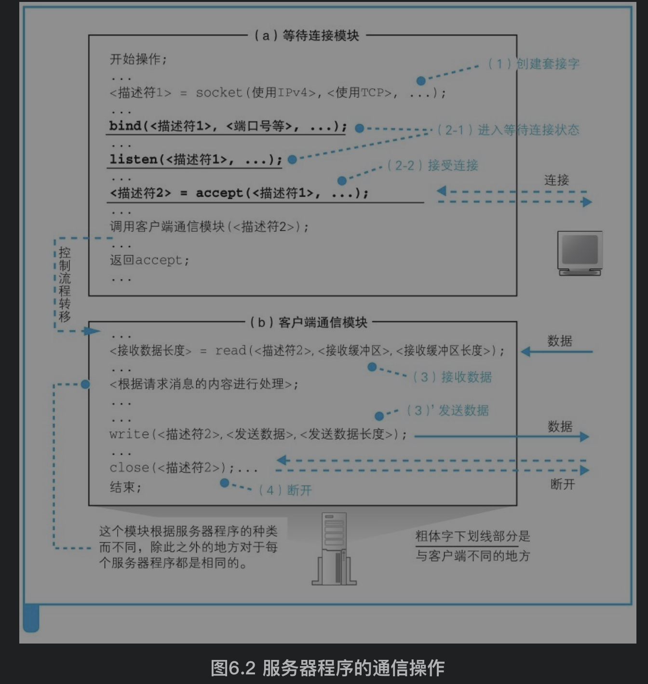

[TOC]

# 1. 服务器端的套接字和端口号
服务器端的套接字有以下阶段：
（1）创建套接字（创建套接字阶段）：socket
（2-1）将套接字设置为等待连接状态（等待连接阶段）：bind将端口号写入套接字中，例如Web服务器使用80号端口；listen向套接字写入等待客户端连接状态这一控制信息
（2-2）接受连接（接受连接阶段）：accept每次都为这个等待套接字创建一个副本并分配给客户端请求的套接字，然后等待套接字继续等待其他连接请求
（3）收发数据（收发阶段）
（4）断开管道并删除套接字（断开阶段）

# 2. 服务器的接收操作
>1. 网卡判断MAC地址，存入缓存：
网卡的MAC模块将网络包从信号还原为数字信息，校验FCS和MAC接收方是否是自己，校验通过并存入缓冲区。

>2. 网卡驱动程序交给协议栈：
网卡通过中断将网络包到达的事件通知给CPU，CPU就会暂停当前的工作，并切换到网卡的任务。然后，网卡驱动会开始运行，从网卡缓冲区中将接收到的包读取出来，根据MAC头部的以太类型字段判断协议的种类，并调用负责处理该协议的软件。这里，以太类型的值应该是表示IP协议，因此会调用TCP/IP协议栈，并将包转交给它

>3. IP模块判断IP地址、是否分片、转交给TCP或UDP模块：
协议栈的IP模块会检查IP头部，（1）根据接收方IP判断是不是发给自己的；（2）判断网络包是否经过分片，如果是分片的包，则将包暂时存放在内存中，等所有分片全部到达之后将分片组装起来还原成原始包；（3）将包转交给TCP模块或UDP模块。如果协议号为06（十六进制），则将包转交给TCP模块；如果是11（十六进制），则转交给UDP模块

>4. 如果是连接请求，则复制套接字，进入3次握手阶段：
当网络包TCP头部中的控制位SYN为1时，表示这是一个发起连接的包。TCP模块根据接收方端口号判断是否有等待连接的套接字，如果有就执行接受连接的操作，否则向客户端返回错误通知的包。
如果存在等待连接的套接字，则为这个套接字复制一个新的副本，并将发送方IP地址、端口号、序号初始值、窗口大小等必要的参数写入这个套接字中，同时分配用于发送缓冲区和接收缓冲区的内存空间。然后生成代表接收确认的ACK号，用于从服务器向客户端发送数据的序号初始值，表示接收缓冲区剩余容量的窗口大小，并用这些信息生成TCP头部，委托IP模块发送给客户端。这个包到达客户端之后，客户端会返回表示接收确认的ACK号，当这个ACK号返回服务器后，连接操作就完成了。(经过3次握手后，连接成功)服务器从accept的等待状态变为运行状态

>5. TCP模块处理数据包：找到套接字、判断是否遗漏、放入接收缓冲区
TCP模块根据双方的IP和端口号找到对应的套接字，根据套接字中保存的上一个序号和数据长度计算下一个序号，并检查与收到的包的TCP头部中的序号是否一致，如果一致说明包没有遗漏并把数据放入接收缓冲区。生成确认应答的TCP头部，并根据接收包的序号和数据长度计算出ACK号，然后委托IP模块发送给客户端

>6. 应用程序调用read读取
通常在写入接收缓冲区前，就有服务器端应用程序调用read等待。

>7. 调用close断开连接
服务器程序会调用Socket库的close, TCP模块会生成一个控制位FIN为1的TCP头部，并委托IP模块发送给客户端。当客户端收到这个包之后，会返回一个ACK号。接下来客户端调用close，生成一个FIN为1的TCP头部发给服务器，服务器再返回ACK号，这时断开操作就完成了。HTTP1.1中，是客户端先发起断开操作，这种情况下只要将客户端和服务器的操作颠倒一下就可以了

