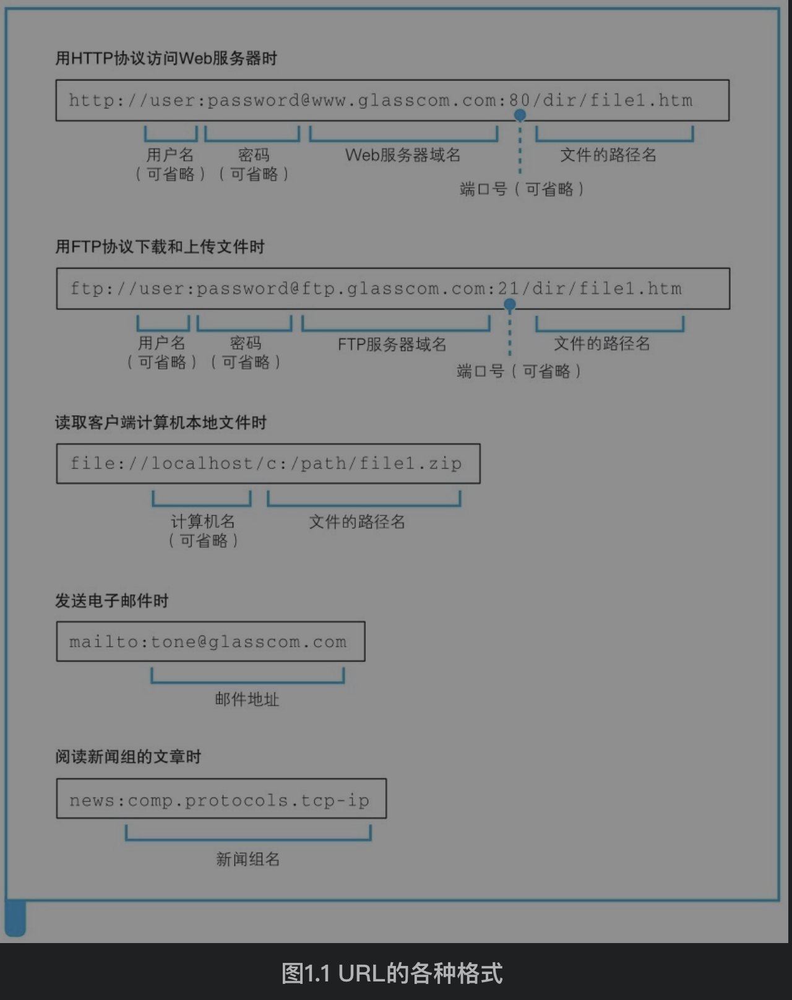
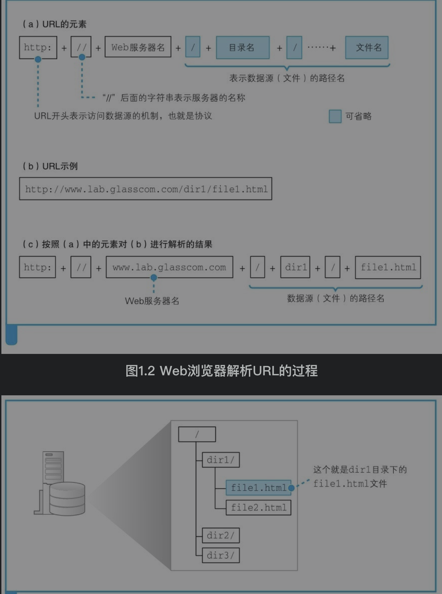
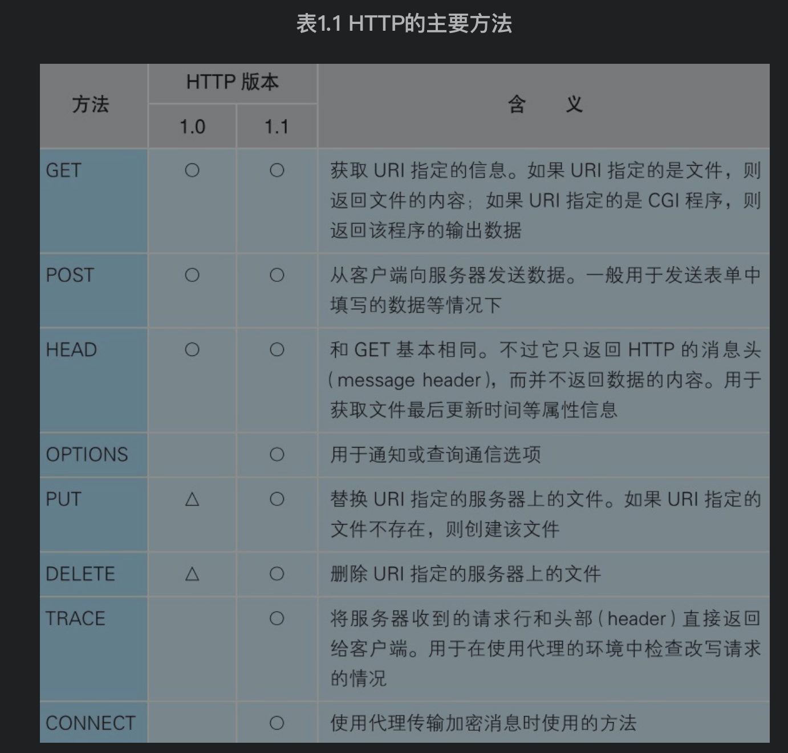
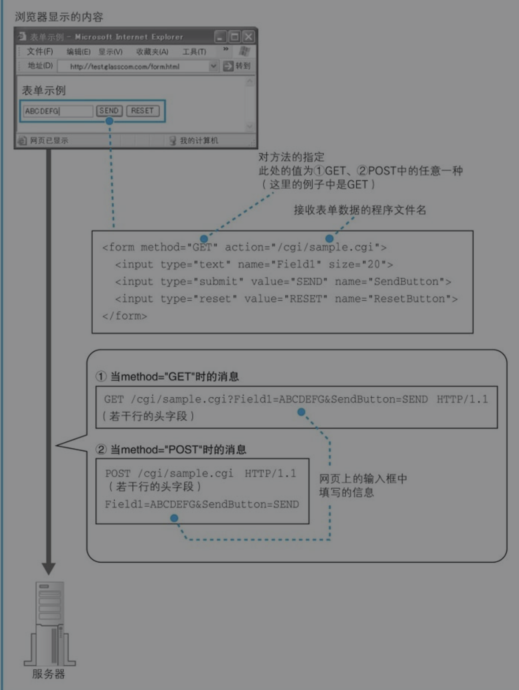
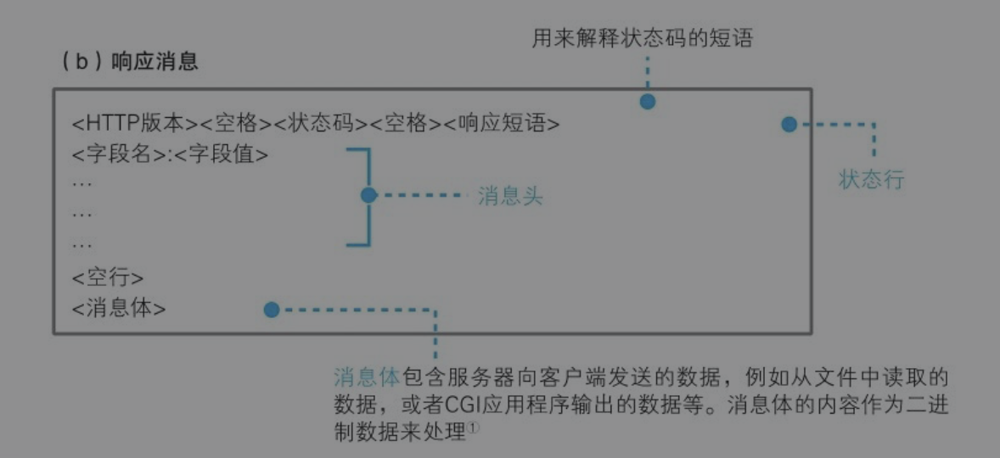
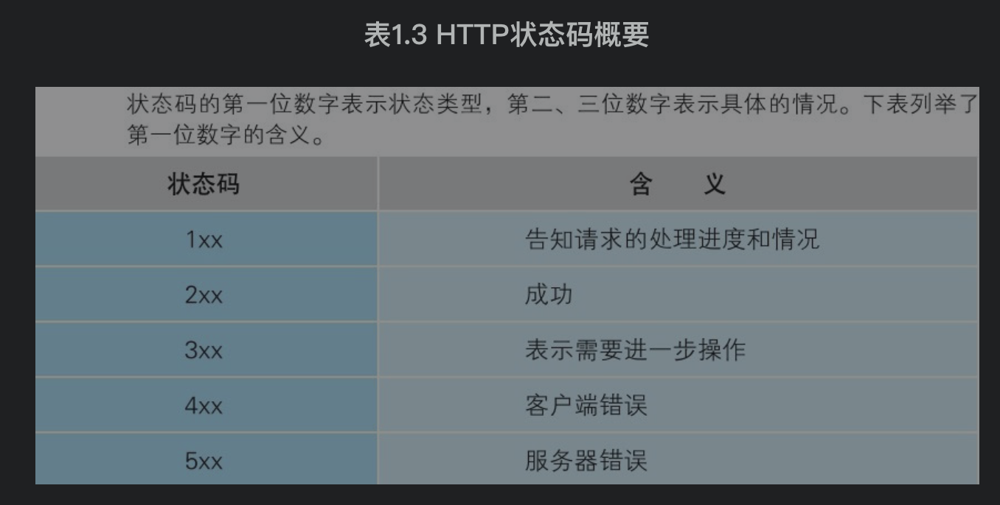
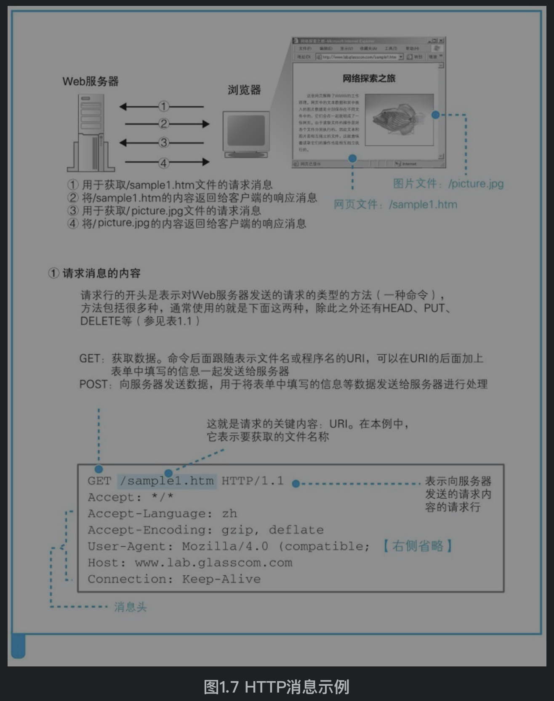
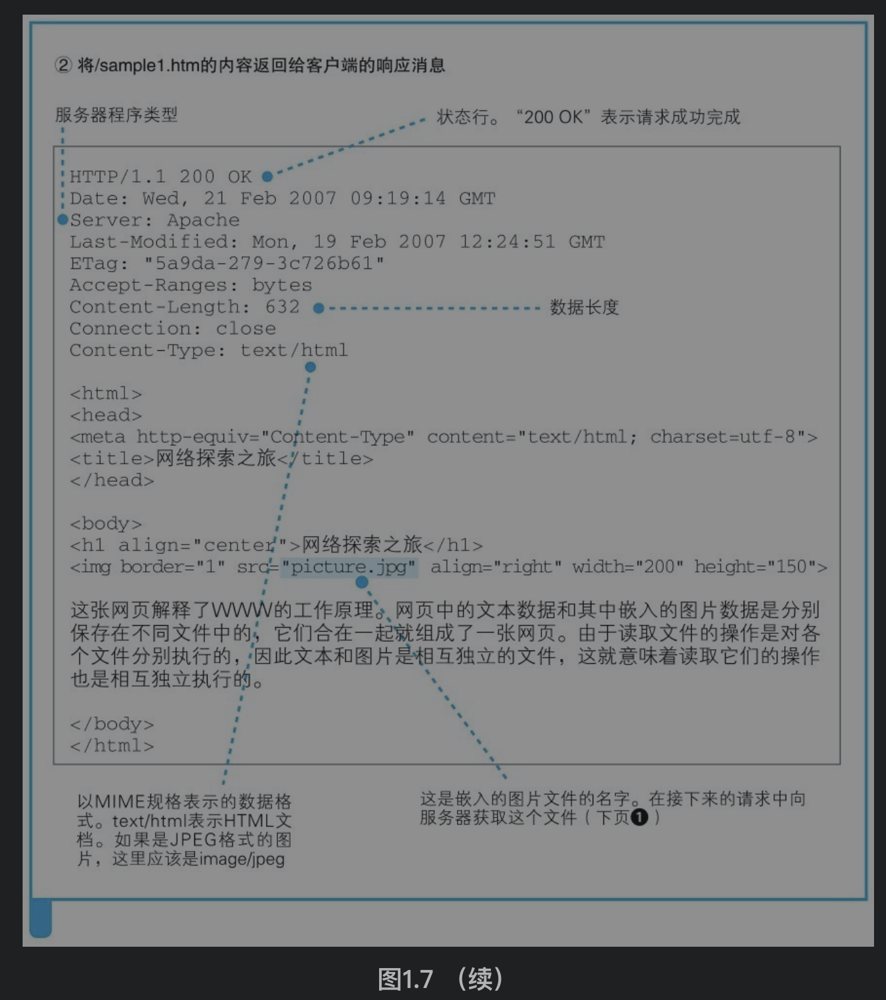
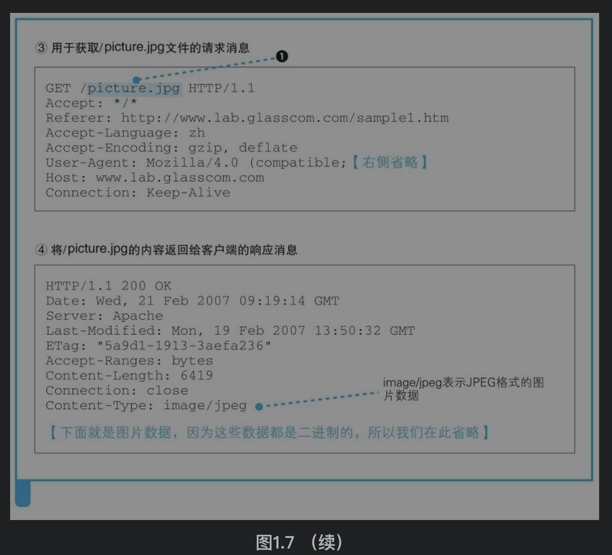

[TOC]

# 1. 生成HTTP请求消息
## 1.1 解析URL
### URL
URL告诉浏览器应该使用什么功能、什么协议做事情。

如果是http:，那浏览器要访问web服务器，使用http协议；如果是ftp:，那浏览器要访问ftp服务器，使用ftp协议。

### 浏览器解析URL的过程
表示要访问www.lab.glasscom.com这个web服务器上路径为dir1.file1.html的文件

## 1.2 HTTP协议
HTTP协议规定了浏览器和服务器之间交互的消息内容(请求消息和响应消息)和步骤。

步骤包括：浏览器发送HTTP请求消息，服务器收到消息后处理并返回响应消息，浏览器收到响应消息后读取其中的数据显示在屏幕上

#### 请求消息：访问对象+访问方法+头字段
访问对象叫URI，URL可以是一个要访问的文件名/dir1/file1.html，也可以是一个URL。一条请求消息只能请求一个URI

访问方法告诉服务器完成怎么样的工作，是读取还是URI表示的数据，还是将客户端输入的数据发送给URI表示的程序等

#### 响应消息：状态码+头字段+网页数据
服务器收到请求消息后，通过消息中的URI判断对什么对象做什么操作，并将结果放在响应消息中返回。

状态码表示执行工作是成功了还是失败了，例如遇到找不到的文件就会显示出404 Not Found的错误信息

HTTP请求举例：

# 2. 向DNS服务器查询web服务器的IP地址
