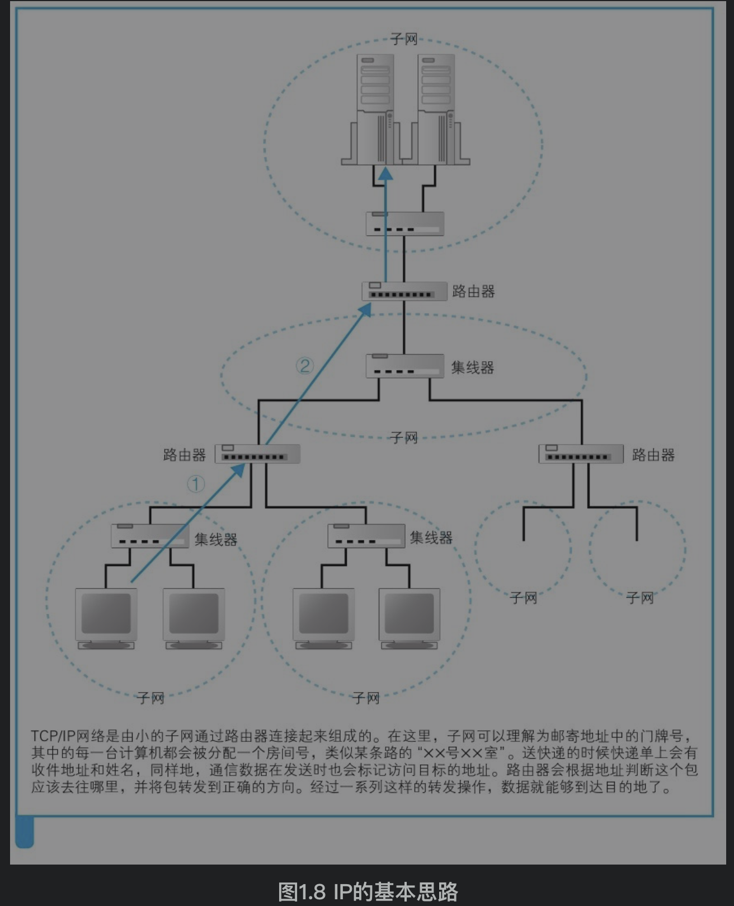
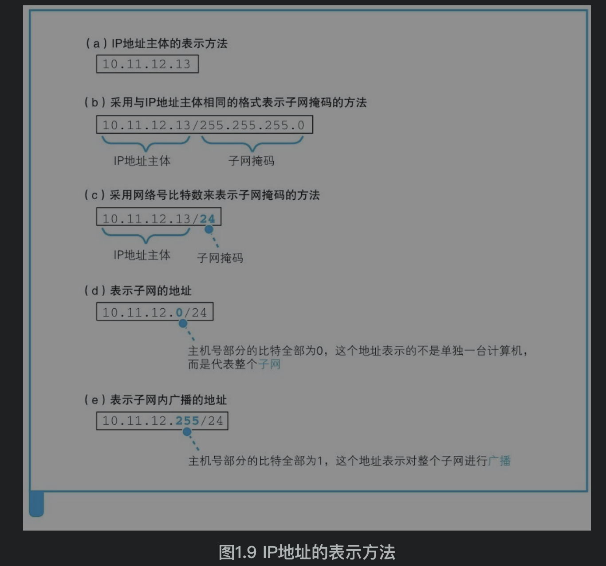
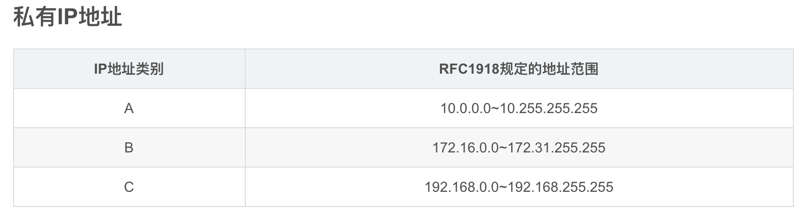
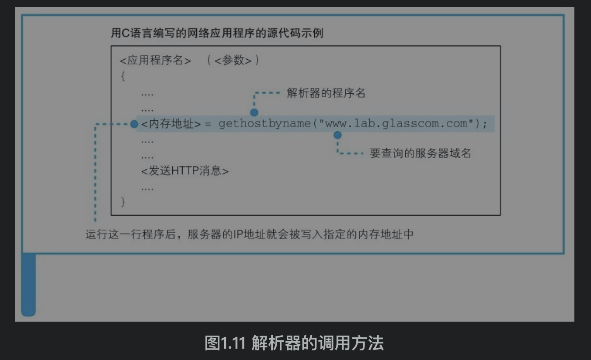
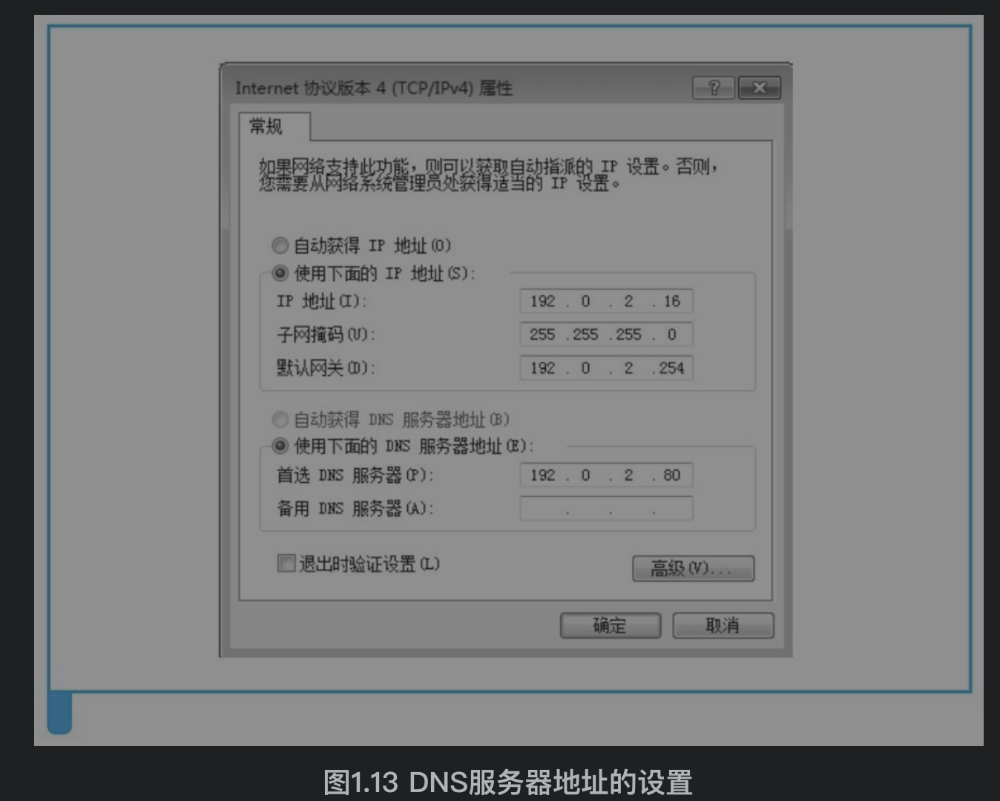
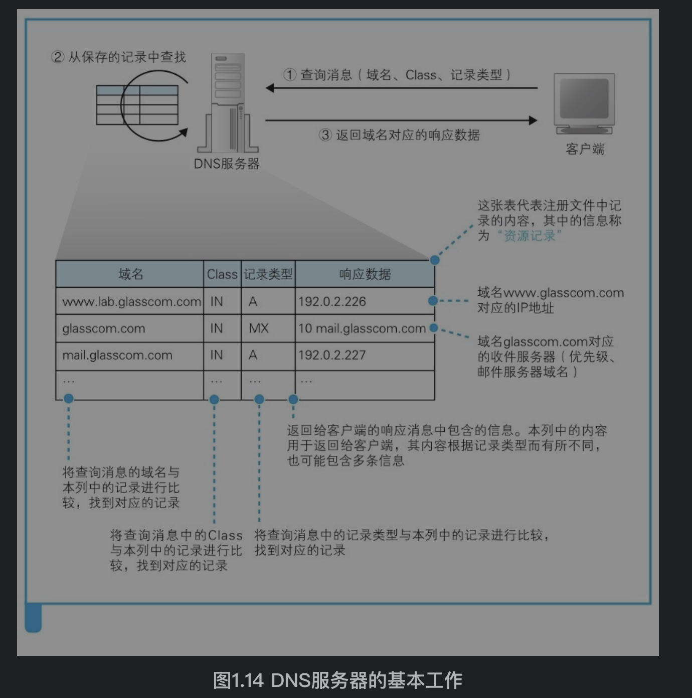
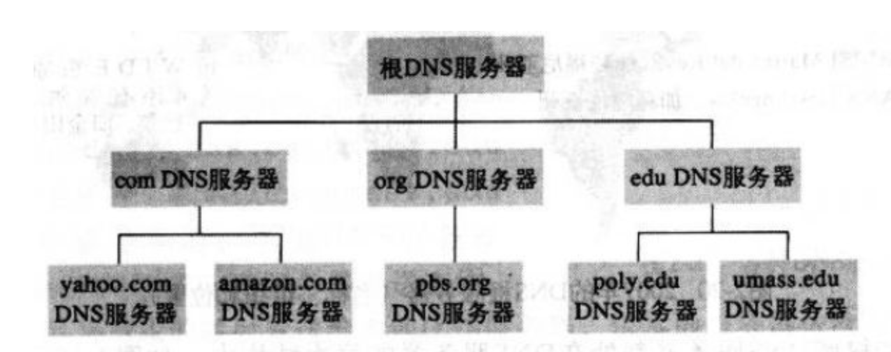
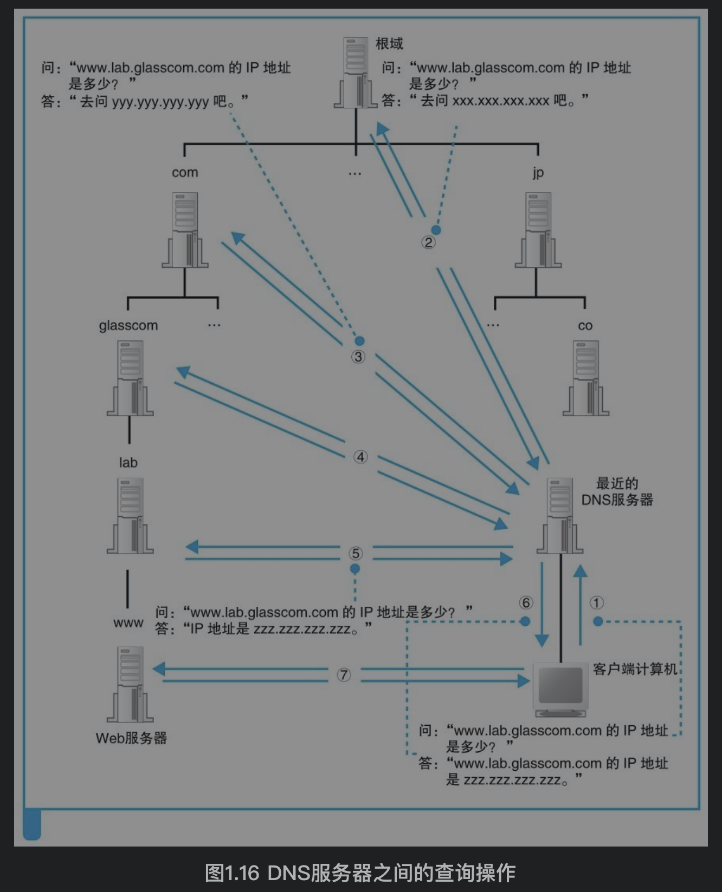
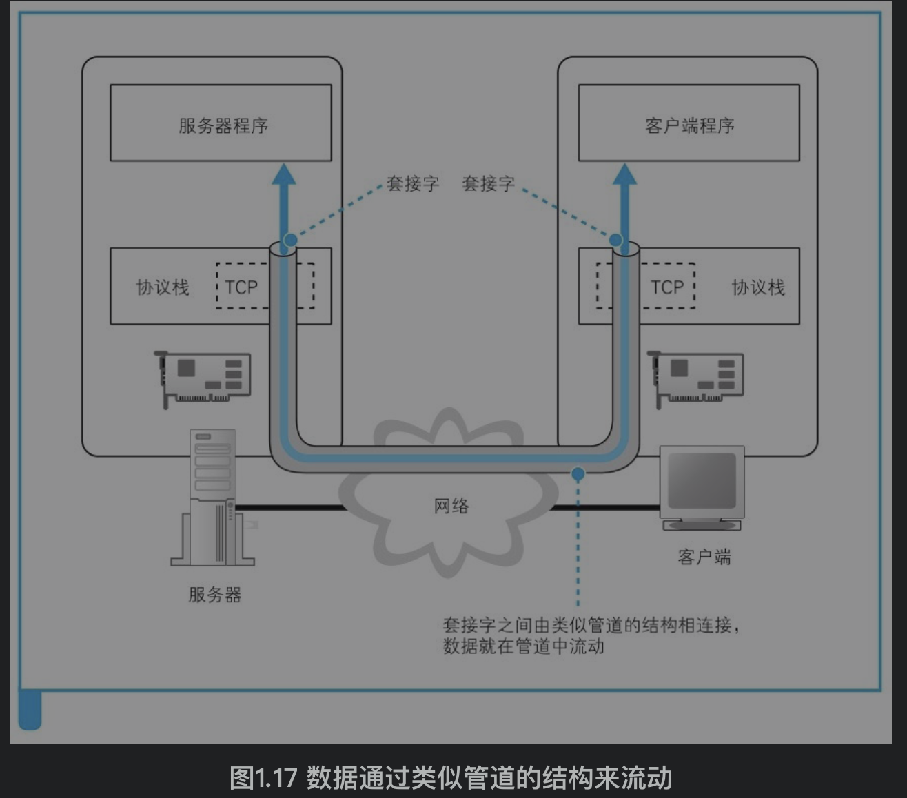
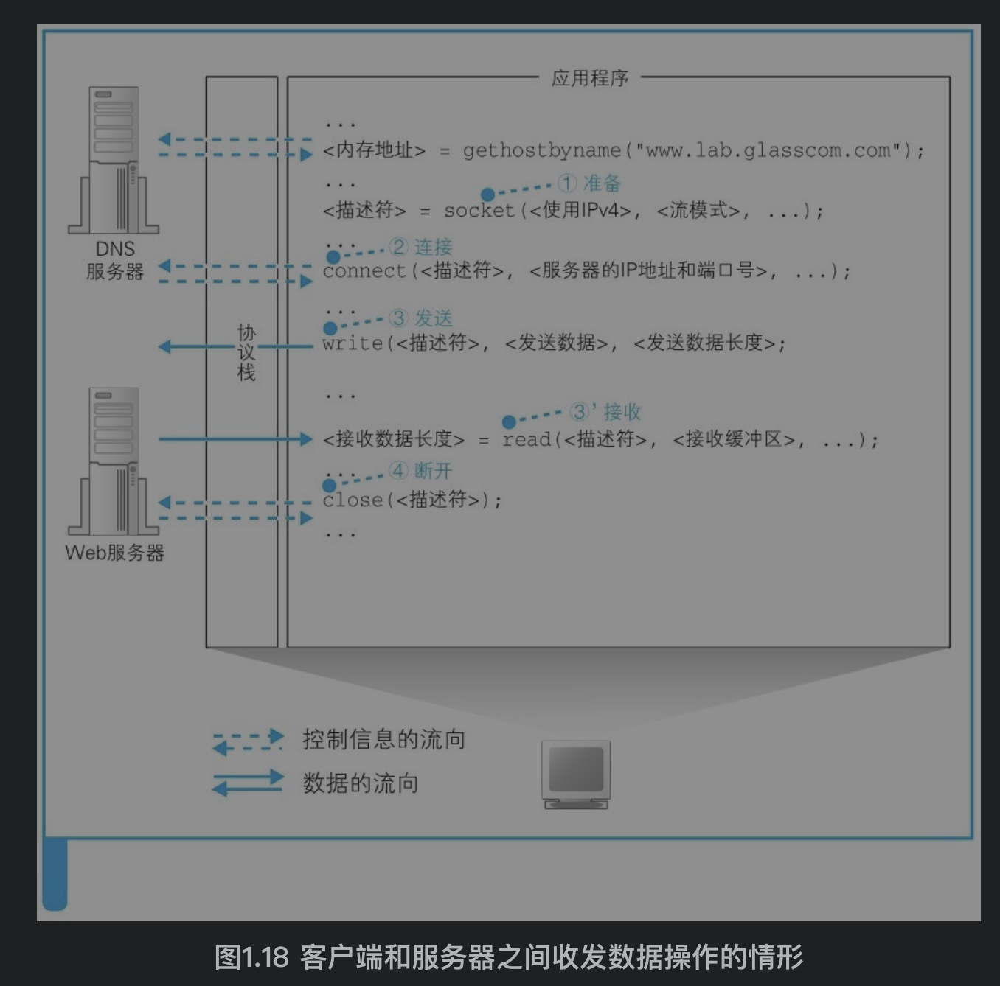

## 参考博文
[IP地址和子网划分学习笔记之《IP地址详解》](https://blog.51cto.com/6930123/2112403)

[TOC]

# 1. 生成HTTP请求消息
## 1.1 解析URL
### URL
URL告诉浏览器应该使用什么功能、什么协议做事情。

如果是http:，那浏览器要访问web服务器，使用http协议；如果是ftp:，那浏览器要访问ftp服务器，使用ftp协议。

### 浏览器解析URL的过程
表示要访问www.lab.glasscom.com这个web服务器上路径为dir1.file1.html的文件

## 1.2 HTTP协议
HTTP协议规定了浏览器和服务器之间交互的消息内容(请求消息和响应消息)和步骤。

步骤包括：浏览器发送HTTP请求消息，服务器收到消息后处理并返回响应消息，浏览器收到响应消息后读取其中的数据显示在屏幕上

#### 请求消息：访问对象+访问方法+头字段
访问对象叫URI，URL可以是一个要访问的文件名/dir1/file1.html，也可以是一个URL。一条请求消息只能请求一个URI

访问方法告诉服务器完成怎么样的工作，是读取还是URI表示的数据，还是将客户端输入的数据发送给URI表示的程序等

#### 响应消息：状态码+头字段+网页数据
服务器收到请求消息后，通过消息中的URI判断对什么对象做什么操作，并将结果放在响应消息中返回。

状态码表示执行工作是成功了还是失败了，例如遇到找不到的文件就会显示出404 Not Found的错误信息

HTTP请求举例：

# 2. 向DNS服务器查询web服务器的IP地址
## 2.1 IP地址
多个小的子网通过路由器连接成一个大的网络，子网中有多台计算机。像门牌号(XX号XX室)一样，IP由网络号+主机号组成，网络号标识子网，主机号标识该子网中的某个主机。
包的传输就是根据IP地址确定目的主机的位置，然后通过连接各子网的路由器从一个子网传送到另一些子网，最终到达目的主机的位置。

### IP地址表示方法
子网掩码为1的部分表示网络号，子网掩码为0的部分表示主机号

## 2.2 OS的Socket库提供查询IP地址的功能
操作系统的Socket库是调用网络功能的程序组件的集合，其中的DNS解析器组件相当于DNS客户端，负责向DNS服务器发起查询IP地址的请求

在开发浏览器等应用程序的时候，只需要调用解析器的程序名以及传递要查询的域名就可以请求解析了。解析器会向DNS服务器查询域名对应的IP，然后把IP放入浏览器指定的内存中。浏览器就从内存中取出IP，再将IP地址和HTTP请求消息一起交给操作系统

解析器会调用操作系统的协议栈(即TCP/IP驱动、协议驱动)向DNS服务器发送查询消息，协议栈会通过网卡将消息发送出去。

DNS服务器地址是在计算机中事先设定好的

## 2.3 DNS服务器
### 工作过程
DNS服务器接收来自客户端的查询消息，然后根据查询消息从保存的记录中寻找响应数据

查询消息中包含3个内容：
1）域名
服务器、邮件服务器(邮件地址中@后面的部分)的名字
2）Class
互联网以外的网络应用，但如今除了互联网没有其他网络，所以永远是IN
3）记录类型
表示域名对应哪种类型的记录。A(address)代表域名对应着IP地址，MX(mail exchange)代表域名对应着邮件服务器

举例如下：
如果要查询www.lab.glasscom.com这个域名对应的IP地址，客户端会向DNS服务器发送包含以下信息的查询消息。（a）域名=www.lab.glasscom.com（b） Class = IN（c）记录类型=A
DNS服务器就从记录中查找和这三个信息都匹配的响应数据192.0.2.226返回

### 域名的层次结构
根域名服务器——顶级域名服务器——权威域名服务器

下层的DNS服务器的IP要注册到他的上层，例如负责管理lab.glasscom.com这个域的DNS服务器的IP地址需要注册到glasscom.com域的DNS服务器中，而glasscom.com域的DNS服务器的IP地址又需要注册到com域的DNS服务器中

根域名服务器为www.lab.glasscom.com.后面的点，但是这个.通常都会被忽略，但是根域名服务器真实存在并保存着com、org、edu等DNS服务器的IP信息，并且所有的DNS服务器都会保存根域名服务器的IP信息。

假设要查询www.lab.glasscom.com这台Web服务器的相关信息，客户端会先访问设置中的DNS服务器A，由于该服务器A没有存放这个域名对应的信息，所以要从顶层开始找。A会将请求转发给根域名服务器，根域名中也没有保存，，但是它通过com判断出这个域名属于com的DNS服务器，就给A返回它管理的所有com的DNS服务器的IP，A又像这些com的DNS服务器询问，他们也没有，com域服务器会返回它下面的glasscom.com域的DNS服务器的IP地址，以此类推。

在实际的机器部署中，上下级域名服务器可能在一台服务器上，DNS服务器还会设置缓存

# 3. 委托协议栈发送HTTP请求消息
[用电信号传输TCP/IP数据——协议栈、网卡](./协议栈、网卡.md)

只要是使用网络进行通信的操作都适用于这一过程：调用socket库来委托协议栈使用TCP协议或UDP协议发送和接受消息。发送HTTP请求、查询IP地址等都如此。

TCP协议的数据通信过程：
两台要通信的机子会在双方建立套接字，用来确定两者之间的通信线路，相当于通过指定两个入口确定一条管道。所有的消息都通过网卡变成电信号发送出去，整个网络是通过路由器一级级传输的。

具体步骤包括：
（1）创建套接字（创建套接字阶段）
（2）将管道连接到服务器端的套接字上（连接阶段）
（3）收发数据（通信阶段）
（4）断开管道并删除套接字（断开阶段）

