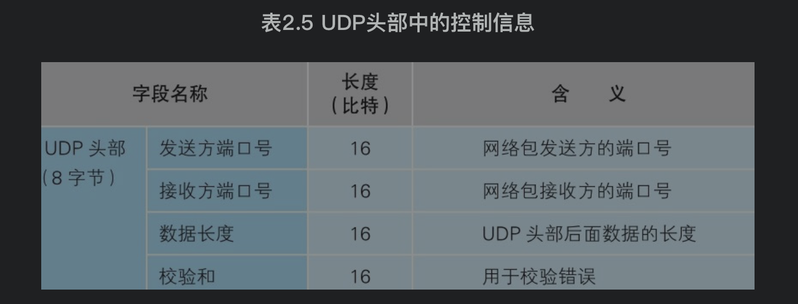

# 1. TCP协议的收发操作
[TCP协议的收发操作](./TCP协议的收发操作.md)

# 2. UDP协议的收发操作
如果要发送的数据很短，只用一个包就可以装下，就不需要TCP的确认重发机制了，不需要考虑哪个包是否送达，因为只有一个包。如果没收到对方的应答，只要重发这一个包就行了。
使用UDP协议不需要连接的建立和断开，创建套接字就行了。使用UDP头部替换TCP头部。UDP只负责单纯的发送数据，而不管发送是否成功。如果出错时没收到对方的回复，应用程序会感知重发的

