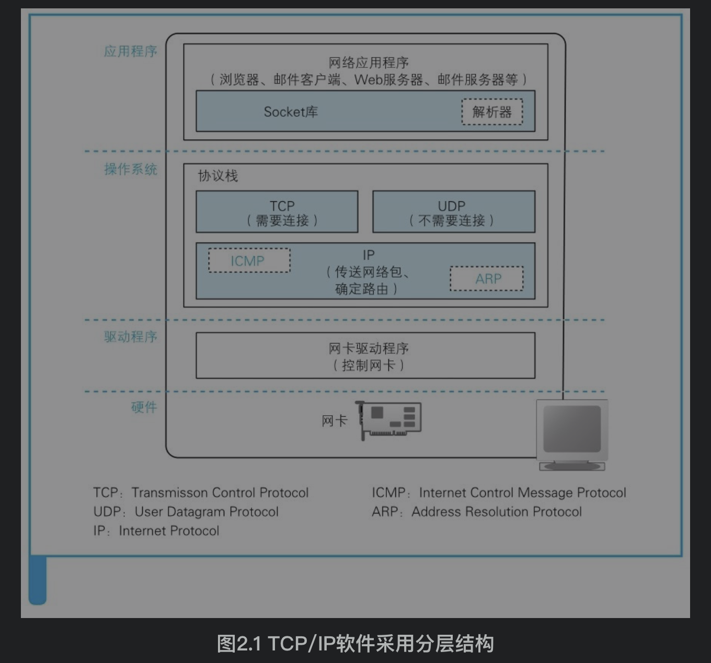
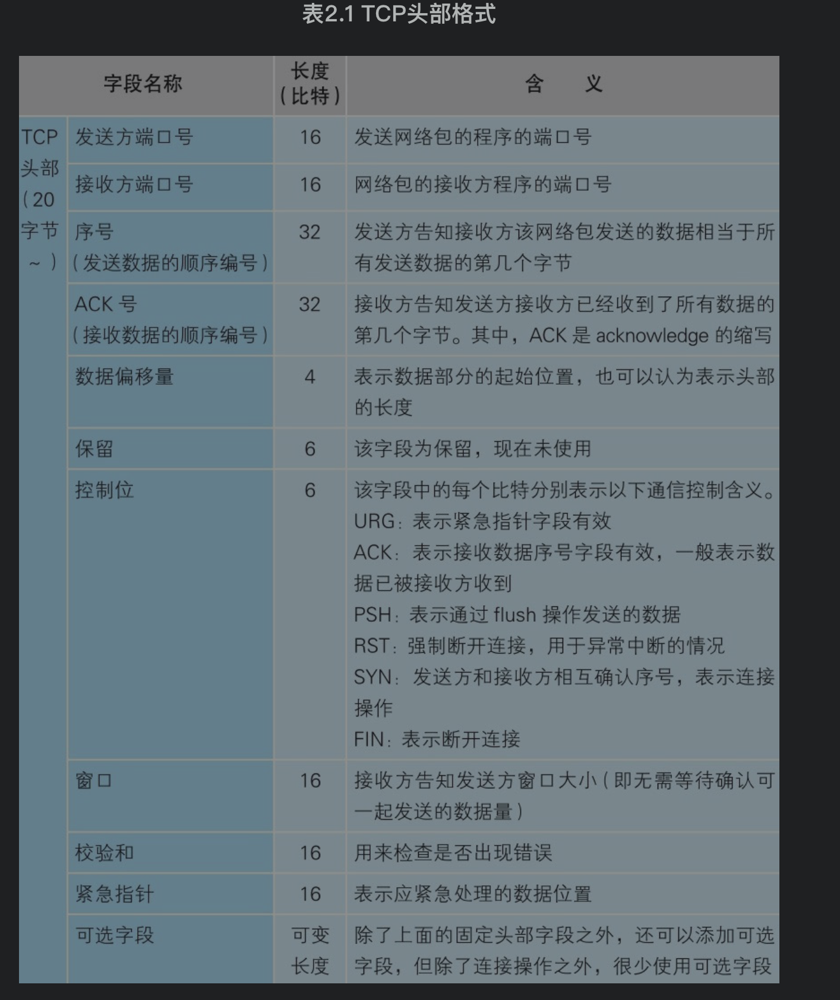
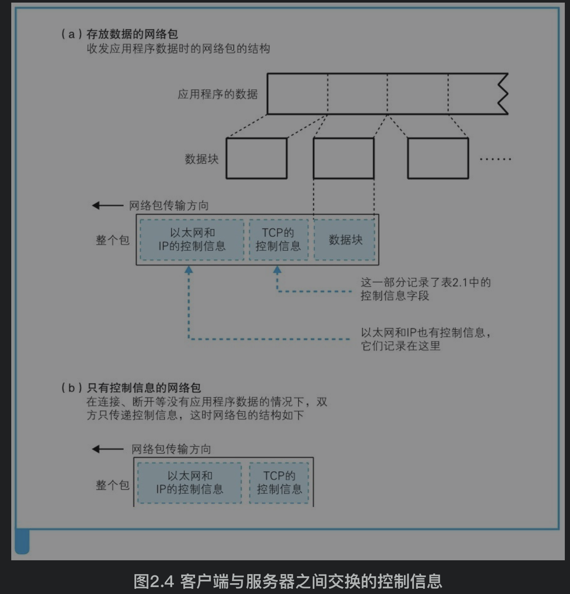
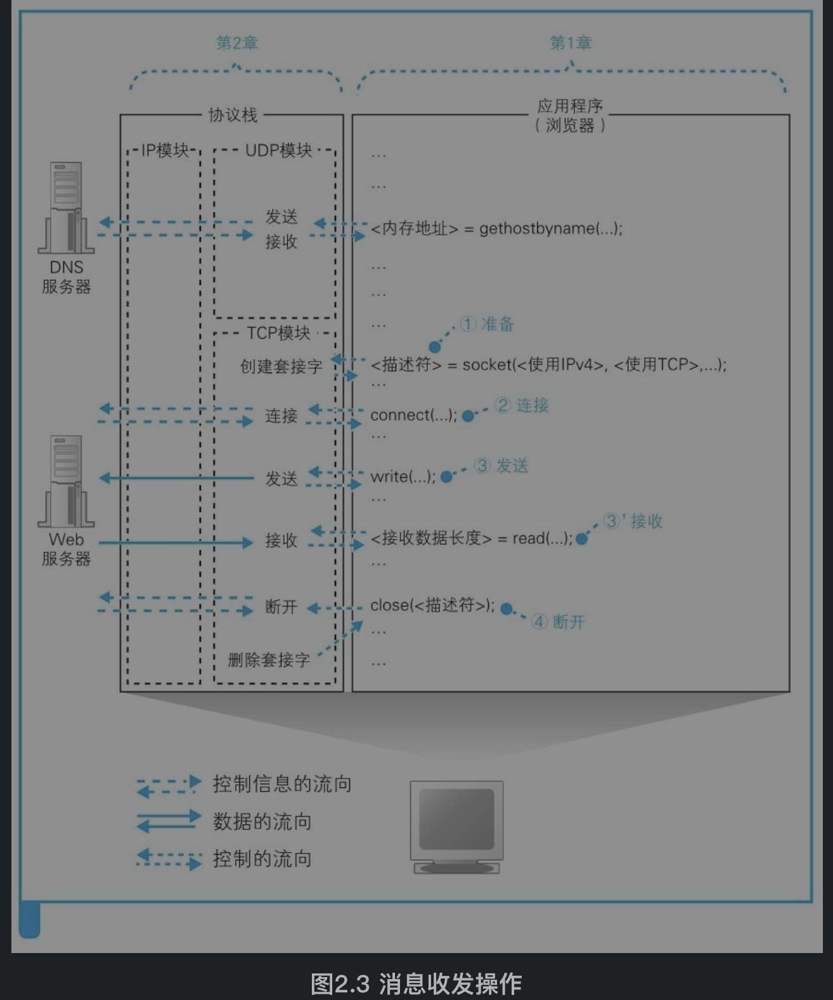
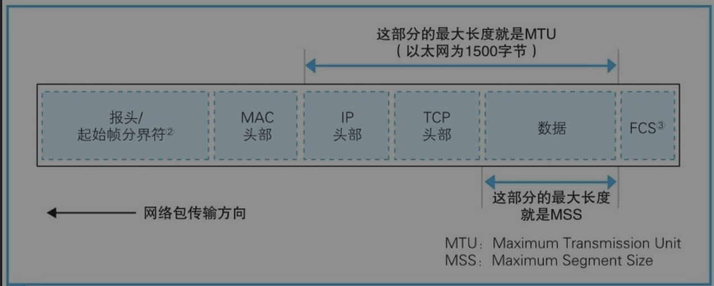

[TOC]

# 1. 创建套接字
## 1.1 协议栈内部结构
第一层网络应用程序将数据的收发工作交给下层执行

第二层是Socket库，作为桥梁请求协议栈

第三层是操作系统的协议栈，它有两块工作。
第一块是使用TCP或UDP协议收发数据的部分，这块将接受委托执行收发数据的操作；浏览器、邮件等一般应用程序收发数据时用TCP;DNS查询等收发较短的控制数据时用UDP。
第二块是用IP协议控制网络数据包收发操作的部分。在网络中数据会被分隔成网络包发送，IP协议负责将网络包发送给通信对象。IP协议中还包括ICMP协议和ARP协议，ICMP用于告知网络包传输过程中的错误和控制信息，ARP则用于根据IP地址查询以太网MAC地址

第四层是网卡驱动程序，负责控制网卡硬件

第五层网卡则负责完成实际的收发操作，也就是对网线中的信号执行发送和接收的操作




## 1.2 通信控制信息
### 头部信息
在连接、数据收发、连接断开下都需要的信息，被放在网络包的头部。有TCP头部(运输层)、IP头部(网络层)以太网头部(MAC头部、数据链路层)、





### 套接字信息
套接字本身就是一个概念，它实体就是通信控制信息。它其实是协议栈内部的一块用来存放控制信息的内存空间，协议栈根据控制信息来执行下一步操作。

套接字中的控制信息例如：通信对象IP地址和端口号、是否已经收到响应、发送数据后经过了多长时间等


## 1.3 使用TCP协议调用socket时的操作
和调用解析器一样，浏览器通过调用Socket库中的socket()方法创建套接字，就是分配一个套接字需要的内存空间，然后写入初始状态，并随机给这个套接字分配一个端口

浏览器会收到一个描述符并放在内存中。描述符用来给协议栈标识用哪个套接字发送和获取数据。




# 2. 连接服务器
```java
connect(<描述符>，<服务器IP地址和端口号>，...)
```
浏览器将通过调用Socket库中的connect()方法与服务器那边的套接字连接起来,需要指定描述符、服务器IP地址和端口号这3个参数。当连接成功后，服务器和客户端的协议栈会将对方的IP地址和端口号等信息保存在套接字中。
1）描述符告诉协议栈使用哪一个socket和对方进行连接。描述符是协议栈用来和浏览器沟通的东西，是不能拿来和对方建立通信的
2）同时指定服务器IP和端口号才能确定一个服务器上的某个套接字，同时确定浏览器和服务器的IP和端口号就能确定两者之间的一个socket连接

connect的执行过程其实就是TCP的三次握手过程：
>1. 客户端发出连接请求
1)客户端调用connect接口将服务器IP地址和端口号传递给协议栈的TCP模块
2)TCP模块创建TCP头部，重点是包含发送方和接收方的端口号，设置TCP头部中==SYN=1(表示连接)，ACK=0==，设置适当的序号和窗口大小
3)TCP模块将TCP头部委托IP模块发送，经过一系列操作后网络包到达服务器。

>2. 服务器发送连接确认信息
1)服务器的IP模块将数据传递给TCP模块，TCP模块根据TCP头部信息从处于等待的套接字中找到端口号对应的套接字。套接字中会写入相应的信息，并将状态改为正在连接。
2)服务器的TCP模块返回响应，该过程和客户端发送连接请求一样，设置TCP头部中==SYN=1，ACK=1==(ACK=0表示确认网络包已经送达)

>3. 客户端回复确认信息
1)网络包到达客户端的TCP模块后，根据TCP头部中的SYN是否为1判断连接是否成功，如果为1表示成功则向套接字中写入服务器的IP地址、端口号等信息，同时还会将状态改为连接完毕。
2)客户端发送ACK=1的响应信息
3)服务器收到后才表示连接已经建立


# 3. 收发数据
## 3.1 将HTTP请求消息交给协议栈
```java
write(<描述符>,<发送数据>,<发送数据长度>)
```
客户端调用write方法将要发送的数据交给协议栈，协议栈将要发送的数据看做一定长度的二进制字节序列。

协议栈收到数据后，会将数据放入发送缓冲区中，根据网络包数据长度和时间两个指标在积累一定的数据量后将数据发送出去。
1）每个包能容纳的最大数据长度MSS：当从协议栈收到的数据长度超过或者接近MSS时再发送出去，就可以避免发送大量小包的问题了
2）当发送数据频率不高时，如果等到达到MSS再发送会有很高的延迟。所以协议栈内部有一个计时器，当经过一定时间之后，就会把网络包发送出去


### 对较大的数据进行拆分
当要发送的数据超过一个MSS时(例如发送一篇博客)，那么应用程序数据会被以MSS为长度单位拆分成多个网络包发送


### 使用ACK号确认网络包已收到


### 根据网络包平均往返时间调整ACK号等待时间

### 使用窗口有效管理ACK号

### ACK与窗口的合并


## 3.2 接收HTTP响应消息


# 4. 从服务器断开连接并删除套接字


# 5. IP与以太网的包收发操作


# 6. UDP协议的收发操作