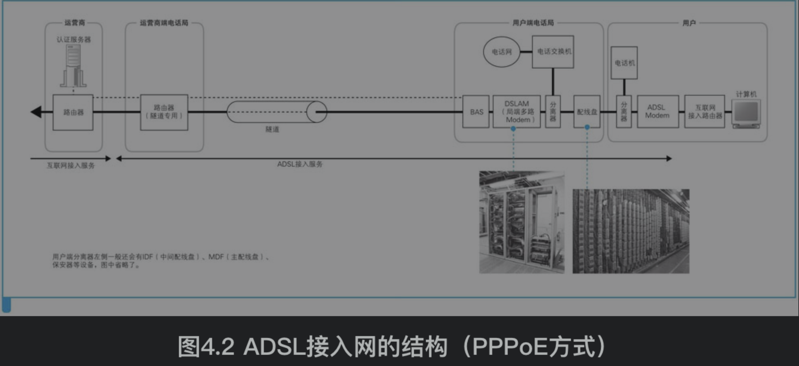
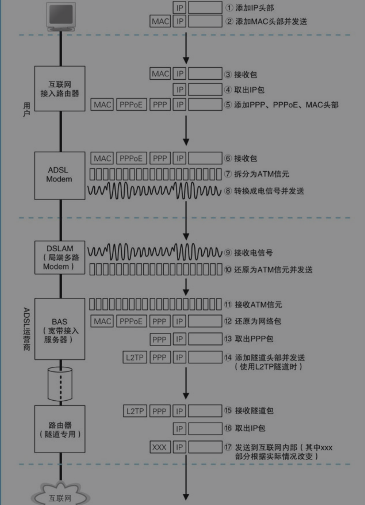

[TOC]

# 1. ADSL接入网的结构和工作方式
用户端路由器发出的网络包通过ADSL Modem(调制解调器)和电话线到达电话局，然后到达ADSL的网络运营商（即ISP，互联网服务提供商）。

ADSL技术中，上行方向（用户到互联网）和下行方向（互联网到用户）的传输速率是不同的，上行慢下行快

信元是一个非常小的数据块，原理上跟TCP/IP将应用程序的数据拆分成块装进一个个包的过程是一样的

# 2. 光纤接入网（FTTH）

# 3. 接入网中使用的PPP和隧道
