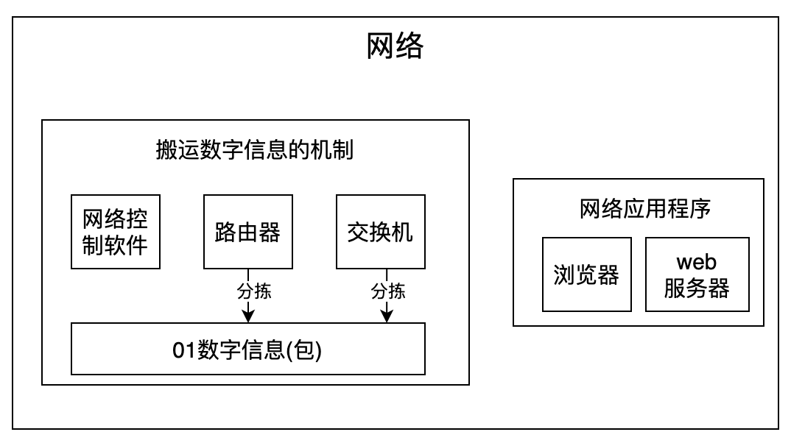
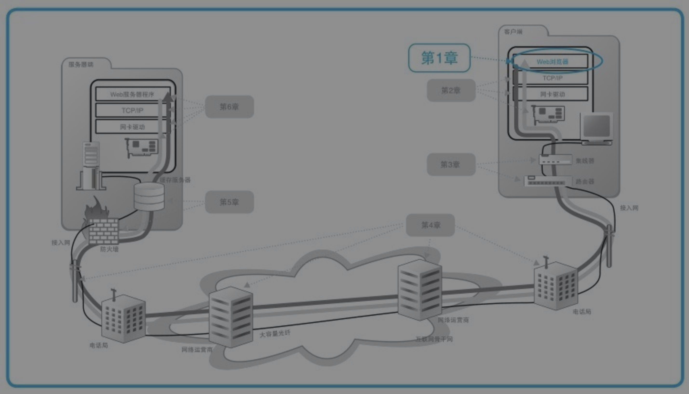
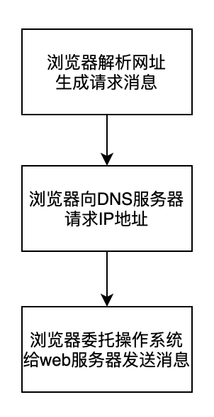
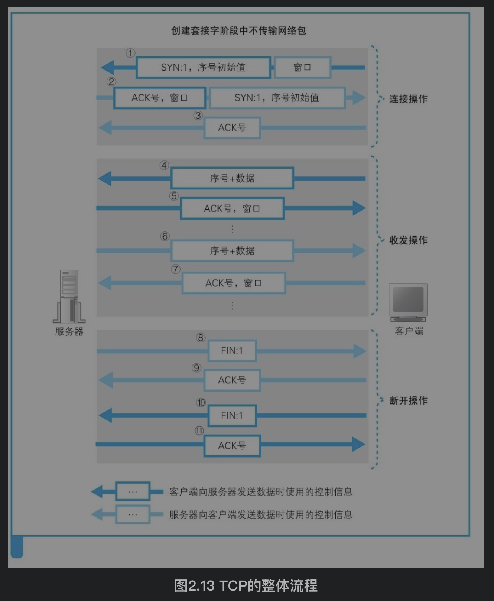
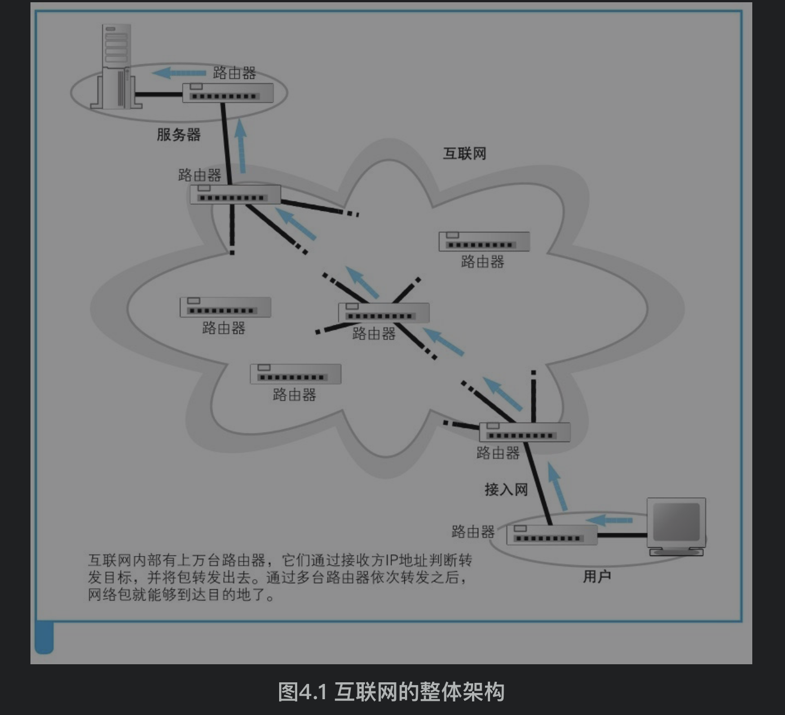

[TOC]

# 网络概图
网络=数字信息搬运机制+网络应用程序

数字信息搬运机制负责在浏览器和web服务器之间传输请求和响应，请求和响应由0、1数字组成数字信息放入“包”容器中，包的头部存储控制信息，浏览器委托网络控制软件发送请求，路由器和交换机充当邮局的角色负责分拣包，并一步步传送到目的地

# 第一章 web浏览器
[web浏览器](./web浏览器.md)

输入网址请求，浏览器生成HTTP消息和向DNS请求web服务器的IP地址，然后委托委托网络控制软件(协议栈、TCP/IP驱动、协议驱动)向目标IP发送请求

# 第二章 用电信号传输TCP/IP数据——协议栈、网卡
[协议栈、网卡](./协议栈、网卡.md)

协议栈就是网络控制软件(OS内部的TCP/IP驱动),协议栈将收到的消息打包并加上目的地址等控制信息，再交给网卡。网卡是负责以太网或无线通信网络的硬件，网卡会将包转化成电信号通过网线发送出去。

# 第三章 集线器、交换机、路由器
[集线器、交换机、路由器](./集线器、交换机、路由器.md) 三个东西本质上都是为了连接网络中的机器，但就是工作的原理和效率不一样。

计算机可以通过家庭或公司的局域网连入互联网，也可以直接连入互联网。

这里针对局域网的形式，计算机先通过以太网线连接到局域网中，然后通过ADSL或光纤到户等宽带线路接入互联网(网络运营商)。

# 第四章 接入网、网络运营商
[接入网、网络运营商](./接入网、网络运营商.md)
包通过接入网(电话线、ISDN、ADSL、有线电视、光线、专线等多种用来接入网络运营商的通信线路)发送到接入点(网络运营商的路由器)

互联网内部结构和家庭、公司的网络差不多，也是用路由器连接并转发的

接入网就是将公司、家庭网络连入互联网(网络运营商)的通信线路，包括ADSL、FTTH(光纤到户)、CATV、电话线、ISDN

# 第五章 防火墙、缓存服务器

# 第六章 web服务器
[web服务器](./web服务器.md)

