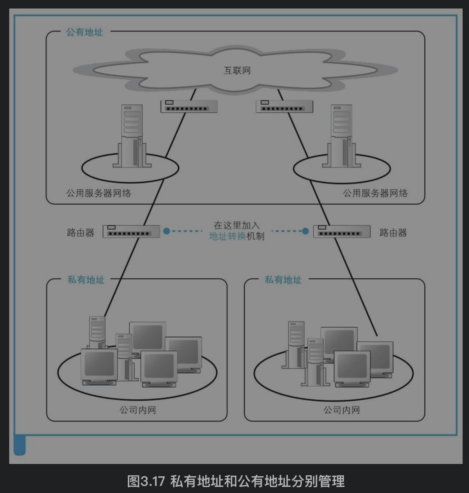
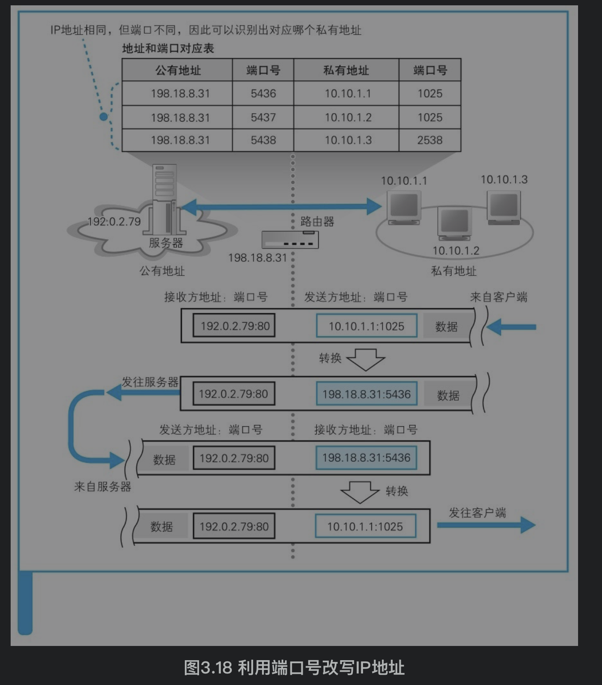

## 参考博文
[集线器、交换机和路由器的区别](https://blog.csdn.net/zjkC050818/article/details/78964508)
[交换机、路由器、集线器的工作原理及区别](https://www.jianshu.com/p/6ae0142d5f3a)

[TOC]

# 1. 集线器
工作在==物理层==，他只是将机器连接起来成为一个局域网，数据对他来说只是电流。例如一个集线器有8个端口，连了8台电脑。当A要向B发送消息时，A会对消息进行广播，将消息发送给所有机器。其余机器收到消息后会判断是不是发给自己的，如果不是就丢弃。
并且这8台机器是共享带宽的，如果集线器带宽是10Mb，那么每台机子的带宽只有10/8MBb

集线器有信号放大的作用，如果两台很远的计算机直接相连，那么电信号经过长距离传输会减弱并产生通信错误。通过集线器可以还原出电信号，A将信号发送给集线器，集线器还原出电信号再发送给B。

# 2. 交换机
又叫交换式集线器，工作在==数据链路层==，只识别MAC地址。当交换机收到数据包，他会根据源MAC地址和目的MAC地址去MAC地址表中找该地址对应的网卡在哪个端口上，然后将消息传递给该端口。如果没有找到就像集线器一样广播

交换机没有转发功能，如果要使用它的话，要发送的机器必须直接连着交换机的端口。交换机连接的机器是独享带宽的，如果交换机带宽是10Mb，那么每台机器也是10Mb

# 3. 路由器
工作在==网络层==、连接不同类型的网络、能够选择数据传的路径，只识别IP地址

通过集线器和交换机只能把机器连接成一个很大的局域网，当机器多了需要将他们分成多个局域网，即虚拟局域网(VLAN),这些多个局域网就要由路由器连接，跨局域网的通信通过路由器转发

现在家庭用的路由器已经集成了集线器和交换机的功能

路由器具有MAC地址和IP地址，家用的是端口共用(针对路由器本身有一个)，商用的是每个端口有自己的

## 3.1 路由器结构
路由器包括转发模块和端口模块，两者相当于IP模块和网卡之间的关系
1）转发模块包含路由表，用来判断把包往哪个地方转发
2）端口模块相当于网卡，负责包的收发操作。

通过更换网卡，计算机不仅可以支持以太网，也可以支持无线局域网，路由器也是一样。如果路由器的端口模块安装了支持无线局域网的硬件，就可以支持无线局域网了。此外，计算机的网卡除了以太网和无线局域网之外很少见到支持其他通信技术的品种，而路由器的端口模块则支持除局域网之外的多种通信技术，如ADSL、FTTH，以及各种宽带专线等，只要端口模块安装了支持这些技术的硬件即可

路由器收到包后，转发模块会根据目的IP去路由表里找下一个转发地的IP，然后查出它的MAC地址。再委托端口模块把包转发出去，端口模块再按照硬件的规则将包发送出去

# 4. 地址转换
在公司内部不重复就行，公司之间可以重复

当内部服务器向互联网发送包时，路由器会将发送方的IP和端口号改成公共服务器的IP和端口号。并将这个映射关系记录到一张表中，当互联网发回响应时，根据这张表将接收方的IP和端口改回去
