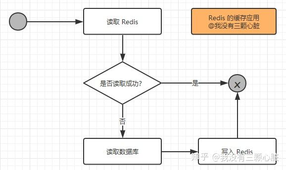
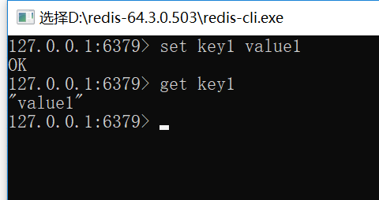
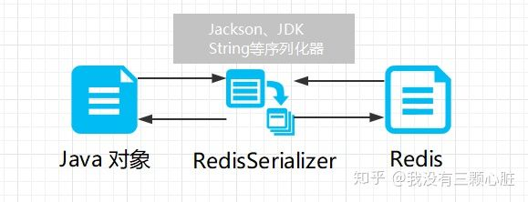

# Redis

# 1. 概念

- NoSQL
- 基于内存的数据库
- 支持集群、分布式、主从同步、一定的事务能力

# 2. 应用场景

- 作为缓存
- 高速读/写的场景

三个角度：

- 业务数据常用吗，命中率高吗。命中率低就不要写入缓存
- 业务数据读多还是写多？如果需要频繁的写，就不要写入缓存
- 业务数据大小如何？如果太大会给缓存带来很大的压力，就不要写入缓存


# 3. 读/写逻辑

## 3.1 读逻辑

- 第一次读数据：读redis会失败，就触发去数据库库，并且写入redis
- 再次读数据：直接从redis中读




## 3.2 写逻辑


## 3.3 高速读/写

天猫双11、抢红包、抢演唱会门票等都是在某一个瞬间会有成千上万的请求到达服务器

- 当一个请求到达服务器，先在redis进行读写，不操作数据库

- 当一个请求操作完redis后，会判断高速读写是否结束（在秒杀商品为0、红包金额为0的时候判断）。如果结束了，就将redis缓存的数据批量一次性写入数据库。


# 4. Redis的安装

## 4.1 启动

打开redis-server.exe

## 4.2 使用

打开redis-cli.exe




# 5. 在JAVA中使用

- maven

```java
<dependency>
    <groupId>redis.clients</groupId>
    <artifactId>jedis</artifactId>
    <version>3.0.0</version>
</dependency>
```

- Redis连接池

```java
JedisPoolConfig poolConfig = new JedisPoolConfig();
// 最大空闲数
poolConfig.setMaxIdle(50);
// 最大连接数
poolConfig.setMaxTotal(100);
// 最大等待毫秒数
poolConfig.setMaxWaitMillis(20000);

// 使用配置创建连接池
JedisPool pool = new JedisPool(poolConfig, "localhost");

// 从连接池中获取单个连接
Jedis jedis = pool.getResource();

// 如果需要密码
//jedis.auth("password");
```


# 6. 在Spring中使用Redis

- maven 

```java
<dependency>
	<groupId>org.springframework.data</groupId>
	<artifactId>spring-data-redis</artifactId>
	<version>2.1.7.RELEASE</version>
</dependency>
<dependency>
	<groupId>redis.clients</groupId>
	<artifactId>jedis</artifactId>
	<version>2.7.2</version>
</dependency>
```


- 配置JedisPoolConfig



```java
<?xml version="1.0" encoding="UTF-8"?>
<beans xmlns="http://www.springframework.org/schema/beans"
       xmlns:xsi="http://www.w3.org/2001/XMLSchema-instance"
       xsi:schemaLocation="http://www.springframework.org/schema/beans http://www.springframework.org/schema/beans/spring-beans.xsd">

    <!--配置JedisPoolConfig对象-->
    <bean id="poolConfig" class="redis.clients.jedis.JedisPoolConfig">
        <!--最大空闲数-->
        <property name="maxIdle" value="50"/>
        <!--最大连接数-->
        <property name="maxTotal" value="100"/>
        <!--最大等待时间-->
        <property name="maxWaitMillis" value="20000"/>
    </bean>

    <!--配置JedisConnectionFactory
    其余还有：JredisConnectionFactory
              JedisConnectionFactory
              LettuceConnectionFactory
              SrpConnectionFactory
    -->
    <bean id="connectionFactory" class="org.springframework.data.redis.connection.jedis.JedisConnectionFactory">
        <!--Redis服务地址-->
        <property name="hostName" value="localhost"/>
        <!--端口号-->
        <property name="port" value="6379"/>
        <!--如果有密码则需要配置密码-->
        <!--<property name="password" value="password"/>-->
        <!--连接池配置-->
        <property name="poolConfig" ref="poolConfig"/>
    </bean>

    <!--配置RedisTemplate
        普通的连接不可以将对象直接存入 Redis 内存中，我们需要将对象序列化（可以简单的理解为继承Serializable接口）.
        把对象序列化之后存入Redis缓存中，然后在取出的时候又通过转换器，将序列化之后的对象反序列化回对象.
        只要我们的POJO类实现了Serializable接口，就不用单独配置
    -->
    <bean id="redisTemplate" class="org.springframework.data.redis.core.RedisTemplate">
        <property name="connectionFactory" ref="connectionFactory"/>
    </bean>
</beans>
```


- 测试

```java
package com.example.redis_test;

import com.example.redis_test.entity.Student;
import org.junit.Test;
import org.junit.runner.RunWith;
import org.springframework.boot.test.context.SpringBootTest;
import org.springframework.context.ApplicationContext;
import org.springframework.context.support.ClassPathXmlApplicationContext;
import org.springframework.data.redis.core.RedisTemplate;
import org.springframework.test.context.junit4.SpringRunner;

@RunWith(SpringRunner.class)
@SpringBootTest
public class RedisTestApplicationTests {

    @Test
    public void contextLoads() {
        ApplicationContext applicationContext = new ClassPathXmlApplicationContext("beans.xml");
        RedisTemplate redisTemplate = applicationContext.getBean(RedisTemplate.class);
        Student student = new Student();
        student.setName("pp");
        student.setAge(23);
        redisTemplate.opsForValue().set("student_pp", student);
        Student std = (Student) redisTemplate.opsForValue().get("student_pp");
        std.service();
    }
}
```

# 7. 在SpringBoot中使用Redis

- maven

```java
<dependency>
    <groupId>org.springframework.boot</groupId>
    <artifactId>spring-boot-starter-data-redis</artifactId>
</dependency>
```
# 

- application.properties

```java
# Redis数据库索引（默认为0）
spring.redis.database=0

# Redis服务器地址
spring.redis.host=localhost

# Redis服务器连接端口
spring.redis.port=6379

# Redis服务器连接密码（默认为空）
spring.redis.password=

# 连接池最大连接数（使用负值表示没有限制）
spring.redis.jedis.pool.max-active=8

# 连接池最大阻塞等待时间（使用负值表示没有限制）
spring.redis.jedis.pool.max-wait=-1

# 连接池中的最大空闲连接
spring.redis.jedis.pool.max-idle=8

# 连接池中的最小空闲连接
spring.redis.jedis.pool.min-idle=0

# 连接超时时间（毫秒）
spring.redis.timeout=0

```

- 测试

```java
package com.example.redis_test;

import com.example.redis_test.entity.Student;
import org.junit.Assert;
import org.junit.Test;
import org.junit.runner.RunWith;
import org.springframework.beans.factory.annotation.Autowired;
import org.springframework.boot.test.context.SpringBootTest;
import org.springframework.context.ApplicationContext;
import org.springframework.context.support.ClassPathXmlApplicationContext;
import org.springframework.data.redis.core.RedisTemplate;
import org.springframework.data.redis.core.StringRedisTemplate;
import org.springframework.test.context.junit4.SpringRunner;

@RunWith(SpringRunner.class)
@SpringBootTest
public class RedisTestApplicationTests {

    @Test
    public void contextLoads() {
        ApplicationContext applicationContext = new ClassPathXmlApplicationContext("beans.xml");
        RedisTemplate redisTemplate = applicationContext.getBean(RedisTemplate.class);
        Student student = new Student();
        student.setName("pp");
        student.setAge(23);
        redisTemplate.opsForValue().set("student_pp", student);
        Student std = (Student) redisTemplate.opsForValue().get("student_pp");
        std.service();
    }

    @Autowired
    private StringRedisTemplate stringRedisTemplate;

    @Autowired
    private RedisTemplate redisTemplate;

    @Test
    public void testString() {
        stringRedisTemplate.opsForValue().set("pp", "ppp");
        Assert.assertEquals("ppp", stringRedisTemplate.opsForValue().get("pp"));
    }

    @Test
    public void testPojo() {
        Student student = new Student();
        student.setName("pp2");
        student.setAge(18);
        redisTemplate.opsForValue().set("student", student);
        Student std = (Student) redisTemplate.opsForValue().get("student");
        System.out.println(std.getName());

    }
}
```


# 8. 数据类型

redis支持string，hash，list，set，sorted set，bitmap 和 hyperloglog

## 8.1 String

- 二进制安全：可以包含任意类型的数据（JPEG图像、Ruby对象）
- max: 512Bytes

## 8.2 List

- 按插入顺序排序的字符串列表
- LPUSH：插入到列表头部
- RPUSH：插入到列表尾部


