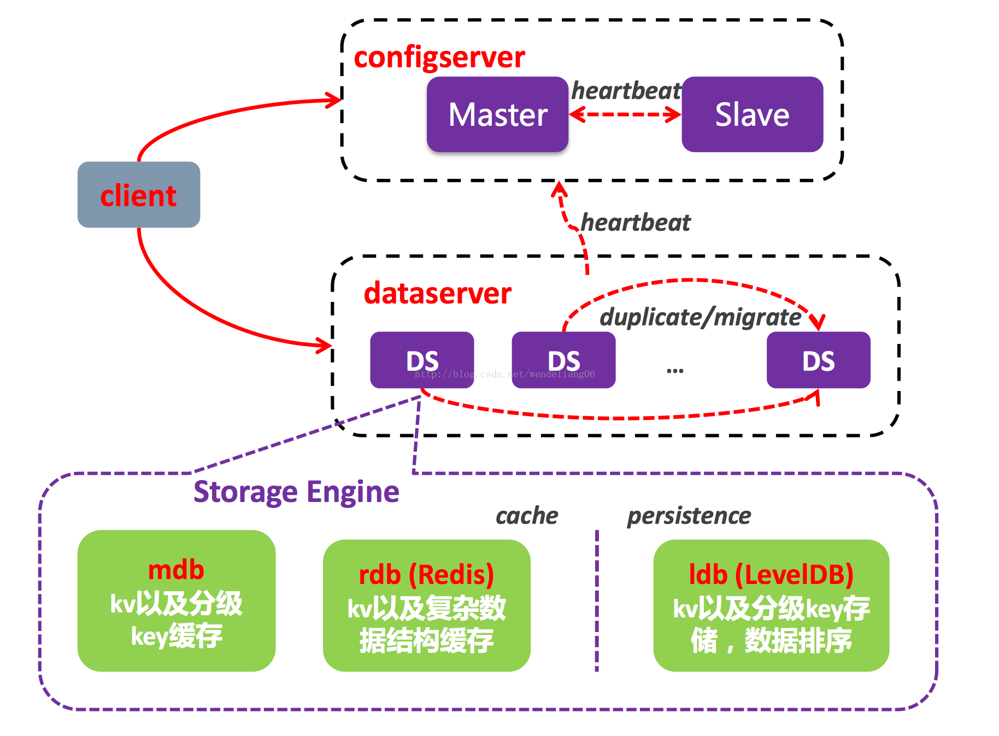
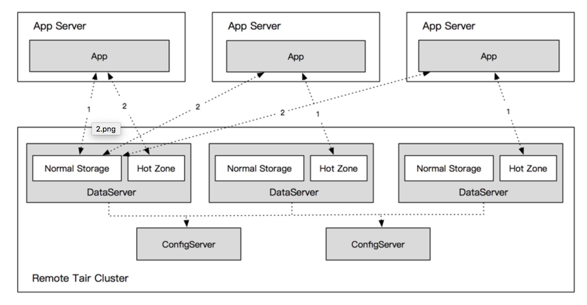

# Tair

# 1. 简介

tair是一个高性能、分布式、可扩展、高可靠的Key-Value结构存储系统

具备标准的特性是：
1. 高性能——基于高速缓存、内存或者ssd

2. 高扩展——轻量中间件+三种数据引擎+负载均衡

3. 高可用——各种容灾部署方式和解决方案（见3.3）

主要功能：
1. 数据库缓存：作为数据库与dao层之间的中间缓存，降低对后端数据库的访问压力，高速缓存能使得访问速度达到1ms级别，例如高频率的数据库查询

2. 临时数据存储：将临时数据存储在mdb中可以降低内存的开销。例如在分布式系统中，同一个用户的不同请求可能会发送到不同的服务器上，这时可以用mdb作为全局存储，用于保存Session数据、用户的Token、权限信息等数据

3. 持久化存储(ldb)：此时类似于传统的数据库，将数据存入磁盘中做持久化存储，例如广告推荐类需要离线计算大量数据以及榜单的生成（注意：由于此时采用的数据库引擎ldb是NoSQL类型的，所以不支持sql查询）

# 2. 架构
## client
给用户提供接口，完成用户请求

初始化时从config server获取对照表，就是获取key和dataserver的对照关系，然后和dataserver进行交互完成请求

## configserver
管理dataserver节点，维护dataserver的状态信息

采用一主一备方式

## dataserver
负责数据存储，按照configserver的指示完成数据的迁移和复制工作

定时给configserver发送心跳信息

# 3. 三种数据引擎
名称	|基于数据库 |	特点	|适用场景
---|---|---|--|
MDB	|Memcache	|基于内存；仅支持k-v类型数据；不支持持久化	|数据小而简单，读多（QPS 万以上）写少，且偶尔数据丢失不应该对业务产生较大影响；例如访问量显示，session manager等功能|
RDB	|Redis|基于内存；除了kv，还支持string, list, hash, set, sortedset等数据类型；支持一定程度的持久化(其方式和LDB不一样)|数据形式复杂，偶尔数据丢失不应该对业务产生较大影响；例如排行榜、最新项目检索、地理位置存储及range查询。
|LDB	|LevelDB|基于ssd硬盘；仅支持k-v类型数据；支持持久化|数据简单，有持久化需求，且读写QPS较高（万级别）但存储数据较简单的应用场景；例如订单计数，库存记录等功能，更新非常频繁。

# 4. Tair的数据一致性
采用了version机制，使用CAS修改和atomic变量
当执行put操作时，看当前version和存储的version是否一致，一致才更新成功，否则说明别人已经修改了，就put失败

# 5. Tair的负载均衡
tair的分布式负载均衡采用的是一致性哈希算法
[一致性hash算法](../mysql/缓存.md)

# 6. Tair的对照表
对照表主要是由configServer生成的提供给client使用key来寻找对应dataServer的路由表

主configserver会利用心跳机制检测dataserver的存活情况来更新对照表，在client请求的时候返回新的对照表

备configserver也会根据心跳机制更新，在主configserver挂掉的时候就上位

如何告诉client对照表发生变化了：
configserver会给对照表维护一个版本号，并把版本号发送给dataserver。当client请求数据的时候，dataserver的response中会返回版本号，client如果发现版本号变了就去configserver获取新的对照表

# 7. Tair的热点数据
通过一致性hash算法总会使得对于同一key会路由到一个dataserver上，那么水平扩展解决不了热点key问题

如何计算热点：
各个接受数据的线程单独技术，然后由汇总线程进行汇总计算，从而得到热点数据

## 热点读
在dataserver中会单独划分一块hotZone存储热点数据

client会随机选择一台dataserver作为热点数据固定的读写hotZone，该区域存储客户端写入的所有热点数据

dataserver会告诉client哪些是热点数据，client会先去固定的hotZone读数据，如果读不到再按原来的方式根据对照表查找dataserver读。相当于hotZone和源数据的dataServer形成了二级缓存

dataserver会异步更新hotZone

## 热点写
当dataserver识别出热点数据后，会将数据交给热点线程处理，热点线程会将一定时间内对同一key的操作进行合并，处理完成后再返回给client

