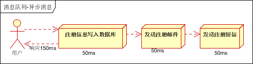
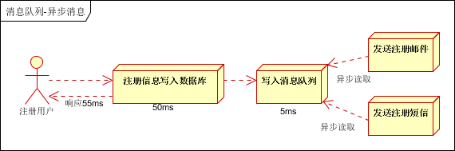
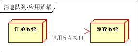
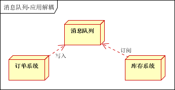
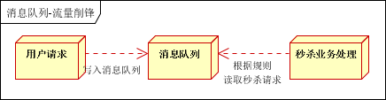
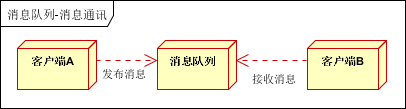
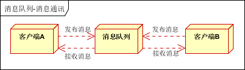
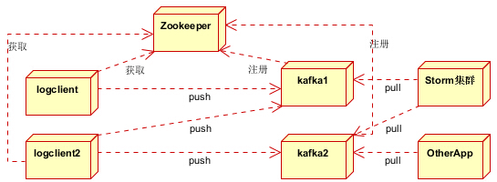

## 参考博文
[浅谈消息队列及常见的消息中间件](https://juejin.cn/post/6844903635046924296#heading-6)
[消息中间件（消息队列）关键知识点总结](https://blog.csdn.net/xiaosong_2016/article/details/110140684)
[消息中间件的应用场景](https://jishuin.proginn.com/p/763bfbd573e7)

[TOC]

# 1. 概述
通过提供==消息传递==和==消息排队==模型，它可以在分布式环境下提供应用解耦、弹性伸缩、冗余存储、流量削峰、异步通信、数据同步等等功能

# 2. 特点
- 采用异步处理

消息发送者发送消息无需等待消息消费者的响应，消息消费者通过订阅消息来消费

- 应用间解耦

a. 发送者和消费者无需对接，不需要了解对方
b. 发送者和消费者不必管对方是否服务正常

# 3. 消息传输模式
## 3.1 点对点模型
发送者发送的消息只能被一个消费者消费

## 3.2 发布/订阅模型（Pub/Sub）
发送者发送的消息能被多个消费者消费，消费者通过订阅来消费消息

# 4. 消息队列的推拉模型
## 4.1 Push推消息模型
消息队列主动将消息推送给消费者

## 4.2 Pull拉消息模型
消费者主动去消息队列拉取消息

# 5. 应用场景
## 5.1 异步处理

引入消息队列，将不是必须的业务逻辑，异步处理

用户注册后，需要发注册邮件和注册短信

a. 串行方式：将注册信息写入数据库成功后，发送注册邮件，再发送注册短信。以上三个任务全部完成后，返回给客户端

b. 并行方式：将注册信息写入数据库成功后，发送注册邮件的同时，发送注册短信

c. 消息队列

注册后写入消息队列就返回给用户，发送邮件和短信通过读取消息队列异步处理

## 5.2 系统解耦
用户下单后，订单系统需要通知库存系统

a.传统方式：订单系统调用库存系统的接口
假如库存系统无法访问，则订单减库存将失败，从而导致订单失败，订单系统与库存系统耦合

b.消息队列：
订单系统：用户下单后，订单系统完成持久化处理，将消息写入消息队列，返回用户订单下单成功

库存系统：订阅下单的消息，采用拉/推的方式获取下单信息，库存系统根据下单信息，进行库存操作

在下单时库存系统不能正常使用，也不影响正常下单

## 5.3 流量削峰和流控
秒杀活动，一般会因为流量过大，导致流量暴增，应用挂掉。为解决这个问题，一般需要在应用前端加入消息队列。一般在秒杀或团抢活动中使用广泛

a、可以控制活动的人数
b、可以缓解短时间内高流量压垮应用

用户的请求先写入消息队列，假如消息队列长度超过最大数量，则直接抛弃用户请求或跳转到错误页面。

秒杀业务根据消息队列中的请求信息，再做后续处理

## 5.4 消息通讯
消息队列一般都内置了高效的通信机制，因此也可以用在纯的消息通讯。比如实现点对点消息队列，或者聊天室等。

点对点通讯：客户端A和客户端B使用同一队列，进行消息通讯

聊天室通讯：客户端A，客户端B，客户端N订阅同一主题，进行消息发布和接收。实现类似聊天室效果

## 5.5 日志处理
将消息队列用在日志处理中，比如Kafka的应用，解决大量日志传输的问题

Zookeeper注册中心：提供负载均衡和地址查找服务
日志收集客户端：用于采集应用系统的日志，将数据推送到kafka队列
Kafka集群：接收，路由，存储，转发等消息处理
Storm集群：与OtherApp处于同一级别，采用拉的方式消费队列中的数据

网易NDC-DTS系统在使用，应该是最典型的应用场景，主要就是binlog的同步，数据表的主从复制。简单一点就是：MySQL进程写binlog文件 -> 同步应用去实时监控binlog文件读取发送到Kafka -> 目标端处理binlog 

# 6. MetaQ
采用pull机制