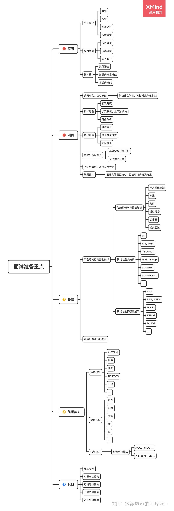

## 参考博文
[程序员面试时这样介绍自己的项目经验，成功率能达到99.99%](https://cloud.tencent.com/developer/news/631290)
[如何准备阿里P6/P7面试（项目经验篇）](https://toutiao.io/posts/e5brcg0/preview)

[TOC]

# 自我介绍
面试官你好，我的名字叫陈培培，浙江温州人，2020年6月毕业于浙江大学软件学院。算上实习的半年，在阿里的营销平台团队工作了一年半。在这一年半里主要负责商家端相关工作的Java开发。

我想从营销平台是干什么的、我在营销平台干了什么两个角度来讲一下。

## 营销平台是干什么的
首先我对营销的理解是：从消费者角度来说，就是识别用户需求，帮助用户更快触达到目标商品。从商家角度来说，帮助他们能将自己的产品以合适的价格和策略在适合的渠道中售卖。

之所以叫平台是因为支撑着618、双11、聚划算、百亿补贴业务的的营销，营销平台分为选品、招商、投放三个团队。然后我是招商团队的，招商团队又分成活动组织域、商家营销中心、商品服务域，我具体参与的是商家营销中心

## 我在营销平台干了什么 
首先我觉得商家营销中心有三类角色，分别是产品经理、运营、商家。首先产品先制定好产品形态，主要包含是三个方面：1. 活动以什么样的组织形式展现给商家 2. 商家以什么样的方式报名活动，3. 然后商家以什么样的方式管理自己报名的活动和商品。这也是商家营销中心的三个核心。
然后是运营，他们通过创建活动将自己的运营策略传达给商家，最后就是商家选择活动报名实施策略
然后今年阿里的一个目标就是商家体验，那围绕商家体验和商家营销中心的三个核心我主要做了三个项目，分别是商品招商策略、规则白盒化和商家端无线化

# 1. 商品招商策略
## 背景
运营在创建活动的时候会绑定商品池，商品池数据来源于选品团队，不同的商品池会有不同的业务目的。商家在报名商品时通过商品选择器报名商品，例如绑一个商品池是用于限制商家报名范围的，那商家只能选择池子里的商品报名，或者用于推荐商家报名这个池子里的优质商品。原来的实现方式是新来一个类型的商品池需求，就要开发一套代码，这样造成了很多问题：
1. 扩展性问题：针对特性类型做的开发不能复用和扩展，因为活动组织域的模型非常复杂，在活动只上还有营销活动、主子活动的概念。假如商品池不想绑在活动这个领域，想绑在其他领域就不支持
2. 维护和迭代性，原来对多个类型的池子的实现方式是不统一的，那负责这个的人就需要去了解各个链路，维护起来非常费劲
3. 性能问题：原来运营帮了一个商品池之后，因为数据链路只支持天级别更新，要等到第二天才能生效，不满足业务期望

那其实不管活动上会绑定什么商品池，他们的关系都可以抽象成活动+商品池+绑定目的+商品，基于这个关系，我们可以忽略池子具体是干什么用的，设计一套通用的链路。

## 设计、技术选型：可用性、性能、一致性，为什么这么设计？
1）首先先确定数据模型：
第一个是领域-商品池绑定关系，这个数据是运营绑定动作产出的。我这里以活动做说明，里面包含的内容有活动ID、商品池ID、商品池类型。

第二个是商品池-商品绑定关系，商品选择器的数据就来源于这个模型，里面包含的核心内容有商品ID-商品池ID的多值列、活动ID多值列、商家ID，以商品ID做唯一索引。这里选择是存储商品池ID和活动ID的多值列是因为商品和商品池是多对多的关系，商品池和活动也是多对多的关系，一个商品池中的数据量又是百万级的，那假如每当活动绑定一个商品池，那这个数据量就会倍数增长，对一个商品他会有很多条数据。

2）然后就是分析这两个数据模型应该怎么存储：
活动-商品池的数据量是千级别的，对这个模型的查询也是根据活动ID和类型获取商品池ID和类型，这个模型的数据量也不会非常大，所以选择DB作为存储，给活动ID+类型建立索引

然后是商品-商品池绑定关系，因为需要对商品ID、商品名称做模糊搜索，再加上数据量非常大，是千万级别的。考虑到对DB的压力，我们选择阿里的OpenSearch搜索引擎作为存储

活动-商品池的绑定关系是运营在保存的活动将关系存进DB。关键在于怎么将商品和商品池的关系灌进OpenSearch

3）这要从数据的可靠性和实时性两个角度去思考：
先说可靠性，我们得保证今天运营绑了某个商品池后，第二天OpenSearch中的数据是对的，所以需要每天一次将数据全量回流到搜索引擎中。每次需要回流的商品数据大约是千万级别，回流的数据源使用的是ODPS，他是离线的海量数据平台，对标的是开源的hive。我们在ODPS上写SQL语句产出数据并建立天任务，每天自动的执行SQL并灌到OpenSearch中。ODPS的原理就是接DB的binlog，通过binlog获取数据。

然后是实时性，因为天级别时效性太差了，所以业务上要求达到小时级别的更新。但如果每小时都将千万数据回流一遍压力太大了，而且小时内也回流不完。所以考虑采取增量更新的方式，对关系没发生变化的商品就不需要回流了，所以我们就要计算出这个小时和上一个小时比哪些商品的商品池ID和活动ID发生了变化。
每小时对结果表和上一个小时的数据作对比，并用version字段来标识。如果在上一个小时里没有这个商品，说明是新加的，version字段置为当前时间戳。如果上一个小时有，这一个小时没有，说明这个商品应该删除，version字段置为0，如果两个小时都有，但是商品池ID不一样，那就更新为最新一小时的商品池ID。这个diff任务是使用ODPS的能力，小时级别的去执行
当diff数据算完之后，直接触发一个http接口读取diff数据，对每条数据都给集群发送一个metaQ消息，应用集群就会去消费消息，根据version字段做对应的插入和删除动作来更新搜索引擎。
这里会有一个问题是如果数据量很大，那么metaQ消息发送量也会很大，集群消费可能会有压力。所以做了一个限流机制，如果每秒数据发送量大于400，就会让发送消息的线程休息1s再发。

稳定性体现在哪里：
1. 历史绑定的池子，只要不解绑，数据就一定不会丢
2. 如果发生错误，对全量链路会有报警机制，重跑就可解决
3. 对于增量链路，有限流机制

为什么是400，压测得到的。通过压测平台，选择想要压测的接口。他会对之前的线上流量进行录制，然后进行数据回放。

## 具体实现

## 分工

## 难点
我感觉对增量链路的设计比较难，因为涉及到的数据量很大，后面想到说MySQL主从复制是通过记录binlog进行增量复制的，所以就想到是不是我们也可以计算出变化的数据，只对变化的数据做更新。

当时还想了另外一个方案，就是商品池是由选品提供的，他们可以监听商品的变化，然后发送metaQ消息，我们去接他们的消息直接更新引擎。但是后面不采取这个方案的是因为也是想做独立于某个业务的平台，他们的用户不只有我们。但是目前对选品团队来说这样的能力不够通用，所需要的场景很小，所以最后没有达成一致，选择我们自己去实现。

## 效果
在这次618需求中，有一个需求就是添加新类型的池子，改动成本非常的小，只是加了一个枚举类，后面的链路就天然支持了

# 2. 规则白盒化
## 背景
商家营销中心对商家是否能报名某个活动、报名某个商品会校验很多规则，比如对报名时间、商家身份、商家店铺分等的校验。在这之前整个校验模块完全是一个黑盒，对外的表现就是透出一个文案告诉商家报名失败。为了提升商家体验，我们希望做到所见即所得，系统里过了什么规则都将他产品化的表达出来给商家看。

原来的规则实现是这样的：有一个Rule的父类，他有一个check接口，所有的规则都实现check方法，并且把Rule定义在规则枚举类中，在校验的时候就根据领域和操作获取对应的Rule进行校验。领域指的是活动、商品，操作指的是报名编辑、撤销报名等操作，例如商品领域会进行商品报名、编辑报名数据、撤销报名等。经过业务的扩张，规则不断慢慢增多后出现很多问题：
1. 有很多规则像搭积木一样堆积了很多不同目的的校验逻辑
2. 后端维护成本高，当商家报名失败来咨询时，只返回了一个错误文案，有些规则的文案不规范，商家和产品都看不懂是被那个规则卡主了，只能由开发去翻代码看是被哪个规则卡主了
3. 每个业务需要校验的规则不同，比如某个规则它目前只有A业务校验，那么就会在代码里写死判断，非A业务都跳过校验。那如果后续B业务也需要校验了，就又要去修改控制逻辑。修改代码是很快，但是整个审批、发布的流程都非常耗时，性价比非常的低
4. 因为我们做的是平台，有很多业务都会有自己的定制规则，那以前都是我们接需求开发，但现在希望他们逐步的进来开发
5. 因为历史原因，规则校验部分现在是分别存在于两个系统，我们希望将这两部分合并，减少维护和开发成本

整个项目可以分为两部分，分别是平台能力建设和规则迁移，我负责规则迁移这部分：

## 设计、技术选型：可用性、性能、一致性，为什么这么设计？
#### 1. 平台能力建设
因为想要有一个平台能让相关人员都能看到某个领域和操作下有什么规则，首先把规则抽象成一个模型，规则模型里面包含ID、唯一的code、规则名称、规则描述、错误文案、所属的领域模型和操作。

当添加一个新规则的时候需要在平台创建一个新规则，创建好后返回一个代码模板，实现者就在里面实现自己的业务逻辑

规则表达式是将规则的控制逻辑和执行逻辑剥离开来，规则是否执行通过在界面上配置，而不是在代码里写if else判断

校验逻辑和控制逻辑的剥离，看这个配置的效果

#### 2. 规则迁移
我做的工作就是将老体系的rule迁移到新体系的valve，包含对逻辑的梳理，对代码的重构、优化，大约有100多个。
先说重构方面：一个老规则可能会堆积了很多校验，那就需要将他根据校验目的拆分成多个新规则；然后多个有很多规则他们都包含重复校验，所以会将他们合并成一个新规则。
然后就是优化，包含了性能优化、可读性和扩展性的和优化：
1. 性能优化：一次的规则执行流中，可能每个规则都要调用RPC接口获取活动信息，为了减少不必要的重复调用，可以在第一次查询活动的时候就将它存储在规则上下文中
2. 可读性、扩展性优化：比如查一个东西可能在不同的业务方下查询不同的数据源，那么可以定义一个查询接口，各个业务都实现这个接口，适用工厂类来决定使用哪个具体实现

因为这相当于将应用的核心代码做了一个翻新，所有不能一下子切到新模式去，需要一个灰度策略慢慢的去切，等线上稳定之后再废弃老模式。灰度的粒度是到每一个规则级别。
所以我们的灰度策略是：定义一份配置，里面是老规则和新规则之间的映射关系，一个老规则下面有一个新规则列表，如果是多个老规则合并到一个新规则，那么这个新规则在每个老规则下面都进行配置，还有一个字段标识这个规则是否需要切到新模式执行。
当执行规则的时候如果是走新模式，那么就获取老规则对应的新规则列表执行，否则执行老规则。这样可能会造成新规则的重复执行，但是根据规则执行的幂等性，重复执行不会造成结果不一致，但是一定少执行。

## 难点
因为涉及到100多个规则，经过历史的迭代，很多代码非常不规范，读起来又臭又长，我就需要一点点啃这些代码，不清楚的逻辑就要找对应的人问，搞清楚之后再迁移到新模式

# 3. 商家端无线化
因为集团今年的目标是提升商家体验，以前商家营销中心只有PC端，并且PC端经过历史迭代变得非常复杂，商家获取营销信息和操作的成本比较高，并且想把所有的商家流量都收口到千牛上，所以我们希望能做一个移动版的商家营销中心，以小程序的方式在千牛中访问。

这个项目分为两期，第一期是活动导航和活动信息的获取和查看，第二期是活动的报名，目前只做了第一期

第一期我们主要是想把关键的信息展现给商家，那站在一个商家的角度上来说。我最关心的数据有这么几个方面：
1. 现在有什么活动
2. 在这么多活动中我能参加什么活动
3. 在这么活动中我最关注的活动是哪些
4. 我曾经参加了什么活动

针对这几个方面，然后结合现有的PC端，我们主要集中在两个角度：
1. 活动组织形式：因现在营销业务的活动组织的形式非常复杂，我之前提到的活动只是其中的一种，其实还有其他的例如营销活动、主子活动等。现在在PC端不同的组织形式是不容的入口。对于很多商家来说理解成本非常高，他们也不需要关心我们的活动结构。我们想定义一个统一对的活动模型，从一个维度展现个商家。所以我们定义了前台活动的概念屏蔽了复杂的活动结构，那对商家来说，看到的只有前台活动一个维度，前台活动和原来的活动是一一对应的关系。
2. 活动发现形式：原来在PC端，没有很清晰的结构来向商家展示能报啥、报了啥，也不能像购物一样收藏我感兴趣的活动。所以我们对无线端的组织形式是四个tab，分别是全部活动，可报活动，已报活动，我的收藏。
其次为了让商家更快筛选出目标活动，给前台活动加了活动特色的概念，运营在创建活动的时候用几个关键字定义这个活动的卖点是什么，然后商家可以根据特色快速筛选出自己想要的类别。

那整个项目分为两大块：
1. 前台活动数据和活动可报数据的计算和产出
前台活动数据是建立后台活动和原有活动之间的映射关系，每当创建一个活动，就要相应的产出一份前台活动数据
活动可报数据是指商家可以报哪些活动，这个就是校验所有的规则得出的，但是如果每次都在商家访问的时候对所有活动进行规则执行，系统压力会太大，所以在牺牲一定实时性的情况下需要提前产出数据。

2. 接口的开发和实现
在这部分主要是业务代码的开发，因为这个项目是刚进去不久做的，主要目的是熟悉系统的代码和业务。

# 其他
从最朴素的商品组织和售卖过程讲起，商家只要在商品中心填写商品信息、发布商品，消费者就能通过淘宝的搜索就能搜到对应的商品并购买。但是在淘宝天猫的体量
变得如此大，电商业务的竞争也越来越激烈的情况下，仅仅通过消费者主动搜索是很难满足需求的，也很难在大量的物品中找到自己心仪的那一个。所以营销就是帮助
商家更好的将商品卖出去，也让消费者能更快的触达到优质的心仪商品。例如双11、618这些活动是营销，聚划算、特价版、天天特卖也是营销。

之所以是营销平台，是因为我们支撑着阿里电商业务的营销，提供基础和通用的营销能力。我们面向的用户对内是运营，对外是商家。对运营来说，我们提供制定营销方案
的能力，指定出的方案称为营销活动，也是一个核心模型。营销活动一个营销活动定义了一个业务场景详细的营销需求，如需要展示给消费者什么信息，什么样的商家/商品能参加，优惠是普通优惠还是定向优惠、渠道优惠，库存怎么控制等。
对商家来说，我们提供参与营销活动的能力。每个商家可以选择自己意向的活动，然后根据活动的要求提报商品，产出的模型是营销方案。每个商家参加某个活动都会有一份营销方案的数据。
商家报名商品后，经过运营侧的审核和挑选，最终会将商品通过手淘传递给消费者。

整个营销平台有35人，分别是招商、选品、投放三个大模块，我所在的团队是招商团队，负责对运营的活动组织和对商家的商家营销，我就属于商家营销领域

3. 性能问题，商品池和商品之间是一对多的关系，商品池和活动也是一对多的关系，但是原来的存储是把这些关系拉平了，会出现一个商品池如果被多个活动绑定，那么每个活动针对这个池子的绑定都会有一条活动ID到商品ID的记录，那这个数据量是爆炸式增长

首先建立一张领域和商品池绑定关系，里面包含领域ID、领域类型、商品池ID、商品池类型，使用领域ID是为了支持活动以外的绑定。每次运营保存活动的时候就将这个关系保存进DB，然后将DB回流到ODPS，过滤掉已经结束的、无效的活动。然后和选品团队的商品-商品池ODPS根据商品池ID做join得到结果表，将结果表每天一次回流到OpenSearch。

规则校验分为两种：
Fast Fail快速失败，当某条规则校验不通过时，则抛出错误，或返回失败原因。
All Execute穿透执行，校验所有规则，返回失败原因或返回校验结果

平台的操作包含对valve的录入、编辑、查看。然后原先的规则是否执行的控制逻辑和他的执行逻辑是放在一起的，现在把他们剥离出来了，提供了规则表达式的配置，定义了在某组条件满足的情况下会执行什么规则。

比如某个规则对不同业务有不同的处理方式，原来的代码里就是if else的去判断。那就可以对这个规则定义一个父类，然后每个业务都实现这个父类，定义自己的逻辑。然后定义一个路由规则，根据不同的业务路由到不同的规则。