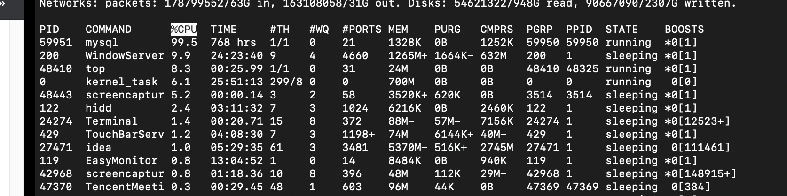
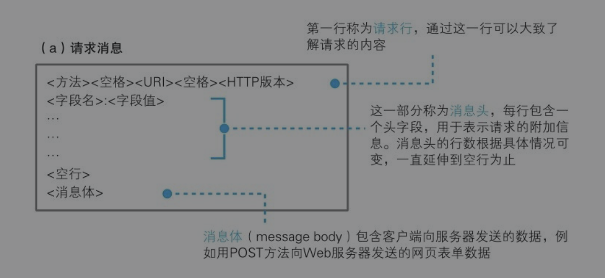
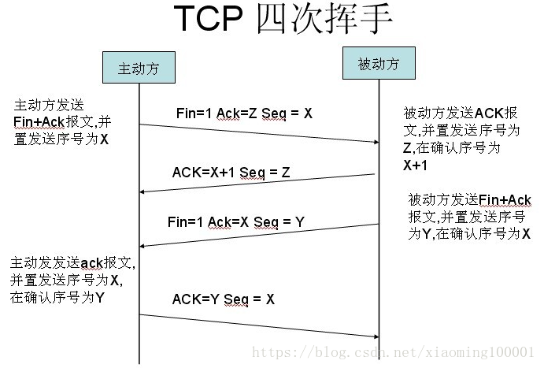
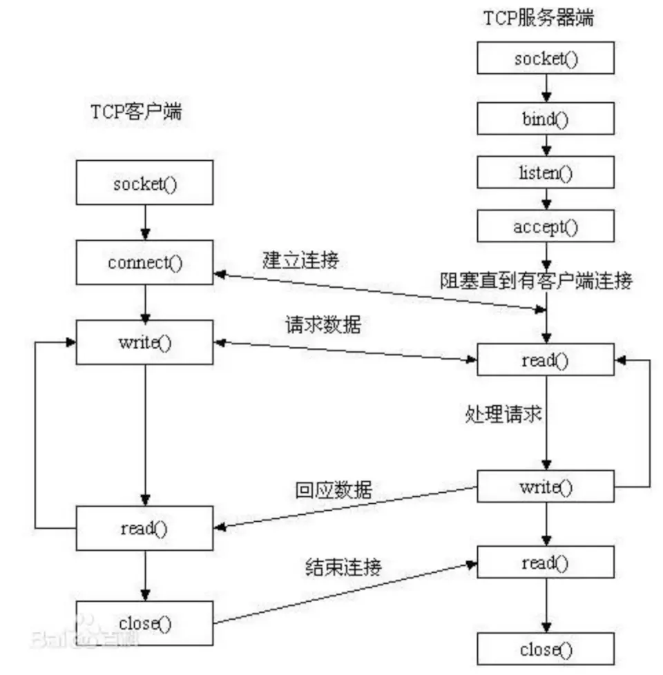
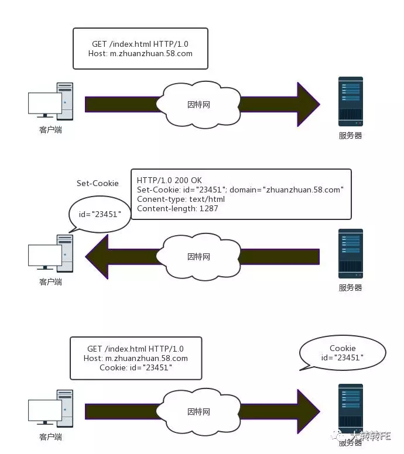

[TOC]

# 1. linux
### Linux抓包：tcpdump 
他可以把网络中传输的数据包进行截获然后分析。可以指定网卡、主机和端口


### Linux查哪个端口被应用进程占用netstat
```shell
netstat -nap | grep port
```

### Linux查看各个进程的资源占用状况top
```shell
序号  列名    含义
a    PID     进程id
b    PPID    父进程id
c    RUSER   Real user name
d    UID     进程所有者的用户id
e    USER    进程所有者的用户名
f    GROUP   进程所有者的组名
g    TTY     启动进程的终端名。不是从终端启动的进程则显示为 ?
h    PR      优先级
i    NI      nice值。负值表示高优先级，正值表示低优先级
j    P       最后使用的CPU，仅在多CPU环境下有意义
k    %CPU    上次更新到现在的CPU时间占用百分比
l    TIME    进程使用的CPU时间总计，单位秒
m    TIME+   进程使用的CPU时间总计，单位1/100秒
n    %MEM    进程使用的物理内存百分比
o    VIRT    进程使用的虚拟内存总量，单位kb。VIRT=SWAP+RES
p    SWAP    进程使用的虚拟内存中，被换出的大小，单位kb。
q    RES     进程使用的、未被换出的物理内存大小，单位kb。RES=CODE+DATA
r    CODE    可执行代码占用的物理内存大小，单位kb
s    DATA    可执行代码以外的部分(数据段+栈)占用的物理内存大小，单位kb
t    SHR     共享内存大小，单位kb
u    nFLT    页面错误次数
v    nDRT    最后一次写入到现在，被修改过的页面数。
w    S       进程状态(D=不可中断的睡眠状态,R=运行,S=睡眠,T=跟踪/停止,Z=僵尸进程)
x    COMMAND 命令名/命令行
y    WCHAN   若该进程在睡眠，则显示睡眠中的系统函数名
z    Flags   任务标志，参考 sched.h
```


### telnet输入qq的url,要输入什么内容能让对方响应
```shell
[root@andy ~]# telnet 192.168.120.204
Trying 192.168.120.204...
Connected to 192.168.120.204 (192.168.120.204).
Escape character is '^]'.

    localhost (Linux release 2.6.18-274.18.1.el5 #1 SMP Thu Feb 9 12:45:44 EST 2012) (1)

login: root
Password: 
Login incorrect
```


### select、epoll在linux下的实现
**1. select**
调用后select函数会阻塞，直到有描述符号就绪（有数据 可读、可写、或者有except），或者超时（timeout指定等待时间，如果立即返回设为null即可），函数返回。当select函数返回后，可以 通过遍历fdset，来找到就绪的描述符

select目前几乎在所有的平台上支持，其良好跨平台支持也是它的一个优点。select的一 个缺点在于单个进程能够监视的文件描述符的数量存在最大限制，在Linux上一般为1024，可以通过修改宏定义甚至重新编译内核的方式提升这一限制，但 是这样也会造成效率的降低。
```c++
int select (int n, fd_set *readfds, fd_set *writefds, fd_set *exceptfds, struct timeval *timeout);
```

**2. poll**

```c++
int poll (struct pollfd *fds, unsigned int nfds, int timeout);

struct pollfd {
    int fd; /* file descriptor */
    short events; /* requested events to watch */
    short revents; /* returned events witnessed */
};
```

pollfd结构包含了要监视的event和发生的event，不再使用select“参数-值”传递的方式。同时，pollfd并没有最大数量限制（但是数量过大后性能也是会下降）。 和select函数一样，poll返回后，需要轮询pollfd来获取就绪的描述符。

从上面看，select和poll都需要在返回后，通过遍历文件描述符来获取已经就绪的socket。事实上，同时连接的大量客户端在一时刻可能只有很少的处于就绪状态，因此随着监视的描述符数量的增长，其效率也会线性下降


**3. epoll**
epoll使用一个文件描述符管理多个描述符，将用户关心的文件描述符的事件存放到内核的一个事件表中，这样在用户空间和内核空间的copy只需一次
```c++
/*
参数size并不是限制了epoll所能监听的描述符最大个数，只是对内核初始分配内部数据结构的一个建议。

当创建好epoll句柄后，它就会占用一个fd值，在linux下如果查看/proc/进程id/fd/，是能够看到这个fd的，
所以在使用完epoll后，必须调用close()关闭，否则可能导致fd被耗尽。
*/
int epoll_create(int size)；//创建一个epoll的句柄，size用来告诉内核这个监听的数目一共有多大

/*
 op：表示op操作，用三个宏来表示：分别添加、删除和修改对fd的监听事件
 添加EPOLL_CTL_ADD，删除EPOLL_CTL_DEL，修改EPOLL_CTL_MOD

 epoll_event：是告诉内核需要监听什么事
*/
int epoll_ctl(int epfd, int op, int fd, struct epoll_event *event)；//对指定描述符fd执行op操作

int epoll_wait(int epfd, struct epoll_event * events, int maxevents, int timeout);
```


### 用户态和内核态切换会出现什么问题
Linux分为内核态(Kernel model)和用户态(User model)，CPU会在两个model之间切换：
1. 内核态：内核态代码拥有完全的底层资源控制权限，可以执行任何CPU指令，访问任何内存地址，其占有的处理机是不允许被抢占的。内核态的指令包括：启动I/O，内存清零，修改程序状态字，设置时钟，允许/终止中断和停机。内核态的程序崩溃会导致PC停机
2. 用户态：是用户程序能够使用的指令，不能直接访问底层硬件和内存地址。用户态运行的程序必须委托系统调用来访问硬件和内存。用户态的指令包括：控制转移，算数运算，取数指令，访管指令（使用户程序从用户态陷入内核态）

操作系统的核心是内核，他独立于应用程序可以访问受保护的内存空间和访问底层硬件。

为了保证用户进程不能操作内核，操作系统将虚拟存储空间分为两部分：
1. 内核空间：供内核态使用，最高的1G字节（从虚拟地址0xC0000000到0xFFFFFFFF）
2. 用户空间：共用户态使用，较低的3G字节（从虚拟地址0x00000000到0xBFFFFFFF）


用户态切换到内核态：
1）系统调用
2）异常事件： 当CPU正在执行运行在用户态的程序时，突然发生某些预先不可知的异常事件，这个时候就会触发从当前用户态执行的进程转向内核态执行相关的异常事件，典型的如缺页异常。
3）外围设备的中断：当外围设备完成用户的请求操作后，会像CPU发出中断信号，此时，CPU就会暂停执行下一条即将要执行的指令，转而去执行中断信号对应的处理程序，如果先前执行的指令是在用户态下，则自然就发生从用户态到内核态的转换。

### 进程间的通信
1. 无名管道
```
1. 它是半双工的（即数据只能在一个方向上流动），具有固定的读端和写端。
2. 它只能用于具有亲缘关系的进程之间的通信（也是父子进程或者兄弟进程之间）。
3. 它可以看成是一种特殊的文件，对于它的读写也可以使用普通的read、write 等函数。但是它不是普通的文件，并不属于其他任何文件系统，并且只存在于内存中。
```

- 原型

当一个管道建立时，它会创建两个文件描述符：fd[0]为读而打开，fd[1]为写而打开。要关闭管道只需将这两个文件描述符关闭即可
```c++
#include <unistd.h>
int pipe(int fd[2]);    // 返回值：若成功返回0，失败返回
```

2. 命名管道(FIFO)
```
1. FIFO可以在无关的进程之间交换数据，与无名管道不同。
2. FIFO有路径名与之相关联，它以一种特殊设备文件形式存在于文件系统中
3. 在数据读出时，FIFO管道中同时清除数据，并且“先进先出”

mode 参数与open函数中的 mode 相同。一旦创建了一个 FIFO，就可以用一般的文件I/O函数操作它

当 open 一个FIFO时，是否设置非阻塞标志（O_NONBLOCK）的区别：
1. 若没有指定O_NONBLOCK（默认），只读 open 要阻塞到某个其他进程为写而打开此 FIFO。类似的，只写 open 要阻塞到某个其他进程为读而打开它。
2. 若指定了O_NONBLOCK，则只读 open 立即返回。而只写 open 将出错返回 -1 如果没有进程已经为读而打开该 FIFO，其errno置ENXIO。
```

- 原型
```c++
#include <sys/stat.h>
// 返回值：成功返回0，出错返回-1
int mkfifo(const char *pathname, mode_t mode);
```

3. 消息队列
```
消息队列，是消息的链接表，存放在内核中。一个消息队列由一个标识符（即队列ID）来标识

1. 消息队列是面向记录的，其中的消息具有特定的格式以及特定的优先级。
2. 消息队列独立于发送与接收进程。进程终止时，消息队列及其内容并不会被删除。
3. 消息队列可以实现消息的随机查询,消息不一定要以先进先出的次序读取,也可以按消息的类型读取。
```

- 原型
```c++
#include <sys/msg.h>
// 创建或打开消息队列：成功返回队列ID，失败返回-1
int msgget(key_t key, int flag);

// 添加消息：成功返回0，失败返回-1
int msgsnd(int msqid, const void *ptr, size_t size, int flag);

// 读取消息：成功返回消息数据的长度，失败返回-1
int msgrcv(int msqid, void *ptr, size_t size, long type,int flag);

// 控制消息队列：成功返回0，失败返回-1
int msgctl(int msqid, int cmd, struct msqid_ds *buf);
```

在以下两种情况下，msgget将创建一个新的消息队列：
```
1. 如果没有与键值key相对应的消息队列，并且flag中包含了IPC_CREAT标志位。
2. key参数为IPC_PRIVATE。
```

函数msgrcv在读取消息队列时，type参数有下面几种情况：
```
type == 0，返回队列中的第一个消息；
type > 0，返回队列中消息类型为 type 的第一个消息；
type < 0，返回队列中消息类型值小于或等于 type 绝对值的消息，如果有多个，则取类型值最小的消息。
```
可以看出，type值非 0 时用于以非先进先出次序读消息。也可以把 type 看做优先级的权值


4. 信号量
```
信号量（semaphore）与已经介绍过的 IPC 结构不同，它是一个计数器。信号量用于实现进程间的互斥与同步，而不是用于存储进程间通信数据

特点:
1. 信号量用于进程间同步，若要在进程间传递数据需要结合共享内存。

2. 信号量基于操作系统的 PV 操作，程序对信号量的操作都是原子操作。

3. 每次对信号量的 PV 操作不仅限于对信号量值加 1 或减 1，而且可以加减任意正整数。

4. 支持信号量组。
```

- 原型

最简单的信号量是只能取 0 和 1 的变量，这也是信号量最常见的一种形式，叫做二值信号量（Binary Semaphore）。而可以取多个正整数的信号量被称为通用信号量。

Linux 下的信号量函数都是在通用的信号量数组上进行操作，而不是在一个单一的二值信号量上进行操作

当semget创建新的信号量集合时，必须指定集合中信号量的个数（即num_sems），通常为1； 如果是引用一个现有的集合，则将num_sems指定为 0
```c++
#include <sys/sem.h>
// 创建或获取一个信号量组：若成功返回信号量集ID，失败返回-1
int semget(key_t key, int num_sems, int sem_flags);

// 对信号量组进行操作，改变信号量的值：成功返回0，失败返回-1
int semop(int semid, struct sembuf semoparray[], size_t numops);  

// 控制信号量的相关信息
int semctl(int semid, int sem_num, int cmd, ...);
```

5. 共享存储
```c++
共享内存（Shared Memory），指两个或多个进程共享一个给定的存储区

特点:
1. 共享内存是最快的一种 IPC，因为进程是直接对内存进行存取。
2. 因为多个进程可以同时操作，所以需要进行同步。
3. 信号量+共享内存通常结合在一起使用，信号量用来同步对共享内存的访问。
```

- 原型
```c++
#include <sys/shm.h>
// 创建或获取一个共享内存：成功返回共享内存ID，失败返回-1
//当用shmget函数创建一段共享内存时，必须指定其 size；而如果引用一个已存在的共享内存，则将 size 指定为0
int shmget(key_t key, size_t size, int flag);

// 连接共享内存到当前进程的地址空间：成功返回指向共享内存的指针，失败返回-1
/*
当一段共享内存被创建以后，它并不能被任何进程访问。必须使用shmat函数连接该共享内存到当前进程的地址空间，
连接成功后把共享内存区对象映射到调用进程的地址空间，随后可像本地空间一样访问
*/
void *shmat(int shm_id, const void *addr, int flag);

// 断开与共享内存的连接：成功返回0，失败返回-1
/*shmdt函数是用来断开shmat建立的连接的。
注意，这并不是从系统中删除该共享内存，只是当前进程不能再访问该共享内存而已。
*/
int shmdt(void *addr); 

// 控制共享内存的相关信息：成功返回0，失败返回-1
/*
shmctl函数可以对共享内存执行多种操作，
根据参数 cmd 执行相应的操作。常用的是IPC_RMID（从系统中删除该共享内存）
*/
int shmctl(int shm_id, int cmd, struct shmid_ds *buf);
```


- 例子

下面这个例子，使用了【共享内存+信号量+消息队列】的组合来实现服务器进程与客户进程间的通信:
```
共享内存用来传递数据；
信号量用来同步；
消息队列用来 在客户端修改了共享内存后 通知服务器读取
```

### Java的进程间通信
1. wait/notify
```
Object的方法，必须在synchronized域中执行。
如果当前线程不是此锁的拥有者，会抛出IllegalMonitorStateException异常

执行wait方法的线程将释放锁并进入对象的等待队列中等待别的线程调用notify/notifyAll来唤醒
使用notify将随意唤醒线程从等待队列移到同步队列，使用notifyAll将唤醒所有线程从等待队列移到同步队列。
同步队列中的线程以常规方式和其他线程竞争锁，并在当前线程释放锁后才能竞争
```

2. condition
```
在使用Condition前，线程必须获得锁。

condition.await()：当前线程构造Node进入condition的等待队列,然后释放锁并唤醒后继节点,最后调用LockSupport.park()阻塞当前线程
condition.signal()：随机解除某一个线程。如果是非公平锁将直接尝试获取锁，如果获取不到将其从condition的等待队列放入AQS的同步队列
condition.signalAll()：解除condition等待队列中的所有线程
```

3. CountDownLatch
```
CountDownLatch像是一个倒数器，使得某些线程等待一组事件都发生后再继续执行。
它基于AQS实现，维护一个计数器，调用countDown()的线程使计数器减1，
调用await()的线程将处于阻塞状态直到计数器为0，或者等待中的线程中断，或者等待超时。

同一个线程可以多次调用countDown()方法，那么每次计数器都将减1
await()方法可以被多个线程调用，那么他们都将处于阻塞状态

//CountDownLatch
public void await() throws InterruptedException {
    // 转发到sync对象上
    sync.acquireSharedInterruptibly(1);
}

//AQS
public final void acquireSharedInterruptibly(int arg) throws InterruptedException {
    if (Thread.interrupted())
        throw new InterruptedException();
    if (tryAcquireShared(arg) < 0)
        doAcquireSharedInterruptibly(arg);
}

//Sync
protected int tryAcquireShared(int acquires) {
    return (getState() == 0) ? 1 : -1;
}


//CountDownLatch
public void countDown() {
    sync.releaseShared(1);
}

//AQS
public final boolean releaseShared(int arg) {
    if (tryReleaseShared(arg)) {
        doReleaseShared();
        return true;
    }
    return false;
}

//Sync
protected boolean tryReleaseShared(int releases) {
    // 无限循环
    for (;;) {
        // 获取状态
        int c = getState();
        if (c == 0) // 没有被线程占有
            return false;
        // 下一个状态
        int nextc = c-1;
        if (compareAndSetState(c, nextc)) // 比较并且设置成功
            return nextc == 0;
    }
}
```

4. CyclicBarrier
```
该属性有一个为ReentrantLock对象，有一个为Condition对象，而Condition对象又是基于AQS的，所以，归根到底，底层还是由AQS提供支持

可以指定在所有线程都进入屏障后的执行动作(barrierCommand)，该执行动作由最后一个进行屏障的线程执行

调用await方法的线程告诉CyclicBarrier自己已经到达同步点，然后当前线程被阻塞。直到parties个参与线程调用了await方法

使用独占锁来执行await方法

public class CyclicBarrier {
    
    /** The lock for guarding barrier entry */
    // 可重入锁
    private final ReentrantLock lock = new ReentrantLock();
    /** Condition to wait on until tripped */
    // 条件队列
    private final Condition trip = lock.newCondition();
    /** The number of parties */
    // 参与的线程数量
    private final int parties;
    /* The command to run when tripped */
    // 由最后一个进入 barrier 的线程执行的操作
    private final Runnable barrierCommand;
    /** The current generation */
    // 当前代
    private Generation generation = new Generation();
    // 正在等待进入屏障的线程数量
    private int count;

    public CyclicBarrier(int parties, Runnable barrierAction) {
        // 参与的线程数量小于等于0，抛出异常
        if (parties <= 0) throw new IllegalArgumentException();
        // 设置parties
        this.parties = parties;
        // 设置count
        this.count = parties;
        // 设置barrierCommand
        this.barrierCommand = barrierAction;
    }   

    private static class Generation {
        boolean broken = false;
    }
}
```

### 进程和线程 
[进程和线程](../../线程与并发/进程和线程.md)

### 进程如何划分内存
（1）代码区：（text）
主要用于存放功能代码，函数指针指向该区域，比如函数名。

（2）只读常量区：（text）
存放字符串常量和用const修饰的，并且已经初始化的全局变量和静态局部变量。

（3）全局区/数据区：（data）
存放已经初始化的全局变量和静态局部变量（这个区的数据都有存储空间，生命周期是整个程序）。

（4）bss段：
存放没有初始化的全局变量和静态局部变量，bss段会在main函数执行前清0。

（5）堆区：
主要表示使用malloc / calloc / realloc / free等手动申请的动态内存，需要手动释放。

（6）栈区：
主要存放非静态局部变量（包括函数的参数），块变量，有操作系统自动管理。

### 创建进程fork()
```
Linux系统下，进程可以调用fork函数来创建新的进程。调用进程为父进程，被创建的进程为子进程

pid_t fork(void);
fork函数向子进程返回0，并将子进程的进程ID返给父进程
因为进程形成了链表，父进程的fpid(p 意味point)指向子进程的进程id, 因为子进程没有子进程，所以其fpid为0

父线程fork子线程后，如果是只读取变量。子线程访问的就是父线程中的变量。
然而一一方做了修改，就会对物理内存重新赋值，就是完全独立的变量了，子进程只能通过进程间通信访问。
```


### 操作系统换页
当用户访问一个页时，MMU回去查询一个操作系统维护的页表，看看用户访问的页是否存在于内存当中，如果存在，就直接调用；如果没有，就需要开启中断，执行页错误处理程序，在磁盘中找到相应的数据页，并在内存中找到一块空闲，将其载入进来，然后中断返回，执行用户程序，在去访问内存中用户需要的页

**页面换出策略：**
```
1. 先进先出算法
先进先出（FIFO，First In First Out）算法的核心是更换最早进入内存的页面，其实现机制是使用链表将所有在内存中的页面按照进入时间的早晚链接起来，
然后每次置换链表头上的页面就行了，而新加进来的页面则挂在链表的末端

缺点是如果最先加载进来的页面是经常被访问的页面，那么就可能造成被访问的页面替换到磁盘上，导致很快就需要再次发生缺页中断，从而降低效率

2. 最近最少使用：移除最长时间没被用的
每次引用后放到队尾

3. 时钟置换算法
```

### 区分死锁和死循环
- 死循环
```shell
# 1. 用top查看cpu利用率最高的进程。或者使用ps -T -p <pid>
chenpeipeideMacBook-Pro:~ chenpeipei$ top

# 2. 使用jstack获取对应进程的线程堆栈信息
chenpeipeideMacBook-Pro:~ chenpeipei$ jstack 59951 >59951.txt

# 3. 查看该进程中cpu利用率最高的线程ID
top -H -p 108196 

# 4. 在jstack导出的文件中查找对应线程ID的信息
```

- 死锁
```shell
# 1. jps查看对应java进程信息
chenpeipeideMacBook-Pro:~ chenpeipei$ jps
55611 BIOServer

# 2. 使用jstack获取对应进程的线程堆栈信息
jstack -l 55611 > 55611.txt

# 3. 可以看到jstack导出的文件记录了死锁
```


# 2. 网络
### http、https、get、post、HTTP head

- http的请求方式 
```
1. GET	请求指定的页面信息，并返回实体主体。
2. HEAD	类似于 GET 请求，只不过返回的响应中没有具体的内容，用于获取报头
3. POST	向指定资源提交数据进行处理请求（例如提交表单或者上传文件）。数据被包含在请求体中。POST 请求可能会导致新的资源的建立和/或已有资源的修改。
4. PUT	从客户端向服务器传送的数据取代指定的文档的内容。
5. DELETE	请求服务器删除指定的页面。
6. CONNECT	HTTP/1.1 协议中预留给能够将连接改为管道方式的代理服务器。
7. OPTIONS	允许客户端查看服务器的性能。
8. TRACE	回显服务器收到的请求，主要用于测试或诊断。
9. PATCH	是对 PUT 方法的补充，用来对已知资源进行局部更新
```

- Get和post区别
```
1. url是获取资源，post是提交数据
2. get请求可以被浏览器缓存，而post不可以。因为如果提交一个页面，这个页面被缓存了，那么服务器并没有收到post，其实提交就没有成功。
3. get参数包含在URL, post通过request body传参
4. post并没有比get安全，因为他们用的都是HTTP就不安全，安全的话要用HTTPS
```

- 状态码


- http请求消息
```
get的参数放在请求行的URL中
post参数放在请求数据中
```


- http响应消息
```
HTTP响应也由四个部分组成，分别是：状态行、消息报头、响应正文。
```


- HTTP head中的每部分的意思
```
head=请求行+请求头
```


- HTTP2.0和HTTP1.X相比的新特性
```
1. 新的二进制格式（Binary Format），HTTP1.x的解析是基于文本。
基于文本协议的格式解析存在天然缺陷，文本的表现形式有多样性，要做到健壮性考虑的场景必然很多，二进制则不同，只认0和1的组合。
基于这种考虑HTTP2.0的协议解析决定采用二进制格式，实现方便且健壮。

2. 多路复用（MultiPlexing），即连接共享，即每一个request都是是用作连接共享机制的。
一个request对应一个id，这样一个连接上可以有多个request，每个连接的request可以随机的混杂在一起。
接收方可以根据request的 id将request再归属到各自不同的服务端请求里面。

3. header压缩，如上文中所言，对前面提到过HTTP1.x的header带有大量信息，而且每次都要重复发送。
HTTP2.0使用encoder来减少需要传输的header大小，通讯双方各自cache一份header fields表。
既避免了重复header的传输，又减小了需要传输的大小。

4. 服务端推送（server push），同SPDY一样，HTTP2.0也具有server push功能。
服务端根据一个请求主动将相关的内容推送给客户端
```

- https工作原理
```
一开始使用非对称加密，后面数据的传输过程使用对称加密

1. 客户端发送连接请求。发送的内容包含一个随机值1和它支持的加密算法
2. 服务端收到后返回随机值2和经过和客户端匹配协商后的加密算法
3. 然后将数字证书和公钥发送给客户端
4. 客户端收到证书后会验证公钥的有效性，如果验证通过就会生成一个随机的预主密钥
5. 客户端通过随机值1、随机值2和与主密钥组装成会话秘钥，然后通过公钥加密会话秘钥发送给服务端
6. 服务端收到后利用私钥解密，得到会话秘钥
7. 客户端和服务端之间会互发一条消息来验证是否能正常发送，如果没问题的话连接就建立成功。

浏览器验证证书的有效性：
浏览器会查自己有没有这个CA机构的根证书，如果有就拿根证书中的公钥去解密数字证书中的指纹和指纹算法。
拿到指纹算法之后对证书中的摘要进行计算得到指纹，然后和服务器发过来的指纹进行对比。
```


- https优缺点 
```
HTTPS是安全的

1. 相同网络环境下，HTTPS协议会使页面的加载时间延长近50%，增加10%到20%的耗电。此外，HTTPS协议还会影响缓存，增加数据开销和功耗。
2. HTTPS协议的安全是有范围的，在黑客攻击、拒绝服务攻击、服务器劫持等方面几乎起不到什么作用。
3. 最关键的，SSL 证书的信用链体系并不安全。特别是在某些国家可以控制 CA 根证书的情况下，中间人攻击一样可行。
```


### 对http发送出的数据包，是在网卡中解析还是在内存中解析
IP包在网卡中，TCP以上的都在内存


### TCP三次握手和四次挥手
- 三次握手
```
connect的执行过程其实就是TCP的==三次握手过程==：
>1. 客户端发出连接请求
1)客户端调用connect接口将服务器IP地址和端口号传递给协议栈的TCP模块
2)TCP模块创建TCP头部，重点是包含发送方和接收方的端口号，设置TCP头部中==SYN=1(表示连接)，ACK=0，选择序号为x==
3)TCP模块将TCP头部委托IP模块发送([5.IP与以太网的包收发操作](#5-ip与以太网的包收发操作))，经过一系列操作后网络包到达服务器。

>2. 服务器发送连接确认信息
1)服务器的IP模块将数据传递给TCP模块，TCP模块根据TCP头部信息从处于等待的套接字中找到端口号对应的套接字。套接字中会写入相应的信息，并将状态改为正在连接。
2)服务器的TCP模块返回响应，该过程和客户端发送连接请求一样，设置TCP头部中==SYN=1，ACK=1(ACK=1表示确认网络包已经送达)，ACK确认号为x+1,序号为y==

>3. 客户端回复确认信息
1)网络包到达客户端的TCP模块后，根据TCP头部中的SYN是否为1判断连接是否成功，如果为1表示成功则向套接字中写入服务器的IP地址、端口号等信息，同时还会将状态改为连接完毕。
2)客户端发送==ACK=1,确认ACK为y+1==的响应信息
3)服务器收到后才表示连接已经建立


为什么需要三次握手呢？为了防止已失效的连接请求报文段突然又传送到了服务端，因而产生错误。
1. 防止已失效的连接请求报文段突然又传送到了服务端，因而产生错误。
比如：client发出的第一个连接请求报文段并没有丢失，而是在某个网络结点长时间的滞留了，以致延误到连接释放以后的某个时间才到达server。
如果是2次握手：server收到此失效的连接请求报文段后，就误认为是client再次发出的一个新的连接请求，于是就向client发出确认报文段，同意建立连接。
如果是3次握手：服务端给客户端返回确认，客户端收到后可以根据自身的上下文，判断这是一个历史连接（序列号过期或超时），那么客户端就会发送 RST 报文给服务端，表示中止这一次连接

2. 同步双方初始序列号
通信双方必须维护一个序列号，通过他：
1）接收方可以去除重复的数据；
2）接收方可以根据数据包的序列号按序接收；
3）可以标识发送出去的数据包中， 哪些是已经被对方收到的
四次握手其实也能够可靠的同步双方的初始化序号，但由于第二步和第三步可以优化成一步，所以就成了「三次握手」。
而两次握手只保证了一方的初始序列号能被对方成功接收，没办法保证双方的初始序列号都能被确认接收
```


- 四次挥手
```
>1. 服务器发起断开连接请求
服务器的应用程序调用Socket库的close程序，协议栈生成包含断开信息的TCP头部，即将控制位中的==FIN=1==，并记录进套接字中，委托IP模块向客户端发送数据

>2. 客户端确认报文
当收到FIN=1的头部后，客户端会向服务器==返回一个ACK号确认报文==已收到。并会将自己的套接字标记为进入断开操作状态。此时==TCP处于半关闭状态，服务器不能发数据但能收数据==

>3. 客户端发起断开连接请求
当应用程序继续调用read获取数据时，如果接收缓冲区中没数据了，协议栈会告知应用程序（浏览器）来自服务器的数据已经全部收到了。
客户端的应用程序调用Socket库的close程序，协议栈将和服务器一样生成包含断开信息的TCP头部，即将控制位中的==FIN=1==，并记录进套接字中，委托IP模块向客户端发送数据

>4. 服务器确认报文
服务器收到后，返回一个ACK号确认报文已收到。进⼊==TIME-WAIT==状态，等待 2 MSL(最⼤报⽂存活时间)后释放连接。客户端收到确认报文后断开连接

为什么需要四次挥手：
因为如果一方数据发送完了，那么此时他就只能读而不能发。但是另一方可能还有数据没有发送完。如果另一方也发送完了再关闭才可以。


为什么要TIME-WAIT：
1. 确保最后⼀个确认报⽂文能够到达。如果客户端没收到服务端发送来的确认报⽂文，那么就会重新发送连接释放请求报⽂，服务端等待一段时间就是为了了处理这种情况的发生
2. 客户端在发送完最后一个ACK报文段后，再经过2MSL，就可以使本连接持续的时间内所产生的所有报文段都从网络中消失，使下一个新的连接中不会出现这种旧的连接请求报文段。
```



- timewait端口占用问题
```
端口复用允许在一个应用程序可以把 n 个套接字绑在一个端口上而不出错。

在A机上进行客户端网络编程，假如它所使用的本地端口号是1234，如果没有开启端口复用的话，它用本地端口1234去连接B机再用本地端口连接C机时就不可以，若开启端口复用的话在用本地端口1234访问B机的情况下还可以用本地端口1234访问C机。

若是服务器程序中监听的端口，即使开启了复用，也不可以用该端口望外发起连接了

用途：

端口复用最常用的用途应该是防止服务器重启时之前绑定的端口还未释放或者程序突然退出而系统没有释放端口。
这种情况下如果设定了端口复用，则新启动的服务器进程可以直接绑定端口
2. SO_REUSEADDR
设置socket的SO_REUSEADDR选项，即可实现端口复用：

int opt = 1;
// sockfd为需要端口复用的套接字
setsockopt(sockfd, SOL_SOCKET, SO_REUSEADDR, (const void *)&opt, sizeof(opt));

设置端口复用函数要在绑定之前调用，而且只要绑定到同一个端口的所有套接字都得设置复用。这些套接字并不是所有都能读取信息，只有最后一个套接字会正常接收数据

SO_REUSEADDR可以用在以下四种情况下:
1、当有一个有相同本地地址和端口的socket1处于TIME_WAIT状态时，而你启动的程序的socket2要占用该地址和端口，你的程序就要用到该选项。

2、SO_REUSEADDR允许同一port上启动同一服务器的多个实例(多个进程)。但每个实例绑定的IP地址是不能相同的。在有多块网卡或用IP Alias技术的机器可以测试这种情况。

3、SO_REUSEADDR允许单个进程绑定相同的端口到多个socket上，但每个socket绑定的ip地址不同。这和2很相似，区别请看UNPv1。

4、SO_REUSEADDR允许完全相同的地址和端口的重复绑定。但这只用于UDP的多播，不用于TCP。

```

### TCP和UDP的区别
```
1. 连接
TCP 是面向连接的传输层协议，传输数据前先要建立连接。
UDP 是不需要连接，即刻传输数据。

2. 服务对象
TCP 是一对一的两点服务，即一条连接只有两个端点。
UDP 支持一对一、一对多、多对多的交互通信

3. 可靠性
TCP 是可靠交付数据的，数据可以无差错、不丢失、不重复、按需到达。
UDP 是尽最大努力交付，不保证可靠交付数据。

4. 拥塞控制、流量控制
TCP 有拥塞控制和流量控制机制，保证数据传输的安全性。
UDP 则没有，即使网络非常拥堵了，也不会影响 UDP 的发送速率。

5. 首部开销
TCP 首部长度较长，会有一定的开销，首部在没有使用「选项」字段时是 20 个字节，如果使用了「选项」字段则会变长的。
UDP 首部只有 8 个字节，并且是固定不变的，开销较小。

6. 应用场景
由于 TCP 是面向连接，能保证数据的可靠性交付，因此经常用于FTP 文件传输、HTTP / HTTPS
由于 UDP 面向无连接，它可以随时发送数据，再加上UDP本身的处理既简单又高效，因此经常用于：包总量较少的通信如 DNS 、SNMP 等、视频、音频等多媒体通信、广播通信
```


### NIO/BIO
IO分为两个阶段，当有数据到达时，会先放到内核区。等数据到达后内核区才将数据复制到用户进程。
在Linux中，BIO是同步阻塞的。当用户发起请求后，会阻塞等待内核准备好数据和数据的复制


NIO是同步非阻塞的，在准备阶段用户会不断轮询看数据准备好没有。当数据准备好后，就阻塞在那里开始复制


在java中对这两个模型做了封装，BIO是指服务器为每个客户端的socket请求都分配一个线程处理。但是问题是有可能要读的数据还没准备好，线程就会阻塞在哪里浪费了。NIO是指服务器使用一个多路复用器统一监听所有的socket，直到某个socket准备好读或者写后才分配线程处理。

```
1.用户空间进程通过系统调用函数reveform接收等待接收数据包，并将接收到的数据包在内核通过四表五链检查网络状态，若通过网络检查，则提交给用户空间http进程；

2.http进程解析请求，并发起系统调用read函数，到达内核空间；

3.内核空间执行read函数读取磁盘内容，并将此内容加载至内存；

4.内核空间提交给用户空间http进程，告知数据已经read完毕；

5.用户空间http进程根据请求报文进行构建响应报文；

6.构建完http响应报文后，通知内核空间构建网络封装；

7.内核空间再次通过四表五链网络状态，通过网卡发送构建好的http的响应报文。
```

### 输如网址到返回消息都做了什么
```
1. 请求DNS域名解析得到IP
2. 建立TCP连接
3. 发送HTTP请求
4. 服务器处理并返回HTTP响应
5. 关闭TCP连接
```


### 数据在网络中是怎么传输的
```
1\. 需要传送的数据是网络服务器的HTML页面。

 2\. 应用协议HTTP报文头添加到HTML数据之前。报文头信息包括：服务器所使用的HTTP版本，以及表明它包含发给网络客户端信息的状态编码。

 3\. HTTP应用层协议将HTML格式的网页数据发送给传输层。TCP传输层用于管理网络服务器和客户端之间的会话。

 4\. IP信息添加到TCP信息之前。IP指定适当的源和目的IP地址。这些信息就构成了IP报文。

 5\. 以太网协议添加到IP报文的两端之后，就形成了数据链路帧。上述帧发送至通向网络客户端的路径上的最近一个路由器。
 路由器移除以太网信息，观察IP报文，判定最佳路径，将报文插入一个新的帧，并发送至目标路径上下一个相邻路由器。
 每一个路由器在转发之前都移除并添加新的数据链路层信息。

 6\. 数据通过互联网络传输，互联网络包含媒介和中间设备。

 7\. 客户端接收到包含数据的数据链路帧，处理各层协议头，之后以添加时相反的顺序移除协议头。首先处理并移除以太网信息，之后是IP协议信息，接下来TCP信息，最后是HTTP信息。

 8\. 之后，将网页信息传递给客户端网页浏览器软件。
```


### socket编程，原理 
```
客户端 connect 成功返回是在第二次握手

服务端 accept 成功返回是在三次握手成功之后

1. 服务端和客户端初始化 socket，得到文件描述符；
2. 服务端调用 bind，将绑定在 IP 地址和端口;
3. 服务端调用 listen，进行监听；
4. 服务端调用 accept，等待客户端连接；
5. 客户端调用 connect，向服务器端的地址和端口发起连接请求；
6. 服务端 accept 返回用于传输的 socket 的文件描述符；
7. 客户端调用 write 写入数据；服务端调用 read 读取数据；
8. 客户端断开连接时，会调用 close，那么服务端 read 读取数据的时候，就会读取到了 EOF，待处理完数据后，服务端调用 close，表示连接关闭。
```



### socket的实现，实现一个reactor模型
Reactor：在一个单独的线程中运行，负责监听和分发事件。把IO事件分配给对应的handler处理。对应的是当内核数据准备好后，select就返回了，可以分配线程给handler处理。
Acceptor：处理客户端连接事件，建立对应client的Handler，并向Reactor注册此Handler
Handler：处理程序执行IO事件要完成的实际事件，处理非阻塞的任务。对应的是select返回了，线程要执行read从内核中复制数据了。


### 访问百度，对方用负载均衡，大概经过的过程
[负载均衡](../../mysql/负载均衡.md)


### Ipv4有多少个
IPv4使用32位（4字节）地址，因此地址空间中只有4,294,967,296（2的32次方）个地址


### 对称加密和非对称加密 
对称加密：指的就是加、解密使用的同是一串密钥

非对称加密：指的是加、解密使用不同的密钥，一把作为公开的公钥，另一把作为私钥。公钥加密的信息，只有私钥才能解密。反之，私钥加密的信息，只有公钥才能解密

（1）对称加密与解密使用的是同样的密钥，所以速度快，但由于需要将密钥在网络传输，所以安全性不高。
（2） 非对称加密使用了一对密钥，公钥与私钥，所以安全性高，但加密与解密速度慢。
（3） 解决的办法是将对称加密的密钥使用非对称加密的公钥进行加密，然后发送出去，接收方使用私钥进行解密得到对称加密的密钥，然后双方可以使用对称加密来进行沟通。


 
### cookie和session
- cookie
```
cookie是服务器发送给浏览器的用来标识身份的文本信息。
当浏览器首次访问服务器，服务器的响应头中会带上Set-Cookie字段
当用户访问同一站点的时候，会将cookie放在请求头中发送给服务器。服务器就可以用cookie中的内容来标识用户了。

1. 会话cookie是一种临时cookie，用户退出浏览器，会话Cookie就会被删除了

2. 持久cookie储存在硬盘里，保留时间更长，关闭浏览器，重启电脑，它依然存在。持久cookie 设置一个特定的过期时间（Expires）或者有效期（Max-Age）
```



- session
```
session是通过服务端保存状态的机制，服务端开辟空间保存用户的状态信息
会将session_id存放在cookie中，服务端可以根据这个id来查找对应的信息。

对于短时间内不用重复登录就是使用session和cookie实现的。

通常session的过期时间都设置成cookie的过期时间

session的实现机制有两种：
1. 放在cookie中
2. 不支持cookie的放在URL中作为参数


集群下session的管理：
1. session复制
各应用服务器间同步复制session，但是服务期间大量的session通信复制占用大量的网络资源。在大量用户访问时，服务器会出现内存不够session使用的情况


2. session绑定(会话粘滞)
利用负载均衡的源地址散列方法进行负载均衡。

来源于同一IP的请求将被分配到同一服务器。但是如果这台服务器宕机了，存储的session信息也就丢失了


3. 利用cookie记录session
利用浏览器的cookie将session记录在客户端，当客户端请求时将cookie发送给服务器，服务器处理完请求后将修改过的cookie返回给客户端

但是session的大小受cookie的限制，而且如果用户关闭cookie这种方法就不能用了


4.session服务器
由独立部署的session集群管理session，应用服务器都从session服务器取session。

其实是把服务器分成了无状态的应用服务器和有状态的session服务器

可以利用session服务器做成单点登录(SSO)、用户服务等功能
```


# 3. 数据库
### Mysql底层数据结构、索引
B+树。非叶子节点存放的是索引值，叶子节点存放数据，叶子节点之间是双向链表。

B树是每个节点都存放数据，不能顺序遍历。针对范围查询的情况就很糟糕

分为聚簇索引和非聚簇索引：
1. InnoDB就用的聚簇索引，叶子节点存放的就是数据。他的二级索引存放的也是非聚簇索引，每次都是找到一个叶子节点后，再根据里面的索引值去聚簇索引上找

2. MyISAM用的非聚簇索引，叶子节点存放的是索引值和指向记录的内存地址

索引用的是最左前缀匹配原则。B+树是二叉平衡树，左小于根、根小于右，然后是按照主键索引的顺序排序的


### mysql的引擎区别
比较|InnoDB|MyISAM
---|---|---|
类型|事务型|非事务型
存储|表空间:将每个表的数据和索引存放在一个文件中|数据文件.MYD;索引文件.MYI
锁|支持行级锁|不支持行级锁，对整张表加锁。读时加共享锁，写时加排它锁
事务|崩溃后可以安全恢复|崩溃后只能手动恢复


### mysql分库分表，如何解决数据重复
- 分库分表
```
1. 垂直分库
将一个数据库根据业务拆分成多个数据库。比如说交易一个数据库，购物车一个数据库

2. 垂直分表
将一个大表的列拆分成多个小表，例如可以将不常用的列、长度特别长的列拆分出来成为扩展表，避免查询时内存的跨页加载问题。

3. 水平分表
将一个表的行数据拆分成多个表

4. 水平分库分表
将一个表的行数据拆分成多个表并放到不同的数据库中，每个数据库有相同的表但是包含的行数据不同
```

- 分片算法
```
1. hash取模
假设有用户表user,将其分成3个表user0,user1,user2.路由规则是对3取模,当uid=1时,对应到的是user1,uid=2时,对应的是user2.

2. 范围分片
从1-10000一个表,10001-20000一个表。

3. 地理位置分片
华南区一个表,华北一个表。

4. 时间分片
按月分片，按季度分片等等,可以做到冷热数据。
```


- 分库引入的问题
```
1. 分布式事务问题
做了垂直或水平分库后，必然会涉及到跨库执行SQL的问题，就产生了分布式事务的问题
可以选择分布式事务中间件解决

2. 跨库join的问题
分库后join操作将受到限制，无法join位于不同库的表，导致一次join需要拆分成多次查询
可以选择：1）建立全局表，所有数据库都有这张表；2）建立冗余字段，避免跨表查询；3）由应用层负责分别查询再组装

3. 横向扩容问题
如果采用hash水平分表，当数据量增加需要增加表后，会造成需要rehash的问题

4. 结果集合并、排序的问题
当数据被划分到不同库、表后，查询数据时必然有数据合并、排序的问题，每次查询都合并排序会有性能问题
可以选择走缓存

5. ID自增的问题
当单库分成多库后，需要考虑ID的连续性和唯一性。可以有两种解决方案：

1）独立ID生成器的方式
使用独立的一张表存储来记录每个表的ID序列当前最大的值，每个应用都向ID生成器请求ID，ID生成器则向存储层请求

2) ID生成器嵌入应用的方式
每个应用单独完成独立ID生成器的工作，即自己向存储层请求

3）Snowflake 分布式自增 ID 算法
生成 64 位的 Long 型数字
```

- 数据重复插入的问题
```
使用分布式锁。在分布式缓存中设置一个唯一条件，在要插入时就设置这个条件，设置成功的线程代表获取锁成功。
```


### mysql事务
- 事务特性
```
1. 原子性(atomicicy)
事务中的操作要么都成功，要么都失败

2. 一致性(consistency)
数据库总是从一个一致性状态转移到另一个一致性状态。
在事务开始之前和事务结束以后，数据库的完整性约束没有被破坏。
如果表中有一个唯一性的字段，那么在事务提交或回滚之后，这个字段仍然不能出现重复记录

3. 隔离性(isolation)
又叫并发控制（concurrencycontrol）、可串行化（serializability）、锁（locking)
一个事务在提交之前，他所做的更改不会被其他事务看见

4. 持久性(durability)
一个事务提交了更改，如果数据库崩溃了，更改也不会丢失
```

- 隔离级别
```

在存储引擎层面实现的
1. READ UNCOMMITTED(未提交读)
指的是事务能看见其他事务还未提交的修改，容易导致脏读

2. READ COMMITTED(提交读)
指的是事务只能看见其他事务已经提交的修改，满足了事务隔离性的定义，容易导致不可重复读(一个事务两次查询读到的数据不一致)

3. REPEATABLE READ(可重复读)
一个事务两次查询的结果一样，InnoDB的默认隔离级别。因为MVCC的实现。

4. SERIALIZABLE(可串行化)
强制使所有事务串行执行，在读取的每一行上加锁，解决幻读的问题(事务A在读，事务B插入一行，事务A再次读发现多了一行)
```

隔离级别|脏读可能性|不可重复读可能性|幻读可能性|加锁读|
---|---|---|---|---|
未提交读|yes|yes|yes|no|
提交读|no|yes|yes|no
可重复读|no|no|yes|no
可串行化|no|no|no|yes


- 事务分类
```
1. 扁平事务
最基本的事务，事务中的所有操作处于同一层次，要么都做要么都不做。
它的缺点是不能提交或回滚事务中的某一部分,回滚只能回滚到事务开始时的状态。所以需要保存点

2. 带有保存点的扁平事务
保存点记录事务的某个状态，当发生错误时可以通过保存点回滚到某个状态而不是全部回滚
保存点用SAVE WORK函数来建立，回滚到保存点位置然后继续执行后面的步骤
但是保存点是非持久的，当系统崩溃时所有保存点都会丢失，需要链事务

3. 链事务（chained transactions）
在提交一个事务时，释放不需要的数据对象，将必要的处理上下文隐式地传给下一个要开始的事务。注意，提交事务操作和开始下一个事务操作将合并为一个原子操作。这意味着下一个事务将看到上一个事务的结果，就好像在一个事务中进行的


4. 嵌套事务（nested transactions）
有一个顶层事务（top-level transaction）控制着各个层次的事务。顶层事务之下嵌套的事务被称为子事务（subtransaction），其控制每一个局部的变换

嵌套事务的子事务既可以是嵌套事务也可以是扁平事务

处于叶子节点的事务是扁平事务。实际的数据访问工作都由叶子事务完成，其他事务都负责逻辑控制

任何子事务的提交都是在父事务提交后才真正提交。这就意味着所有事务都在顶层事务提交后才真正提交

任一事务的回滚都会导致他的所有子事务回滚
```

- 事务语句
```
1. start transaction|begin：显示开始一个事务。在存储过程中只能使用START TRANSACTION，因为MySQL数据库的分析器会自动将BEGIN识别为BEGIN ... END
2. commit[work]：提交事务。当参数completion_type的值为0时，commit和commit work相同；当参数completion_type的值为1时，COMMIT WORK等同于COMMIT AND CHAIN，表示事务变成了链事务，马上自动开启一个相同隔离级别的事；当参数completion_type为2时，COMMIT WORK等同于COMMIT AND RELEASE。当事务提交后会自动断开与服务器的连接
3. rollback[work]：回滚事务
4. SAVEPOINT identifier：在事务中创建一个保存点
5. RELEASE SAVEPOINT identifier：删除一个保存点。当保存点不存在时会抛出异常
6. ROLLBACK TO [SAVEPOINT] identifier：将事务回滚到保存点的位置。并没有真的结束一个事务，之后也需要显式地运行COMMIT或ROLLBACK命令
7. SET TRANSACTION：设置事务隔离级别
```


### 分布式事务
[分布式事务](../../mysql/分布式事务.md)


### mysql可重复读的mvcc 
MVCC是利用快照读使得在select的时候不加锁

通过三个字段：
```
(1)DB_TRX_ID
最近修改事务ID：最后一次修改该记录的事务ID

(2)DB_ROLL_PTR
回滚指针：指向rollback segment(undo log)中上一个版本的地址

(3)DB_ROW_ID
隐藏的自增ID：如果数据表没有主键，InnodDB自动以DB_ROW_ID作为聚簇索引
```

当某个事务执行读的时候，会生成当前数据库的一个快照。通过这个快照来判断这个事务能读到哪个版本的数据

快照有四个字段：
```
1. m_ids：表示在生成ReadView时当前系统中活跃的读写事务的事务id列表。
2. min_trx_id：表示在生成ReadView时当前系统中活跃的读写事务中最小的事务id，也就是m_ids中的最小值。
3. max_trx_id：表示生成ReadView时系统中应该分配给下一个事务的id值。
4. creator_trx_id：表示生成该ReadView的事务的事务id。


1. 当要访问记录的最新DB_TRX_ID等于creator_trx_id，说明当前事务要访问被他最后一次修改过的记录，该版本记录可以被访问。

2. 当要访问记录的DB_TRX_ID小于min_trx_id，说明生成该版本的事务在当前事务创建前已经提交，该版本记录可以被访问。
(DB_TRX_ID小于min_trx_id一定保证可以被访问，但是DB_TRX_ID大于min_trx_id的也有可能被访问，图中的指针不表示大小关系)

3. 当要访问记录的DB_TRX_ID大于max_trx_id，说明生成该版本的事务在当前事务创建后才开始，该版本记录不可以被访问。
(这种情况只适用于RC的情况，RR只在第一次select生成一个readview，所以在他后面的事务他是看不见的)

4. 如果被访问记录的DB_TRX_ID介于min_trx_id和max_trx_id之间，如果DB_TRX_ID在m_ids列表中，表示生成该版本的事务还没有提交，不能访问；
如果不在说明生成该版本的事务已经提交，可以被访问
```

RC 每次读取数据都生成一次read view
RR 在第一次读取数据时生成一个ReadView

MVCC不能阻止RR的完全幻读。因为如果第一次select没有查到，然后另一个事务对我要select的数据插入了，然后我又去修改了，那我也能读到这个记录


### 如果多个线程同时修改一行，那最后提交的时候结果是什么？
获得锁的线程才能去修改，因为是两阶段提交。他不提交事务，锁也不会释放。


### mysql数据了过亿，如果快速查找和优化？我这里说的索引和分库分表，分库分表又展开问，问跪了
[MySQL分库分表](../../mysql/MySQL分库分表.md)


### 当一个select语句很慢时，怎么找出慢的原因
1. 慢查询日志 slow_query
2. explain分析语句


### char VS varchar
对于CHAR类型的字符串，MySQL数据库会自动对存储列的右边进行填充（Right Padded）操作，直到字符串达到指定的长度N。而在读取该列时，MySQL数据库会自动将填充的字符删除

MySQL数据类型	|含义|其他
---|---|---|
char(n)	|固定长度，最多255个字符|定义多长使用多长,删除末尾空格，适合经常更新
varchar(n)|	可变长度，最多65535个字符|仅使用必要的空间，保留末尾空格，适合列更新少

# 4. 算法数据结构
### 红黑树
[红黑树](../../数据结构和算法/红黑树.md)

- 二叉排序树
[二叉查找树](../../数据结构和算法/二叉查找树.md)


### 树遍历
前序中序后序


### 判断平衡二叉树
左右子树深度差值小于1，递归


### 判断链表有环
快慢指针，如果快指针和满指针相遇就有环

### 判断图有环
深度优先遍历。把遍历到的节点放入map中，如果map中有了就代表有环


### 反转链表
三个指针

### 栈和队列的区别 
栈先进后出 队列先进先出


### 排序算法有哪些 
插入、冒泡、快排、归并、堆排、选择

### 快排的时间复杂度、递归非递归
最好是nlogn,最差n^2,平均nlogn

当数组近乎于顺序的时候，，partition就不能把数组分成左右两块进行递归。有可能一个数组当中只有一个数，另一个数组当中包含剩余的数字，那么就相当于双重循环了

越乱越好

### 递归是时间复杂度高吗 


### 对Ipv4地址，写两个函数，把它变成int,又可以从int返回回来。（要求无损并且不能有额外的存储空间）
```java
int ipv4ToInt(String ip) {
    // 1. 将ip变成4个数，a b c d
    // 2. int result = 0;
    // 3. result += a; result = result<<8
}

String intToIpv4(int num) {
    // 1. int a = 255
    // 2. String r4 = num & 255;
    // 3. num = num >> 8;
    // 4. String r3 = num & 255;
}
```


### 10进制数字转成64进制数，进制符包括0-9 A-Z a-z 和#@
```java

    /**
     * 十进制转十六进制
     *
     * @param num
     */
    public static String encode(double num) {
        String[] numString = String.valueOf(num).split("\\.");

        //整数部分转换
        //整数部分不断对64取余直到商为0，余数倒排
        StringBuilder i1 = new StringBuilder(0);
        Stack<Character> stack = new Stack<Character>();
        long i1num = 0;
        if (numString.length < 1) {
            i1num = (long) num;
        } else {
            i1num = Long.parseLong(numString[0]);
        }
        long i1numTemp = i1num;
        while (i1num > 0) {
            //取余
            stack.push(array[(int) (i1num % 64)]);
            i1num = i1num / 64;
        }

        while (!stack.isEmpty()) {
            i1.append(stack.pop());
        }

        String result = i1.toString();

        //小数部分转换
        //小数部分不断乘64直到小数部分为0，取出乘积的整数部分正排
        if (numString.length > 1) {
            StringBuilder i2 = new StringBuilder(0);
            LinkedList queue = new LinkedList();
            double decimal = num - i1numTemp;
            for (int i = 0; i < numString[1].length(); i++) {
                decimal = decimal * 64;

                long temp = getInteger(decimal);
                //整数部分放在队列中
                queue.addLast(array[(int) temp]);

                //小数部分继续乘
                decimal = decimal - temp;
            }

            while (!queue.isEmpty()) {
                i2.append(queue.removeFirst());
            }
            result = result + "." + i2.toString();
        }

        return result;
    }


    /**
     * 十六进制转十进制
     *
     * @param num
     * @return
     */
    public static double decode(String num) {
        String[] numString = String.valueOf(num).split("\\.");

        String num1 = num;
        if (numString.length > 0) {
            num1 = numString[0];
        }

        long r1 = 0;
        int multiple = 1;
        //整数部分从后往前乘64的i-1次方
        for (int i = num1.length() - 1; i >= 0; i--) {
            r1 += decodeCore(num1.charAt(i)) * multiple;
            multiple *= 64;
        }

        double result = r1;
        //小数部分，从前往后乘64的-i次方
        if (numString.length > 0) {
            String num2 = numString[1];
            double n2 = 0;
            double m = 1.0 / 64;
            for (int i = 0; i < num2.length(); i++) {
                n2 += decodeCore(num2.charAt(i)) * m;
                m *= 1.0 / 64;
            }
            result += n2;
        }
        return result;

    }

    //取出整数部分
    public static long getInteger(double decimal) {
        String[] numString = String.valueOf(decimal).split("\\.");
        return Long.parseLong(numString[0]);
    }

    public static int decodeCore(char c) {
        for (int i = 0; i < array.length; i++) {
            if (array[i] == c) {
                return i;
            }
        }
        return -1;
    }

```


### 找出第100大的数
小顶堆。比堆顶小，pass。比堆顶大就插入


### 有50g的QQ号数据，一次只能运行20g，想要找出出现次数最多的前十个qq号，怎么做？ 
1. 每次取20g，使用qq号取模100分到100个文件中，并且统计每个qq号出现的次数
2. 对每个文件进行小顶堆排序，大小为10。然后对每个小顶堆进行归并排序。如果qq号的出现次数大于堆顶，那么就插入堆中，如果小于就pass


### 100亿的qq号，但是有重复，个数大概就25亿个，剩下的都重复，如何找出它们重复的个数或者找到哪些是重复的，只能在一台机器上操作且要在内存中
使用hash函数将QQ号分到多个文件中，然后对每个文件进行统计


### 基于优先堆的调度队列
[基于优先堆的调度队列](../../数据结构和算法/基于优先堆的调度队列.md)

### 背包问题
有N件物品和一个容量为V的背包。第i件物品的重量是c[i]，价值是w[i]。求解将哪些物品装入背包可使价值总和最大。

用子问题定义状态：即f[i][v]表示前i件物品恰放入一个容量为v的背包可以获得的最大价值。则其状态转移方程便是：

```java
/*
1. 如果放第i件物品，那么问题就转化为“前i-1件物品放入剩下的容量为v-c[i]的背包中”，
此时能获得的最大价值就是f[i-1][v-c[i]]再加上通过放入第i件物品获得的价值w[i]

2. 如果不放第i件物品，那么问题就转化为“前i-1件物品放入容量为v的背包中”，价值为f[i-1][v]
*/
f[i][v]=max{f[i-1][v],f[i-1][v-c[i]]+w[i]}

for i=1..N
    for v=V..0
        f[i][v]=max{f[i-1][v],f[i-1][v-c[i]]+w[i]};
```


### 字符串复制函数


### 字符串反转
整个先反一遍再各自反

### 求逆序对

### 最长回文子串
```java
public void palindrome(String str)
    {
        if(str==null||str.length()==0)
            return ;
            //如果str为null 或长度为0直接返回。
        StringBuffer sb=new StringBuffer(str);
        for(int i=0;i<str.length();i++)
        {
            sb.append("#");
            sb.append(str.charAt(i));           
        }
        //对给出的串进行填充。
        sb.append("#"); 

        char chs[]=sb.toString().toCharArray();
        int max_len=0;
        for(int i=0;i<chs.length;i++)
        {
            //遍历到位置i时，对i进行中心扩展
            max_len=Math.max(subpalidromelen(chs,i), max_len);
            //subpalidromelen(chs,i),以i为中心进行中心扩展，max_len 保存最长回文子串的长度。                       
        }
        System.out.println(max_len);
    }
//中心扩展函数    
public int subpalidromelen(char []chs,int i)
    {

        int len=0;

        for(int k=0;k<=i&&k<(chs.length-i);k++)
        {
            if(chs[i-k]==chs[i+k])
            {
                len++;

            }
            else {
                break;
            }
        }

        return len-1;
        //因为是填充之后的串，填充之前的回文子串值为len-1。
    } 
```

### 和接近S的三个数
```java
class Solution {
public:
    int threeSumClosest(vector<int> &num, int target) {
        int n = num.size();
 
        sort(num.begin(),num.end());
    
        int closest = num[0] + num[1] + num[2] - target;
        int k,i,j, cur;
        for(k=0;k<n-2;k++)
        {
            i=k+1;
            j=n-1;
            while(i<j)
            {
                cur = num[i]+num[j]+num[k]-target;
                if(abs(cur) < abs(closest))
                    closest = cur;
                
                if(cur > 0)
                    j--;
                else if(cur < 0)
                    i++;
                else
                    return target;
            }
        }
        return closest + target;
    }
};
```

### n！末尾有多少个0
每出现一个nx5^i的数，就会产生i个零，所以要计算有多少个5
```c++
int CountZero(int N)
{
    int ret =0;
    while(N)
    {
           ret+=N/5;
           N/=5;
    }
    return ret;
}
```


### 为了统计一天内QQ每秒的在线用户数量，每次一个用户下线时会生成一条记录到文件里：记录里有三个字段（上线时间，下线时间，用户名），时间以秒为单位。现在有一个文件包含了当天生成的N条记录（N很大），请设计一个算法根据N条记录统计出当天每秒在线用户的数量。(0<=上线时间& lt;下线时间<=24*3600)

创建一个数组change[ 24*3600 ]用来记录一天中，每秒用户的变化情况，在第i秒上线一人change[ i ]++，在第i秒下线一人change[ i ] - -，change[ i ]若为正，说明这一秒上线人数大于下线人数，反之亦然。再创建一个online[ 24*3600 ]，用来记录每秒在线人数，online[ 0 ] = 0表示第0秒在线人数为0，计算方法为online[ n ] = online[ n-1 ] + change[ n ]

### 求出 比指定数大 的 最小的 2 的 n 次方
1不断左移，直到比这个数大


# 5. 多线程
### CAS
[CAS](../../线程与并发/CAS.md)


### 线程池如何实现定时任务
ScheduledThreadPoolExecutor是可以定时和周期性执行任务 的线程池
```java
//delay 指定的时间后，执行指定的 Runnable 任务
public ScheduledFuture<?> schedule(Runnable command,long delay,TimeUnit unit)

//initialDelay 指定的时间后，开始按周期 period 执行指定的 Runnable 任务
public ScheduledFuture<?> scheduleAtFixedRate(Runnable command,long initialDelay,long period,TimeUnit unit)
```


# 6. 项目
### 社交网站获取好友动态怎么取前100条数据
```
1. 推模型
一个人发了微博之后，放到粉丝的消息队列中，然后粉丝去自己的消息队列中拿
问题是如果关注它的人非常多，推送的压力就非常大。

2. 拉模型
一个人发送微博后，由用户主动来拉取。
如果我关注的人非常多，就有压力。可以限制关注的人数量

3. 推拉结合
对于在线用户：主动推送到用户的消息队列中

对于非在线用户：被动拉取，每次获取都获取在我上次查询时间之后发表的。进一步可以限制拉取的条数。也可以限制更新时间的查询

对于一些热门微博可以存储在缓存中，那拉取的就很快

对于用户浏览过的微博，也可以为用户建立缓存，下次刷的时候就直接从缓存里拿
```

### 每个人有2000个好友，每个好友又有2000条动态，这样扩散太大了怎么办
可以先获取近3天内发表过微博的好友对他们按最近发表的时间排序，取出他们近3天内发表过的微博。

也可以给好友设置权重，根据权重和发表时间进行排序

### 大V发了一条微博，如何让关注他的人马上看到
可以直接推送给粉丝的消息队列里


### 谈了谈项目，具体用到的地方，谈了很多，消息队列，实现机制，如何保证可用？redis原理 zookeeper原理，集群等等


# 7. java
### Hashmap
添加key-value键值对：首先，根据key值计算出哈希值，再计算出数组索引(即，该key-value在table中的索引)。然后，根据数组索引找到Entry(即，单向链表)。判断是否是红黑树，如果是直接插入。否则判断链表长度是否大于8，大于8的话把链表转换为红黑树再进行插入操作。否则进行链表的插入。遍历单向链表，将key和链表中的每一个节点的key进行对比。若key已经存在Entry链表中，则用该value值取代旧的value值；若key不存在Entry链表中，则新建一个key-value节点，并将该节点插入Entry链表的表头位置。


### Hashmap的容量为什么都是2^n
因为他扩容都是通过左移实现的，就肯定是2^n


### Hash冲突
[HashMap](../../java基础/HashMap.md)


### HashTable和HashMap
```
1. 继承的父类不同
HashTable继承自Dictionary类，而HashMap继承自AbstractMap类。但他们都实现了Map接口

2. 线程安全不同
HashTable中的方法是synchronized的,HashMap是线程不安全的
可以使用Collections.syncronizedMap来包装HashMap使得其变成同步的

3. 是否包含contains方法
HashMap把Hashtable的contains方法去掉了，改成containsValue和containsKey，因为contains方法容易让人引起误解。
Hashtable则保留了contains，containsValue和containsKey三个方法，其中contains和containsValue功能相同

4. key和value是否允许null值
Hashtable中，key和value都不允许出现null值，运行时会抛出NullPointerException异常
HashMap中，null可以作为键，这样的键只有一个；可以有一个或多个键所对应的值为null
因此，在HashMap中不能由get()方法来判断HashMap中是否存在某个键， 而应该用containsKey()方法来判断
```

### java如何编译的，具体细节
[源码编译过程](../../JVM/源码编译过程.md)

### java中的多态如何实现的，为什么就可以多态了呢，编译的时候有什么不同，为什么要重写方法呢？
多态通过extend来实现。

重写方法是如果子类有自己的特性，可以修改父类方法的方法体。但是在调用的时候又不用区分是哪个子类，直接根据父类的引用调用。在运行阶段根据参数的实际类型确定使用哪个版本的方法进行调用，由虚拟机执行

### 手写单例模式（懒汉 饿汉 双重检查 内部类）


### Spring底层说一下
1. 用户发出request请求(URL)到前端控制器DispatcherServlet
2. DispatcherServlet向处理器映射器HandlerMapping请求查找handler
3. HandlerMapping根据xml配置、注解返回一个执行链HandlerExecutionChain(包括Interceptor、Handler)
4. DispatcherServlet向处理器适配器HandlerAdapter请求执行处理器Handler(平常叫做controller)
5. HandlerAdapter执行controller
6. controller返回ModelAndView
7. HandlerAdapter向DispatcherServlet返回ModelAndView
8. DispatcherServlet向视图解析器View Resolver请求解析视图
9. View Resolver根据逻辑视图名给DispatcherServlet返回物理视图View
10. DispatcherServlet进行视图渲染，将模型数据填充到request域
11. DispatcherServlet向用户响应结果

### Tomcat处理http请求的过程


# 8. c++
### c++编译的过程大概是什么
```
1）编译 ：把文本形式的源代码翻译成机器语言，并形成目标文件

2）连接 ：把目标文件 操作系统的启动代码和库文件组织起来形成可执行程序。
比如某个源文件调用了另一个源文件中的函数或常量，在程序中调用了某个库文件中的函数
```

### extern关键字
extern可以置于变量或者函数前，以标示变量或者函数的定义在别的文件中，提示编译器遇到此变量和函数时在其他模块中寻找其定义

**1. 引用另一个文件中的变量**

必须是另外一个文件的全局变量

extern关键字只需要指明类型和变量名就行了，不能再重新赋值，初始化需要在原文件所在处进行，如果不进行初始化的话，全局变量会被编译器自动初始化为0
- main.c
```c++
#include<stdio.h>

int main()
{
    //不可以是extern int num = 5;
    extern int num;
    //但是声明之后就可以改了
    num=1;
    printf("%d",num);
    return 0;
}
```

- b.c
```c++
#include<stdio.h>

int num = 5;

void func()
{
    printf("fun in a.c");
}
```


**2. 引用另一个文件中的函数**
- mian.c
```c++
#include<stdio.h>

int main()
{
    extern void func();
    func();
    return 0;
}
```

- b.c
```c++
#include<stdio.h>

const int num=5;
void func()
{
    printf("fun in a.c");
}
```


### sizeof()
sizeof 是一个关键字，它是一个编译时运算符，用于判断变量或数据类型的字节大小
```c++
#include <iostream>
using namespace std;
 
int main()
{
   cout << "Size of char : " << sizeof(char) << endl;
   cout << "Size of short int : " << sizeof(short int) << endl;
   cout << "Size of int : " << sizeof(int) << endl;
   cout << "Size of float : " << sizeof(float) << endl;
   cout << "Size of long int : " << sizeof(long int) << endl;
   cout << "Size of double : " << sizeof(double) << endl;
   cout << "Size of wchar_t : " << sizeof(wchar_t) << endl;
   return 0;
}
/*
Size of char : 1
Size of short int : 2
Size of int : 4
Size of float : 4
Size of long int : 8
Size of double : 8
Size of wchar_t : 4
*/
```


# 9. 智力题
### 轮流拿东西
有A、B两个人，从50个苹果中轮流拿苹果，每次只能拿1个或者2个，A先拿，问A应该采取什么样的策略才能保证自己能拿到最后一个苹果。
```
A要想获胜，就必须保证他在倒数第二次拿苹果之后还剩下3个，这样无论B拿1个还是2个，最后一个都是A拿到。
A要保证最后剩3个，则A需要考虑自己第一次拿了苹果之后，剩下的苹果是3的倍数，这样A可以控制每次A和B拿的苹果之和为3，最后一定会剩下3个。
该题中A只需刚开始拿2个，然后保证以后每次拿的个数与B拿的个数之和为3即可。
```


