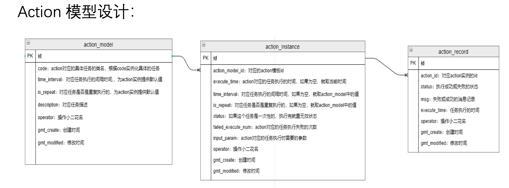

## 参考博文
[程序员面试时这样介绍自己的项目经验，成功率能达到99.99%](https://cloud.tencent.com/developer/news/631290)
[如何准备阿里P6/P7面试（项目经验篇）](https://toutiao.io/posts/e5brcg0/preview)


# 1. 自我介绍
面试官你好，我的名字叫陈培培，浙江温州人，毕业于浙江大学软件学院。毕业后在阿里的营销平台工作了两年，在这两年里负责商家侧相关工作的Java开发。营销平台指的是

# 2. 统一投放系统
这个系统是为导购业务提供数据来源支持的。比如当我们打开一个页面，会看到很多的推荐商品。然后在不同时间、针对不同人群推荐的商品都不一样。统一投放系统解决的问题就是在什么时候、给什么人展示什么商品。

1. 在这个项目中，我第一个负责的就是action调度这一块。Action是为一系列已经写好的任务定义的调度模型。比如需要定时统计已经报名商家的数目。我把我的分解成2部分，一部分是模型设计：定义了一个ActionInstance作为任务实例, 每个ActionInstance就对应一个具体的任务，他定义了任务的code，要根据code路由到具体要被调度的任务，并且定义了任务执行时间，任务执行次数，任务执行间隔，任务失败次数，执行任务需要的参数。并且定义了ActionRecord记录任务的执行结果。
然后有个定时任务定时执行，遍历ActionInstance，如果当前时间大于任务执行时间，那么就执行任务，如果任务执行成功，那么他的下次执行时间设置为当前时间加上间隔时间。如果执行失败，看任务失败过多少次，如果失败次数大于3次，那就不再重试，否则重试。并且每次的任务执行结果都插入结果表中。



定时任务的话，他是在页面上创建一个任务。需要填入任务类型。比如java、c++，然后要填入任务的全限定类名，然后指定是单机跑还是集群跑。然后开发的话，要继承JavaProcessor，实现process方法。

执行任务的方式：
```
1. 单机：一个任务实例只会随机触发到一台机器上
2. 广播：会广播给所有机器执行，当所有机器都执行完成，该任务才算完成。任意一台机器执行失败，都算该任务失败
3. MapReduce任务：把一批子任务分布式到多台机器上执行。
```

```java
@Component
public class MyProcessor2 extends JavaProcessor {
    private volatile boolean stop = false;

    @Override
    public ProcessResult process(JobContext context) throws Exception {
        int N = 10000;
        while (!stop && N >= 0) {
            //TODO
            N--;
        }
        return new ProcessResult(true);
    }

    @Override
    public void kill(JobContext context) {
        stop = true;
    }

    @Override
    public void preProcess(JobContext context) {
        stop = false;  //如果是通过Spring启动，Bean是单例，需要通过preProcess把标记为复位
    }
} 
```

2. 我第二个接的任务是投放排期的复制。排期其实就是运营在投放侧设置的一份规则。在每次活动中，运营都要创建非常多的规则，但其实很多排期其实他们的差异不大，可能只有在时间上有差异，所以运营希望能再已有排期的基础上修改一小点地方，然后得到一个新的排期。所以我们采取的方案就是复制排期。在我写代码之前，我先去弄清楚啥是排期，然后总结一下我感觉排期其实可以分为三部分，一部分是时间，他定义了这份排期的生效时间，第二部分是数据，这个数据就是选品得出来的一个个池子，第三部分是排序规则，它定义了数据的排序顺序。所以其实我的目标就是搞定这三部分。我把任务分解成几个步骤。一个是根据id获取已有的排期，然后创建一个新排期，把数据复制到新排期中，最后保存这个新排期。我觉得这里面最复杂的是排期数据区的复制，排期其实有5种类型的数据源，因为信息安全我不能细说，所以我要搞清楚每种数据源的链路。具体我的做法是，定义了一个抽象数据处理器，然后5种数据源都是他的实现类，复制的时候根据排期具体的数据类型选择具体的数据源处理器。我觉得这样比较容易扩展，如果以后添加了数据类型的话，就添加一个实现类就行了，不需要做其他改动。
# 3. A社交网站
这是模仿微博的一个社交网站，注册成为网站的用户可以发布动态、关注好友、查看好友动态，对好友动态点赞、收藏

我们用的是Neo4j, 他是基于图的数据库，他的节点代表实体，边代表联系，然后边也可以
有属性。比如一个人发布了动态，那么发布这个边就可以有发布时间这个属性。

担任后端的组长，后端组3个人。搭建好框架后，让每个人自己做自己想做的模块，大致分配。
框架搭建问题。对neo4j数据库不熟悉，数据库的连接出了一些问题。后面就是官方文档看，csdn上别人怎么做的

自己定义的查询方法不能遍历到他关联的节点。比如说如果我自己写语句得到了一个user节点，本来我是可以通过get方法获取这个user关联的动态列表的，但是通过这个user节点我获取的动态列表是空的。刚开始一直找不出问题。后来才发现如果要通过user遍历他关联的节点的话，必须是使用neo4jRepository已经为我们提供的getUser()方法，通过这个方法获取到的对象就可以遍历他关联的节点。
查博客，问组内同学，问其他项目组的同学

Save方法继承了update和persist
可以遍历到所有关联的节点
NodeEntity
RepationshipEntity
startNode
endNode

## 面试问题
大V发了一条微博，如何让关注他的人马上看到:
用户发表微博后，把微博写入消息队列。


# 4. 教务管理系统
这个项目是我本科的时候学院举办的一个开发的比赛。我是一个人从系统的分析、设计、开发一直做下去的。差不多做了5个多月。
我的整个设计分为3个阶段。第一个阶段是画流程图，通过画流程图来分析这个系统需要包含什么模块，然后搞清楚每个业务的流程是什么样的，会产生什么数据。然后流程图是我后面设计的依据。
第二阶段就是系统设计，我主要画了类图，这个里面包含了实体类、service类和dao类。
第三阶段是进行数据库设计。这一阶段的设计是根据画好的类图转换成数据库表

## 问题
因为这是我做的第一个系统，遇到了不少的问题
1.	第一个是我之前没有做过系统，都不知道从哪里入手。对类的设计都很陌生，后面才从流程图入手，理清自己的思路。
2.	第二个是在这之前，没有真正实践过MVC模式，对业务逻辑的处理和对数据的操作没有分的太清楚。后续对代码还进行了大规模重构。
3.	第三个是技术上，这个项目里面用了JPA和JSF的框架，这是我在之前没有接触过的，然后就是现学现用的。


# 5. 酒迅达
这个项目是老师外面接过来的项目，甲方是昆明的一家销售酒水的公司，他们想要一个线上销售平台，像鲜丰水果一样，当天内可以送达的。然后他们就在昆明市的各个区会开设点，根据送达位置选择由哪个点发货。

我们组加上我一共有三个人，然后我在里面担任组长，这也是我第一次担任组长，和别人协作

既然是和别人协作，我就要对组员负责。我要把握好整个项目的节奏，要分配好每个组员的任务。一开始我们是共同讨论，确定项目应该有什么功能。我根据讨论的结果设计好类图，建好数据库，然后搭建了系统的框架。在这里面最大的困难是我的组员和之前的我一样，没有过项目经历，所以我写了一个简单demo, 大概和他们介绍了下项目的结构，向他们解释什么是service,什么是dao。然后把任务分配给他们，提供他们框架的学习资料，让他们边学边做。

我觉得在这里面我做的比较好的是，我没有非常逼迫他们，没有觉得他们都是新手，没有觉得教他们还不如我自己做，我还是很耐心的告诉他们我所知道的，让他们在这个当中能有所收获。因为我觉得作为一名程序员，我不应该只是懂得自己写代码，这是最基础的，我应该学会和别人合作。包括在阿里实习的这几个月，我觉得写代码的时间不是最多的，和别人沟通也是很重要的一部分。

1.	团队协作的问题，组员没有经验，基础不好
集中起来，大概说一下整个项目框架，给他们讲讲每个层次的关联，每个层次都是写什么。就比如backbean层是调用service层的接口，他不存放具体逻辑的，他给页面提供数据。
半个月的时间熟悉一下项目的技术框架。
2.	分工问题：设计好数据库，搭建好系统框架。购物车、收藏、浏览记录、卖方的订单管理。按照能力分、更愿意做的


我想从营销平台是干什么的、我在营销平台干了什么两个角度来讲一下。


# 营销平台是干什么的：
从最朴素的商品组织和售卖过程讲起，商家只要在商品中心填写商品信息、发布商品，消费者就能通过淘宝的搜索就能搜到对应的商品并购买。但是在淘宝天猫的体量
变得如此大，电商业务的竞争也越来越激烈的情况下，仅仅通过消费者主动搜索是很难满足需求的，也很难在大量的物品中找到自己心仪的那一个。所以营销就是帮助
商家更好的将商品卖出去，也让消费者能更快的触达到优质的心仪商品。例如双11、618这些活动是营销，聚划算、特价版、天天特卖也是营销。

之所以是营销平台，是因为我们支撑着阿里电商业务的营销，提供基础和通用的营销能力。我们面向的用户对内是运营，对外是商家。对运营来说，我们提供制定营销方案
的能力，指定出的方案称为营销活动，也是一个核心模型。营销活动一个营销活动定义了一个业务场景详细的营销需求，如需要展示给消费者什么信息，什么样的商家/商品能参加，优惠是普通优惠还是定向优惠、渠道优惠，库存怎么控制等。
对商家来说，我们提供参与营销活动的能力。每个商家可以选择自己意向的活动，然后根据活动的要求提报商品，产出的模型是营销方案。每个商家参加某个活动都会有一份营销方案的数据。
商家报名商品后，经过运营侧的审核和挑选，最终会将商品通过手淘传递给消费者。

# 我在营销平台干了什么 
我负责的就是商家侧的工作，在这一块


# 商品招商策略
## 背景
运营在创建活动的时候会绑定商品池，不同的商品池会有不同的业务目的。例如绑定卡报名的商品池，商家报名活动的时候只能选择池子里的商品报名，或者是绑定优质商品池，在商家报名活动的时候鼓励他报名这个池子里的优质商品。

原来我们实现的方式有很多问题：
1. 扩展性问题，产品提出一个新类型的池子，就要对这个类型做新的开发，包括数据链路、商家报名链路，扩展性很差。如果想绑在其他维度，不支持
2. 性能问题，商品池和商品之间是一对多的关系，商品池和活动也是一对多的关系，但是原来的存储是把这些关系拉平了，会出现一个商品池如果被多个活动绑定，那么每个活动针对这个池子的绑定都会有一条活动ID到商品ID的记录，那这个数据量是爆炸式增长
3. 迭代性，原来对多个类型的池子的实现方式是不统一的，那可维护性和和迭代性都非常查。

那其实不管活动上会绑定什么商品池，他们的关系都可以抽象成活动+商品池+池子类型，基于这个关系，将所有活动上绑定的池子都统一起来。


## 设计、技术选型
可用性、性能、一致性，为什么这么设计？好处


具体方案设计分为两部分：
1. 数据链路，数据怎么产出给商家端用

商家报名商品的方式是在一个商品选择器中选择，要支持搜索的功能。这里我们选择了阿里的OpenSearch搜索引擎，我们的问题归结于怎么把数据灌输到OpenSearch


对数据我们从两方面来考虑，一是可靠性，二是实时性。
为了保证数据可靠正确，


2. 商家端在线链路，怎么使用绑定的商品池


数据最终的展现形式是商家在报名的时候能看到一个商品选择器，可以在里面搜索商品进行报名。
先说一下数据模型，因为我们要得到的是领域-商品池-商品的关系，所以我选择建立两张DB表。一张表是。第二张表是商品池、商品的绑定关系，以商品Id作为主键，有一个商品池Id的多值列。下面拿活动ID来讲

因为要支持名称搜索，我选择将数据存在opensearch搜索引擎。数据的形式是：商品ID+活动ID多值列+商品池ID多值列+商家ID，问题转换成如何把数据灌到搜索引擎里面。
我们从两个方面来考虑，一个是数据的可靠性，一个是实时性。

先说可靠性，因为活动 商品池 商品之间的绑定关系随时都会变，但是要保证不变的情况下搜索引擎里的数据是对的。所以首先需要天级别的数据全量回流到搜索引擎中。需要回流的商品数据大约在7000-9000万左右，一般需要回流4-6个小时。回流的数据源使用的是ODPS，他是基于SQL语句的海量数据平台，对标的是hive。

首先建立一张领域和商品池绑定关系，里面包含领域ID、领域类型、商品池ID、商品池类型，使用领域ID是为了支持活动以外的绑定。每次运营保存活动的时候就将这个关系保存进DB，然后将DB回流到ODPS，过滤掉已经结束的、无效的活动。然后和选品团队的商品-商品池ODPS根据商品池ID做join得到结果表，将结果表每天一次回流到OpenSearch。


然后是实时性，因为运营每天都会创建活动，或者更新活动绑定的商品池，如果每天都要等一天商家才能看到的话太慢了。所以业务上要求说要达到小时级别的更新，但如果每小时都将几千万数据回流一遍压力太大了，而且小时内也回流不完。所以采取增量更新的方式，那就要计算出这个小时和上一个小时比哪些商品发生了变化。
没小时对结果表和上一个小时的数据作对比，并用version字段来标识。如果在上一个小时里没有这个商品，说明是新加的，version字段置为当前时间戳。如果上一个小时有，这一个小时没有，说明这个商品应该删除，version字段置为0，如果两个小时都有，但是商品池ID不一样，那就更新为最新一小时的商品池ID。因为通过ODPS更新OpenSearch不支持部分增量更新，只支持覆盖式更新，所以对于这些diff数据只能通过在线链路更新到OpenSearch。
当diff数据算完之后，通过shell脚本，直接curl直接出发一个http接口，通过应用读取diff数据，对每条数据都给集群发送一个metaQ消息，应用集群就会去消费消息，根据version字段做对应的插入和删除动作。这里会有一个问题是如果数据量很大，那么metaQ消息发送量也会很大，集群消费可能会有压力。所以做了一个限流机制，如果每秒数据发送量大于400，就会让发送消息的线程休息1s再发。


## 分工


## 具体实现


## 难点


## 效果


# 规则白盒化
对商家参加活动提报内容，能否提报做管控
ability valve

商家体验战役

# 商家端无线化

# 官方直播间


背景、意义：
设计、技术选型：可用性、性能、一致性，为什么这么设计？好处
具体实现
分工
难点
效果


对商家参加活动提报内容，能否提报做管控
ability valve


你们订单中台有多少人？是不是对原来的系统进行重构？订单中台有哪些领域？你负责的是？

幂等性怎么确保的？

创建订单的时候存到Redis的是什么？有没有解决过缓存穿透的问题？

TiDB有没有用到乐观锁？
